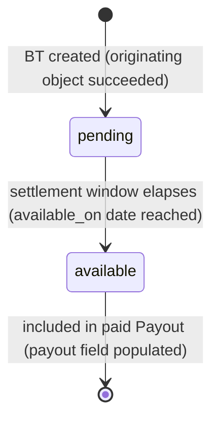
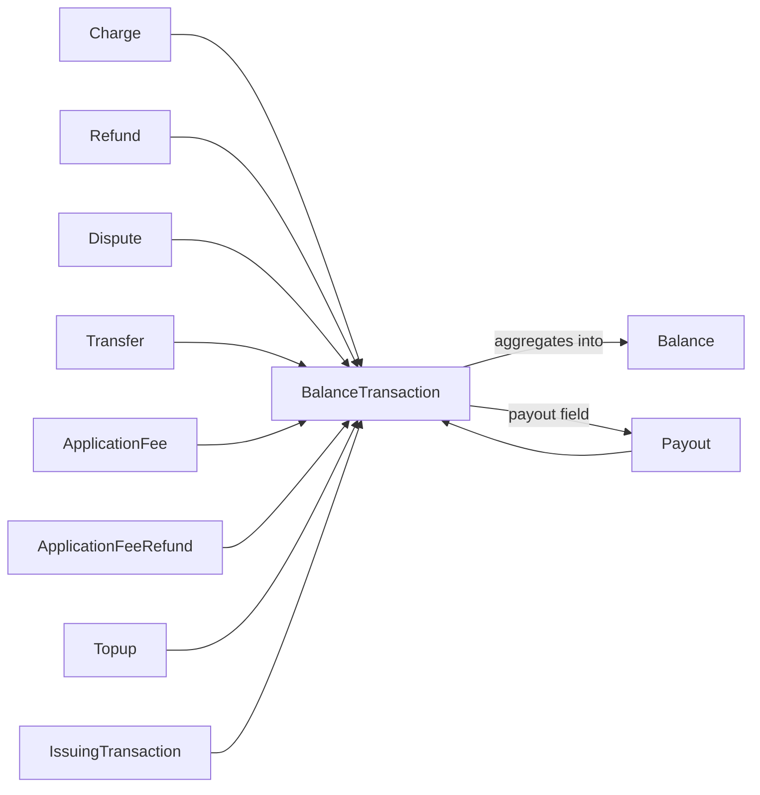

# Balance Transaction

> API resource: `balance_transaction` · API version: `2026-04-22.dahlia` · Category: [Core resources](README.md)

## What it is

A `BalanceTransaction` (BT) is one line in Stripe's general ledger for your account. **Every cent that moves into or out of your [Balance](balance.md) — from any source, in any direction — writes exactly one BalanceTransaction.** Charges, refunds, payouts, transfers, application fees, dispute holds, dispute reversals, top-ups, Issuing transactions, network adjustments, manual debits — all of them.

A BT records: the gross `amount`, the `fee` Stripe charged you, the `net` that actually hit (or left) your balance, *which* originating object caused the movement (`source`), *when* the funds become payable (`available_on`), and — once a payout sweeps the funds — the `payout` they rolled into. It is the source of truth for accounting. The originating objects (Charge, Refund, Payout, Transfer, Dispute, ApplicationFee) all have `balance_transaction` pointers back to one or more BTs.

## Why it exists

Without BalanceTransactions you would have to compute fees, nets, and reconciliation from a dozen separate object schemas, each with subtly different conventions. Stripe normalizes every money movement into one shape — `amount / fee / net / currency / available_on / type / source` — so a single piece of code can reconcile the entire ledger. Concretely, BTs answer four questions you can't answer from the originating objects alone:

1. **What did Stripe actually charge me on this transaction?** `Charge.amount` is gross; `BalanceTransaction.fee` and `fee_details[]` are the breakdown.
2. **What's my net?** `BalanceTransaction.net` (= `amount` − `fee`).
3. **When does it count as available cash?** `available_on` (a date, not a timestamp).
4. **Which payout swept this money to my bank?** `payout` (set once the BT has been included in a paid Payout).

If you can't tie a money movement to a BalanceTransaction, your books will not reconcile.

## Lifecycle & states

A BalanceTransaction has a small, two-state lifecycle keyed off the `status` field — `pending → available`. There is no failure state on the BT itself; if the originating action failed, no BT is written (or, in the case of network fees on declines, a small `payment_failure_refund`-style adjustment BT is written immediately as `available`).



State notes:

- **pending.** The originating event has happened (charge captured, refund initiated, dispute opened, etc.) but the funds have not yet cleared their settlement window. `available_on` is in the future. The BT counts toward `Balance.pending[]`.
- **available.** `available_on` date has passed. The BT counts toward `Balance.available[]`. Eligible to be swept into a Payout. Some BT types (`payout`, `payout_cancel`, `payout_failure`, `transfer`) are born `available` because they don't have a settlement window — they're moving funds that already cleared.
- **No state for "paid out."** Once a Payout sweeps the BT, the `status` stays `available` but the `payout` field becomes non-null. That's the signal it has left your Stripe balance.

BalanceTransactions are **immutable** once created. You cannot update or delete them. A correction ships as a *new* BT with a different `type` (commonly `adjustment`).

## Anatomy of the object

### Identity

| Field | Notes |
|---|---|
| `id` | `txn_…` — though some legacy or auto-created BTs use other prefixes. Always check `object`. |
| `object` | always `"balance_transaction"`. |
| `created` | unix seconds. When the BT was written. |
| `available_on` | unix seconds for the *date* (00:00 UTC) the funds become available. Often `created + N days`. |
| `currency` | three-letter ISO. The currency of `amount` / `fee` / `net`. |
| `description` | short human label, e.g. `"Subscription update"` or `"PAYOUT"`. |
| `status` | `pending` or `available`. See lifecycle. |

### Money

| Field | Notes |
|---|---|
| `amount` | Gross movement in the smallest unit. **Sign matters.** Positive = funds in (charge, transfer in). Negative = funds out (refund, payout, dispute, fee). |
| `fee` | Total Stripe fee on this movement, in the same currency. Always non-negative. |
| `fee_details[]` | Itemized fee breakdown — see below. |
| `net` | `amount − fee`. The actual change to your Balance. Use this for accounting, not `amount`. |
| `exchange_rate` | If the BT is the result of a currency conversion (e.g. a USD charge settling to a EUR balance), the rate Stripe applied. `null` otherwise. |

### `fee_details[]` shape

Each entry is `{ amount, currency, type, application, description }`:

| `type` | Meaning |
|---|---|
| `stripe_fee` | The standard processing fee. |
| `application_fee` | The cut a Connect platform took (visible on the connected account's BT). |
| `tax` | Local tax on the fee itself, where applicable. |
| `network_cost` / `payment_method_passthrough_fee` | Pass-through interchange/network costs in interchange-plus pricing. |

`fee_details[]` summed equals `fee`. For most accounts it's a single `stripe_fee` entry; for Connect or interchange-plus, multiple.

### Type & source

| Field | Notes |
|---|---|
| `type` | The kind of movement. Long enum — see the table below. Drives reporting category and your reconciliation logic. |
| `source` | ID of the originating object (`ch_…`, `re_…`, `po_…`, `tr_…`, `dp_…`, `fee_…`, etc.). Always populated. **Expand this in queries** to inline the originating object. |
| `reporting_category` | Stripe-curated grouping for reports — e.g. `charge`, `refund`, `payout`, `dispute`, `fee`, `tax`, `issuing_authorization_hold`. Stable across `type` enum additions; safer to bucket on for dashboards. |

The `type` enum (subset that covers ~99% of activity):

| `type` | Originating object | Sign |
|---|---|---|
| `charge` | [Charge](charges.md) | + |
| `payment` | Charge created via legacy `Source` flow or async PM | + |
| `refund` | [Refund](refunds.md) | − |
| `payment_refund` | Refund of a `payment`-type charge | − |
| `payout` | [Payout](payouts.md) | − |
| `payout_cancel` | Payout was canceled before sending | + |
| `payout_failure` | Bank rejected the Payout, funds returned | + |
| `adjustment` | Manual or automated correction (incl. dispute reversals) | ± |
| `application_fee` | Platform took a cut (BT on the *platform*) | + |
| `application_fee_refund` | Platform refunded its cut | − |
| `transfer` | [Transfer](../07-connect/transfers.md) out (on sender) | − |
| `transfer_refund` / `transfer_cancel` / `transfer_failure` | Reversal of a transfer | + |
| `topup` | Platform funded its own balance | + |
| `topup_reversal` | Top-up bounced | − |
| `stripe_fee` | A standalone Stripe fee debit (rare; most fees are `fee_details` on a charge BT) | − |
| `stripe_fx_fee` | FX conversion fee | − |
| `network_cost` | Interchange-plus passthrough debit | − |
| `tax_fee` | Tax owed on Stripe fees | − |
| `issuing_authorization_hold` | Stripe Issuing authorization hold | − |
| `issuing_authorization_release` | Hold released | + |
| `issuing_transaction` | Settled Issuing transaction | − |
| `issuing_dispute` | Issuing dispute filed | + (provisional credit) |
| `connect_collection_transfer` | Platform debiting a connected account | ± |
| `obligation_outbound` / `obligation_payout_failure` | Reverse-platform-collection flows | ± |

### Payout linkage

| Field | Notes |
|---|---|
| `payout` | `po_…` once this BT has been swept into a Payout. **`null` until then.** Filterable: `GET /v1/balance_transactions?payout=po_…` returns every BT in the payout. |

### Source expansion

`source` is the canonical pointer back. Expand it for one-shot queries:

```http
GET /v1/balance_transactions/txn_…?expand[]=source
```

Or in lists: `expand[]=data.source`. Limit applies (4 levels deep).

## Relationships



Key invariants:

- **Every successful money-moving operation creates exactly one BT** *on the account where the funds moved*. Connect Direct charges create a BT on the connected account; the matching `application_fee` creates a separate BT on the platform.
- **A Charge has exactly one BT at success** — `Charge.balance_transaction`. A failed Charge may still create one BT for the failure fee (`Charge.failure_balance_transaction`).
- **A Refund has at most one BT.** `Refund.balance_transaction`. Async failed refunds populate `Refund.failure_balance_transaction` with the offset.
- **A Dispute creates BTs in pairs** — one when funds are withdrawn (`charge.dispute.funds_withdrawn`), one when reinstated if you win (`charge.dispute.funds_reinstated`). The Dispute object has `balance_transactions[]` (an array, not a single ID).
- **A Payout creates one BT for itself** (the debit) plus links to all the BTs being swept via the `payout` field on each.

## Common workflows

### 1. Find the fee and net for a single charge

```http
GET /v1/charges/ch_…?expand[]=balance_transaction
```

Read `balance_transaction.fee` and `.net`. **Do not** sum `Charge.amount − fee` yourself — fees vary by card brand, currency, country, and Connect arrangement; you'll get it wrong.

### 2. Reconcile a payout: prove the bank deposit

```http
GET /v1/balance_transactions?payout=po_…&limit=100
```

Paginate with `starting_after` until exhausted. Each entry has `source` pointing to the originating object. Sum `net` across all entries — it equals `Payout.amount`. This is the canonical reconciliation script.

```http
GET /v1/balance_transactions?payout=po_…&expand[]=data.source&limit=100
```

…inlines each originator if you need the metadata, customer ID, or invoice in the same response.

### 3. List all transactions in a date range

```http
GET /v1/balance_transactions?created[gte]=1714521600&created[lt]=1717200000&limit=100
```

`created` is the BT write time. Use `available_on[gte]=…` instead if you need *settlement* date (matches what hits Stripe-issued reports).

### 4. Filter by type

```http
GET /v1/balance_transactions?type=refund&limit=100
```

Useful for "list all refunds we issued last week" without iterating Refunds and joining BTs. `type` accepts a single value; for multiple types, run multiple queries or filter client-side.

### 5. Sanity-check the Balance

```http
GET /v1/balance
GET /v1/balance_transactions?limit=100
```

The Balance is the running sum; the latest BTs explain the deltas since the previous fetch. If they don't match, suspect missed events or a stale cache.

### 6. Connect: read a connected account's BTs

```http
GET /v1/balance_transactions
Stripe-Account: acct_1Nxxx
```

Without the header you see the platform's BTs (which include `application_fee` entries from connected-account charges). With the header you see the connected account's BTs (which include the corresponding `charge` entries minus the application fee). They are different ledgers.

## Webhook events

| Event | Fires when | Listener typically does |
|---|---|---|
| *(none)* | BalanceTransaction emits no events of its own. | Listen to the originating object's events instead — `charge.succeeded`, `refund.created`, `payout.paid`, `transfer.created`, `charge.dispute.funds_withdrawn`. Then fetch the linked BT for fee/net/available_on. |
| `balance.available` | Funds rolled from `pending` to `available` on the Balance. | Refetch `GET /v1/balance` and (optionally) reconcile new `available` BTs. |
| `payout.reconciliation_completed` | All BTs for a payout have been assigned to it (i.e. `BT.payout` is now populated for every constituent). | Trigger your reconciliation pipeline for that payout. |

Cross-check with [_meta/webhook-catalog.md](../_meta/webhook-catalog.md) — the BT row there explicitly notes "no events."

## Idempotency, retries & race conditions

- All BalanceTransaction endpoints are read-only. Idempotency keys do not apply.
- BTs are **eventually consistent** with their originating objects. A `charge.succeeded` webhook may arrive *before* the BT is queryable; if `Charge.balance_transaction` is non-null but `GET /v1/balance_transactions/<id>` 404s for a moment, retry with backoff.
- The `payout` field becomes populated some time after `payout.paid`. Wait for `payout.reconciliation_completed` before assuming every constituent BT has been linked.
- BTs are immutable. You will never see "the same BT changed" — corrections arrive as new BTs (`type: adjustment`).
- Pagination is cursor-based via `starting_after` / `ending_before`. **Do not** rely on offset; the list is unstable as new BTs append.

## Test-mode tips

- Test charges, refunds, transfers, and payouts all create test BTs with the same shape as live. Use them to develop your reconciliation script end-to-end.
- `stripe trigger payout.created` followed by `stripe trigger payout.paid` exercises the BT `payout` field becoming populated.
- Test-mode BTs roll from `pending` to `available` on a fast schedule (often near-instant). To exercise the timing of `available_on`, point your code at the field rather than waiting on the clock.
- The Stripe Dashboard's "Reports" view in test mode reads from the same BT stream — useful for cross-checking your queries.

## Connect considerations

This is where BTs do their most important work and where most reconciliation bugs live.

- **Two ledgers per Direct charge.** A direct charge on a connected account (with `application_fee_amount=200`) writes:
  - On the **connected account**: BT `type: charge`, `amount: +1000`, `fee: 200` (the application fee), `net: +800`.
  - On the **platform**: BT `type: application_fee`, `amount: +200`, `fee: <stripe fee on the application fee, often 0>`, `net: +200`.

  These are two distinct objects in two different `GET /v1/balance_transactions` results. To reconcile platform revenue, query the platform; to reconcile merchant revenue, query the connected account.

- **Destination charge writes three BTs.** One on the platform (`type: payment`), one for the [Transfer](../07-connect/transfers.md) (`type: transfer` on the platform, debit), and one on the connected account (`type: payment` from the inbound transfer). The `transfer` field on the platform's BT links them.

- **`type: connect_collection_transfer`** appears when the platform debits a connected account (collected funds for risk, etc.). Look for these explicitly in marketplace reconciliation.

- **Application fee refunds.** Refunding a Charge that had an `application_fee_amount` will, by default, *also* refund the application fee proportionally — generating an `application_fee_refund` BT on the platform. You can opt out with `refund_application_fee=false` on the [Refund](refunds.md) creation. See [ApplicationFeeRefund](../07-connect/application-fee-refunds.md).

- **Per-account currency support.** Each connected account's BTs are in *its* settlement currencies. The platform sees its own. Do not assume the platform and a connected account transact in the same currency.

## Common pitfalls

- **Computing fees from `Charge.amount`.** Always read `BalanceTransaction.fee` and `.net`. The matrix of fees (card brand × country × currency × Connect arrangement × Radar add-ons × instant payout fees) is too complex to reconstruct.
- **Treating `created` as the settlement date.** It's the *write* date. The settlement date is `available_on`. Stripe-issued reports group by `available_on` by default — so if your dashboard groups by `created`, your numbers will not match Stripe's.
- **Querying BTs by Charge ID.** There is no `?charge=ch_…` filter. Either expand `balance_transaction` on the Charge, or fetch the Charge and read its `balance_transaction` field.
- **Assuming one BT per event.** A Charge succeeds → 1 BT. A Refund → 1 BT. But a Dispute → multiple BTs over time, a Payout → 1 BT for itself + N BTs it sweeps, and a Connect direct charge → 2 BTs in different ledgers. Your sync logic must accept that one originator can produce many BTs across many accounts.
- **Forgetting that `payout` is `null` until swept.** Reconciliation queries that filter on `payout=po_…` only see *swept* BTs. To find unswept BTs that *will* roll into a future payout, filter on `available_on` and `payout=null`.
- **Confusing `BalanceTransaction` with `CustomerBalanceTransaction`.** They are unrelated. The latter is per-Customer prepaid credit/debit on invoices — see [CustomerBalanceTransaction](../06-billing/customer-balance-transactions.md). The former is the global ledger.
- **Expecting webhook events on BTs.** There are none. Drive reconciliation off the originating object's events.
- **Ignoring `reporting_category`.** When new `type` enum values ship in a future API version, your `switch (type)` will miss them. Bucket on `reporting_category` for stability.

## Further reading

- [API reference: BalanceTransaction](https://docs.stripe.com/api/balance_transactions/object)
- [API reference: List balance transactions](https://docs.stripe.com/api/balance_transactions/list)
- [Reports: balance transaction summary](https://docs.stripe.com/reports/balance-transaction-types)
- [Connect: reconciling balances](https://docs.stripe.com/connect/account-balances)
- [Reconciliation guide](https://docs.stripe.com/reports/reconciliation)
