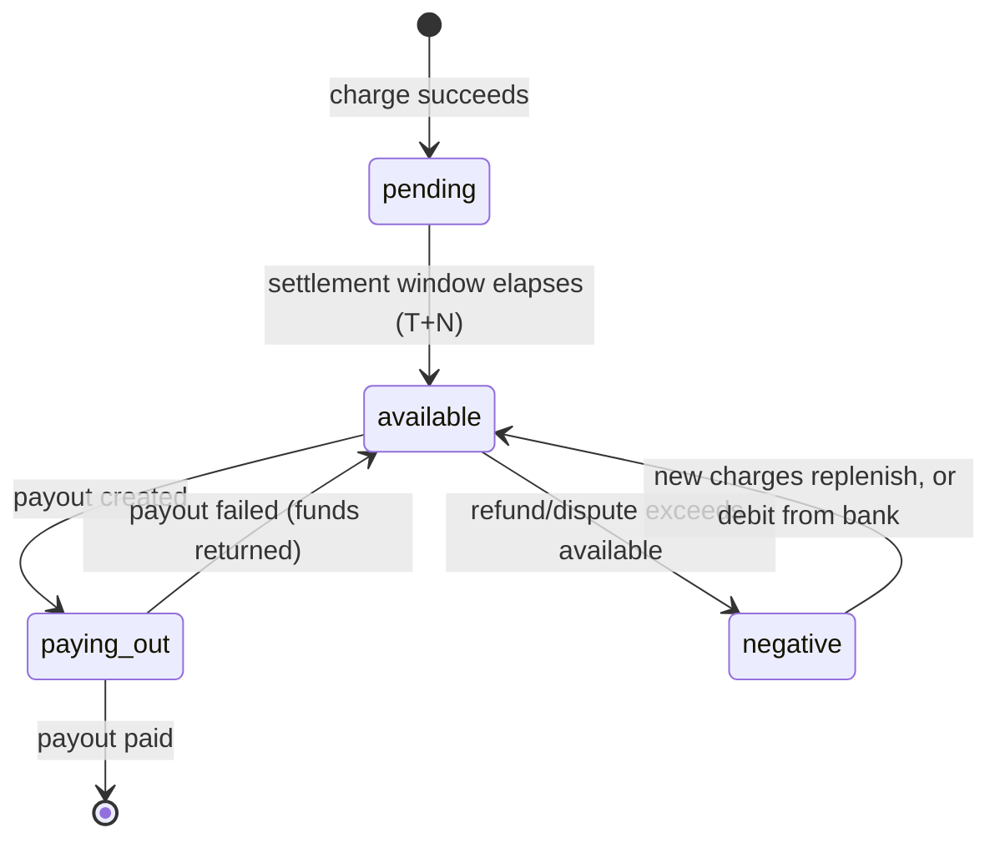
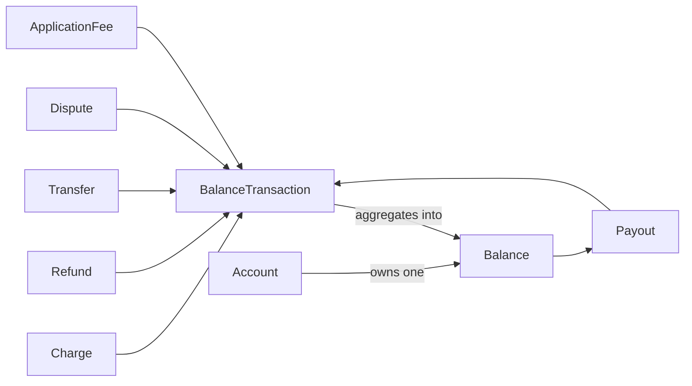

# Balance

> API resource: `balance` · API version: `2026-04-22.dahlia` · Category: [Core resources](README.md)

## What it is

A `Balance` is the running snapshot of money sitting *inside* Stripe on behalf of one Stripe account — money that has cleared the network but has not yet (or may never) be paid out to the account's external bank. It is a **singleton**, retrieved with `GET /v1/balance`. There is no list endpoint, no `id`, no `created`, no `metadata`. Each Stripe account has exactly one Balance object that mutates continuously as charges, refunds, payouts, transfers, fees, disputes, and adjustments hit it.

The Balance is *not* the ledger — that's [BalanceTransaction](balance-transactions.md), which records each individual movement. The Balance is the *aggregate*: at any moment, what's the sum of every BalanceTransaction broken down by currency and settlement bucket. If your reconciliation script needs line items, query BalanceTransactions; if your dashboard needs "how much can I pay out right now," read Balance.

## Why it exists

Stripe holds funds between the moment a card network acknowledges a charge and the moment your bank account receives a payout. That window can be hours (instant payouts) or many days (international ACH, holds, dispute reserves). During that window you still need to know:

- How much can I pay out today? → `available[]`.
- How much is on the way but not yet eligible? → `pending[]`.
- How much is being held back because of risk / Connect reserves? → `connect_reserved[]` and `instant_available[]`.
- How much do I have specifically in Issuing-funded float? → `issuing.available[]`.

Without a Balance object you would have to derive these by summing the entire BalanceTransaction history every time. Stripe maintains the aggregates for you.

## Lifecycle & states

`Balance` has no state machine. It has no `status` field, never gets created or deleted, and is never returned by webhook event payloads as a stand-alone object. What *moves* is each currency entry between buckets. The pertinent flow is the **pending → available** transition for funds:



State notes:

- **pending.** Funds from charges that have been authorized + captured but have not yet cleared the settlement window. For US card payments this is typically T+2 business days. For international or alternative payment methods it can be much longer.
- **available.** Funds eligible for payout. This is what `Payout.create` will draw from.
- **connect_reserved.** Connect-only. Funds the platform has reserved on a connected account (or that Stripe has held back for risk). They count as the connected account's money but cannot be paid out until released.
- **instant_available.** Subset of `available` (or `pending`, depending on PM type) that is eligible for an [Instant Payout](https://docs.stripe.com/payouts/instant-payouts) (debit-card-rail). Has a separate per-day cap.
- **issuing.available.** Stripe Issuing only — the prefunded float used to authorize Issuing transactions. Distinct from your acquiring balance; you fund it via [Topup](../07-connect/README.md) or transfer.
- **negative.** Not a separate field, but the available amount can be negative when refunds, disputes, or fees outpace fresh activity. Stripe will then either offset it from new charges, debit your bank account (`debit_negative_balances` setting), or block payouts until you top up.

The `balance.available` event fires when at least one currency bucket has rolled additional funds from `pending` to `available`. That's your cue to reconcile or trigger a payout if you're on a manual schedule.

## Anatomy of the object

### Identity

| Field | Notes |
|---|---|
| `object` | always `"balance"`. No `id`, no `created`, no `metadata`. |
| `livemode` | mode flag. Test and live each have their own Balance. |

### Money buckets

Each bucket below is an **array of per-currency entries**, because a single Stripe account can hold balances in multiple currencies simultaneously. Each entry has at minimum `{ amount, currency, source_types: { card, bank_account, fpx, … } }`. `source_types` decomposes the bucket by originating payment-method family — useful when card and ACH have different settlement curves.

| Field | Notes |
|---|---|
| `available[]` | Funds you can pay out right now. One entry per currency you've ever transacted in. |
| `pending[]` | Funds in the settlement window. Will roll to `available` automatically. |
| `connect_reserved[]` | Connect platforms only — funds reserved against a connected account. Not payable until reserve releases. |
| `instant_available[]` | Subset eligible for Instant Payouts (debit-card rail). Has its own daily cap and per-payout fee. |
| `issuing.available[]` | Stripe Issuing prefunded float. Used to authorize Issuing card transactions. Funded separately. |

> The exact set of buckets visible on your account depends on which Stripe products are enabled. Issuing accounts see `issuing.*`; non-Connect accounts won't see `connect_reserved`.

### Per-entry breakdown

Inside each bucket entry, `source_types` (when present) splits the amount by payment-method family:

```json
{
  "amount": 1234500,
  "currency": "usd",
  "source_types": {
    "card": 1200000,
    "bank_account": 34500
  }
}
```

This matters because card funds settle on T+2; ACH funds settle on T+4 or longer. Two integrations with the same `available[].amount` can have very different cash-flow profiles depending on `source_types`.

## Relationships



- **Account → Balance.** One-to-one. Every Stripe account (your platform, every connected account) has its own Balance. A `GET /v1/balance` with `Stripe-Account: acct_…` returns the connected account's Balance, not yours.
- **BalanceTransaction → Balance.** Many-to-one aggregation. Every BalanceTransaction's `net` rolls into the relevant bucket. The Balance is the cached sum.
- **Balance → Payout.** A Payout draws from `available[]` of the matching currency. You cannot pay out from `pending[]`, `connect_reserved[]`, or `issuing.available[]`.

## Common workflows

### 1. Read the current balance

```http
GET /v1/balance
```

Returns the singleton. No pagination, no filters. To read a connected account's balance:

```http
GET /v1/balance
Stripe-Account: acct_1Nxxx
```

### 2. Decide whether to issue a manual payout

```http
GET /v1/balance
```

Inspect `available[]`. For each currency entry where `amount > 0` and your business rules allow it:

```http
POST /v1/payouts
Idempotency-Key: payout-2026-05-06-usd
  amount=<available_amount>
  currency=usd
```

(Payout creation requires manual schedule on the account — see [Payout](payouts.md).)

### 3. Wait for funds to clear

Subscribe to `balance.available` on a [WebhookEndpoint](../19-webhooks/webhook-endpoints.md). The event fires when one or more currencies' `pending → available` rolls have completed. The event payload **does not** include the Balance object — it carries no useful data fields. Treat it as a *trigger* and call `GET /v1/balance` in the handler.

### 4. Reconcile "available" against the ledger

```http
GET /v1/balance_transactions?available_on=<unix_ts>&limit=100
```

The sum of `net` across all transactions with the same `available_on` date should equal the amount that rolled into `available[]` on that date. If it doesn't, you have an integration bug or a missed event.

### 5. Inspect a connected account's balance (Connect platform)

```http
GET /v1/balance
Stripe-Account: acct_1Nxxx
```

Without the header you get the platform's own Balance. *With* the header you get that one connected account's Balance. There is no "list balances of all my connected accounts" endpoint — iterate over [Account](../07-connect/accounts.md) and call this per-account.

## Webhook events

| Event | Fires when | Listener typically does |
|---|---|---|
| `balance.available` | One or more currency entries rolled funds from `pending` to `available`. | Call `GET /v1/balance` to see the new amounts; trigger reconciliation; if on manual payout schedule, decide whether to issue a payout. |

There is **no `balance.updated` event**, no `balance.created`, no `balance.deleted`. The Balance object is not delivered in event payloads. The only signal is `balance.available`, and even that carries an empty-ish payload.

For knock-on events that change the Balance, listen to the *originating* object: `charge.succeeded`, `refund.created`, `payout.paid`, `payout.failed`, `transfer.created`, `charge.dispute.funds_withdrawn`, `application_fee.created`. Each of those produces a BalanceTransaction that mutates the Balance.

## Idempotency, retries & race conditions

- `GET /v1/balance` is read-only and idempotent by definition.
- The Balance is **eventually consistent** with respect to the BalanceTransaction stream. A BT can show up in `GET /v1/balance_transactions` a few hundred milliseconds before the Balance aggregate reflects it. Don't loop-poll Balance immediately after a payment to see the change — listen to webhooks.
- `balance.available` can fire multiple times per day if multiple currencies roll, or if a backfill / reprocessing happens. Handlers must be idempotent against repeated triggers.
- Within a single `GET /v1/balance` response, the per-currency arrays are a consistent snapshot — you won't see a half-applied refund. But two back-to-back GETs are not guaranteed monotonic; a payout reversal can *raise* `available[]` between calls.

## Test-mode tips

- Test-mode Balance is independent of livemode. It accumulates from test charges and test payouts. Use `4242 4242 4242 4242` to add to test `pending[]`.
- Funds in test mode roll from `pending` to `available` on the same accelerated schedule Stripe uses for the test environment (often near-instant for cards). You can also force a roll with `stripe trigger balance.available` via the CLI.
- To exercise the negative-balance path, create a refund or `stripe trigger charge.dispute.created` against a charge that exceeds your test `available[]`. Watch `connect_reserved[]` and the negative `available` value.
- [TestClock](../06-billing/test-clocks.md) does not interact with Balance directly — Balance is account-wide, not per-customer.

## Connect considerations

Connect is where the Balance object gets *interesting*.

- **Each connected account has its own Balance.** A Standard, Express, or Custom account that has charges processed has a `pending[]`, `available[]`, and (if Stripe holds reserves) `connect_reserved[]`. Read it with `GET /v1/balance` + `Stripe-Account: acct_…`.
- **The platform also has its own Balance.** Application fees, top-ups, and platform-direct charges accumulate there. Reading `GET /v1/balance` *without* the header returns the platform's, not aggregated across the network.
- **`connect_reserved` is the field to watch.** Stripe can place a reserve on a connected account's balance for risk reasons; the funds belong to the connected account but cannot be paid out until released. The platform sees this via `account.updated` (the `requirements` and `payouts_enabled` fields shift).
- **Direct charges** land in the connected account's Balance. The platform's `application_fee_amount` lands in the platform's Balance as a separate BalanceTransaction with `type: application_fee`.
- **Destination charges** land in the platform's Balance first, then a Transfer moves funds to the connected account's Balance. Two BalanceTransactions, two ledgers, but only one Charge.
- **Issuing on Connect.** When the platform issues cards on behalf of a connected account, the `issuing.available[]` bucket lives on the connected account if the issuing program is per-account, or on the platform if the platform funds Issuing centrally.

The classic Connect mistake is reading `GET /v1/balance` from the platform and assuming it includes connected accounts. It does not.

## Common pitfalls

- **Treating `available[].amount` as "money in the bank."** It's "money eligible to be sent to the bank." Until a Payout's `status: paid` event fires, the funds are still inside Stripe.
- **Polling `GET /v1/balance` instead of listening to `balance.available`.** Polling burns rate limit and lags behind the webhook. Listen first, fetch on event.
- **Assuming one currency.** If you have any international charges, `available[]` and `pending[]` are arrays of length > 1. Code that reads `balance.available[0].amount` will silently miss currencies and miscount.
- **Forgetting `source_types`.** Two equally-sized `available[]` entries can roll out of `pending` on different schedules depending on whether they're card-funded or bank-funded. For cash-flow models, you need the breakdown.
- **Reading platform Balance with the `Stripe-Account` header by accident.** The opposite mistake: header set globally on a Connect platform's HTTP client returns the connected account's Balance every time. Audit your client config.
- **Expecting a `balance.updated` webhook.** It does not exist. The closest you get is `balance.available`, and *only* for `pending → available` rolls — a fresh charge that lands in `pending` does not fire any `balance.*` event at all.
- **Using Balance for receipts or refunds.** Balance is account-level. Per-payment data lives on [Charge](charges.md), [PaymentIntent](payment-intents.md), and [BalanceTransaction](balance-transactions.md).

## Further reading

- [API reference: Balance](https://docs.stripe.com/api/balance/balance_object)
- [API reference: Balance retrieve](https://docs.stripe.com/api/balance/balance_retrieve)
- [Understanding payouts](https://docs.stripe.com/payouts)
- [Connect: payouts and balances](https://docs.stripe.com/connect/payouts-connected-accounts)
- [Negative balances](https://docs.stripe.com/billing/revenue-recovery/negative-balances)
