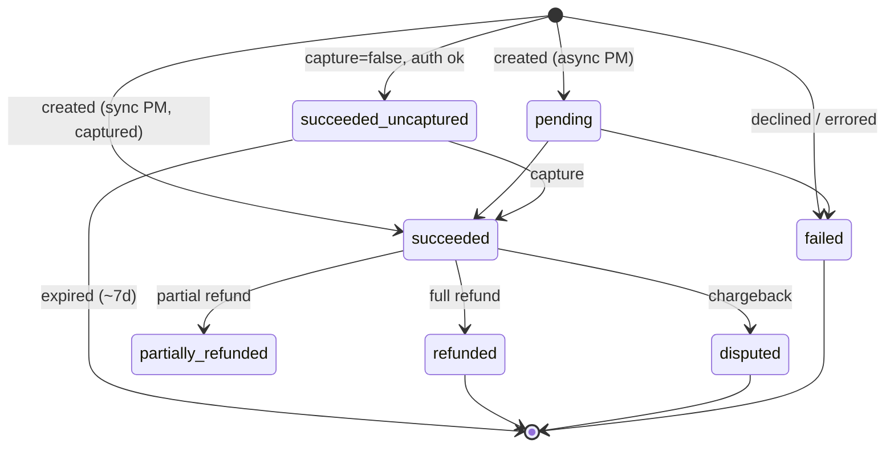
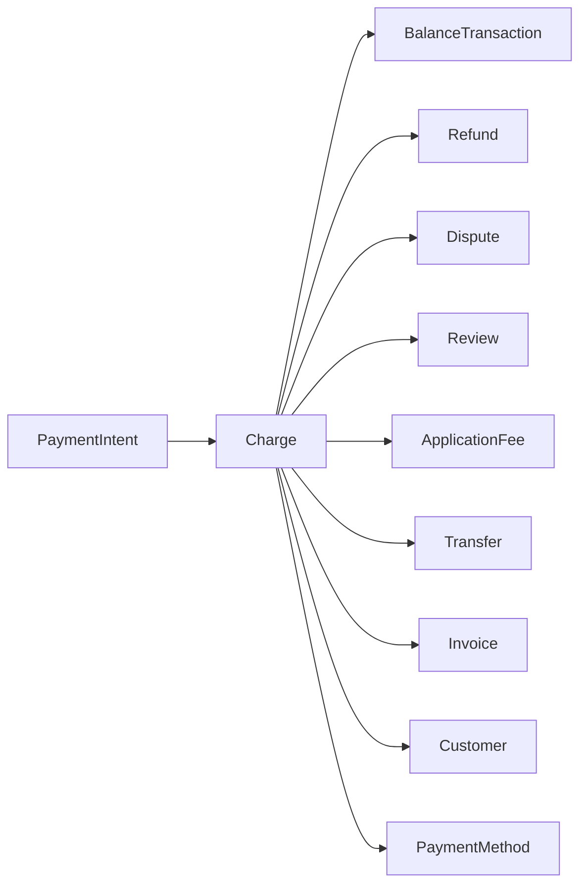

# Charge

> API resource: `charge` · API version: `2026-04-22.dahlia` · Category: [Core resources](README.md)

## What it is

A `Charge` is the record of a single attempt to move money from a payment instrument into your Stripe balance. It is the *outcome* — not the *intent*. It exists once a payment method has been authorized (and usually captured) by the card network or bank rails.

In modern Stripe integrations you almost never *create* Charges directly anymore. You create [PaymentIntents](payment-intents.md), and Stripe creates a Charge as the by-product when the intent succeeds. But the Charge is still where the truth lives: receipt data, fraud outcome, the `BalanceTransaction` link, the dispute pointer, the refund children. Reading PaymentIntent without reading Charge gets you only half the story.

## Why it exists

It is the atomic unit of "money came in." Every dollar that ever lands in your Stripe balance traces back to a Charge (or a Top-up, Transfer, or Connect Issuing transaction). All later movements — refunds, disputes, fees, payouts — point back to it. Removing Charge from the model would mean accounting becomes impossible.

## Lifecycle & states

Charge has no `status` enum in the modern sense — it has a few status-like booleans you must read together:



Decoding the booleans:

| Field | Meaning |
|---|---|
| `status` | `succeeded | pending | failed`. Pending happens for async payment methods (ACH, wires, etc.). |
| `paid` | True the moment the network accepts (auth succeeds). True even before capture. |
| `captured` | True only after capture has occurred. False on auth-only charges. |
| `refunded` | True only when *fully* refunded. Partial refunds set `amount_refunded > 0` but leave `refunded: false`. |
| `disputed` | True if a dispute exists and is not closed in your favor. |
| `failure_code` / `failure_message` | Populated only when `status: failed`. |

### Capture window

If you create a Charge (or PaymentIntent) with `capture_method: manual`, the funds are *authorized* — the bank holds them — but not pulled. You have ~7 days for cards (varies by network) to capture. If you don't, the auth expires; an `charge.expired` event fires and the customer's hold drops off.

## Anatomy of the object

### Identity

| Field | Notes |
|---|---|
| `id` | `ch_…` |
| `object` | `"charge"` |
| `livemode` | mode flag |
| `created` | unix seconds |
| `currency` | three-letter ISO. |

### Money

| Field | Notes |
|---|---|
| `amount` | Authorized amount in the smallest currency unit (cents for USD). |
| `amount_captured` | What was actually pulled. ≤ `amount`. |
| `amount_refunded` | Cumulative across all attached Refunds. |
| `application_fee_amount` | Connect platforms only — what the platform took. |

### Outcome

| Field | Notes |
|---|---|
| `status` | enum, see above. |
| `paid` / `captured` / `refunded` / `disputed` | booleans, see above. |
| `outcome` | Subobject with Radar + network detail: `network_status`, `risk_level`, `risk_score`, `seller_message`, `reason`, `type`. **`outcome.seller_message` is the one to surface to humans for declines.** |
| `failure_code` | Network-level decline code (e.g. `card_declined`). |
| `failure_message` | Human-ish message. |
| `failure_balance_transaction` | The fee Stripe charged you for the failed attempt (network fee), if any. |

### Pointers (to other objects)

| Field | Type |
|---|---|
| `payment_intent` | `pi_…` if created via PaymentIntent. **Almost always present in modern code.** |
| `payment_method` | `pm_…` |
| `payment_method_details` | Subobject with the per-PM-type details (card brand, ACH bank name, etc.). |
| `customer` | `cus_…` if attached to a customer. |
| `invoice` | `in_…` if this charge paid an invoice. |
| `balance_transaction` | `txn_…` — the ledger entry. **Source of truth for fee + net.** |
| `application` | OAuth application that created the charge (Connect). |
| `application_fee` | `fee_…` if a platform took a cut. |
| `transfer` | `tr_…` for destination charges. |
| `transfer_data.destination` | Connected account that funds were routed to. |
| `source_transfer` | Reverse pointer for separate-charges-and-transfers. |
| `review` | `prv_…` if Radar opened a review. |
| `dispute` | `dp_…` if a dispute exists. Note: a Charge has **at most one** dispute. |

### Receipts & customer-facing

| Field | Notes |
|---|---|
| `receipt_email` | Where Stripe sent (or will send) the receipt. |
| `receipt_url` | A hosted Stripe URL with the receipt. **Persistent and shareable**; safe to email customers later. |
| `receipt_number` | Populated only after a receipt is sent. |
| `description` | What you put on the customer's statement when no `statement_descriptor` is set. |
| `statement_descriptor` / `statement_descriptor_suffix` | What appears on the bank statement. Strict character rules; varies by acquirer. |
| `calculated_statement_descriptor` | What Stripe will *actually* send (after merging account + PI + Charge values + applying rules). |

### Fraud / risk

| Field | Notes |
|---|---|
| `fraud_details.user_report` | You can mark a charge as `fraudulent` (sends data to Radar). |
| `fraud_details.stripe_report` | Stripe-flagged fraud (e.g. matched a value list, or post-dispute determination). |
| `outcome.rule` | If a Radar rule blocked or allowed, this points to the rule. |

### Refunds

| Field | Notes |
|---|---|
| `refunds` | Subobject `{ data: [Refund, …], has_more, total_count }`. Up to 10 inline; paginate via `/v1/refunds?charge=ch_…` for the rest. |

## Relationships



Crucial invariants:

- **A Charge has at most one Dispute.** If lost+won re-disputed, it'd be a new Charge / new flow.
- **A Charge can have many Refunds** (partial refunds) up to `amount`.
- **A Charge has exactly one BalanceTransaction at success** plus more for refund/dispute/transfer.
- **A Charge belongs to at most one Invoice and at most one PaymentIntent.**

## Common workflows

### 1. Read what really happened (post-PaymentIntent success)

After a `payment_intent.succeeded` webhook:

```http
GET /v1/payment_intents/pi_…?expand[]=latest_charge.balance_transaction
```

Now you have:

- `latest_charge.amount`, `.amount_captured`, `.outcome.risk_level`.
- `latest_charge.balance_transaction.fee` and `.net` — Stripe's fee and your net.
- `latest_charge.payment_method_details.card.brand` for analytics.

### 2. Capture an authorization

For a PI or Charge created with `capture_method: manual`:

```http
POST /v1/payment_intents/pi_…/capture
  amount_to_capture=1500
```

(`amount_to_capture` ≤ original amount; the difference is released back to the customer.)

### 3. Refund

```http
POST /v1/refunds
  charge=ch_…
  amount=500              # omit for full refund
  reason=requested_by_customer
```

(Or `payment_intent=pi_…` instead of charge — equivalent.)

### 4. Mark fraudulent (after a chargeback you accept as fraud)

```http
POST /v1/charges/ch_…
  fraud_details[user_report]=fraudulent
```

This signals Radar so the originating card / fingerprint / device gets blocked on future attempts.

### 5. Update receipt email after the fact

```http
POST /v1/charges/ch_…
  receipt_email=correct@example.com
```

Stripe will (re)send the receipt.

## Webhook events

| Event | Fires when |
|---|---|
| `charge.succeeded` | Auth + capture both ok (or auth-only ok if `captured: false`). |
| `charge.failed` | Network declined or errored. |
| `charge.captured` | An uncaptured charge was later captured. |
| `charge.refunded` | A Refund was created against it. **Fires per refund**, even partial. |
| `charge.updated` | Most other field changes (description, metadata, fraud_details). |
| `charge.expired` | Uncaptured auth past the capture window. |
| `charge.pending` | Async payment method (ACH, multibanco) still settling. |
| `charge.dispute.created` | Chargeback opened. |
| `charge.dispute.closed` | Resolved. |
| `charge.dispute.funds_withdrawn` / `funds_reinstated` | Ledger movements during/after dispute. |

> For *modern* code, prefer listening to `payment_intent.succeeded` instead of `charge.succeeded`. The Charge is reachable via `pi.latest_charge`.

## Idempotency, retries & race conditions

- Direct Charge creation (`POST /v1/charges`) takes `Idempotency-Key`. Don't omit it.
- Capture and refund are not natively idempotent across calls — use idempotency keys.
- **`charge.succeeded` can arrive before** the synchronous PI `confirm` response gets to your client (for some redirect-based PMs). Trust the webhook.
- Multiple `charge.refunded` events can interleave for partial refunds. Handlers must be set-style: "refund X exists" rather than "+= X".

## Test-mode tips

- Magic card `4242 4242 4242 4242` always succeeds.
- `4000 0000 0000 0002` always declines (`card_declined`).
- `4000 0027 6000 3184` triggers 3DS challenge.
- `4000 0000 0000 0341` succeeds at auth, fails at capture.
- `4000 0000 0000 0259` and `4000 0000 0000 1976` create disputes when charged — useful to exercise the dispute path.
- `stripe trigger charge.dispute.created` via CLI also creates a dispute on a fresh test charge.

## Connect considerations

- **Direct charge.** `Stripe-Account` header set. Charge lives on the connected account. Platform takes `application_fee_amount` (in connected-account currency).
- **Destination charge.** No header. Charge lives on the platform. `transfer_data[destination]` causes a Transfer to be auto-created when the charge succeeds; `application_fee_amount` is what the platform keeps.
- **Separate charges and transfers.** Charge on platform, Transfer created later — your code must do the bookkeeping to map customer payments to merchant payouts.

For a destination charge, the connected account sees a `transfer.created` event; the platform sees `charge.succeeded`. Two ledgers, two truths.

## Common pitfalls

- **Reading `refunded` to detect any refund.** It's only true on *full* refunds. Use `amount_refunded > 0`.
- **Treating `paid: true` as "money is mine".** It only means auth. For auth+capture you need `captured: true` *and* the BalanceTransaction has been created.
- **Ignoring `outcome.seller_message`.** It's the one human-readable explanation; `failure_message` is often vague.
- **Reading `Charge.amount` for net revenue.** That's gross. Net = `BalanceTransaction.net` (= amount − fees − adjustments).
- **Assuming `charge.refunded` is terminal.** A refund itself can later fail (ACH bounce). Listen to `refund.failed`.
- **Setting `statement_descriptor` per-charge with characters the acquirer rejects.** It silently falls back to your account default. Check `calculated_statement_descriptor`.

## Further reading

- [API reference: Charge](https://docs.stripe.com/api/charges/object)
- [Authorizations and capture](https://docs.stripe.com/payments/place-a-hold-on-a-payment-method)
- [Statement descriptors](https://docs.stripe.com/get-started/account/statement-descriptors)
