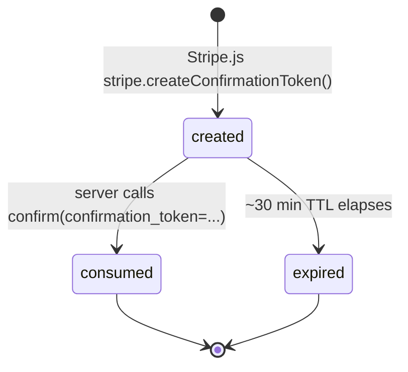
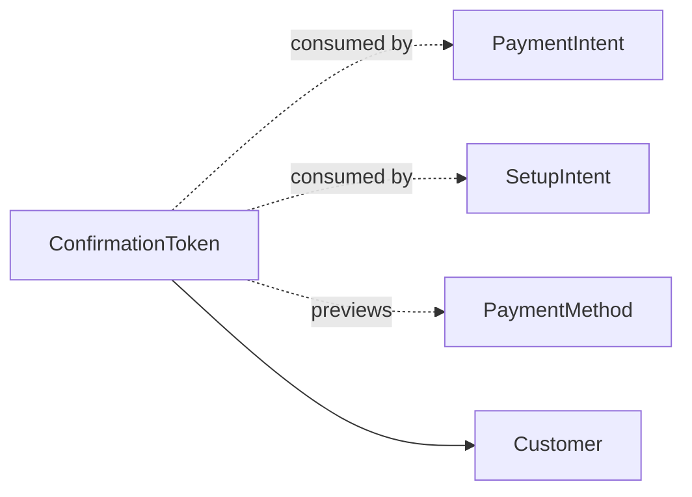

# ConfirmationToken

> API resource: `confirmation_token` · API version: `2026-04-22.dahlia` · Category: [Core resources](README.md)

## What it is

A `ConfirmationToken` is a **single-use, client-generated handle** that bundles everything needed to confirm a [PaymentIntent](payment-intents.md) or [SetupIntent](setup-intents.md) — the candidate [PaymentMethod](../02-payment-methods/payment-methods.md) details, billing details, shipping, mandate consent, return URL — into one opaque `ctoken_…` ID. The browser collects it via Stripe.js (`stripe.createConfirmationToken`); your server passes it to Stripe with `confirm=true&confirmation_token=ctoken_…`.

It exists so that **the server can be the one that calls `confirm`** without the browser ever seeing a `pm_…` ID, and without your server having to handle raw card data.

## Why it exists

The two older patterns each have problems:

1. **Client-confirms (Elements `confirmPayment`)** — the simplest flow, but the *browser* drives the final commit. Server can't easily branch (apply a coupon, pick a different connected account, attach extra metadata) between the customer clicking "Pay" and the actual charge being authorized. Server-side fraud rules run *after* the fact.
2. **Server-confirms with raw `pm_…`** — to use it the browser must POST `pm_…` back to your server. That's fine, but `pm_…` is *attachable, persistent, multi-use*. If your client code ever leaks it, it can be used against your customer. You also need extra round trips for 3DS handoff (`requires_action` → return to client → `handleNextAction` → return to server).

ConfirmationToken solves both. It's:

- **Single-use** — usable for exactly one confirm. Any leak is at most a one-time replay until TTL expires.
- **Server-confirmable** — your server makes the policy decision (which Customer to attach to, which Connect account, which metadata) at confirm time.
- **3DS-aware** — Stripe.js builds the token with the redirect/SDK handoff already wired, so the standard "confirm → requires_action → handleNextAction" loop works end to end.

It's the modern replacement for the "create a PM client-side, ship its `pm_…` to server, server confirms" pattern.

## Lifecycle & states

ConfirmationToken has no `status` field. Its lifecycle is binary plus expiry:



What you can read from the object:

- **`expires_at`** — Unix seconds. Roughly 30 minutes from creation. After this the token is unusable.
- **`use_stripe_sdk`** — boolean signal that the original creation flow was Elements-driven (almost always `true`).

There is no API to invalidate or extend a token. Wait for expiry, or simply don't use it.

> Stripe will reject any second `confirm` call referencing the same `ctoken_…` once it has been consumed — the first call wins, retries return the same PI/SI without consuming a second time only because of the standard `Idempotency-Key` machinery on the *enclosing* confirm call. Without an Idempotency-Key the second call errors.

## Anatomy of the object

### Identity

| Field | Notes |
|---|---|
| `id` | `ctoken_…` |
| `object` | `"confirmation_token"` |
| `created` | Unix seconds. |
| `expires_at` | Unix seconds. ~30 minutes after `created`. |
| `livemode` | Standard. |
| `use_stripe_sdk` | Set when token was created via Stripe.js (almost always true). |

### Candidate payment method

| Field | Notes |
|---|---|
| `payment_method_preview` | The full PaymentMethod-shaped preview of what *will* be created/used on confirm. Same per-type subobjects as `payment_method` (`.card.brand`, `.card.last4`, `.us_bank_account.bank_name`, etc.). **Read this on the server to render confirmation UI** ("you're about to pay with Visa •••• 4242"). |
| `payment_method_options` | Options that will apply on confirm (e.g. `card.installments`, `us_bank_account.verification_method`). |

### Customer & billing

| Field | Notes |
|---|---|
| `customer` | `cus_…` if the Element was bound to a customer session. May be null for guest flows. |
| `payment_method_preview.billing_details` | Name/email/phone/address as the customer entered them. |
| `shipping` | If your Element collected shipping. |
| `mandate_data` | Mandate consent payload for ACH/SEPA/BACS — IP, user_agent, accepted_at as captured by the browser. **Stripe.js fills this for you.** |

### Confirmation hints

| Field | Notes |
|---|---|
| `return_url` | Where Stripe will send the customer after a redirect-based PM (3DS, iDEAL, Bancontact). |
| `setup_future_usage` | If the customer ticked "save for future use" in the Element, this is the resulting hint (`off_session` / `on_session`). |

## Relationships



- A ConfirmationToken is consumed by exactly one `confirm` call on a PI or SI.
- The actual PaymentMethod (`pm_…`) is created **at confirm time** as a side effect; it is not the token itself. The preview field is shape-identical but is not a PM you can attach independently.
- Tokens have no relationship to the legacy [Token](tokens.md) (`tok_…`) object — different resource, different purpose, despite the name overlap.

## Common workflows

### 1. Modern server-confirmed PaymentIntent (recommended for custom flows)

Client (Stripe.js):

```js
const elements = stripe.elements({ mode: "payment", amount: 1999, currency: "usd" });
const paymentElement = elements.create("payment");
paymentElement.mount("#payment");

document.querySelector("#pay").addEventListener("click", async () => {
  const { error: submitErr } = await elements.submit();
  if (submitErr) return showError(submitErr);

  const { confirmationToken, error } = await stripe.createConfirmationToken({ elements });
  if (error) return showError(error);

  const res = await fetch("/api/pay", {
    method: "POST",
    body: JSON.stringify({ confirmation_token: confirmationToken.id, cart_id: "cart_abc" }),
  });
  const { client_secret, status } = await res.json();
  if (status === "requires_action") {
    await stripe.handleNextAction({ clientSecret: client_secret });
  }
});
```

Server:

```http
POST /v1/payment_intents
  amount=1999 currency=usd
  customer=cus_…
  confirmation_token=ctoken_…
  confirm=true
  return_url=https://example.com/order/done
  metadata[cart_id]=cart_abc
Idempotency-Key: cart_abc-pay
```

Response: a PI in `succeeded`, `processing`, or `requires_action`. Return its `client_secret` and `status` to the client. For `requires_action` the client calls `handleNextAction` to drive 3DS, then your webhook handler picks up the final outcome.

### 2. Server-confirmed SetupIntent for save-card flow

```http
POST /v1/setup_intents
  customer=cus_…
  confirmation_token=ctoken_…
  confirm=true
  usage=off_session
Idempotency-Key: signup_abc-si
```

Same `requires_action` handoff applies. Resulting PM is attached to the Customer.

### 3. Inspect what the customer is about to pay with (server-side render of "review order")

```http
GET /v1/confirmation_tokens/ctoken_…
```

Read `payment_method_preview.card.brand`, `.last4`, `billing_details.name`, etc. Useful when you want a "review and confirm" page on the server before consuming the token.

> You cannot create a ConfirmationToken via the REST API. The endpoint is **read-only** server-side. Stripe.js is the only creator.

### 4. Apply server-side coupon between collection and confirm

```js
const { confirmationToken } = await stripe.createConfirmationToken({ elements });
const res = await fetch("/api/pay", { /* ... */ body: JSON.stringify({ ct: confirmationToken.id, coupon: "SAVE10" }) });
```

Server:

```http
POST /v1/payment_intents
  amount=1799  # 10% off applied
  currency=usd
  customer=cus_…
  confirmation_token=ctoken_…
  confirm=true
```

This is the real value-add over client-confirms: the server picks the final amount based on its own validated coupon table.

## Webhook events

**None.** ConfirmationToken has no events of its own — it's an ephemeral handoff artifact. Webhooks fire on the PI / SI it gets attached to:

| You want | Webhook to listen for |
|---|---|
| Confirm consumed token successfully | `payment_intent.succeeded` / `setup_intent.succeeded` |
| 3DS in progress | `payment_intent.requires_action` / `setup_intent.requires_action` |
| Confirm failed | `payment_intent.payment_failed` / `setup_intent.setup_failed` |

The token's TTL expiring also produces no event — silently unusable.

## Idempotency, retries & race conditions

- **Set `Idempotency-Key` on the enclosing `confirm` call.** A network retry without one and Stripe will reject the second use of the token (already consumed) → spurious failure your client sees as "Payment failed."
- The `createConfirmationToken` Stripe.js call is itself idempotent within a single Element session — calling it twice in rapid succession returns the same `ctoken_…` until the user changes input.
- **Race**: customer clicks "Pay" twice. Both clicks generate the same token (Elements caches), both POST to your server, the second hits a half-finished confirm and 409s — *unless* you're using `Idempotency-Key`, in which case the second is dedup'd. Always use the key.
- **TTL race**: customer fills out the form, walks away, comes back 35 minutes later, clicks Pay. Token expired. Stripe.js `confirmPayment` would have transparently re-created — but with a server-confirm flow, your server gets `confirmation_token_invalid`. Surface "your session expired, please re-enter card details."

## Test-mode tips

- ConfirmationTokens **only exist client-side via Stripe.js** — `stripe trigger` cannot manufacture one. Use the Stripe.js test page (or your own Element-mounted dev page) with test card numbers.
- Test cards behave the same as elsewhere: `4242 4242 4242 4242` succeeds, `4000 0027 6000 3184` triggers 3DS at confirm time.
- After consumption, the resulting PM (`pm_…`) is a normal test PM — inspect via dashboard.
- TTL in test mode matches live (~30 min); no shortened cycle to test expiry against.

## Connect considerations

- A ConfirmationToken created on the platform's publishable key can be consumed on a connected account by setting `Stripe-Account: acct_…` on the confirm call. Stripe handles cross-account passthrough — the resulting PM lands on the connected account.
- Same caveat as PaymentMethod cloning: SCA exemptions are bound to the original `on_behalf_of` set at *consume* time. Pass `on_behalf_of=acct_…` on the confirm call to keep the issuer happy.
- Direct-charge platforms can also have the browser create the token directly against the connected account by initializing Stripe.js with `{ stripeAccount: "acct_…" }` — token is then only consumable on that account.

## Common pitfalls

- **Trying to create a ConfirmationToken server-side.** No such endpoint. The whole point is the browser collects PM details so your server never sees them.
- **Using the same `ctoken_…` twice.** Single-use. Second confirm fails with `confirmation_token_already_consumed`. If you need to retry, the client must regenerate (`stripe.createConfirmationToken` again).
- **Forgetting the Idempotency-Key on the server confirm.** A network blip retry → "already consumed" error → customer sees a payment error even though the first call succeeded server-side. Always set the key.
- **Reading `payment_method_preview.card.last4` and storing it as the customer's saved card.** The preview is the candidate; the real PM only exists *after* confirm. Wait for `payment_intent.succeeded` and read `payment_intent.payment_method`.
- **Confusing it with [Token](tokens.md) (`tok_…`).** Different objects, different generations. ConfirmationToken is the modern, single-use confirm handle; Token is a 2014-era card representation.
- **Letting the page sit too long.** ~30-min TTL. Long checkout funnels (multi-step forms with shipping calc, address verification, etc.) should re-create the token immediately before submit, not at form load.
- **Returning the `ctoken_…` from server to client and re-using.** Don't. The server's job is to consume, and the client should never see another customer's token.

## Further reading

- [API reference: ConfirmationToken](https://docs.stripe.com/api/confirmation_tokens/object)
- [Finalize payments on the server](https://docs.stripe.com/payments/finalize-payments-on-the-server)
- [Stripe.js: createConfirmationToken](https://docs.stripe.com/js/payment_intents/create_confirmation_token)
- Sibling: [PaymentIntent](payment-intents.md) — primary consumer.
- Sibling: [SetupIntent](setup-intents.md) — secondary consumer.
- Sibling: [PaymentMethod](../02-payment-methods/payment-methods.md) — what the token previews and produces.
- Legacy cousin: [Token](tokens.md) — older single-use object, unrelated despite the name.
