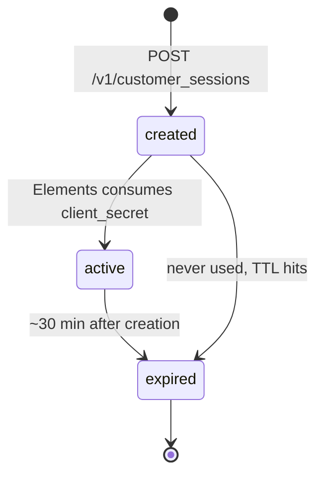
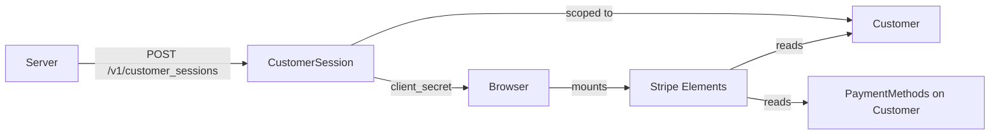

# Customer Session

> API resource: `customer_session` · API version: `2026-04-22.dahlia` · Category: [Core resources](README.md)

## What it is

A `CustomerSession` is a short-lived, server-issued capability token that grants Stripe Elements running in a customer's browser scoped access to *one* [Customer's](customers.md) data. It exists for a single purpose: letting client-side Stripe.js components render Customer-specific UI (saved payment methods, the hosted Pricing Table, the Buy Button, etc.) without your server having to expose its secret key or proxy every read.

You create one CustomerSession per page-load, server-side, with the `customer` you're rendering for and the `components` you intend to mount. Stripe returns a `client_secret`; you ship it to the browser; Stripe.js exchanges it for the right level of access. ~30-minute TTL means each page render gets a fresh one — there's no long-lived "session" to manage.

## Why it exists

Three problems it solves:

1. **You can't put your secret key in the browser.** But the Saved-Payment-Method element needs to read attached PMs, the Buy Button needs to load price data, the Pricing Table needs to know if the customer is already subscribed. CustomerSession is the bridge.
2. **You don't want one customer's session to access another customer's data.** Server-issued, single-customer sessions enforce the boundary. The browser can never escalate.
3. **You want fine-grained UI feature flags.** The `components` field opts into specific Element capabilities one at a time, so a leaked session-secret limits blast radius to exactly what you opted in to.

If you only need to take a one-shot payment and you don't care about saved cards or hosted billing UI, you don't need a CustomerSession — a PaymentIntent's `client_secret` is sufficient.

## Lifecycle & states

CustomerSession has no `status` enum. It is created, used by Elements while valid, and expires:



Properties of the lifecycle:

- **No update endpoint.** You can't extend, downgrade, or revoke a session. Throw it away and create a new one.
- **No delete endpoint.** Wait for TTL.
- **`expires_at`** is set at creation and never changes.
- **The `client_secret` is shown exactly once**, in the create response. You cannot fetch a session by ID and recover it.

### TTL

Default ~30 minutes (Stripe documents the exact value inline; treat as "definitely less than an hour"). The TTL is for the session as a whole, not per-component. Long-lived single-page apps must request a new session before a user lingers past expiry — typically by hitting your server endpoint again on a stale-token error from Elements.

## Anatomy of the object

### Identity

| Field | Notes |
|---|---|
| `id` | `cs_…` — note: also the prefix used by Checkout Session. Different objects, distinguishable by the `object` field. |
| `object` | `"customer_session"` |
| `livemode` | mode flag. |
| `created` | unix seconds. |

### What the session grants

| Field | Notes |
|---|---|
| `customer` | `cus_…`. The Customer this session is scoped to. **Required at creation.** |
| `client_secret` | Opaque string Stripe.js will consume. **Returned only on create.** Hand it to the browser; never log it to a system that retains it longer than the TTL. |
| `expires_at` | unix seconds. After this, the secret is rejected by Elements and the API. |
| `components` | Subobject. Each key is a Stripe Element capability you're enabling for this session. **You must opt in** — by default, no component access is granted. |

### Components subobject

A typical request:

```json
{
  "buy_button":     { "enabled": true },
  "pricing_table":  { "enabled": true },
  "payment_element":{
    "enabled": true,
    "features": {
      "payment_method_redisplay": "enabled",
      "payment_method_save": "enabled",
      "payment_method_save_usage": "off_session",
      "payment_method_remove": "enabled"
    }
  }
}
```

Common `components` keys:

| Component | What it lets the browser do |
|---|---|
| `buy_button` | Render a Stripe-hosted Buy Button keyed to this customer. |
| `pricing_table` | Render the hosted Pricing Table; it can show "current plan" cues for this customer. |
| `payment_element` | Render the Payment Element with this customer's saved PMs (subject to `features` flags). |
| `customer_sheet` | Mobile saved-PM sheet. |

Hedge: the exact list of components keeps growing — verify against the live API reference for the version you're on. The pattern (`{ enabled: true, features: {…} }`) is stable.

### Features (under `payment_element` and others)

| Feature | Effect |
|---|---|
| `payment_method_redisplay` | `enabled` shows previously-saved PMs in the Element. |
| `payment_method_save` | `enabled` lets the customer tick "save for later". |
| `payment_method_save_usage` | `on_session` / `off_session` — the `setup_future_usage` Stripe writes when the customer saves. |
| `payment_method_remove` | `enabled` lets the customer detach a saved PM right from the Element. |
| `payment_method_redisplay_limit` | Optional integer cap on how many PMs to show. |

## Relationships



A CustomerSession exists to be consumed by Elements. It doesn't appear in Customer's list of children, doesn't show up as a webhook source, and doesn't outlive its TTL. It is the most ephemeral resource in the API.

## Common workflows

### 1. Render saved cards on a checkout page

Server (per-render):

```http
POST /v1/customer_sessions
  customer=cus_…
  components[payment_element][enabled]=true
  components[payment_element][features][payment_method_redisplay]=enabled
  components[payment_element][features][payment_method_save]=enabled
  components[payment_element][features][payment_method_save_usage]=off_session
  components[payment_element][features][payment_method_remove]=enabled
```

Pass `client_secret` to the page. Browser:

```js
const stripe = Stripe(PUBLISHABLE_KEY);
const elements = stripe.elements({
  customerSessionClientSecret: clientSecret,
  // also pass mode/amount/currency or a PaymentIntent client_secret
});
const paymentEl = elements.create("payment");
paymentEl.mount("#payment-element");
```

### 2. Embed a Pricing Table that knows the customer

```http
POST /v1/customer_sessions
  customer=cus_…
  components[pricing_table][enabled]=true
```

Browser:

```html
<stripe-pricing-table
  pricing-table-id="prctbl_…"
  publishable-key="pk_live_…"
  customer-session-client-secret="${clientSecret}">
</stripe-pricing-table>
```

### 3. Embed a Buy Button for a returning customer

```http
POST /v1/customer_sessions
  customer=cus_…
  components[buy_button][enabled]=true
```

Use the returned `client_secret` as the `customer-session-client-secret` attribute on the `<stripe-buy-button>` web component.

### 4. Refresh on stale-token error

If your SPA sits open longer than the TTL and the user re-engages, Elements will throw on next interaction. Pattern:

```js
elements.on("error", async (e) => {
  if (e.error?.code === "customer_session_expired") {
    const fresh = await fetch("/api/customer-session", { method: "POST" });
    elements.update({ customerSessionClientSecret: (await fresh.json()).clientSecret });
  }
});
```

(Exact error code varies; check `error.type` against the version of Stripe.js you load.)

## Webhook events

CustomerSession does **not** emit webhook events. It's a transient client-side capability — there's nothing to react to server-side. If you need to react to actions a customer takes through Elements (saving a PM, removing one), listen to the underlying object events: `payment_method.attached`, `payment_method.detached`, etc. See [_meta/webhook-catalog.md](../_meta/webhook-catalog.md).

## Idempotency, retries & race conditions

- **Always send `Idempotency-Key`** on `POST /v1/customer_sessions`. A retry without one creates a second session and burns a little money on the wasted call (and on your DB if you store them).
- **Multiple concurrent sessions for the same customer are fine.** Each is independent, each has its own `client_secret`, each expires on its own clock.
- **Race between TTL expiry and a final action.** A customer who clicks "save card" right at T+30min may see the action fail. Build the refresh-on-expiry path before you ship.
- **`client_secret` exposure.** Treat it like a short-lived bearer token. Send it over TLS, don't log it server-side past the request, don't put it in URL query strings (referer leaks).

## Test-mode tips

- Test-mode CustomerSessions work against test-mode Customers and the test publishable key. Live sessions reject test-mode Customers and vice-versa — `livemode` must match across all three (account key, customer, session).
- Stripe CLI's `stripe customer_sessions create` is the fastest path to a working session in dev.
- The Saved-Payment-Method element shows nothing if the test Customer has no PMs attached. Attach one (e.g. via a SetupIntent) before you debug rendering.

## Connect considerations

- For **Standard / Express** connected accounts, set the `Stripe-Account` header on `POST /v1/customer_sessions` to scope the session to a customer on that connected account. The publishable key in the browser must match (use the connected account's publishable key, or a platform key with `Stripe-Account` set on Element load).
- For **direct charges** flows where the customer lives on the connected account, the session must too.
- A platform cannot create a CustomerSession for a customer on a connected account *without* the Connect header — there's no "cross-account session".

## Common pitfalls

- **Hard-coding a long-lived session.** The TTL is short by design. Recreate per page-load.
- **Forgetting to opt into `components`.** A session with no `components` enabled effectively grants nothing — Elements will mount empty. The default is *not* "all on".
- **Mismatched livemode.** Test customer + live publishable key + any session = failure. Check all three.
- **Logging the `client_secret`.** Treat as sensitive. It's bearer auth for the customer's data while it's valid.
- **Passing the wrong customer.** The session is scoped at creation; you can't change it. Show the wrong customer's saved cards if you mix them up — and you've now leaked PM data to the wrong user.
- **Confusing `cs_…` prefixes.** Both Checkout Session and CustomerSession use `cs_` IDs. Differentiate by the `object` field, not the prefix.
- **Expecting a webhook.** None fire. React to the underlying PaymentMethod / Subscription events instead.

## Further reading

- [API reference: CustomerSession](https://docs.stripe.com/api/customer_sessions)
- [Customer](customers.md) — the resource the session scopes to.
- [PaymentMethod](../02-payment-methods/payment-methods.md) — what the Saved-PM element manages.
- [Stripe Elements overview](https://docs.stripe.com/payments/elements)
- [Pricing Table](https://docs.stripe.com/payments/checkout/pricing-table) and [Buy Button](https://docs.stripe.com/payment-links/buy-button) docs.
