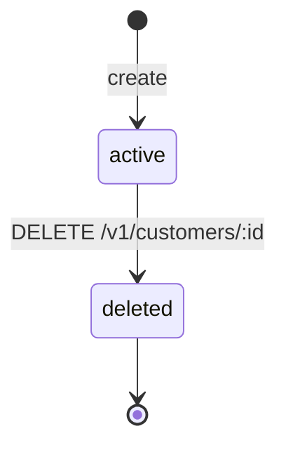

# Customer

> API resource: `customer` · API version: `2026-04-22.dahlia` · Category: [Core resources](README.md)

## What it is

A `Customer` is Stripe's persistent record of someone you can charge again. It is a *container*: it owns saved payment methods, default invoice settings, tax IDs, addresses, balances, the discount currently applied, and references to subscriptions and invoices created against it. It is **not** a user account in your product — there's no password, no login, no permissions. It's just an identity Stripe uses to thread a person's payment relationships together.

You don't strictly need a Customer to take a one-shot payment (a guest checkout via PaymentIntent works without one). You *do* need one for: subscriptions, invoicing, saving cards for later, pre-applied tax/discount rules, and the customer portal.

## Why it exists

Three reasons:

1. **Identity for recurring billing.** Subscriptions and invoices have to point at *something*. The Customer is that something.
2. **A place to attach saved instruments.** PaymentMethods get `attached` to a Customer so you can charge them again without re-collecting card details.
3. **A place to attach tax/discount/locale defaults.** Address, tax IDs, default tax rates, default coupon, preferred locale, default invoice email. Set them once on the Customer and they cascade to invoices.

## Lifecycle & states

Customers don't have a `status` enum. The interesting state is *deletion*:



- **`active`** (the default — there's no field saying so, just the absence of `deleted: true`). All operations work.
- **`deleted: true`**. The object is *tombstoned*. The ID still resolves but the response only contains `id`, `object: "customer"`, `deleted: true`, and nothing else. **Subscriptions on a deleted customer are canceled immediately. Saved PaymentMethods are detached. Pending invoices stay payable.** You cannot un-delete; you'd have to create a new Customer.

> Soft sub-states you'll want to track in your own DB: "has at least one valid PaymentMethod", "has overdue invoice", "in dunning". Stripe doesn't surface these on the Customer object itself — derive from related objects.

## Anatomy of the object

### Identity

| Field | Notes |
|---|---|
| `id` | `cus_…` |
| `object` | always `"customer"` |
| `livemode` | true in live, false in test. **Do not** copy IDs across modes. |
| `created` | unix seconds. |
| `metadata` | your bag. Best place to store *your* user ID. |

### Money & balance

| Field | Notes |
|---|---|
| `balance` | Integer in cents. **Negative = credit you owe the customer; positive = debt the customer owes you.** Auto-applied to next invoice. Sign convention trips up everyone the first time. |
| `cash_balance` | (expandable) For customer-balance payments — funds the customer wired to a Stripe-issued bank reference. |
| `currency` | Pinned the first time the customer is charged or invoiced. After that, all invoices must match. |
| `discount` | The single active customer-level discount. There's no "discounts" array on Customer — only one at a time. |
| `default_source` | Legacy. Don't read on new code; use `invoice_settings.default_payment_method`. |

### Defaults that cascade to invoices

| Field | Notes |
|---|---|
| `invoice_settings.default_payment_method` | The PM Stripe will charge on subscription renewals and finalized invoices unless an Invoice/Subscription overrides. |
| `invoice_settings.custom_fields` | Free-form key/value pairs that render on PDF invoices. Often used for PO numbers. |
| `invoice_settings.footer` | String shown at the bottom of every invoice PDF. |
| `invoice_settings.rendering_options` | e.g. `amount_tax_display`. |
| `invoice_prefix` | The prefix portion of `invoice.number` for this customer. |
| `next_invoice_sequence` | Auto-incremented per-customer counter. You can reset it but rarely should. |
| `email`, `name`, `phone`, `description` | Standard identity. `email` is what gets receipts and invoice emails by default. |
| `address`, `shipping` | Used for tax calculation if Stripe Tax is enabled. |
| `preferred_locales` | Array. Drives Hosted Invoice / Checkout language. |
| `tax_exempt` | `none | exempt | reverse`. `reverse` means VAT reverse-charge applies. |
| `tax.automatic_tax` / `tax.location` | Automatic tax detection state, computed by Stripe. |

### Tax IDs

Tax IDs (VAT, GST, ABN, EIN, …) are their own sub-resource: `/v1/customers/:id/tax_ids`. They affect invoice rendering and tax calculation. See [TaxId](../06-billing/tax-ids.md).

### Sources & PaymentMethods

`sources` (legacy) and `default_source` are deprecated. The modern way:

- Attach a PaymentMethod via `POST /v1/payment_methods/:id/attach { customer: cus_… }`.
- List attached PMs via `GET /v1/payment_methods?customer=cus_…&type=card`.
- Set the default for invoices on `invoice_settings.default_payment_method`.

A Customer can have any number of attached PaymentMethods.

## Relationships

```mermaid
graph LR
    Customer --> PaymentMethod
    Customer --> Subscription
    Customer --> Invoice
    Customer --> InvoiceItem
    Customer --> Charge
    Customer --> PaymentIntent
    Customer --> SetupIntent
    Customer --> TaxId
    Customer --> CashBalance
    Customer --> CustomerBalanceTransaction
    Customer --> Discount
    Customer --> CheckoutSession
    Customer --> Quote
    Customer -.-> TestClock: locked to one
```

A Customer can be locked to a [TestClock](../06-billing/test-clocks.md) at creation (test mode only). Once locked, you can't unlock; the Customer's billing time advances with the clock.

## Common workflows

### 1. Create a Customer at signup, charge later

```http
POST /v1/customers
  email=jane@example.com
  name=Jane Doe
  metadata[app_user_id]=42
```

Save the returned `cus_…` against your user record. Don't worry about payment methods yet.

When Jane checks out:

```http
POST /v1/payment_intents
  amount=1999
  currency=usd
  customer=cus_…
  setup_future_usage=off_session    # save the PM after charging
  automatic_payment_methods[enabled]=true
```

Confirm the PI client-side via Stripe.js. After success, a PaymentMethod is attached to the Customer and you can charge it again later.

### 2. Save a card without charging (free trial)

Create a [SetupIntent](setup-intents.md) instead of a PaymentIntent. After confirmation, attach the resulting PaymentMethod to the Customer and store its ID.

### 3. Update billing email

```http
POST /v1/customers/cus_…
  email=new@example.com
```

This updates the receipt destination for *future* invoices. Already-sent receipts aren't reissued.

### 4. Apply a credit

To grant Jane $20 of credit (Stripe will auto-deduct from her next invoice):

```http
POST /v1/customers/cus_…/balance_transactions
  amount=-2000
  currency=usd
  description=Apology credit
```

Negative amount = credit. Positive = debt. The next finalized invoice will absorb up to its total. See [CustomerBalanceTransaction](../06-billing/customer-balance-transactions.md).

### 5. Delete

`DELETE /v1/customers/cus_…`. Subscriptions cancel immediately. Open invoices remain payable (Stripe does not auto-void them). Most teams *don't* delete — they soft-suspend in their own DB and keep the Stripe record for audit/reconciliation.

## Webhook events

| Event | Fires when | Listener typically does |
|---|---|---|
| `customer.created` | A Customer is created | Sync to your DB. |
| `customer.updated` | Any field change (incl. balance, default PM) | Re-sync. |
| `customer.deleted` | DELETE was issued | Soft-suspend in your DB. |
| `customer.source.*` | Legacy source events. | Ignore in new integrations. |
| `customer.tax_id.created/deleted` | Tax IDs added/removed | Refresh tax compliance UI. |
| `customer.discount.created/updated/deleted` | Coupon applied/removed at customer level | Refresh pricing display. |
| `payment_method.attached/detached` | PM added/removed (note: top-level, not under `customer.*`) | Refresh saved-cards list. |
| `customer.subscription.*` | Subscription lifecycle on this customer | See [Subscription](../06-billing/subscriptions.md). |

## Idempotency, retries & race conditions

- **Always send `Idempotency-Key`** on `POST /v1/customers`. Otherwise a network retry can create two customers with the same email — Stripe doesn't deduplicate by email.
- The Customer object you get back from `customer.updated` webhooks reflects *post-change* state. If you receive multiple `customer.updated` events out of order (rare but possible), trust the one with the largest `created` timestamp on the Event, or refetch.
- Concurrent attempts to set a default PM on the same Customer are last-write-wins.

## Test-mode tips

- `Stripe-Account` and livemode are independent dimensions; you can have a test Customer on a connected account.
- To simulate billing time advancing, attach the Customer to a `test_clock` at creation and use [TestClock](../06-billing/test-clocks.md) APIs to fast-forward.
- `stripe customers create --email foo@example.com` via Stripe CLI is faster than curl during development.

## Connect considerations

- Customers are scoped to a single Stripe account. **They do not exist on the platform and connected account simultaneously.** If you need a customer on both, create two Customer objects and link them in your DB by metadata.
- For *destination charges* and *direct charges*, see [Account](../07-connect/accounts.md) — the relevant question is "whose Customer is this?".
- The `Stripe-Account` header determines which account the Customer is created on.

## Common pitfalls

- **`balance` sign confusion.** Negative is *credit*, positive is *debt*. Easy to flip.
- **Currency lock.** Once a customer has a Stripe object in currency X, you cannot create one in currency Y on the same Customer. Create a separate Customer per currency if you bill internationally per-customer.
- **`email` is not unique.** Stripe lets you create N customers with the same email. Dedupe in your application layer.
- **Deleting a customer cancels subscriptions.** If you only meant to "archive in our UI", don't call DELETE.
- **`customer.updated` fires *constantly*** — every balance debit, every PM attach, every metadata tweak. Idempotent handlers and conservative refetches will save your Postgres.
- **`default_source` vs `invoice_settings.default_payment_method`.** The first is legacy (Sources/Cards), the second is current (PaymentMethods). Subscriptions look at the second; setting the first won't help.

## Further reading

- [API reference: Customer](https://docs.stripe.com/api/customers/object)
- [Customer guide](https://docs.stripe.com/customers)
- [Saving payment details for future use](https://docs.stripe.com/payments/save-and-reuse)
