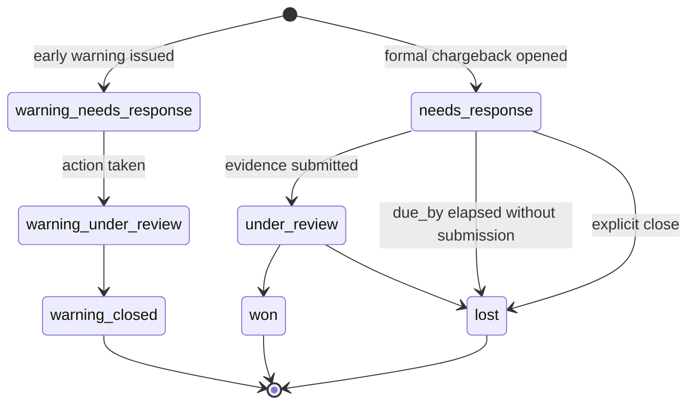
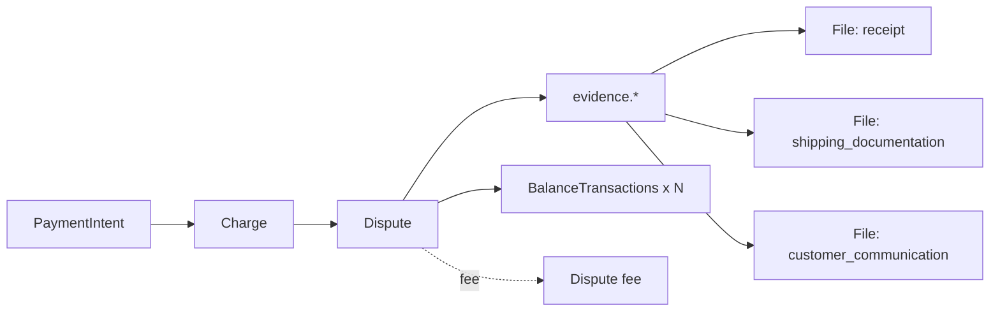

# Dispute

> API resource: `dispute` · API version: `2026-04-22.dahlia` · Category: [Core resources](README.md)

## What it is

A `Dispute` is the Stripe representation of a chargeback: the cardholder went to their issuing bank, told the bank "I don't recognize / didn't authorize / didn't receive this payment," and the bank pulled the funds back from your Stripe balance. The Dispute object is your interface for fighting it: you attach evidence, you submit, Stripe forwards everything to the card network, the network rules in your favor (`won`) or against (`lost`).

A small number of dispute-like cases also surface as *early warnings* — Visa's RDR/CDRN, Mastercard's Ethoca alerts. Those arrive as Disputes with `warning_*` statuses, give you a chance to refund proactively before the formal chargeback hits, and never withdraw funds.

## Why it exists

Three reasons it has to be a first-class object:

1. **Funds movement.** When the dispute opens, money leaves your balance immediately and a debit BalanceTransaction is recorded. Reconciliation needs an authoritative pointer for that movement.
2. **Evidence workflow.** Card networks require structured evidence with strict format rules. The `evidence` subobject is that structure.
3. **Outcome accounting.** Won, lost, and "warning closed" each have different ledger consequences (won = funds reinstated, lost = funds + dispute fee gone, warning = no movement). The `status` enum drives that.

You almost never *create* a Dispute via the API. They are created by Stripe in response to a network message. You *read*, *update* (to attach evidence), and *close* (to accept the loss).

## Lifecycle & states



### State semantics

| Status | Meaning | What's mutable |
|---|---|---|
| `warning_needs_response` | Early warning (Ethoca / Visa RDR-CDRN). No funds withdrawn yet. You typically refund proactively to avoid the formal chargeback. | Refund the underlying charge to resolve. |
| `warning_under_review` | You acted on the warning (refunded or otherwise); waiting for it to close. | Mostly read-only. |
| `warning_closed` | Terminal warning state. No financial impact recorded on the dispute. | None. |
| `needs_response` | Formal chargeback. Funds already withdrawn. Clock ticking — you have until `evidence_details.due_by`. | `evidence.*` and `metadata`. Submit with `submit=true`. |
| `under_review` | You submitted evidence; Stripe forwarded it to the network. | `metadata` only. **No more evidence edits in most cases.** Some networks accept additional submissions; check `evidence_details.submission_count` and Stripe's per-network rules. |
| `won` | Network ruled in your favor. Funds + dispute fee reinstated. | `metadata` only. |
| `lost` | Network ruled against you (or the deadline passed). Funds + non-refundable dispute fee gone. | `metadata` only. |

### Funds movement timeline

1. **Dispute opens** (`needs_response`): Stripe debits your balance for `amount` + a non-refundable dispute fee. `charge.dispute.funds_withdrawn` fires. The original Charge gets `disputed: true`.
2. **You submit evidence** (`under_review`): no funds movement.
3. **Network rules `won`**: Stripe credits your balance back for `amount` + the dispute fee. `charge.dispute.funds_reinstated` fires.
4. **Network rules `lost`**: nothing further happens; the earlier debit is final. The dispute fee stays gone.

For warnings, none of this happens — they're pre-chargeback notifications and never withdraw money.

## Anatomy of the object

### Identity

| Field | Notes |
|---|---|
| `id` | `dp_…` |
| `object` | `"dispute"` |
| `livemode` | mode flag. |
| `created` | unix seconds. The moment the dispute was opened (or the warning was issued). |
| `metadata` | Your bag — useful for tying disputes back to your internal case-management. |

### Money

| Field | Notes |
|---|---|
| `amount` | Disputed amount, smallest currency unit. Usually the full charge amount but can be partial. |
| `currency` | ISO 4217. Matches the underlying charge. |
| `balance_transactions` | Array of `BalanceTransaction` ids representing the dispute's ledger entries: the initial debit, the dispute fee, and (on win) the reinstating credits. **Always read this for accurate accounting** — the dispute object's `amount` is the disputed amount, not the net impact on your balance. |

### Status

| Field | Notes |
|---|---|
| `status` | See state machine above. |
| `is_charge_refundable` | Boolean. If `true`, you can still refund the underlying charge to resolve a warning early. Becomes `false` after a formal chargeback opens — you can't both refund and dispute. |

### Reason (the cardholder's claim)

| Value | Cardholder said |
|---|---|
| `fraudulent` | "I didn't authorize this." Highest-loss-rate category; strong evidence required. |
| `unrecognized` | "I don't recognize this charge." Often resolved with merchant-name + receipt evidence. |
| `duplicate` | "I was charged twice." Show distinct authorizations. |
| `subscription_canceled` | "I canceled, you kept billing." Show your cancellation policy + UI flow. |
| `product_unacceptable` | "What I got isn't what was advertised." |
| `product_not_received` | "It never showed up." Shipping proof / delivery confirmation is the typical evidence. |
| `credit_not_processed` | "You promised a refund and didn't issue it." |
| `general` | Catch-all. Check `evidence_details` carefully. |
| `incorrect_account_details` | Wire/ACH-style claim that the account info was wrong. |
| `insufficient_funds` | ACH bounce surfaced as a dispute. |
| `bank_cannot_process` | Issuing bank operational failure. |
| `debit_not_authorized` | ACH unauthorized debit. |
| `customer_initiated` | Some non-card networks. |
| `check_returned` | Check-based payment bounced. |
| `noncompliant` | Compliance claim by issuer. |

Hedge: Stripe expands the reason enum from time to time. Treat unknown values as `general` in your code.

### Evidence (the heart of the object)

`evidence` is a large subobject. You write each field via `POST /v1/disputes/dp_…`:

| Field | Type | What it is |
|---|---|---|
| `access_activity_log` | string | Logs showing the customer used the service. |
| `billing_address` | string | Billing address on the order, for AVS comparison. |
| `cancellation_policy` | `file_…` | PDF of your cancellation policy. |
| `cancellation_policy_disclosure` | string | Where on the site the customer saw it. |
| `cancellation_rebuttal` | string | Why a `subscription_canceled` claim is wrong. |
| `customer_communication` | `file_…` | Emails / chat transcripts with the customer. |
| `customer_email_address` | string | Email on the account. |
| `customer_name` | string | Name on the account. |
| `customer_purchase_ip` | string | IP at purchase time. |
| `customer_signature` | `file_…` | Signed receipt, if any. |
| `duplicate_charge_documentation` | `file_…` | Showing the "duplicate" is actually distinct. |
| `duplicate_charge_explanation` | string | Why two charges aren't the same purchase. |
| `duplicate_charge_id` | `ch_…` | The other charge being claimed as a duplicate. |
| `product_description` | string | What was sold. |
| `receipt` | `file_…` | The receipt/invoice. |
| `refund_policy` | `file_…` | Your refund policy PDF. |
| `refund_policy_disclosure` | string | Where the customer saw it. |
| `refund_refusal_explanation` | string | Why you refused refund. |
| `service_date` | string | When the service was rendered. |
| `service_documentation` | `file_…` | Proof of service delivery. |
| `shipping_address` | string | Where it shipped. |
| `shipping_carrier` | string | UPS / FedEx / etc. |
| `shipping_date` | string | When you shipped. |
| `shipping_documentation` | `file_…` | Tracking screenshot, label PDF. |
| `shipping_tracking_number` | string | Carrier tracking number. |
| `uncategorized_file` | `file_…` | Anything else. |
| `uncategorized_text` | string | Free-form catch-all. |
| `enhanced_evidence` | subobject | Newer card-network-specific structured evidence (Visa Compelling Evidence 3.0, Mastercard FirstParty). Hedge: shape varies by network and is evolving — read the live API reference. |

All `file_…` fields require a [File](files.md) with `purpose=dispute_evidence`.

### Evidence details

| Field | Notes |
|---|---|
| `evidence_details.due_by` | unix seconds. **Hard deadline.** Submit by this or you lose by default. |
| `evidence_details.has_evidence` | Boolean. True once you've written any non-empty evidence field. |
| `evidence_details.past_due` | Boolean. True if `due_by` has passed without a submission. |
| `evidence_details.submission_count` | How many times you've submitted. Most networks accept exactly one; some allow additional submissions while `under_review`. |

### Pointers

| Field | Notes |
|---|---|
| `charge` | `ch_…`. The disputed charge. **A charge has at most one Dispute.** |
| `payment_intent` | `pi_…` if the charge was created via a PaymentIntent (almost always in modern integrations). |
| `payment_method_details` | Subobject mirroring the charge's, telling you which network is in play (Visa / MC / Amex / Discover / non-card). Determines the ruleset. |
| `network_reason_code` | Raw network reason code, useful when you're talking to your acquirer or chargeback-management vendor. |

## Relationships



- A Charge has **at most one** Dispute (lifetime).
- A Dispute references **many** Files via the `evidence.*` fields.
- A Dispute spawns multiple BalanceTransactions: an initial debit, a fee, and (on win) reinstating credits.

## Common workflows

### 1. React to a new dispute

Webhook `charge.dispute.created` arrives. In your handler:

```python
event = stripe.Webhook.construct_event(payload, sig, secret)
if event["type"] == "charge.dispute.created":
    d = event["data"]["object"]
    notify_team(d["id"], d["amount"], d["reason"], d["evidence_details"]["due_by"])
    schedule_evidence_collection(d["id"], deadline=d["evidence_details"]["due_by"])
```

Page the right team. Surface `due_by` *prominently* — most lost disputes are lost by missing the clock, not by weak evidence.

### 2. Save evidence as a draft

Upload files first, then attach with `submit=false`:

```http
POST /v1/disputes/dp_…
  evidence[receipt]=file_…
  evidence[shipping_documentation]=file_…
  evidence[shipping_tracking_number]=1Z9999...
  evidence[customer_communication]=file_…
  submit=false
```

This persists the evidence on the dispute without sending it to the network. You can update the same fields again repeatedly while `submit=false` and `status: needs_response`.

### 3. Submit evidence

When ready:

```http
POST /v1/disputes/dp_…
  evidence[uncategorized_text]=Final summary of our case…
  submit=true
```

Status flips to `under_review`. **For most networks this is final** — you can't edit again. Some networks allow additional submissions; the only safe rule is "treat the first `submit=true` as your only shot".

### 4. Concede / accept the loss

If you're going to lose anyway, save the dispute fee and operational time:

```http
POST /v1/disputes/dp_…/close
```

Status flips to `lost` immediately. The non-refundable dispute fee is still gone (the fee was charged at dispute open), but you skip the cycle.

### 5. Resolve a warning by refunding

For `warning_needs_response`:

```http
POST /v1/refunds
  charge=ch_…
  amount=…
  reason=requested_by_customer
```

`is_charge_refundable: true` while the warning is open. Refunding it short-circuits the formal chargeback in most cases. The warning then closes.

### 6. Reconcile the ledger

```http
GET /v1/disputes/dp_…?expand[]=balance_transactions
```

Each entry has `amount`, `fee`, `net`. Sum to compute the dispute's net impact on your balance.

### 7. List recent disputes

```http
GET /v1/disputes?created[gte]=…&limit=100
```

Useful for ops dashboards and weekly chargeback rate calculations.

## Webhook events

| Event | Fires when | Listener typically does |
|---|---|---|
| `charge.dispute.created` | Dispute opens (warning or formal). **Page on this.** | Open an internal case, page the team, kick off evidence-gathering. |
| `charge.dispute.updated` | Any field change — most often evidence updates, status transition, `due_by` change. | Re-sync, re-render UI for ops. |
| `charge.dispute.closed` | Terminal status reached: `won`, `lost`, or `warning_closed`. | Update internal case, post-mortem if `lost`. |
| `charge.dispute.funds_withdrawn` | Funds debit hit your balance. | Update accounting. |
| `charge.dispute.funds_reinstated` | Funds credit hit your balance after a `won`. | Update accounting. |

`charge.dispute.created` is one of a handful of events Stripe recommends paging humans on — if you ignore it, the deadline can slip.

## Idempotency, retries & race conditions

- **Send `Idempotency-Key`** on every `POST /v1/disputes/dp_…`. Without one, a network retry that re-sends evidence with `submit=true` could double-submit (rare but devastating since you can't unsend).
- **The `submit=true` action is one-way.** Practice in test mode. Build a confirm-step in your ops UI before the API call.
- **Funds-withdrawn and dispute-created can race.** The withdrawn event sometimes arrives before the dispute object is fully readable via GET. Refetch with backoff if your handler 404s.
- **Multiple `charge.dispute.updated` events for the same change.** Treat handlers as set-style, not delta-style.
- **`due_by` can shift earlier.** Some networks shorten the response window after issuance. Don't cache `due_by` — refetch before scheduling reminders.

## Test-mode tips

- Magic card `4000 0000 0000 0259` charges successfully then *creates a dispute immediately*. Useful to exercise the full flow.
- `4000 0000 0000 1976` triggers a dispute under the `fraudulent` reason; `4000 0000 0000 5423` under `product_not_received`. The full table is in [Stripe testing docs](https://docs.stripe.com/testing#disputes).
- `stripe trigger charge.dispute.created` via the CLI builds a fresh test charge and disputes it end-to-end.
- Test-mode disputes resolve based on the `evidence.uncategorized_text` content: include the magic word `winning_evidence` and the dispute resolves to `won`; `losing_evidence` resolves to `lost`. See the testing docs for the canonical strings, which evolve.
- Test-mode `due_by` is short (often a few hours) so you can exercise the timeout path without waiting weeks.
- Use `stripe events resend evt_…` to replay a dispute event during handler development.

## Connect considerations

- For **direct charges** (charge on a connected account), the Dispute lives on the connected account. Evidence uploads and the `submit` action must use `Stripe-Account: acct_…`. The dispute fee is debited from the connected account's balance, not the platform's.
- For **destination charges** (charge on platform with `transfer_data[destination]`), the Dispute lives on the platform. The platform is on the hook for evidence and the dispute fee. Many platforms then claw back from the connected account by reversing the original Transfer; that's a business / contract decision, not an automatic flow.
- **Visibility.** A connected Standard account with Dashboard access can see and respond to disputes themselves; a Custom or Express account cannot — the platform must build the UI.
- **Payouts may be paused** for high-dispute connected accounts. Watch `account.updated` events for `requirements` changes.

## Common pitfalls

- **Missing the early warning.** `warning_needs_response` looks innocuous in the Dashboard but is your one chance to refund and avoid the chargeback fee. Treat warnings as urgent.
- **Submitting too early.** Once `submit=true`, evidence is locked in most cases. Collect everything before the call.
- **Treating `lost` as appealable.** It is final at the network layer. Stripe's "Inquiry" / "second presentment" flows exist for some networks but are limited and out-of-scope for the public API.
- **Confusing `amount` with balance impact.** `amount` is the disputed sum. The full ledger impact is `amount + fee` on open, `amount + fee` reinstated on win. Read `balance_transactions` for the truth.
- **Uploading evidence files with the wrong `purpose`.** Files attached to `evidence.*` must be `purpose=dispute_evidence`. Wrong purpose → API error at attach time.
- **Hitting per-field size limits.** Each evidence file field has its own limits (typically a few MB). Compressing PDFs is often necessary.
- **Forgetting to handle `is_charge_refundable=false` paths.** Once a formal dispute opens, you can't refund the underlying charge — refunds will fail. Your own UI should hide the refund button.
- **Reusing the same idempotency key across draft updates.** Stripe will return the first response on the second call. Use a unique key per logical write.
- **Trusting Dashboard-edited evidence to be in your DB.** If your ops team edits evidence in the Stripe Dashboard, the only way you'll see it is via `charge.dispute.updated`. Make sure your handler refreshes from that event.
- **Not surfacing `due_by` in your UI.** This is the single highest-leverage piece of information. Show it on every dispute view.

## Further reading

- [API reference: Dispute](https://docs.stripe.com/api/disputes/object)
- [Dispute state machine in this repo](../_meta/state-machines.md#dispute)
- [Charge](charges.md) — the disputed object.
- [File](files.md) and [FileLink](file-links.md) — evidence uploads and merchant-facing review URLs.
- [Disputes & fraud guide](https://docs.stripe.com/disputes) on docs.stripe.com.
- [Testing disputes](https://docs.stripe.com/testing#disputes) — the magic test cards and evidence strings.
