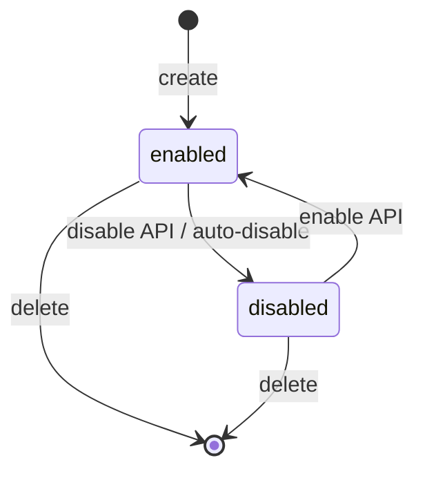
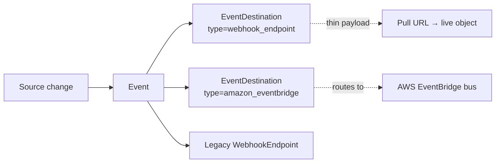

# Event Destination

> API resource: `v2.core.event_destination` · API version: `2026-04-22.dahlia` · Category: [Core resources](README.md)

## What it is

An `EventDestination` is the modern, v2 configuration for "send Stripe events somewhere." It is the replacement for the classic [WebhookEndpoint](../19-webhooks/webhook-endpoints.md). One destination has a transport (HTTPS POST or Amazon EventBridge), a payload shape (`thin` or `snapshot`), and a list of `enabled_events`. Stripe matches events against the destination's filter and delivers them via the chosen transport.

The two systems coexist during the migration window. Both can be active on the same account simultaneously. A given event will be delivered to *every* matching destination, classic and v2 — so be careful not to double-process if you're piloting v2 alongside an existing WebhookEndpoint that subscribes to the same types.

## Why it exists

Three things the legacy WebhookEndpoint couldn't do well:

1. **Non-HTTP transports.** EventDestination can deliver natively to Amazon EventBridge, no Lambda glue required.
2. **Thin events.** The classic webhook always serialized the entire affected object. For high-volume sources (Issuing authorizations, Treasury) that's wasteful and creates ordering pain. Thin events carry only `id` + `type` + a `related_object` pointer; you pull the resource yourself, at the version *you* want, when *you* want.
3. **v2 API alignment.** Newer Stripe APIs (v2 core, billing meters, Treasury financial accounts) emit "v2 thin event" types that simply don't fit the legacy WebhookEndpoint model.

If you are starting fresh today, prefer EventDestination. If you have a working WebhookEndpoint, there's no urgency to migrate; both are supported.

## Lifecycle & states



The `status` field carries `enabled` or `disabled`. Disabling stops delivery without losing the configuration; events generated while disabled are *not* queued for later delivery — they're skipped for this destination. Deleting is permanent.

The `status_details` field surfaces *why* Stripe disabled a destination automatically — for example, persistent 4xx/5xx responses for a long enough window will auto-disable a webhook destination. Re-enable after fixing.

## Anatomy of the object

### Identity

| Field | Notes |
|---|---|
| `id` | `ed_…` |
| `object` | `"v2.core.event_destination"` |
| `livemode` | mode flag. |
| `created` / `updated` | RFC3339 timestamps. (v2 APIs use ISO strings, not unix seconds.) |
| `name` | Human label. Optional but recommended. |
| `description` | Free text. |
| `metadata` | Key-value bag, your bookkeeping. |

### Routing & filtering

| Field | Notes |
|---|---|
| `enabled_events` | Array of event-type strings, e.g. `["v1.invoice.paid", "v1.charge.succeeded"]`. Note the `v1.` prefix on classic types when used with v2 destinations. v2-native thin events appear without a `v1.` prefix (e.g. `v2.core.event_destination.ping`). Use `["*"]` for all (development only). |
| `event_payload` | `thin` or `snapshot`. **`thin`**: deliver only `id`, `type`, `related_object.{id,type,url}`, `created`. You fetch the object yourself via the URL. **`snapshot`**: classic behavior — full object embedded under `data.object`, like a WebhookEndpoint. |
| `events_from` | Array. Where the events originate. `["self"]` for your own account; for Connect platforms, `["self", "other"]` to receive both your own events and connected-account events on this destination. |
| `include` | Array of optional fields to include in the payload. Hedge: exact field list depends on the destination type and is evolving — consult the live API reference. |

### Transport

| Field | Notes |
|---|---|
| `type` | `webhook_endpoint` or `amazon_eventbridge`. |
| `webhook_endpoint.url` | Present when `type=webhook_endpoint`. The HTTPS URL Stripe POSTs to. |
| `webhook_endpoint.signing_secret` | Returned **once** on creation (and via the rotate endpoint). Used to verify the `Stripe-Signature` header on delivery. Store securely. |
| `amazon_eventbridge.aws_account_id` | When `type=amazon_eventbridge`. The AWS account that owns the partner event source. |
| `amazon_eventbridge.aws_region` | Region of the EventBridge bus. |
| `amazon_eventbridge.aws_event_source_arn` | The partner event source ARN Stripe creates; you associate this with your bus on the AWS side before delivery starts working. |
| `amazon_eventbridge.aws_event_source_status` | Whether AWS has accepted the partner source (`active`, `pending`, etc.). |

### Status

| Field | Notes |
|---|---|
| `status` | `enabled` / `disabled`. |
| `status_details` | Subobject explaining auto-disable reasons. |

## Relationships



A single event fans out to every matching destination of either generation. There's no concept of "primary destination" — they're parallel.

## Common workflows

### 1. Create a webhook-style event destination

```http
POST /v2/core/event_destinations
Content-Type: application/json

{
  "name": "Production billing handler",
  "type": "webhook_endpoint",
  "event_payload": "snapshot",
  "enabled_events": ["v1.invoice.paid", "v1.invoice.payment_failed"],
  "webhook_endpoint": { "url": "https://api.example.com/stripe/v2" }
}
```

Capture `webhook_endpoint.signing_secret` from the response — it isn't shown again.

### 2. Create an EventBridge destination

```http
POST /v2/core/event_destinations
Content-Type: application/json

{
  "name": "Issuing → SIEM",
  "type": "amazon_eventbridge",
  "event_payload": "thin",
  "enabled_events": ["v1.issuing_authorization.created", "v1.issuing_authorization.updated"],
  "amazon_eventbridge": {
    "aws_account_id": "123456789012",
    "aws_region": "us-east-1"
  }
}
```

Stripe returns an `aws_event_source_arn`. In the AWS Console, associate that partner event source with the bus you want, then events flow.

### 3. Handle a thin event

When `event_payload=thin`, the POST body looks like:

```json
{
  "id": "evt_…",
  "type": "v1.charge.succeeded",
  "created": "2026-05-06T14:00:01Z",
  "related_object": {
    "id": "ch_…",
    "type": "charge",
    "url": "/v1/charges/ch_…"
  }
}
```

Verify the signature, then GET the URL to fetch the object at the API version you've pinned for your library. The thin event carries no stale snapshot to confuse you.

### 4. Migrate from a classic WebhookEndpoint

Pattern that avoids double-processing:

1. Create the new EventDestination subscribed to the same events. Disable it.
2. Add idempotent dedupe by `event.id` in your handler (you should already).
3. Enable the new destination. Now both deliver. Dedupe handles the overlap.
4. Watch metrics for parity, then disable then delete the old WebhookEndpoint.

### 5. Rotate the signing secret

```http
POST /v2/core/event_destinations/ed_…/rotate_secret
```

Stripe returns the new secret and continues to honor the old one for a brief overlap window so you can roll deployments. Hedge: exact overlap window is documented inline in the response — read it.

### 6. Ping for a smoke test

```http
POST /v2/core/event_destinations/ed_…/ping
```

Causes Stripe to deliver a synthetic `v2.core.event_destination.ping` event to the destination. Useful in CI and after re-enabling.

## Webhook events

Event destinations themselves emit a small set of meta-events you can subscribe to:

| Event | Fires when |
|---|---|
| `v2.core.event_destination.ping` | You hit the `ping` action on a destination — useful for end-to-end testing. |
| `v2.core.event_destination.created` | A destination was created. |
| `v2.core.event_destination.updated` | Configuration changed. |
| `v2.core.event_destination.deleted` | Destination removed. |

Beyond those, EventDestination doesn't *emit* events about other resources — it's a *sink*. The events flowing through it are the ones declared in `enabled_events`. See [_meta/webhook-catalog.md](../_meta/webhook-catalog.md).

## Idempotency, retries & race conditions

- **Same delivery semantics as classic webhooks.** At-least-once, signed, retried with exponential backoff for ~3 days.
- **Auto-disable.** Persistent failure for a sustained window disables the destination. Re-enable after fixing the root cause.
- **Thin events sidestep snapshot drift.** Because you fetch the live object yourself, you can't act on stale `data.object`. Trade-off: an extra GET per event.
- **Signing secret rotation overlaps.** During the overlap window, your verifier should accept either secret.
- **Parallel delivery to v1 + v2.** If you have both a WebhookEndpoint and an EventDestination subscribed to `invoice.paid`, you'll get *two* deliveries with different `evt_…` IDs and the same payload semantics. Dedupe by event ID, or only enable one path per environment.

## Test-mode tips

- Test-mode destinations are isolated from live exactly like classic webhooks.
- The Stripe CLI's `stripe listen` works against EventDestination too — pass the appropriate flag (check `stripe listen --help`) to point it at a v2 destination.
- The `ping` action triggers a test event delivery without needing to cause a real state change. Useful in test or live to validate connectivity after a deploy.

## Connect considerations

- Set `events_from: ["self", "other"]` on a platform-side destination to receive both platform events and connected-account events on the same destination. Each event will carry an `account` field if it's about a connected account.
- For high-volume Connect surfaces (Issuing, Treasury) the `thin` payload is strongly preferred. A platform with thousands of cardholders generating issuing authorizations would otherwise drown in snapshot payloads.
- Connected accounts (Standard) can register their own EventDestinations independent of the platform.

## Common pitfalls

- **Storing the signing secret only in code review.** It's shown exactly once. Pull it into your secret store before you `git commit`.
- **Subscribing to `*` in production.** A future Stripe release that adds a new event type will start hitting your handler with payloads you didn't design for. Enumerate explicitly.
- **Mixing `thin` and `snapshot` mental models.** Thin payloads do **not** include `data.object`. Code expecting `event.data.object` will NPE. Branch on `event_payload` or use a separate handler.
- **Double-processing during migration.** When both a classic WebhookEndpoint and a new EventDestination are live, dedupe by `event.id` — they share the underlying Event.
- **Forgetting to associate the EventBridge partner source.** The destination shows `aws_event_source_status: pending` until you accept the partner source in the AWS console. Until then, no deliveries.
- **Treating disable as a queue.** Events generated while a destination is disabled are skipped, not buffered. Either re-enable promptly or accept the data loss.
- **Reusing v1 type names verbatim on a v2 destination.** You write `v1.invoice.paid`, not `invoice.paid`. Mismatched names silently match nothing.

## Further reading

- [API reference: EventDestination](https://docs.stripe.com/api/v2/core/event_destinations) — the v2 endpoint.
- [Event](events.md) — the underlying object that gets delivered.
- [WebhookEndpoint](../19-webhooks/webhook-endpoints.md) — the classic equivalent, still supported.
- [_meta/webhook-catalog.md](../_meta/webhook-catalog.md) — the catalog of event types.
- [Event destinations guide](https://docs.stripe.com/event-destinations) on docs.stripe.com.
