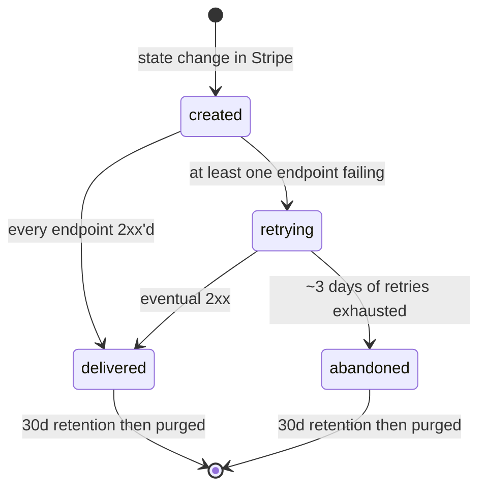
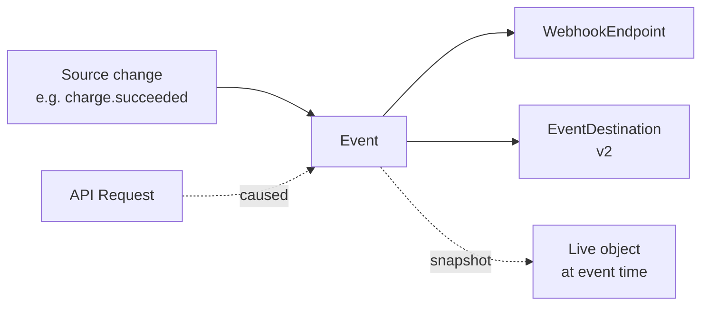

# Event

> API resource: `event` · API version: `2026-04-22.dahlia` · Category: [Core resources](README.md)

## What it is

An `Event` is Stripe's immutable record of "something happened in your account." Every state change Stripe deems interesting — a charge succeeded, an invoice finalized, a subscription canceled, a dispute opened — produces exactly one Event. Events are the substrate of webhooks: when you configure a [WebhookEndpoint](../19-webhooks/webhook-endpoints.md) (or modern [event destination](event-destinations.md)), Stripe POSTs the Event to your URL. They are also retrievable via `GET /v1/events`, which lets you reconcile delivery, replay missed history, and audit "what changed when".

The Event is **not** the live object. It carries a *snapshot* of the resource at the moment the event was generated, plus (for `*.updated` events) a diff of what changed.

## Why it exists

Without Events you'd have to poll. Webhook delivery alone isn't enough either — networks fail, your handler 500s, your queue backs up. The Event collection gives you a server-side log of truth you can re-read at any point in the last 30 days. Three jobs:

1. **Drive webhook delivery.** Each Event tracks how many endpoints still need it (`pending_webhooks`).
2. **Audit / replay.** Listing events is how you backfill a downed handler, or prove to a customer "we saw this transition at 14:02 UTC".
3. **Diff.** `data.previous_attributes` tells you which fields changed on `*.updated` events without you having to remember the prior state.

## Lifecycle & states

Events have no `status` enum. They are created and never mutated:



The "states" above are *delivery* states tracked on the WebhookEndpoint side; the Event object itself is immutable. The fields you can observe:

- `pending_webhooks` — how many endpoints still owe Stripe a 2xx for this event. Decreases as deliveries succeed.
- No `delivered_at` field — check the Dashboard's Webhooks log for per-attempt detail, or query `GET /v1/webhook_endpoints/we_…/attempts` (where supported).

### Retention

Events are retained for **30 days**, then purged. After that, `GET /v1/events/evt_…` returns 404. If you need long-term audit, sink events into your own store on receipt.

## Anatomy of the object

### Identity

| Field | Notes |
|---|---|
| `id` | `evt_…` |
| `object` | `"event"` |
| `livemode` | mode flag. Test events are isolated from live. |
| `created` | unix seconds. The moment of the underlying state change, not delivery time. |
| `api_version` | The API version Stripe used to render `data.object`. **Pinned per-endpoint**: if your WebhookEndpoint declares `api_version: 2026-04-22.dahlia`, every event delivered there is rendered against that version, even if the underlying object now exists in a newer shape. |

### What happened

| Field | Notes |
|---|---|
| `type` | The event name, e.g. `charge.succeeded`, `customer.subscription.updated`, `invoice.finalized`. Full list in [_meta/webhook-catalog.md](../_meta/webhook-catalog.md). |
| `data.object` | The full snapshot of the resource at event time. For `charge.succeeded`, this is the Charge; for `invoice.paid`, the Invoice. |
| `data.previous_attributes` | Only on `*.updated`-style events. A partial object containing the *prior* values of every field that changed. Diff = `data.object` minus `data.previous_attributes`. Absent on `created`/`deleted` events. |

### Provenance

| Field | Notes |
|---|---|
| `request.id` | `req_…` of the API call that caused the change, when there was one. `null` for events caused by Stripe itself (renewals, automatic disputes, payout finalization). |
| `request.idempotency_key` | The `Idempotency-Key` header on that request, if you sent one. Useful for tying a webhook back to your originating action. |

### Connect

| Field | Notes |
|---|---|
| `account` | `acct_…`. Only present on events your **platform** receives *about a connected account*. If you're a Connect platform, you can also receive Connect events on a separate set of endpoints; the `account` field tells you which connected account the event is about. Absent on platform-level events and on events received directly by the connected account. |

### Delivery accounting

| Field | Notes |
|---|---|
| `pending_webhooks` | Integer. How many endpoint deliveries are still outstanding (haven't 2xx'd yet). Snapshot at the moment you fetch — it can decrease over time. |

## Relationships



- One source change → one Event. (Bulk operations may emit many.)
- One Event → fan-out to N matching endpoints.
- `data.object` is a *snapshot*, not a live reference. Re-fetch the resource by ID for current state.

## Common workflows

### 1. Verify and process a webhook

Stripe POSTs the Event JSON to your URL with a `Stripe-Signature` header. Verify, then dispatch:

```python
event = stripe.Webhook.construct_event(
    payload=request.body,
    sig_header=request.headers["Stripe-Signature"],
    secret=WEBHOOK_SECRET,
)
if event["type"] == "payment_intent.succeeded":
    pi = event["data"]["object"]            # snapshot
    handle_payment_succeeded(pi["id"])
return 200
```

Always 2xx fast. Heavy work belongs in a queue.

### 2. Backfill after an outage

Your handler was down from 14:00 to 16:00 UTC. Replay:

```http
GET /v1/events?created[gte]=1714572000&created[lte]=1714579200&limit=100
```

Page through with `starting_after`. Filter by `type[]=…` to only re-process what you care about.

### 3. Diff what changed

For `customer.subscription.updated`:

```python
prev = event["data"]["previous_attributes"]
curr = event["data"]["object"]
if "status" in prev:
    transitioned_from = prev["status"]
    transitioned_to = curr["status"]
```

If the field you care about isn't in `previous_attributes`, it didn't change.

### 4. Trace a webhook back to your code

```python
req_id = event["request"]["id"]              # req_…
idem  = event["request"]["idempotency_key"]  # what you sent
# Look up your call log by idempotency_key to find the originating user/action.
```

### 5. List events for a single object

The `?type=` and `?created=` filters are documented; for "all events touching this object" there is no first-class filter — use `type` + your own knowledge. E.g. for a charge:

```http
GET /v1/events?type=charge.succeeded&created[gte]=…
```

then filter client-side on `data.object.id == ch_…`.

## Webhook events

Events don't have their own webhooks (an `event.created` event would be infinite). Instead, every Stripe object family emits its own `*.created`/`updated`/`deleted`-style events, which **are** themselves the Events. See [_meta/webhook-catalog.md](../_meta/webhook-catalog.md) for the complete list grouped by source object.

A few invariants worth remembering:

| Pattern | Meaning |
|---|---|
| `*.created` | First time an object exists. No `previous_attributes`. |
| `*.updated` | Field change. `previous_attributes` present. |
| `*.deleted` | Object removed (or tombstoned). |
| `*.<terminal>` | Status reached a terminal value (`invoice.paid`, `charge.succeeded`, `payout.failed`). Often the *only* event your business logic cares about. |

## Idempotency, retries & race conditions

- **Events are delivered at-least-once.** Same `evt_…` may arrive twice; dedupe by `id` in your handler.
- **Out-of-order delivery is possible.** Order by `created` if ordering matters. For status machines, prefer "is this the latest event I've seen for this object?" rather than "apply state transition".
- **The webhook can race the API response.** A common pattern: you `POST /v1/payment_intents/.../confirm`, your client gets the response, *and* your webhook handler fires `payment_intent.succeeded` — sometimes the webhook wins. Make your handler safe against the case where your DB doesn't yet know the PI exists.
- **`data.object` is a snapshot.** Between event time and your processing time, the live object may have changed (another refund, a metadata update). For "what is true now", refetch by ID. For "what was true at event time", trust the snapshot.
- **Retry policy.** Stripe retries failed deliveries with exponential backoff for ~3 days. After that the event is abandoned for that endpoint (the Event itself stays in your account for the 30-day window).

## Test-mode tips

- `stripe trigger <event-name>` via the [Stripe CLI](https://docs.stripe.com/cli) creates a real test-mode event end-to-end. E.g. `stripe trigger charge.dispute.created` builds a fresh charge and disputes it.
- `stripe events resend evt_…` re-delivers a specific event to all your test endpoints.
- `stripe listen --forward-to localhost:4242/webhooks` proxies test events to your laptop without ngrok.
- Test-mode events live 30 days too; they're a great backfill target during development.

## Connect considerations

For a Connect platform, three event-routing modes coexist:

- **Account events.** Endpoint registered on your platform with no Connect flag → receives only events about *your platform's* account.
- **Connect events.** Endpoint registered on your platform with `connect: true` → receives events about *all your connected accounts*. The `account` field on each Event identifies which one. This is how you watch for `account.updated`, capability changes, etc.
- **Connected-account-owned endpoints.** A connected account can register its own endpoints if it's Standard. Events about that account fan out there as well.

Notes:

- The `account` field on the Event is set only on the platform-side Connect feed.
- A single state change on a connected account can produce multiple Events — one delivered to the connected account's endpoints, another to the platform's Connect feed. They'll have different `evt_…` IDs.

## Common pitfalls

- **Trusting `data.object` as the current truth.** It's a snapshot. The live object may have moved on.
- **Skipping signature verification.** Without `Stripe-Signature` validation, anyone can POST to your URL and fake a `charge.succeeded`.
- **Returning 5xx for anything other than "I genuinely failed".** A 5xx puts the event into Stripe's retry loop, which is expensive both for you and for them. If you don't recognize the event type, return 200 and ignore.
- **Long-running handlers.** Stripe times out webhook deliveries after a few seconds. Acknowledge fast, queue the work.
- **Assuming order.** `customer.subscription.updated` for a status change can arrive before or after `invoice.payment_failed` even though the latter caused the former. Don't sequence business logic on event arrival order.
- **Forgetting the 30-day retention window.** Backfill scripts written to "replay all history" must be re-run within 30 days, or you've lost the data on Stripe's side.
- **Treating a missing `previous_attributes` as "nothing changed".** It's missing on `created`/`deleted` events because the concept doesn't apply, not because no field changed.

## Further reading

- [API reference: Event](https://docs.stripe.com/api/events/object)
- [Webhook event catalog](../_meta/webhook-catalog.md)
- [WebhookEndpoint](../19-webhooks/webhook-endpoints.md) — classic delivery config.
- [Event destinations](event-destinations.md) — modern v2 replacement.
- [Best practices for using webhooks](https://docs.stripe.com/webhooks/best-practices)
