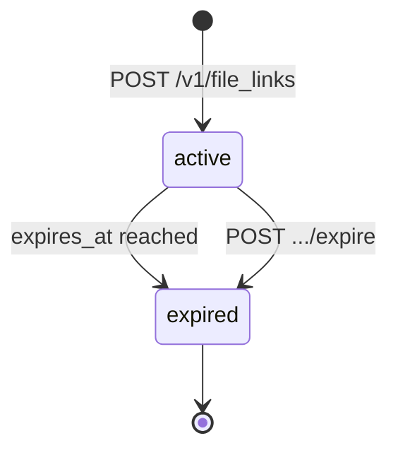
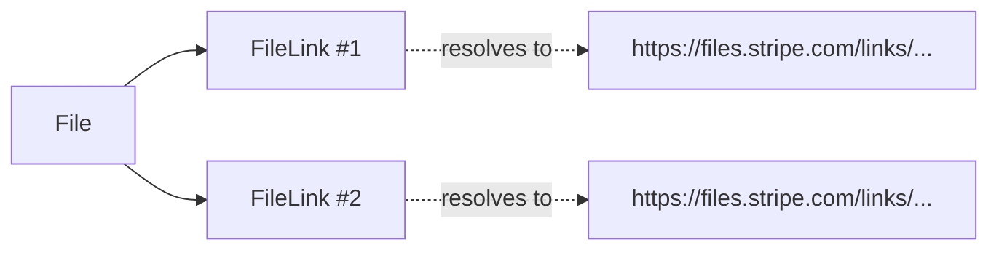

# File Link

> API resource: `file_link` · API version: `2026-04-22.dahlia` · Category: [Core resources](README.md)

## What it is

A `FileLink` is a signed, publicly-fetchable URL that points at a single [File](files.md). It exists so you can hand a downloadable URL to someone who has no Stripe credentials — a merchant viewing dispute evidence in your dashboard, a customer downloading a receipt PDF, an internal tool rendering an uploaded asset. Once created, anyone with the URL can fetch the file's bytes; that's the whole point.

A FileLink is not the file. It's a *capability*. The bytes live on the underlying File and are reused for every link to it. You can have many FileLinks pointing at the same File, with independent expiry and metadata.

## Why it exists

Two cases the bare File can't satisfy:

1. **Authenticated `file.url` is unshareable.** The URL on the `File.url` field requires your Stripe secret key in `Authorization`. You can't put that in a browser, an email, or a third-party tool.
2. **Time-bound public access.** When you do want a public URL, you usually want it to die. FileLinks accept an `expires_at`, and you can revoke early by hitting the `expire` endpoint.

If neither of those applies — say, you only ever fetch the file server-side using your secret key — you don't need a FileLink. Most integrations need exactly one when building a "view evidence" or "download receipt" UI.

## Lifecycle & states

A FileLink has no `status` field but a derivable state from `expired`:



- **`expired: false`** → the URL fetches the bytes.
- **`expired: true`** → the URL returns an error. The FileLink object stays around (you can still list/inspect it) but the bytes are no longer downloadable through it.

The expiry is final — you cannot un-expire. Create a new FileLink on the same file if you need to re-share.

### Default expiry

`expires_at` is **null by default**, which means *the link does not expire on its own*. That's a sharp edge: a link to dispute evidence created during onboarding is still live next year unless you explicitly set an expiry or call expire. Most teams default to `expires_at = now + 7d` or similar.

## Anatomy of the object

### Identity

| Field | Notes |
|---|---|
| `id` | `link_…` |
| `object` | `"file_link"` |
| `livemode` | mode flag. |
| `created` | unix seconds. |
| `metadata` | Key-value bag, your bookkeeping. |

### Target & access

| Field | Notes |
|---|---|
| `file` | `file_…`. **Required at creation.** Cannot change after. |
| `url` | The public URL Stripe issues. **This is what you share.** No Stripe credentials needed to fetch. The URL is opaque — don't parse or mutate it. |
| `expires_at` | unix seconds, or `null` for "never". You can pass it on create; you can also `POST` to update it as long as the link hasn't already expired. |
| `expired` | Boolean, derived from `expires_at` vs. now or from explicit expire. |

## Relationships



- **One File → many FileLinks.** Independent expiry, independent metadata.
- **A FileLink cannot be re-pointed.** Wrong file? Create a new link.
- **No automatic creation.** Files do not auto-spawn FileLinks. You must `POST /v1/file_links` for each one you want.

## Common workflows

### 1. Create a permanent public link

```http
POST /v1/file_links
  file=file_…
```

Returns:

```json
{
  "id": "link_…",
  "url": "https://files.stripe.com/links/MDB8YWNjdF8…",
  "expires_at": null,
  "expired": false
}
```

The `url` is ready to embed in an email or `<a href>`.

### 2. Create a link that auto-expires

```http
POST /v1/file_links
  file=file_…
  expires_at=1715000000
  metadata[purpose]=merchant_evidence_view
```

Anyone hitting the URL after `1715000000` (unix seconds) gets an error.

### 3. Extend (or shorten) expiry

```http
POST /v1/file_links/link_…
  expires_at=1716000000
```

Works only on links that haven't expired yet. Once expired, you can't reanimate — create a new one.

### 4. Revoke immediately

```http
POST /v1/file_links/link_…/expire
```

Idempotent. After this, `expired: true` and the URL stops serving bytes.

### 5. Show dispute evidence to a merchant in your platform UI

A common Connect pattern:

```python
file_obj = stripe.File.create(
    purpose="dispute_evidence",
    file=open("receipt.pdf", "rb"),
)
link = stripe.FileLink.create(
    file=file_obj.id,
    expires_at=int(time.time()) + 24 * 3600,  # 1 day
    metadata={"dispute": "dp_…", "shown_to": "merchant"},
)
return {"download_url": link.url}
```

Now your merchant clicks the link in their dashboard, fetches the PDF directly from Stripe — no proxy through your servers, no need to handle the bytes yourself.

### 6. List links for a single file

```http
GET /v1/file_links?file=file_…
```

Useful before creating another — you can reuse a still-valid link instead of multiplying them.

## Webhook events

FileLinks do not emit webhook events. Their lifecycle is too quiet to warrant any. If you need to know "did the merchant click the link", track it on your side with a redirect through your own URL.

## Idempotency, retries & race conditions

- **Send `Idempotency-Key`** on `POST /v1/file_links`. A retry without one creates a second link with a different URL, and the first one is still live (no auto-cleanup).
- **`expire` is idempotent natively** — calling it on an already-expired link is a no-op.
- **Race between expiry and a fetch in flight.** If a download starts before `expires_at` and finishes after, Stripe lets it complete; the cutoff is checked at request initiation. Don't lean on this — it's an implementation detail.
- **Multiple links to the same file are independent.** Expiring one doesn't expire the others.

## Test-mode tips

- Test-mode FileLinks point at test-mode Files only. The URL still fetches bytes (you can curl it without auth) — useful for verifying the public-fetch path in CI.
- Generated URLs have the same format in test and live; don't hard-code "test" detection by URL parsing.
- The Stripe CLI doesn't have a dedicated `file_links` shorthand; use the standard `stripe file_links create`.

## Connect considerations

- A FileLink is created on the same account as the underlying File. To create a link on a connected account's file, set `Stripe-Account: acct_…`.
- The resulting `url` is fetchable by anyone — Connect doesn't add auth on top. If you want merchant-scoped access controls, gate access in your own app and proxy the link to the merchant only after auth.
- A platform cannot create a FileLink for a connected-account file without the Connect header.

## Common pitfalls

- **No expiry by default.** A link created without `expires_at` lives forever. For sensitive content, *always* set one or call `expire` when you're done with it.
- **Treating the URL as guessable / scoped.** It's a bearer URL — anyone who has the string can download. Don't put it in places where unintended audiences can see (public Slack, server logs without redaction).
- **Re-pointing a link.** Not possible. Create a new FileLink for a different file.
- **Reanimating an expired link.** Not possible. Create a new one.
- **Confusing `link_…` with [PaymentLink](../05-payment-links/payment-links.md) `plink_…`.** Different objects, different prefixes; the names are similar.
- **Using the FileLink for `purpose`s that shouldn't be shared.** Some Files contain PII (Identity documents, tax forms). Just because you *can* create a link to them doesn't mean you should. Default to fetching server-side with your secret key.
- **Forgetting livemode.** A test-mode link to test-mode bytes won't surface anything useful in a live customer email.

## Further reading

- [API reference: FileLink](https://docs.stripe.com/api/file_links/object)
- [File](files.md) — the bytes the link points at.
- [Dispute](disputes.md) — the most common reason to mint a public download.
- [Account branding](https://docs.stripe.com/get-started/account/branding) — for sharing logo URLs publicly.
