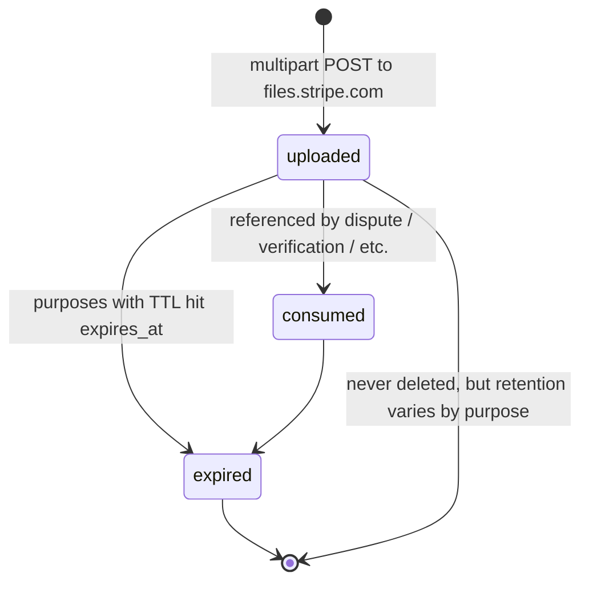
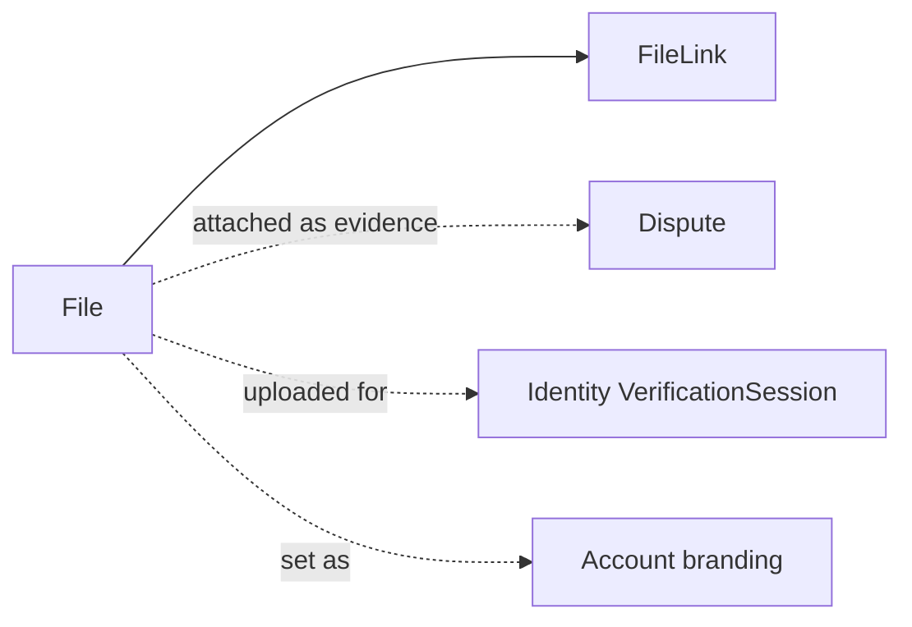

# File

> API resource: `file` · API version: `2026-04-22.dahlia` · Category: [Core resources](README.md)

## What it is

A `File` is an object Stripe stores on your behalf — typically a PDF, image, or text document — that participates in some other Stripe workflow. The most common cases: dispute evidence (a shipping receipt to fight a chargeback), an Identity verification document, your business logo for branding, a tax form. Files are uploaded once via a multipart-form POST and are immutable afterward; you reference them by `id` from whichever resource consumes them.

Files are not general-purpose blob storage. Stripe enforces an enumerated `purpose` field — you tell Stripe what role the upload is going to play, and Stripe accepts or rejects the upload based on type, size, and content rules tied to that purpose.

## Why it exists

Three workflows lean on Files:

1. **Dispute evidence.** When you contest a chargeback, you attach Files (receipts, shipping proofs, customer correspondence) to the [Dispute](disputes.md) object's `evidence` subobject.
2. **Identity verification.** Verification documents collected through Stripe Identity arrive on your account as Files.
3. **Branding & compliance.** Business logos for hosted invoices and Checkout, PCI compliance docs, tax-form uploads.

Without first-class Files, Stripe couldn't accept dispute evidence, and you'd have to host every artifact yourself and pass URLs (which Stripe wouldn't be able to retain post-deletion).

## Lifecycle & states

A File has no `status` enum. It exists immediately after a successful upload and is read-only thereafter:



- **No update endpoint.** You cannot change a file's bytes after upload. Re-upload to get a new `file_…` ID.
- **No delete endpoint** in the public API for most purposes. Files are retained per Stripe's data-retention policy for the purpose.
- **`expires_at`** is set automatically on certain purposes (notably some Identity flows). Once past, the file is no longer downloadable.

## Anatomy of the object

### Identity

| Field | Notes |
|---|---|
| `id` | `file_…` |
| `object` | `"file"` |
| `created` | unix seconds. |

### Content

| Field | Notes |
|---|---|
| `purpose` | Enum. Determines what Stripe accepts and what consumers can use it. See table below. **Required** at upload. |
| `type` | Detected file extension: `pdf`, `jpg`, `png`, `csv`, `xlsx`, `docx`, etc. Stripe sniffs from bytes; the original filename hint is advisory. |
| `size` | Bytes. |
| `filename` | Original filename if you provided one. |
| `title` | Optional caption-style label, mostly used for surfacing in the Dashboard. |
| `expires_at` | unix seconds. `null` for purposes without TTL. |

### Access

| Field | Notes |
|---|---|
| `url` | A signed, **authenticated** URL on `files.stripe.com`. Fetching it requires your Stripe API key in the `Authorization` header. **Not** safe to hand to a browser or third party. For public sharing, create a [FileLink](file-links.md). |
| `links` | Subobject `{ data: [FileLink, …], has_more, total_count }`. The list of FileLinks created against this file. Helps you find an existing public link before creating another. |

### Purpose enum

| `purpose` | Used by | Notes |
|---|---|---|
| `dispute_evidence` | [Dispute](disputes.md) `evidence.*` fields | PDF/JPG/PNG. Strict per-field size limits. |
| `identity_document` | Stripe Identity verification sessions | Government-issued ID images. |
| `identity_document_downloadable` | Internal consumer-side artifact for Identity | Hedge: surface only when explicitly produced by Stripe. |
| `business_logo` | Account branding (Checkout, Hosted Invoice) | Square preferred. |
| `business_icon` | Smaller favicon-style logo | |
| `pci_document` | Annual PCI compliance attestation upload | |
| `tax_document_user_upload` | Tax-form uploads (e.g. W-9 collected via Stripe forms) | |
| `additional_verification` | Connect onboarding extra docs | |
| `customer_signature` | Some manual-mandate flows | |
| `finance_report_run` | Internal Stripe-generated reports | Read-only, you don't upload these. |
| `sigma_scheduled_query` | Internal Sigma exports | Read-only. |
| `account_requirement` | Connect requirements that need a doc | |
| `terminal_reader_splashscreen` | Custom splash image for Terminal readers | |
| `selfie` | Identity selfie | |
| `document_provider_identity_document` | Third-party Identity provider docs | |

Hedge: the enum grows over time. Always check the live API reference for the canonical list before depending on a value.

## Relationships



A File can be referenced by:

- A Dispute's `evidence.receipt`, `evidence.customer_communication`, `evidence.shipping_documentation`, etc.
- An Identity VerificationSession's collected documents.
- An Account's `settings.branding.logo` / `.icon`.
- Any number of FileLinks (each generates a public URL to the same bytes).

The File outlives the linker: detaching from a dispute does not delete the file.

## Common workflows

### 1. Upload a dispute-evidence file

Files are uploaded to a **different host** than the rest of the API: `https://files.stripe.com/v1/files`. The body is `multipart/form-data`, not URL-encoded.

```bash
curl https://files.stripe.com/v1/files \
  -u sk_test_…: \
  -F "purpose=dispute_evidence" \
  -F "file=@/path/to/receipt.pdf"
```

Response includes the `file_…` id and `size`/`type`. Save the id.

### 2. Attach to a dispute

Once you have the file id:

```http
POST /v1/disputes/dp_…
  evidence[receipt]=file_…
  evidence[customer_communication]=file_…
  submit=false
```

Stripe will reject the attach if the file's `purpose` isn't `dispute_evidence`.

### 3. Download a file you uploaded

```bash
curl -u sk_test_…: \
  -L https://files.stripe.com/v1/files/file_…/contents > out.pdf
```

(`-L` follows the signed redirect.) The `url` field on the File is also fetchable with the same auth. To share with a non-Stripe consumer, create a [FileLink](file-links.md) instead.

### 4. Set a business logo

```http
POST /v1/files
  purpose=business_logo
  file=@logo.png
```

Then:

```http
POST /v1/accounts/acct_…
  settings[branding][logo]=file_…
```

### 5. List files by purpose

```http
GET /v1/files?purpose=dispute_evidence&created[gte]=…
```

Useful for audit and clean-up.

## Webhook events

Files do **not** emit webhook events. The events you care about live on the consuming objects: `charge.dispute.updated` (when evidence changes), `identity.verification_session.verified`, etc. See [_meta/webhook-catalog.md](../_meta/webhook-catalog.md).

## Idempotency, retries & race conditions

- **Multipart uploads accept `Idempotency-Key`** like JSON requests do. Always send one — a network blip in the middle of a large upload can otherwise produce two distinct `file_…` IDs of the same bytes.
- **No partial-upload semantics.** A failed upload is just a failure — start over.
- **Per-purpose size and type limits.** Dispute evidence has tight limits (typically a few MB per field, ~5MB total or so — verify per the dispute docs); Identity tolerates larger raw images. Read the per-purpose constraint before uploading or you'll waste bandwidth.
- **Eventual consistency on `links`.** A FileLink created moments before may not appear in `file.links.data` immediately on a follow-up GET. Re-fetch.

## Test-mode tips

- Test-mode and live-mode files are isolated. A test `file_…` cannot be referenced by a live Dispute.
- For dispute evidence in tests, *any* PDF or image of the right size will be accepted; the byte content isn't validated against the dispute facts.
- The Stripe CLI doesn't have first-class file commands — `curl` against `files.stripe.com` is still the simplest path in dev.
- For Identity verification docs in test mode, Stripe ships sample passport/license images you can use; see Identity docs for the pre-canned set.

## Connect considerations

- For platform-uploaded files used by a connected account (e.g. dispute evidence on the connected account), set `Stripe-Account: acct_…` on the upload. The file is then created on that account.
- For files belonging to the platform (your own logo, your own PCI doc), no Connect header needed.
- A file uploaded on the platform cannot be attached to a connected-account resource by id — re-upload on the connected account.
- For Standard accounts, the connected merchant can upload their own files via their own session; for Express/Custom, you typically upload on their behalf.

## Common pitfalls

- **Posting to `api.stripe.com` instead of `files.stripe.com`.** Different host. The API host returns 404 for file upload paths.
- **Forgetting `multipart/form-data`.** File upload won't work as URL-encoded form. The Stripe SDKs handle this for you; raw `curl` callers must use `-F`.
- **Sharing the `file.url`.** It requires Stripe API auth. Use a [FileLink](file-links.md) for shareable URLs.
- **Wrong `purpose`.** Stripe rejects the attach when the consumer expects a different purpose. The error is verbose; read it.
- **Re-uploading instead of re-attaching.** Once you have a `file_…`, you can attach it to multiple resources. No need to re-upload bytes.
- **Assuming files are deletable.** They aren't, in the public API for most purposes. Treat the upload as permanent for retention purposes.
- **Hitting per-purpose size limits silently.** A 12MB receipt for `dispute_evidence` will fail at attach time even if upload succeeded. Pre-validate sizes against the documented per-purpose limits.

## Further reading

- [API reference: File](https://docs.stripe.com/api/files/object)
- [API reference: File upload](https://docs.stripe.com/api/files/create)
- [FileLink](file-links.md) — public URLs to a File.
- [Dispute](disputes.md) — the most common consumer of `dispute_evidence` files.
- [Stripe Identity](https://docs.stripe.com/identity) — for `identity_document`.
