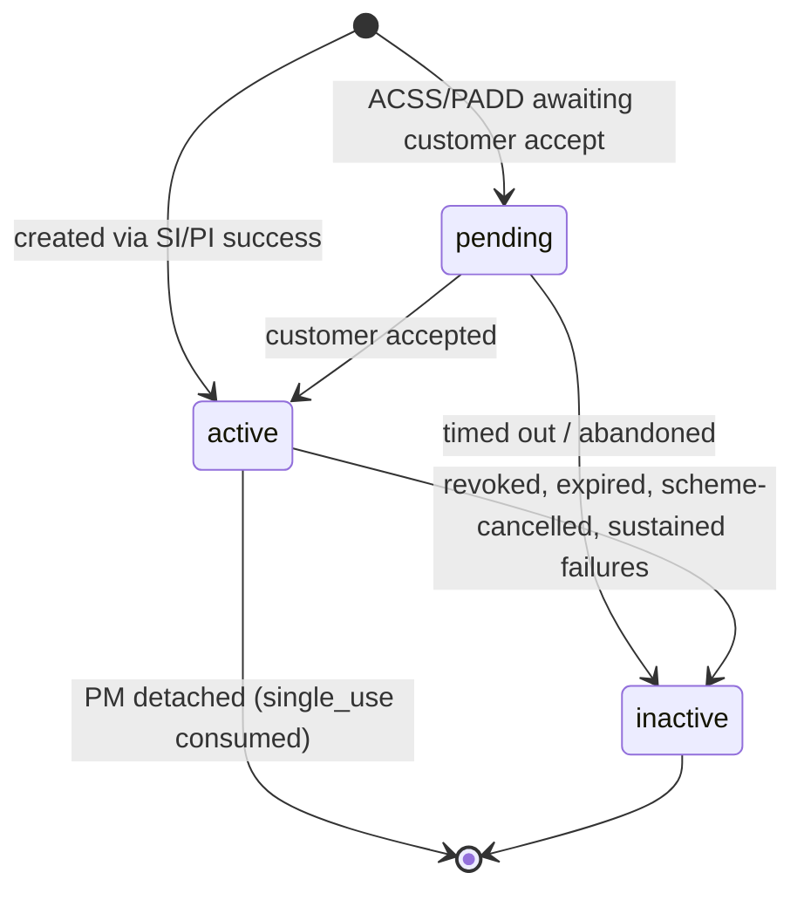
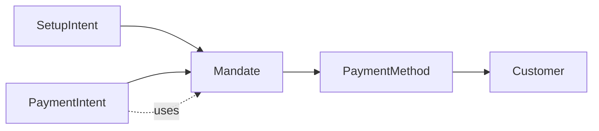

# Mandate

> API resource: `mandate` · API version: `2026-04-22.dahlia` · Category: [Core resources](README.md)

## What it is

A `Mandate` is Stripe's record of a customer's **explicit permission to debit them** — the digital equivalent of the signed direct-debit authorization form that bank schemes have required for forty years. Each mandate is tied to one [PaymentMethod](../02-payment-methods/payment-methods.md) and carries the proof Stripe will hand to the network if the customer disputes a debit later: who consented, when, from what IP, what they were told the debit was for.

You don't usually create a Mandate directly. A successful [SetupIntent](setup-intents.md) (or a [PaymentIntent](payment-intents.md) with `setup_future_usage`) on an ACH/SEPA/BACS/AU BECS/PADD/BLIK PaymentMethod produces one as a side effect.

## Why it exists

Bank-debit networks aren't card networks. Without a stored, retrievable consent record:

- **NACHA** (US ACH) requires the originator to retain authorization for 2 years post-final-debit; missing authorization = automatic chargeback win for the customer.
- **SEPA SDD Core** lets the payer dispute any debit for 8 weeks no-questions-asked, and 13 months without authorization. The mandate (`UMR` — unique mandate reference) is what proves authorization.
- **BACS DD** requires advance notice of every debit and uses the Mandate Reference for that.
- **AU BECS** mirrors SEPA's authorization-based dispute flow.

Cards don't need this — the issuer keeps track. Bank-debit ACH/SEPA/BACS/AU BECS/PADD do. The Mandate object is Stripe's way of storing that record on your behalf, formatting it correctly per scheme, and surfacing it to the network when challenged.

It also gives **you** a programmatic handle: "is this customer's authorization still active before I run their next monthly invoice?" → check `mandate.status`.

## Lifecycle & states



State semantics:

- **`pending`** — the mandate exists but isn't yet usable. Mostly seen for ACSS Debit / PADD CA where Stripe sends the customer a confirmation email / PDF and waits for them to accept.
- **`active`** — usable. Off-session PaymentIntents that reference this PM (and, for some schemes, this Mandate ID) will go through.
- **`inactive`** — no longer usable. Reasons:
  - **Customer revoked** at their bank or in your UI.
  - **Network revoked** because the bank closed the account or returned debits.
  - **Sustained failures** — Stripe deactivates after consecutive returns to protect the originator's NACHA standing.
  - **Single-use consumed** — `single_use` mandates flip to `inactive` after the matching PI succeeds.
  - **Expiry** — some schemes mandate-expire after N months of inactivity (SEPA: 36 months no use → invalid).

> Mandates are not deleted, only deactivated. The historical record stays for audit. An `inactive` mandate is unrecoverable; the customer must re-consent through a new SetupIntent to produce a new `active` mandate.

## Anatomy of the object

### Identity

| Field | Notes |
|---|---|
| `id` | `mandate_…` (yes, no underscore between `mandate` and the body — it's `mandate_…` literally). |
| `object` | `"mandate"` |
| `status` | `active`, `pending`, `inactive`. |
| `type` | `multi_use` or `single_use`. **Determines whether you can debit more than once.** |
| `livemode` | Standard. |

### Relations

| Field | Notes |
|---|---|
| `payment_method` | `pm_…` this mandate authorizes. **One mandate, one PM.** |
| `payment_method_details.type` | `us_bank_account`, `sepa_debit`, `bacs_debit`, `au_becs_debit`, `acss_debit`, `card`, `blik`, `paypal`, `link`, `cashapp`, `amazon_pay`. |
| `payment_method_details.<type>` | Per-type subobject — `us_bank_account.network` (`ach` / `us_domestic_wire`), `sepa_debit.reference` (the UMR), `bacs_debit.reference`, `acss_debit.payment_schedule`, etc. |

### Customer acceptance (the audit record)

| Field | Notes |
|---|---|
| `customer_acceptance.type` | `online` or `offline`. |
| `customer_acceptance.accepted_at` | Unix seconds. |
| `customer_acceptance.online.ip` | IPv4/v6. **Required for `online`.** |
| `customer_acceptance.online.user_agent` | UA string. **Required for `online`.** |
| `customer_acceptance.offline` | `{}` — present but empty for `offline` (in-person / paper signature). Stripe trusts you to retain the offline evidence yourself. |

### Single-use mandate body

| Field | Notes |
|---|---|
| `single_use.amount` | Exact amount the mandate authorizes (minor units). |
| `single_use.currency` | ISO. |

### Multi-use mandate body

`multi_use` is `{}` — the mandate authorizes recurring debits without a per-debit cap. Per-scheme rules govern how Stripe interprets that:

- ACH: any amount, any frequency, with NACHA-required customer notification on amount changes >$50 / >25%.
- SEPA: as the customer agreed; `mandate_options` you pass at SetupIntent time control display copy.
- BACS: requires customer-facing advance notice (Stripe handles email if you opt in).

## Relationships



- One Mandate per (PM, scheme) pair. Same card can host two mandates only if it's a multi-scheme PM, which is rare.
- A PaymentIntent off-session against an ACH/SEPA/BACS PM **must** have an `active` mandate. Stripe looks it up via `payment_method` automatically; you can also pin it explicitly with `mandate=mandate_…`.
- If the PM is `detach`'d from the Customer, its mandates do not auto-revoke — they remain on file, but practical use requires re-attachment.

## Common workflows

### 1. SetupIntent produces the mandate

The dominant path. Confirm a SI on an ACH PM with mandate consent collected by Elements:

```http
POST /v1/setup_intents
  customer=cus_…
  payment_method_types[]=us_bank_account
  payment_method_options[us_bank_account][verification_method]=instant
  mandate_data[customer_acceptance][type]=online
  mandate_data[customer_acceptance][online][ip]=203.0.113.7
  mandate_data[customer_acceptance][online][user_agent]=Mozilla/5.0...
```

On success, `setup_intent.mandate` is `mandate_…`. Cache that ID against your local subscription/customer record — you don't need to fetch it again on every charge, but you do need it for off-session debits in some schemes.

### 2. Off-session ACH debit using the mandate

```http
POST /v1/payment_intents
  amount=4900 currency=usd
  customer=cus_…
  payment_method=pm_…
  mandate=mandate_…
  off_session=true confirm=true
  payment_method_types[]=us_bank_account
```

If the mandate has gone `inactive` since you cached it, the PI fails with `setup_intent_mandate_invalid` / `payment_method_mandate_invalid`. Re-collect via a fresh SetupIntent.

### 3. Inspect a mandate

```http
GET /v1/mandates/mandate_…
```

Read `status` to gate before the next charge. You **cannot** list mandates — only retrieve by ID. Track the IDs yourself (typically alongside the `pm_…` you saved).

### 4. Revoke (customer asks to cancel direct debit)

There is no `POST /v1/mandates/.../revoke`. To stop debits:

1. Detach the PM (`POST /v1/payment_methods/pm_…/detach`).
2. The mandate transitions to `inactive` for new debits.
3. Notify the customer's bank if they want their bank-side mandate also pulled (BACS/SEPA/ACH have their own bank-side cancellation paths customers can use).

For SEPA specifically, you can also issue a Cancellation message via `POST /v1/payment_methods/pm_…` workflows — but the canonical "revoke" is detach.

### 5. Get the BACS / SEPA mandate URL to display

```http
GET /v1/mandates/mandate_…
```

For BACS and SEPA, `payment_method_details.bacs_debit.url` (and the SEPA equivalent) returns a hosted page rendering the mandate as a PDF — useful to surface in a "your direct debit authorization" UI.

## Webhook events

| Event | Fires when | Listener typically does |
|---|---|---|
| `mandate.updated` | `status` changes (e.g. `active` → `inactive`) or scheme metadata changes (UMR assigned, ACSS schedule updated). | Update local "PM is debiterable?" cache; if `inactive`, mark subscription as `requires_payment_method` and email the customer. |

That's it — there is no `mandate.created` or `mandate.deleted`. Creation is implicit in the SI/PI success event you already handle. Deactivation flows entirely through `mandate.updated`.

> A common pattern: on `mandate.updated` with `status=inactive`, look up which active subscriptions reference the parent PM and pause them before the next renewal cycle.

## Idempotency, retries & race conditions

- Mandates are not directly created via API, so there's no idempotency key surface. They inherit creation atomicity from the parent SI/PI confirmation.
- Reading a mandate twice is naturally idempotent.
- **Race**: an off-session PI confirmed at the moment a `mandate.updated` is en route can succeed even though you'd have wanted to wait. Always re-fetch the mandate before high-stakes off-session debits, or trust the PI's own success/failure outcome.
- **Race**: SEPA / BACS bank-side cancellation can lag by hours-to-days. Stripe learns about it via inbound network message and only then fires `mandate.updated` — meaning you may have run a debit that the customer's bank then bounces (R-transactions / DD returns) days later. Handle the eventual `charge.failed` / `payment_intent.payment_failed` even after a mandate looks healthy at debit time.

## Test-mode tips

- ACH test routing `110000000` + account `000123456789` produces a usable mandate.
- SEPA `IBAN: DE89370400440532013000` produces a healthy mandate; `…0532013002` produces one that returns the first debit (good for testing `mandate.updated` → `inactive` after sustained failures, after enough triggers).
- BACS test sort code `108800` + account `00012345` → working mandate.
- `stripe trigger mandate.updated` — generic `active`-state mandate update event for handler scaffolding.
- For `inactive` flips: in test mode, run `stripe trigger setup_intent.setup_failed` against an ACSS PM, or run multiple failing PIs against the same SEPA PM and watch deactivation kick in after the threshold.

## Connect considerations

- A Mandate lives on the same Stripe account as its PaymentMethod. Direct-charge connected accounts have their own mandates; they don't share the platform's.
- For destination-charge flows where the platform owns the PM but routes funds to a connected account, the mandate stays on the platform. The connected account never sees `mandate_…` IDs unless you forward them.
- `on_behalf_of` at SI time matters: SEPA mandates issued under platform-only context can become invalid for charges later issued `on_behalf_of` an EEA-resident connected account. Match `on_behalf_of` between SetupIntent (mandate creation) and PaymentIntent (mandate use).
- Cloning a PM to a connected account does **not** clone the mandate. The connected account must collect its own consent — typically by running its own SetupIntent.

## Common pitfalls

- **Charging off-session against a PM whose mandate is `inactive`.** Stripe rejects with `payment_method_mandate_invalid`. Always re-fetch the mandate (or trust `mandate.updated` webhooks) before billing cycles you can't afford to lose.
- **Trying to `POST /v1/mandates`.** It doesn't exist. Mandates only come from SI/PI success.
- **Listing mandates.** Also doesn't exist — retrieve by ID. Track IDs in your DB.
- **Confirming a SetupIntent server-side without `mandate_data` on bank-debit PMs.** API rejects. Stripe.js fills it for you in the browser; if you bypass Elements you must send IP/UA/`accepted_at` yourself. Failing to capture *real* IP/UA means losing disputes.
- **Treating a card mandate the same as a bank-debit mandate.** Cards rarely have a `Mandate` object — IN/MX recurring-card flows are exceptions. Don't gate every off-session card charge on a mandate lookup; only gate the bank-debit ones.
- **Missing the `mandate.updated → inactive` event.** Customer revokes at their bank in February, you keep auto-billing, dispute storm in March. Subscribe to the event and treat it as "this PM is now off-session-untouchable."
- **Caching mandate `status` for too long.** Re-fetch on each billing cycle (or rely on `mandate.updated`) — local stale `active` cached six months ago is one of the most common dispute-causing bugs.
- **Treating `single_use` like `multi_use`.** A `single_use` mandate is exhausted by the first matching PI. Trying to debit again returns `mandate_already_used`. For recurring billing always use `multi_use` (default in SetupIntent unless you set `single_use`).

## Further reading

- [API reference: Mandate](https://docs.stripe.com/api/mandates/object)
- [ACH Direct Debit overview](https://docs.stripe.com/payments/ach-direct-debit)
- [SEPA Direct Debit overview](https://docs.stripe.com/payments/sepa-debit)
- [BACS Direct Debit overview](https://docs.stripe.com/payments/payment-methods/bacs-debit)
- [Pre-authorized Debit (Canada)](https://docs.stripe.com/payments/acss-debit)
- Sibling: [SetupIntent](setup-intents.md) — primary creator of mandates.
- Sibling: [PaymentIntent](payment-intents.md) — primary consumer of mandates.
- Sibling: [PaymentMethod](../02-payment-methods/payment-methods.md) — owner of the mandate.
