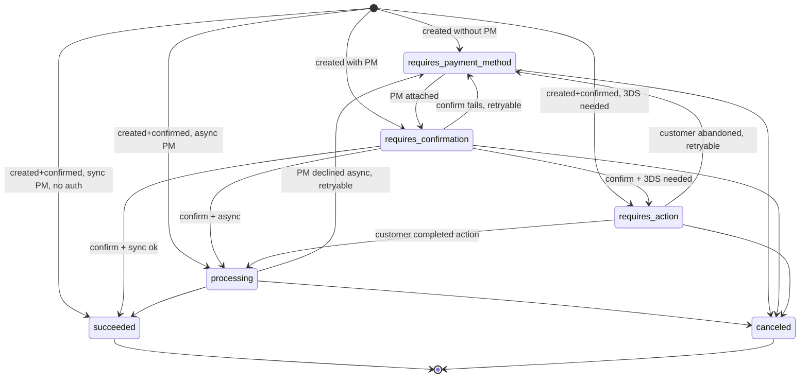
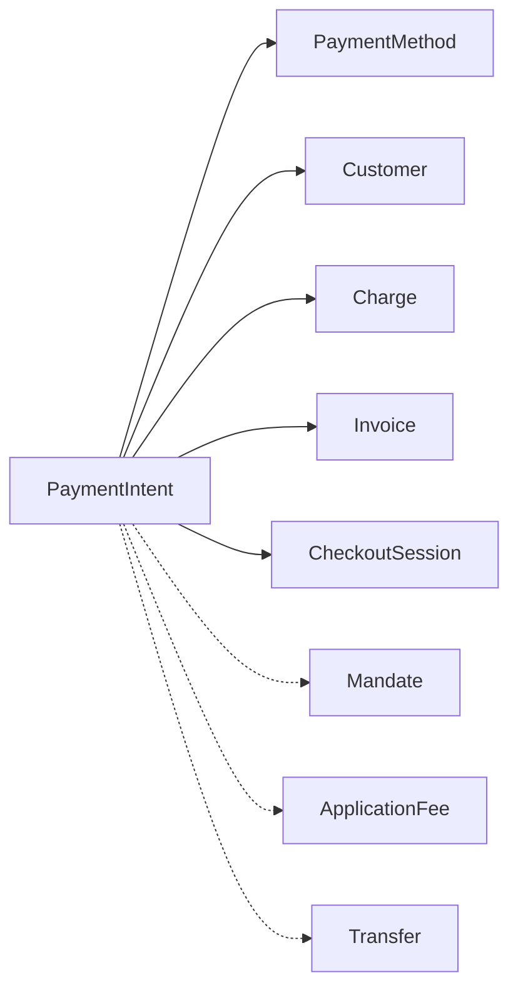

# PaymentIntent

> API resource: `payment_intent` · API version: `2026-04-22.dahlia` · Category: [Core resources](README.md)

## What it is

A `PaymentIntent` is the modern primitive for "I want to collect $X from this customer." It is a state machine that tracks a single payment attempt from creation through any required customer interaction (3DS, OXXO voucher, bank-redirect, async settlement) all the way to either success or definitive failure. When it succeeds, it produces a [Charge](charges.md) (and downstream BalanceTransaction).

Think of it as **the orchestrator** and Charge as **the receipt**.

## Why it exists

In the old direct-Charge model, the client picked a payment method, created a Token, and POSTed to `/v1/charges`. That worked for ~2015 cards but breaks under:

- **3D Secure / SCA** — needs an interactive challenge mid-flow.
- **Async payment methods** — bank debits, vouchers, redirects, BNPL apps that take seconds-to-days.
- **Retries on a still-recoverable error** — same intent, different PM.
- **Multiple payment-method types in one flow** — show the user card *and* Apple Pay *and* iDEAL.

PaymentIntent encapsulates all of that. The same PI walks through `requires_confirmation → requires_action → processing → succeeded` so your client and server can both know "where in the flow are we right now?" by reading `status` and `next_action`.

## Lifecycle & states



What each state means:

- **`requires_payment_method`** — no PM attached yet, or last attempt failed. `client_secret` is valid; client can confirm with a fresh PM.
- **`requires_confirmation`** — PM attached, awaiting `confirm()`. Server-driven flows sit here briefly.
- **`requires_action`** — `next_action` field is populated. Could be `redirect_to_url`, `use_stripe_sdk` (3DS), `display_oxxo_details`, `wechat_pay_display_qr_code`, etc. Stripe.js handles most.
- **`processing`** — funds in flight. For cards, this is rare and short. For ACH/SEPA/iDEAL, can last seconds to days.
- **`succeeded`** — terminal. `latest_charge` is set. **The only state where you should fulfill the order.**
- **`canceled`** — terminal. Either you canceled, or the intent timed out, or it was abandoned past the auto-expire window.

> Important: `succeeded` doesn't mean money is in your bank — only that the payment is final and Stripe has accepted it. Settlement (rolling from pending → available → payout) takes 1–7 days.

## Anatomy of the object

### Identity & money

| Field                                           | Notes                                                                                                                                                              |
| ----------------------------------------------- | ------------------------------------------------------------------------------------------------------------------------------------------------------------------ |
| `id`                                            | `pi_…`                                                                                                                                                             |
| `client_secret`                                 | Opaque token for client-side confirmation. **Treat as scoped credential** — anyone with it can confirm/cancel this PI. Don't log it; don't put it in URLs you log. |
| `amount`                                        | What you intend to charge.                                                                                                                                         |
| `currency`                                      | ISO.                                                                                                                                                               |
| `status`                                        | enum, see above.                                                                                                                                                   |
| `created`, `canceled_at`, `cancellation_reason` | Lifecycle timestamps + reason.                                                                                                                                     |

### Payment method

| Field                                     | Notes                                                                                                                     |
| ----------------------------------------- | ------------------------------------------------------------------------------------------------------------------------- |
| `payment_method`                          | Currently-attached PM.                                                                                                    |
| `payment_method_types`                    | Whitelist of PM type strings. Auto-derived if you use `automatic_payment_methods`.                                        |
| `automatic_payment_methods.enabled`       | Recommended. Stripe shows the customer the optimal PM set based on their location, currency, and your Dashboard settings. |
| `payment_method_options`                  | Per-PM-type options: `card.request_three_d_secure`, `us_bank_account.verification_method`, etc.                           |
| `payment_method_configuration_details.id` | Which [PaymentMethodConfiguration](../02-payment-methods/payment-method-configurations.md) governed PM selection.         |

### Capture

| Field | Notes |
|---|---|
| `capture_method` | `automatic` (default), `automatic_async`, or `manual`. Manual = auth-only; capture later. |
| `amount_capturable` | What's currently held and capturable (after auth, before capture). |
| `amount_received` | What's actually in your balance pipeline. |

### Money routing (Connect)

| Field | Notes |
|---|---|
| `application_fee_amount` | Platform's cut. |
| `transfer_data.destination` | Connected account that gets the money (destination charge). |
| `transfer_data.amount` | If unset, full minus fees goes to destination. |
| `transfer_group` | Free-form string for grouping with later transfers. |
| `on_behalf_of` | Connected account whose settings (statement descriptor, settlement currency) apply. |

### Customer & saving

| Field | Notes |
|---|---|
| `customer` | `cus_…` if attached. |
| `setup_future_usage` | `off_session` or `on_session`. Tells Stripe to save the PM to the Customer after this charge. |
| `confirmation_method` | `automatic` or `manual`. Manual = explicit two-step `confirm` call (rare; only for advanced server-driven flows). |
| `mandate` / `mandate_data` | For ACH/SEPA recurring — proof of customer authorization. |

### Outcome / next steps

| Field | Notes |
|---|---|
| `next_action` | Subobject describing what's needed if `status: requires_action`. Type tells you what to do (`redirect_to_url`, `use_stripe_sdk`, `display_oxxo_details`, …). |
| `last_payment_error` | Most recent error if confirmation failed. `code`, `decline_code`, `payment_method`, `message`. |
| `latest_charge` | `ch_…` of the most recent attempt. Only valid in `succeeded` (and to inspect failures, in earlier states). |
| `charges.data` | (Legacy alias `charges`, deprecated in newer versions.) |
| `processing` | Subobject for asynchronous PM types (e.g. `processing.type: card`). |

### Misc

| Field | Notes |
|---|---|
| `description`, `statement_descriptor`, `statement_descriptor_suffix`, `receipt_email` | Cascade to the Charge. |
| `metadata` | Cascades to the Charge. |
| `shipping` | Cascades to the Charge. |
| `automatic_async_capture_window` | New in `dahlia`-era; finer control of `automatic_async`. |

## Relationships



- A PaymentIntent has at most one *successful* Charge (`latest_charge`) but may have several *failed* Charges along the way (each retry).
- A Subscription's invoice payment uses a PaymentIntent under the hood.
- Checkout Sessions (in `payment` mode) wrap a PaymentIntent.

## Common workflows

### 1. Standard frontend collection (recommended)

Server:

```http
POST /v1/payment_intents
  amount=1999
  currency=usd
  customer=cus_…
  automatic_payment_methods[enabled]=true
  metadata[order_id]=ord_abc123
```

Return `client_secret` to the browser. Client uses Stripe.js Elements:

```js
const { error } = await stripe.confirmPayment({
  elements,
  clientSecret,
  confirmParams: { return_url: "https://example.com/order/done" },
});
```

Stripe handles 3DS, redirects, errors. After success: listen for `payment_intent.succeeded` webhook and fulfill the order. **Do not fulfill on the client.**

### 2. Manual capture (auth → fulfillment → capture)

Create the PI with `capture_method: manual`. After it succeeds, `status: requires_capture`. Once you've shipped:

```http
POST /v1/payment_intents/pi_…/capture
  amount_to_capture=1500   # optional partial
```

If you don't capture within ~7 days (varies by network), Stripe auto-cancels and the auth releases.

### 3. Off-session retry against saved PM

When charging a customer for a renewal without their being present:

```http
POST /v1/payment_intents
  amount=1999
  currency=usd
  customer=cus_…
  payment_method=pm_…
  off_session=true
  confirm=true
```

If 3DS is required (rare for off-session, but possible under SCA), the call returns `status: requires_action` with `last_payment_error.code: authentication_required`. You'll have to bring the customer back on-session and re-confirm.

### 4. Cancel a stuck intent

```http
POST /v1/payment_intents/pi_…/cancel
  cancellation_reason=abandoned
```

Allowed only in `requires_payment_method`, `requires_capture`, `requires_confirmation`, `requires_action`, or `processing` (for some PMs). Not allowed in `succeeded` or `canceled`.

## Webhook events

| Event | Fires when |
|---|---|
| `payment_intent.created` | PI created (any status). |
| `payment_intent.requires_action` | Customer must do something (3DS, voucher, redirect). |
| `payment_intent.processing` | Async PM accepted, settling. |
| `payment_intent.succeeded` | **Terminal success. Fulfill on this.** |
| `payment_intent.payment_failed` | Most recent attempt failed. Could be retryable (`status: requires_payment_method`) or terminal (`canceled`). |
| `payment_intent.canceled` | Explicitly canceled or auto-canceled. |
| `payment_intent.amount_capturable_updated` | After auth on a manual-capture PI; tells you how much is held. |
| `payment_intent.partially_funded` | Customer balance / multibanco partial deposit. |

## Idempotency, retries & race conditions

- **Always** set `Idempotency-Key` on `POST /v1/payment_intents`. Otherwise a network retry creates two PIs and you double-charge.
- `confirm` is idempotent on the same PI — safe to call twice.
- Webhook delivery is at-least-once and unordered. Your handler must:
  1. Verify `Stripe-Signature`.
  2. Look up the local order by `metadata.order_id` (or by `pi.id`).
  3. Check current local state — if already `paid`, ignore.
  4. Re-fetch the PI from Stripe to confirm current state (don't trust event payload alone for high-stakes actions; the API is authoritative).

## Test-mode tips

- Same magic cards as Charges (`4242…`, `4000 0000 0000 0002`, etc.).
- `stripe listen --forward-to localhost:3000/webhooks` streams all events to your dev box.
- `stripe trigger payment_intent.succeeded` creates a fully-formed PI for testing handlers.
- For SCA: `4000 0027 6000 3184` always requires 3DS. `4000 0025 0000 3155` requires it only off-session.

## Connect considerations

- **Direct charge** — set `Stripe-Account` header on the create call. PI lives on the connected account. Platform fee via `application_fee_amount` (denominated in connected account's currency).
- **Destination charge** — no header; set `transfer_data.destination`. PI on platform, money + fees auto-routed.
- **`on_behalf_of`** — the connected account whose settings (statement descriptor, country-specific behaviors, fee structure) apply, even for a platform-owned PI. Different from `transfer_data.destination`. You usually want both set together.
- **Application fee + transfer_data** can't both be set with `transfer_data.amount` simultaneously in some configurations — check the [Connect charge types matrix](https://docs.stripe.com/connect/charges).

## Common pitfalls

- **Fulfilling on the synchronous confirm response.** Use webhooks. The synchronous response can be wrong for redirect/async PMs.
- **Creating a PI per render.** Each PI takes a slot in your dashboard and shows up as `requires_payment_method` if abandoned. Reuse PIs (look up by your local cart ID, retrieve, update if needed).
- **Storing `client_secret` in URLs / logs.** It's a credential.
- **Polling instead of webhooks.** PI status updates can lag the API by seconds for async PMs; webhooks are the canonical signal.
- **Confirming with `automatic_payment_methods` *and* a `payment_method_types` whitelist.** They conflict; pick one strategy.
- **Setting `setup_future_usage` for non-reusable PM types.** PM types like `bancontact` for one-off payments aren't reusable — Stripe will silently ignore (or convert to a SEPA debit setup, depending on the PM).
- **Missing the `requires_action` path off-session.** SCA can fire even off-session for cards governed by EU PSD2. Have UX to bring the customer back to authenticate.

## Further reading

- [API reference: PaymentIntent](https://docs.stripe.com/api/payment_intents/object)
- [Accept a payment](https://docs.stripe.com/payments/accept-a-payment)
- [Saving cards for off-session use](https://docs.stripe.com/payments/save-during-payment)
- [SCA / 3DS](https://docs.stripe.com/strong-customer-authentication)
