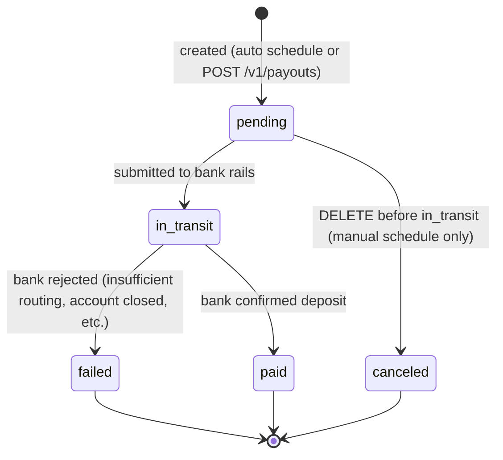
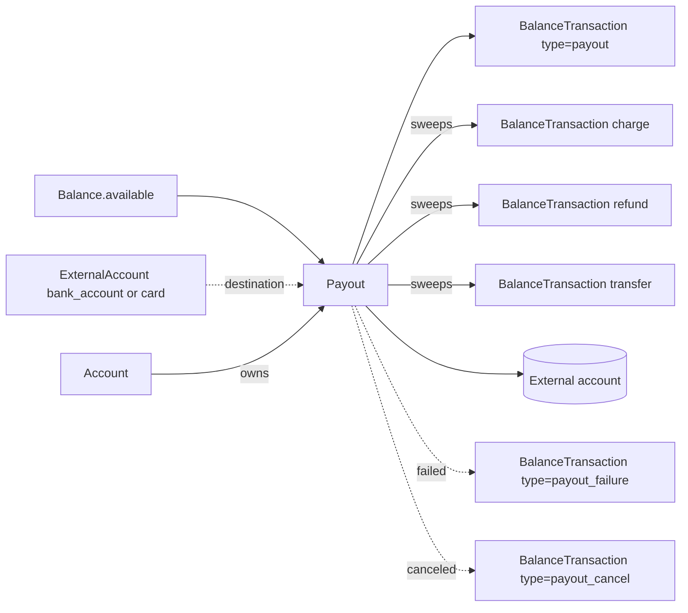

# Payout

> API resource: `payout` · API version: `2026-04-22.dahlia` · Category: [Core resources](README.md)

## What it is

A `Payout` is the record of Stripe sending money out of your `available` [Balance](balance.md) into an external destination — almost always your linked bank account. Each Payout corresponds 1:1 with a single line item on your bank statement: when you see "STRIPE PAYOUT" hit your account on Wednesday morning, that's one `po_…` object. The Payout aggregates many [BalanceTransactions](balance-transactions.md) (one per charge, refund, fee, transfer, etc.) into one wire/ACH movement.

For most accounts Stripe creates Payouts automatically on a schedule (daily, weekly, monthly) configured per-currency on your [Account](../07-connect/accounts.md). For accounts on the *manual* schedule — the default for some Connect platforms and for any account that opts in — you create Payouts via `POST /v1/payouts`. Either way the object you read is the same.

## Why it exists

Charges land funds in your Stripe `Balance.pending`, and after a settlement window roll to `Balance.available`. Payout is the bridge from `available` to your bank. It exists for three reasons:

1. **Aggregation.** Banks don't want one wire per card swipe. Payout collapses N BalanceTransactions into one rail movement.
2. **Reconciliation.** The `Payout` object — and the BTs it sweeps via the `payout` field on each — is what lets you tie your bank statement to the underlying customer payments.
3. **Control.** Choose between automatic (Stripe decides timing) and manual (you call the API). Choose between standard (free, ACH/wire, 1–2 business days) and instant (fee, debit-card rail, minutes).

Without a Payout object, you'd have to derive "what hit the bank" by replaying the entire BT stream and guessing where Stripe drew the line.

## Lifecycle & states



State notes:

- **pending.** The Payout has been created but not yet submitted to the bank. For automatic schedule, this is the brief window between Stripe deciding to issue and actually sending. For manual, this is right after `POST /v1/payouts` returns. **Cancelable** in this state via `POST /v1/payouts/{id}/cancel` (manual schedule only — automatic-schedule pending payouts cannot be canceled).
- **in_transit.** Stripe has handed the Payout to the bank rails (ACH, wire, SEPA, faster payments, etc.). No longer cancelable. `Payout.amount` has been deducted from `Balance.available` (a `type: payout` BalanceTransaction is created at this transition).
- **paid.** Bank confirmed receipt. `payout.paid` event fires. For instant payouts this is near-immediate; for ACH it's typically `arrival_date` or shortly after. **Terminal.**
- **failed.** Bank rejected. `payout.failed` event fires; `failure_code` and `failure_message` are populated; the funds are returned to `Balance.available` via a `type: payout_failure` BalanceTransaction (positive). The Payout cannot be retried by mutating the same object — you create a new Payout (after fixing the underlying issue, usually a bad external account). **Terminal.**
- **canceled.** Only reachable from `pending` on manual schedule. Funds return to `available` via a `type: payout_cancel` BT. **Terminal.**

`status` is the field that tells the truth. Don't rely on `arrival_date` having passed to assume a Payout is `paid` — it's an *expected* date, not a confirmation.

### `arrival_date` vs `created`

| Field | Meaning |
|---|---|
| `created` | When the Payout object was created (Stripe scheduled it). |
| `arrival_date` | The estimated bank-credit date. For ACH, typically 1–2 business days after `created`. For instant, same day. **It's an estimate**, not a guarantee. The `paid` status is the truth. |

## Anatomy of the object

### Identity

| Field | Notes |
|---|---|
| `id` | `po_…` |
| `object` | always `"payout"` |
| `livemode` | mode flag |
| `created` | unix seconds |
| `metadata` | your bag |
| `description` | optional, often `"STRIPE PAYOUT"` by default; may appear on the bank statement depending on rail |
| `statement_descriptor` | what shows on your bank statement (limited character set; rail-dependent) |

### Money

| Field | Notes |
|---|---|
| `amount` | Total being sent in the smallest currency unit. Positive integer. |
| `currency` | three-letter ISO. Must match a currency you have `available` balance in. |
| `application_fee_amount` / `application_fee` | Connect platform fee taken on Instant Payouts to a connected account. Usually `null`. |

### Status & timing

| Field | Notes |
|---|---|
| `status` | `pending | in_transit | paid | failed | canceled`. See lifecycle. |
| `arrival_date` | unix seconds (date, 00:00 in account timezone). Estimated bank-credit date. |
| `failure_code` | enum, populated only on `failed`. e.g. `account_closed`, `account_frozen`, `bank_account_restricted`, `debit_not_authorized`, `insufficient_funds`, `invalid_account_number`, `invalid_currency`. |
| `failure_message` | Human-ish message accompanying the code. |
| `failure_balance_transaction` | The `type: payout_failure` BT that returned the funds to `available`. |
| `reconciliation_status` | `not_applicable | in_progress | completed`. `completed` means every constituent BT has had its `payout` field set — the trigger to start your reconciliation script. |

### Method & destination

| Field | Notes |
|---|---|
| `method` | `standard` or `instant`. Standard is free, slower (ACH, SEPA, etc.). Instant is fee'd, debit-card rail, minutes. |
| `type` | `bank_account` or `card`. Card means an Instant Payout to a debit card. |
| `source_type` | Which `Balance` bucket the Payout draws from: `card`, `bank_account`, `fpx`, etc. Defaults to `card`. **Important on accounts that have multiple `source_types` in `available[]`.** |
| `destination` | ID of the external account receiving the Payout (`ba_…` for a bank account, `card_…` for a debit card). Defaults to the account's primary external account. |
| `automatic` | `true` if Stripe created it on schedule, `false` if you called `POST /v1/payouts`. |

### Linkage back

| Field | Notes |
|---|---|
| `balance_transaction` | The `type: payout` BT for this Payout (the debit on your Balance). |
| `original_payout` | Set on a `payout_reversal` payout — the Payout being reversed. |
| `reversed_by` | Set on the original Payout if a reversal exists. |

## Relationships



Key invariants:

- **A Payout has exactly one `type: payout` BalanceTransaction** (the debit on your Balance, equal to `−amount`).
- **A Payout sweeps many BalanceTransactions.** Each constituent BT's `payout` field is set to this Payout's ID once Stripe finishes assigning. The sum of those BTs' `net` equals `Payout.amount`.
- **A failed or canceled Payout creates a counter-BT** (`payout_failure` or `payout_cancel`) restoring the funds to `available`.
- **A Payout's destination must be a verified external account on the Account.** If you set `destination` to a non-verified or wrong-currency `ba_…`, the call fails synchronously.

## Common workflows

### 1. Reconcile a payout against the underlying transactions

The killer use case. Start from a `payout.paid` (or better, `payout.reconciliation_completed`) webhook:

```http
GET /v1/balance_transactions?payout=po_…&limit=100&expand[]=data.source
```

Paginate via `starting_after`. For each BT, `source` is the originating object (`ch_…`, `re_…`, `tr_…`, `dp_…`, `fee_…`). Sum `net` across all BTs — it equals `Payout.amount`. Persist the mapping; this is what your finance team will ask you for.

### 2. Manual payout (manual schedule)

```http
POST /v1/payouts
Idempotency-Key: payout-2026-05-06-usd
  amount=125000
  currency=usd
```

Optional: `destination=ba_…` (defaults to primary), `method=standard|instant`, `source_type=card|bank_account|fpx|…`, `description=`, `metadata[batch_id]=…`. Returns the new Payout in `pending`.

### 3. Cancel a pending payout (manual schedule)

```http
POST /v1/payouts/po_…/cancel
```

Only works while `status: pending`. Once `in_transit` you cannot cancel — the only reversal is to wait for `paid` and then originate a refund/return out-of-band, or use `POST /v1/payouts/{id}/reverse` if your account is configured for it.

### 4. Reverse a paid payout

```http
POST /v1/payouts/po_…/reverse
```

Creates a *new* Payout in the opposite direction (debit your bank, credit your Balance). Available only on certain rails (typically not on instant). The new Payout points back to the original via `original_payout`; the original gets `reversed_by` set.

### 5. Switch from automatic to manual schedule

Update the [Account](../07-connect/accounts.md):

```http
POST /v1/accounts/acct_…
  settings[payouts][schedule][interval]=manual
```

Funds will accumulate in `available[]` until you call `POST /v1/payouts`. Useful for marketplaces that want to reconcile before paying out connected accounts.

### 6. List failed payouts in a date range

```http
GET /v1/payouts?status=failed&arrival_date[gte]=…&arrival_date[lt]=…&limit=100
```

Common dashboard query. Each `failure_code` plus your bank's response usually tells you whether to update the destination account or contact the merchant.

## Webhook events

| Event | Fires when | Listener typically does |
|---|---|---|
| `payout.created` | Payout was just created (auto or manual). `status: pending`. | Persist the Payout. Show pending payout in admin UI. |
| `payout.updated` | Field change before terminal — usually `status: pending → in_transit`, or `arrival_date` shifted. | Update local copy. |
| `payout.paid` | Bank confirmed deposit. `status: paid`. | Mark deposit as landed. Begin reconciliation. |
| `payout.failed` | Bank rejected. `status: failed`. **Funds are back in `available`.** | Alert the operations team. Inspect `failure_code` to decide whether to update external account or retry. |
| `payout.canceled` | Manual cancel before `in_transit`. | Mark canceled in your records. |
| `payout.reconciliation_completed` | Every constituent BT now has `payout` set on it. Fires *after* `payout.paid`, sometimes hours later. | Trigger your `GET /v1/balance_transactions?payout=…` reconciliation pipeline. This is the safer signal than `payout.paid` for reconciliation jobs. |

Cross-check with [_meta/webhook-catalog.md](../_meta/webhook-catalog.md).

## Idempotency, retries & race conditions

- **Always send `Idempotency-Key`** on `POST /v1/payouts`. The cost of a duplicate is wiring funds twice.
- `POST /v1/payouts/{id}/cancel` and `POST /v1/payouts/{id}/reverse` are idempotent on the resource itself (a second call is a no-op or returns an error if the state changed), but use idempotency keys anyway for clean retries.
- **`payout.created` can arrive *before* the synchronous `POST /v1/payouts` response gets back to your client** in rare network conditions. Trust the webhook and de-dupe by `id`.
- **`payout.paid` does not mean reconciliation-ready.** Wait for `payout.reconciliation_completed` before assuming `BT.payout` is populated for every constituent BT. The gap can be hours.
- **Failure semantics.** `payout.failed` fires asynchronously — sometimes days after the bank initially accepted the file, when the receiving institution returns it. Code that treats `paid` as terminal should listen for the very rare late `failed`/`reversed` events and write a counter-entry.

## Test-mode tips

- Test-mode payouts settle to test-mode-only fake bank accounts. They do not send real money.
- Use [Stripe-provided test routing/account numbers](https://docs.stripe.com/connect/testing#payouts) to force specific `failure_code` results: e.g. account number `000111111116` triggers a payout `failed` with `account_closed`.
- `stripe trigger payout.created` and `stripe trigger payout.paid` via the CLI exercise the happy path; `stripe trigger payout.failed` exercises the failure path.
- `stripe trigger payout.reconciliation_completed` lets you test the gap between `paid` and reconciliation-ready.
- Test-mode payouts on automatic schedule run on an accelerated cadence — useful for development but unrelated to your live schedule.

## Connect considerations

Payouts on Connect are where most of the complexity lives — and where most marketplace bugs originate.

- **Per-account Payouts.** Each connected account (Standard/Express/Custom) has its own Payouts. `GET /v1/payouts` without a header returns the platform's. With `Stripe-Account: acct_…` it returns the connected account's. There is no aggregated cross-account view.
- **Schedule per account.** `account.settings.payouts.schedule.interval` is per-account. The platform may be on automatic daily while a specific connected account is on manual.
- **Manual payouts on Custom accounts.** A platform commonly sets connected accounts to manual schedule, then uses platform-controlled logic to issue per-merchant Payouts via `POST /v1/payouts` + `Stripe-Account: acct_…`. This is how marketplaces hold reserves and time disbursements to their own business rules.
- **Instant Payouts on connected accounts** carry an `application_fee_amount` that the platform can take. Set it on the `POST /v1/payouts` call with `Stripe-Account: acct_…`.
- **`account.external_account.*` events.** Bank/card destinations are managed via [ExternalAccount](../07-connect/external-accounts.md). A Payout fails with `bank_account_restricted` if the destination's verification lapses — listen to `account.external_account.updated` to know.
- **Negative balance on a connected account blocks payouts.** Stripe will not pay out if `available[]` is negative. Either top-up via `Topup` or wait for new charges to offset.
- **Reverse-platform-collection (`obligation_outbound`).** A platform may sweep funds *from* a connected account back to the platform; that flow appears as Payout-shaped objects with the appropriate BT types. See [Account](../07-connect/accounts.md) docs for marketplace-collection-only accounts.

## Common pitfalls

- **Treating `arrival_date` as proof of receipt.** It's an estimate. The bank can return a Payout days *after* the arrival date. Status `paid` is the only signal that money landed; even then, listen for late `failed`.
- **Reconciling on `payout.paid`.** The `payout` field on individual BTs may not be populated yet. Use `payout.reconciliation_completed` to drive your reconciliation pipeline.
- **Forgetting `source_type`.** If your Balance has both card and ACH `available[]`, a `POST /v1/payouts` without `source_type` defaults to `card`. To pay out ACH-collected funds, set `source_type=bank_account` explicitly. Otherwise the call may fail with `insufficient_funds` even though `available[].amount` looks healthy.
- **Trying to cancel an `in_transit` payout.** Not possible. Only `pending` payouts on manual schedule can be canceled.
- **Assuming Instant Payouts are always available.** They require a debit-card destination, are subject to per-day caps, and not all currencies/regions support them. Check `instant_available[]` on the Balance, not `available[]`.
- **Treating `failed` as a synchronous response to `POST /v1/payouts`.** The synchronous response returns `pending`. Failures are asynchronous, often hours or days later. Surface them via webhooks.
- **Relying on `description` for reconciliation.** Banks truncate, replace, or drop descriptors depending on rail and country. The Payout `id` and the BT chain are the only stable links.
- **Connect: reading the platform's payouts and conflating them with merchant payouts.** They are entirely separate ledgers. A platform can pay out daily while its connected accounts pay out monthly — and the reconciliation queries differ.
- **Negative-balance surprise.** If you hit `failed` with `insufficient_funds`, the cause is almost always refunds/disputes that drove `available[]` negative since the Payout was created. Inspect `Balance` and the recent BT stream.

## Further reading

- [API reference: Payout](https://docs.stripe.com/api/payouts/object)
- [API reference: Create payout](https://docs.stripe.com/api/payouts/create)
- [Payout schedule](https://docs.stripe.com/payouts)
- [Instant Payouts](https://docs.stripe.com/payouts/instant-payouts)
- [Connect: payouts to connected accounts](https://docs.stripe.com/connect/payouts-connected-accounts)
- [Failed payouts](https://docs.stripe.com/payouts/failures)
