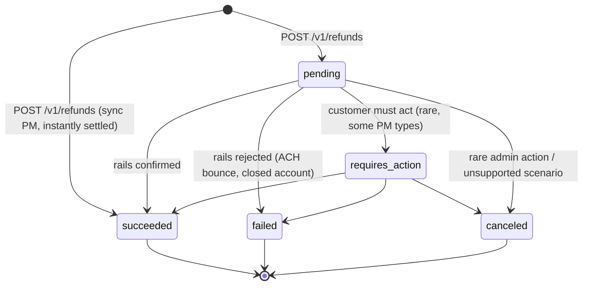
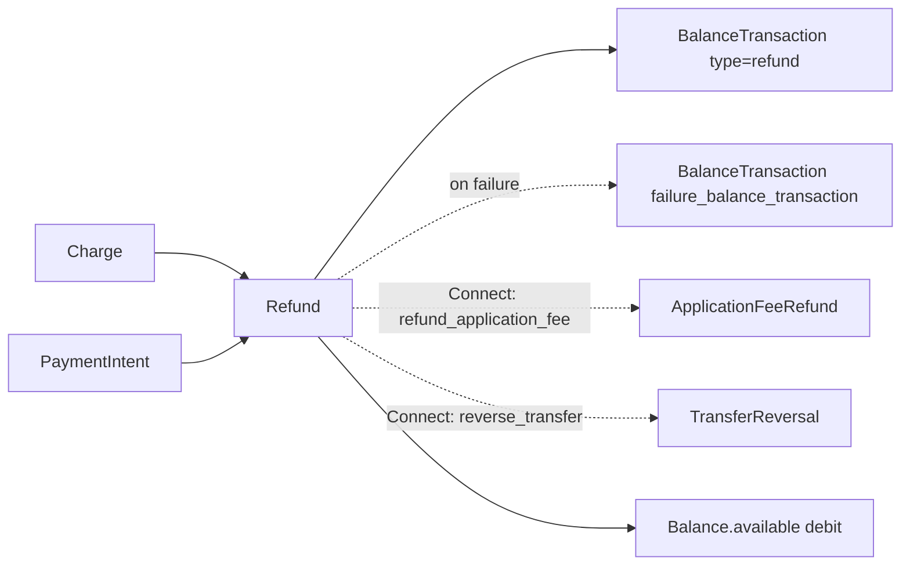

# Refund

> API resource: `refund` · API version: `2026-04-22.dahlia` · Category: [Core resources](README.md)

## What it is

A `Refund` is the record of returning all or part of a captured [Charge](charges.md) to the customer. It is its own object — not a mutation of the Charge — with its own ID, status, and [BalanceTransaction](balance-transactions.md). A Charge can have many Refunds (any number of partial refunds, summing up to `Charge.amount_captured`); each Refund points back at exactly one Charge.

You create a Refund either against a Charge directly or against the [PaymentIntent](payment-intents.md) that produced it. The Refund pulls the refunded amount **from your `Balance.available`**, not from the original Charge — meaning if your available balance is too low, the Refund still succeeds but pushes your Balance negative (Stripe will then debit your bank or block payouts).

For card refunds the funds typically land back on the customer's card in 5–10 business days; for ACH and other bank-rail refunds the timeline varies and the Refund itself can fail asynchronously (a `refund.failed` event days after `refund.created`).

## Why it exists

A Refund object exists for the same reason a Charge does: it is the *atomic ledger event* for money going out. If refunds were just a `refunded_amount` integer on the Charge, you couldn't:

- Track *who* (which agent, which automation) issued each refund — `metadata`.
- Track *when* each one happened — `created`.
- Track *whether* each one succeeded (async refunds bounce).
- Tie each one to its own [BalanceTransaction](balance-transactions.md) for accounting.
- Couple them to [ApplicationFeeRefund](../07-connect/application-fee-refunds.md)s on Connect.

The Refund object captures all of that, and the originating Charge gets a derived `amount_refunded` and `refunded` boolean for convenience.

## Lifecycle & states



State notes:

- **pending.** Refund created; rails have not yet confirmed. For card refunds this state is brief or skipped (the API often returns `succeeded` directly). For ACH, BACS, SEPA, and other delayed-settlement methods, it can persist for days while the receiving bank processes.
- **succeeded.** Funds left your Balance and are en route to the customer (or already there for instant rails). `BalanceTransaction` of `type: refund` (or `payment_refund`) is finalized. **Terminal for the Refund** — but note the customer's bank may still take days to credit the cardholder.
- **failed.** Rails rejected. `failure_reason` is populated (`lost_or_stolen_card`, `expired_or_canceled_card`, `charge_for_pending_refund_disputed`, `insufficient_funds`, `declined`, `merchant_request`, `unknown`). **The funds are returned to your Balance** via a counter-BT pointed to by `failure_balance_transaction`. **Terminal.** To retry you create a new Refund (often after collecting an updated payment instrument from the customer out-of-band).
- **requires_action.** Some PM types need customer action to complete the refund (uncommon; specific to a few alternative PMs and Connect scenarios). Surface the appropriate next action to the customer; the Refund will then transition to `succeeded` or `failed`.
- **canceled.** Rare. Used when a refund cannot be completed and must be voided server-side. **Terminal.**

The Charge-side derived fields:

| Field on Charge | Meaning |
|---|---|
| `amount_refunded` | Sum of `amount` across all `succeeded` Refunds. Updated synchronously on Refund success. |
| `refunded` | **`true` only when fully refunded** (i.e., `amount_refunded == amount_captured`). Partial refunds leave `refunded: false`. |

## Anatomy of the object

### Identity

| Field | Notes |
|---|---|
| `id` | `re_…` |
| `object` | always `"refund"` |
| `created` | unix seconds |
| `currency` | three-letter ISO; matches the Charge's currency |
| `metadata` | your bag — agent ID, support ticket, return-merchandise authorization |
| `description` | optional, sometimes surfaced on customer-facing receipts |

### Money

| Field | Notes |
|---|---|
| `amount` | Refunded amount in the smallest currency unit. ≤ `Charge.amount_captured − sum(other_refunds.amount)`. |

### Status & outcome

| Field | Notes |
|---|---|
| `status` | `pending | succeeded | failed | requires_action | canceled`. See lifecycle. |
| `reason` | Optional enum: `duplicate`, `fraudulent`, `requested_by_customer`. Free-text not allowed; use `metadata` for finer detail. `fraudulent` flags the original Charge to Radar. |
| `failure_reason` | Populated only on `failed`. Enum, see lifecycle notes above. |
| `next_action` | Subobject populated only when `requires_action`; describes the action type and any URL/instructions. |

### Pointers

| Field | Notes |
|---|---|
| `charge` | `ch_…` — always populated. |
| `payment_intent` | `pi_…` — populated when the Charge was created via a PaymentIntent (almost always in modern code). |
| `balance_transaction` | The `type: refund` (or `payment_refund`) BT for this Refund. **Source of truth for the actual amount that left your Balance.** |
| `failure_balance_transaction` | If the Refund failed, the offsetting BT that returned the funds to `available`. |
| `source_transfer_reversal` | Set when the Refund triggered a Transfer reversal on Connect. |
| `transfer_reversal` | The `trr_…` ID of that Transfer reversal. |
| `destination_details` | Subobject describing where the refund went, broken out per-PM (e.g. `card.reference`, `card.reference_status`). The `card.reference` is the Refund Reference Number some issuers display to cardholders. |

### Connect coupling

| Field | Notes |
|---|---|
| `application_fee` (read via Charge) | The original ApplicationFee. |
| (request param) `refund_application_fee` | Boolean. **Defaults to `true` when refunding a Charge that had an `application_fee_amount`.** When true, an [ApplicationFeeRefund](../07-connect/application-fee-refunds.md) is created proportionally to the refund. Set `false` to let the platform keep its cut despite the customer refund. |
| (request param) `reverse_transfer` | Boolean. For destination charges. **Defaults to `true`.** When true, the linked Transfer is reversed proportionally so the connected account doesn't keep funds for a refunded sale. Set `false` to leave the Transfer intact. |

## Relationships



Invariants:

- **A Refund belongs to exactly one Charge.** Even when created via `payment_intent=`, the resulting Refund's `charge` field is set to the PI's `latest_charge`.
- **A Charge can have many Refunds.** Sum of `amount` across all *succeeded* Refunds ≤ `Charge.amount_captured`. Stripe enforces this synchronously on creation.
- **Each succeeded Refund has exactly one BT** (`type: refund`, negative `amount`). A failed Refund has an additional BT (`failure_balance_transaction`) that re-credits your Balance.
- **A Refund on a Connect direct or destination charge can spawn an ApplicationFeeRefund and/or a TransferReversal**, depending on the parameters above.

## Common workflows

### 1. Full refund of a Charge

```http
POST /v1/refunds
Idempotency-Key: refund-order-12345-full
  charge=ch_…
```

(Omitting `amount` defaults to the unrefunded remainder, which for a fresh Charge is the full amount.) Equivalent:

```http
POST /v1/refunds
Idempotency-Key: refund-order-12345-full
  payment_intent=pi_…
```

### 2. Partial refund

```http
POST /v1/refunds
Idempotency-Key: refund-order-12345-part-1
  charge=ch_…
  amount=500
  reason=requested_by_customer
  metadata[support_ticket]=TKT-789
```

`amount` is in the smallest unit (cents). After this, `Charge.amount_refunded` increases by 500; `Charge.refunded` stays `false` unless this brings the total to `Charge.amount_captured`.

### 3. Refund without reversing the application fee (Connect)

The platform keeps its cut even though the customer is being refunded:

```http
POST /v1/refunds
Idempotency-Key: refund-order-12345-platform-keeps-fee
  charge=ch_…
  amount=1000
  refund_application_fee=false
```

Useful for non-refundable booking fees on a marketplace.

### 4. Refund without reversing the transfer (Connect destination charge)

```http
POST /v1/refunds
Idempotency-Key: refund-order-12345-no-transfer-reverse
  charge=ch_…
  amount=1000
  reverse_transfer=false
```

The connected account keeps the funds; the platform absorbs the refund cost. Used when the platform has already disbursed and doesn't want to claw back.

### 5. Mark a refund as fraudulent (informs Radar)

```http
POST /v1/refunds
Idempotency-Key: refund-fraud-9876
  charge=ch_…
  reason=fraudulent
```

Plus you typically also call `POST /v1/charges/ch_…` with `fraud_details[user_report]=fraudulent` — see [Charge](charges.md).

### 6. Update metadata or description on an existing Refund

```http
POST /v1/refunds/re_…
  metadata[reviewed_by]=ops_alice
```

`amount`, `reason`, `charge`, `payment_intent` are immutable. `metadata` and `description` are updatable.

### 7. Cancel a refund that requires action

```http
POST /v1/refunds/re_…/cancel
```

Only valid while `status: requires_action` (or, in some scenarios, `pending`). Returns the Refund in `canceled`.

### 8. Reconcile a refund's actual ledger impact

```http
GET /v1/refunds/re_…?expand[]=balance_transaction&expand[]=failure_balance_transaction
```

`balance_transaction.net` is what left your Balance (always negative for a `succeeded` refund). On `failed`, the `failure_balance_transaction.net` is the positive offset.

## Webhook events

| Event | Fires when | Listener typically does |
|---|---|---|
| `refund.created` | A Refund was created — `status` may be `pending`, `succeeded`, or `requires_action` depending on PM. | Persist the Refund. Update local order/return state. |
| `refund.updated` | Status or fields changed (most commonly `pending → succeeded`, or `requires_action → succeeded`). | Re-sync. Update customer-facing refund status. |
| `refund.failed` | Async refund bounced — typically ACH or other delayed-settlement rails. | **Page the operations team.** The funds are back in `Balance.available`; the customer was *not* refunded. Reach out to the customer for an alternate refund destination. |
| `charge.refunded` | A Refund was attached to a Charge. **Fires per refund**, including each partial refund and including failed/pending intermediate states depending on PM. | Re-fetch the Charge to read updated `amount_refunded`. Treat as set-style: "refund X exists" rather than "+= X". |
| `application_fee.refunded` (Connect) | An ApplicationFeeRefund was created as a side effect of a Refund with `refund_application_fee=true`. | Update platform revenue books. |

Cross-check with [_meta/webhook-catalog.md](../_meta/webhook-catalog.md). **`refund.created` does *not* mean money has reached the customer.** Wait for `refund.updated` with `status: succeeded`, and even then the customer's bank may take 5–10 business days.

## Idempotency, retries & race conditions

- **Always send `Idempotency-Key`** on `POST /v1/refunds`. A duplicate refund without one is the most common way to *double-refund* a customer.
- Repeating `POST /v1/refunds/{id}/cancel` is safe; the second call returns the same Refund.
- **`refund.created` and the synchronous `POST /v1/refunds` response can race.** A multi-region Stripe deployment may emit the webhook before the response reaches your client. Trust whichever arrives first; de-dupe by `id`.
- **Multiple `charge.refunded` events can interleave.** Two parallel partial refunds each fire one event; the order they hit your handler is not guaranteed to match the order they were created. Idempotent handlers must reconstruct refund state from the Refund list, not increment.
- **`refund.failed` can arrive *days* after `refund.created`** for ACH and similar rails. Treat `succeeded` as not-yet-terminal-from-the-customer's-perspective, and `failed` as a real possibility long after issuance.
- Stripe enforces `sum(succeeded refunds) ≤ Charge.amount_captured` synchronously. A partial refund that would over-refund returns `400 charge_already_refunded`.

## Test-mode tips

- Card `4242 4242 4242 4242`: refunds always succeed synchronously.
- Card `4000 0000 0000 5126`: refund will fail asynchronously — useful for exercising the `refund.failed` path.
- Card `4000 0000 0000 0259` / `4000 0000 0000 1976`: charge creates a dispute; refund attempts on disputed charges produce predictable failures (`charge_for_pending_refund_disputed`).
- `stripe trigger refund.created` and `stripe trigger refund.failed` via the CLI exercise the events without needing to set up a charge first.
- Test-mode refunds settle on the same accelerated balance schedule as test charges. The `BalanceTransaction` is created immediately.
- [TestClock](../06-billing/test-clocks.md) does not interact with Refunds directly — refunds are not subscription-driven.

## Connect considerations

Refunds on Connect are where most ledger surprises happen. Two flags govern the behavior:

| Flag | Default | What it does |
|---|---|---|
| `refund_application_fee` | `true` | Proportionally refund the platform's [ApplicationFee](../07-connect/application-fees.md) by creating an [ApplicationFeeRefund](../07-connect/application-fee-refunds.md). Set `false` for non-refundable platform fees. |
| `reverse_transfer` | `true` | For destination charges: proportionally reverse the linked [Transfer](../07-connect/transfers.md) so the connected account loses the corresponding funds. Set `false` to absorb the refund on the platform. |

Concrete consequences for a destination charge of `amount=1000`, `application_fee_amount=200` (so the connected account net-received `800`), if you refund `500`:

- **Defaults (`refund_application_fee=true`, `reverse_transfer=true`)**: ApplicationFeeRefund of `100` is created (platform refunds half its fee), TransferReversal of `400` is created (connected account loses half its share). Customer is refunded `500`; platform Balance goes down `100`; connected account Balance goes down `400`.
- **`refund_application_fee=false`**: Platform keeps the full `200` fee. Customer is refunded `500`; platform Balance goes down `500`; connected account Balance goes down `400`. *Platform absorbs the difference.*
- **`reverse_transfer=false`**: Connected account keeps the full `800`. Customer is refunded `500`; platform Balance goes down `100` (fee refund) plus `500` (the refund itself); connected account is unchanged. *Platform fully absorbs the merchant share.*
- **Both `false`**: Platform absorbs the entire refund (`500` debit on platform Balance), no movement on connected account, no fee refund.

For Direct charges (`Stripe-Account` header), the analogue: `refund_application_fee` works the same; `reverse_transfer` doesn't apply because there's no Transfer object — the connected account directly bears the refund.

Per-account considerations:

- **Send `Stripe-Account: acct_…` to refund a Direct charge.** Without it, you'll get `404` because the Charge lives on the connected account, not the platform.
- **A connected account can also issue refunds itself** via Dashboard or API. Treat the resulting `refund.created` events identically to platform-issued refunds.

## Common pitfalls

- **Reading `Charge.refunded` to detect *any* refund.** It's `true` only on *full* refund. Use `Charge.amount_refunded > 0` for "has at least one refund."
- **Treating `status: succeeded` as "the customer has the money."** It means it left your Balance. Card issuers post the credit 5–10 business days later. Surface that timeline to customers in your UI.
- **Forgetting that refunds can fail asynchronously.** A refund that succeeded yesterday can fail today (ACH return). Listen to `refund.failed` and reconcile; the failure puts funds back in your Balance, not back on the customer's card.
- **Double-refunding.** Without `Idempotency-Key`, a network retry on `POST /v1/refunds` creates two refunds. Stripe will not deduplicate by `(charge, amount)`.
- **Over-refunding.** Stripe blocks `sum > amount_captured`, but if you have racing parallel refund jobs, both may pass the local "have we refunded too much?" check before Stripe sees them. Idempotency keys plus a serialized in-app refund queue prevent this.
- **Connect: forgetting `refund_application_fee` and `reverse_transfer` defaults.** Both default to `true`. If your business model says "the platform fee is non-refundable" and you don't pass `refund_application_fee=false`, you've quietly given the customer your platform's fee back too.
- **Refunding the wrong thing on Connect.** A Refund on a destination charge does *not* refund the application fee unless you also let it reverse the transfer. Read the matrix above before shipping.
- **Putting reason text in `reason`.** It's an enum (`duplicate`, `fraudulent`, `requested_by_customer`). Free-text goes in `metadata` or `description`.
- **Refunding a disputed Charge.** Once a Dispute exists, refund logic gets unusual — the `failure_reason` `charge_for_pending_refund_disputed` shows up. Generally accept the dispute or submit evidence; don't try to short-circuit with a Refund.
- **Refunding a `pending`-status Charge** (async PM). You usually can't until it succeeds. If you need to abort, cancel the PaymentIntent instead.

## Further reading

- [API reference: Refund](https://docs.stripe.com/api/refunds/object)
- [API reference: Create a refund](https://docs.stripe.com/api/refunds/create)
- [Refunds guide](https://docs.stripe.com/refunds)
- [Issuing partial refunds](https://docs.stripe.com/refunds#partial-refunds)
- [Refund failures](https://docs.stripe.com/refunds#failed-refunds)
- [Connect: refunds and disputes](https://docs.stripe.com/connect/destination-charges#issuing-refunds)
