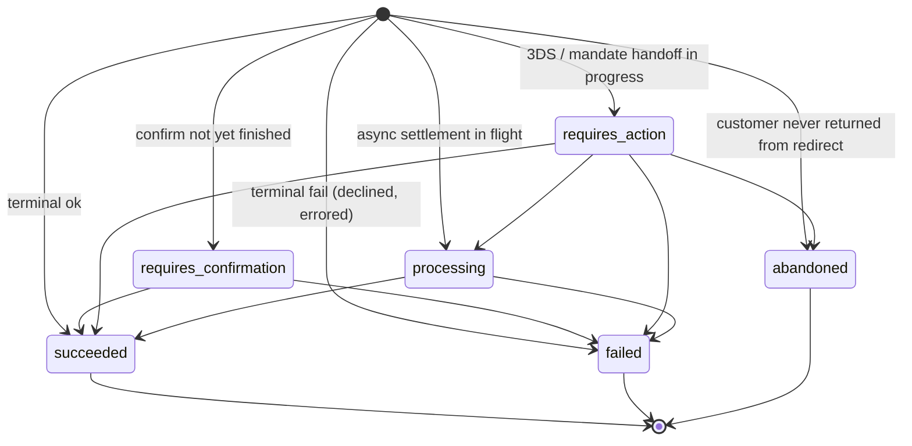
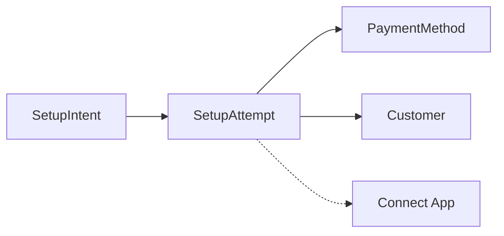

# SetupAttempt

> API resource: `setup_attempt` · API version: `2026-04-22.dahlia` · Category: [Core resources](README.md)

## What it is

A `SetupAttempt` is an immutable, read-only record of one pass through a [SetupIntent's](setup-intents.md) confirm cycle. Every time someone (you, Stripe.js, the customer in a redirect) calls `confirm` on a SI, Stripe writes a SetupAttempt with what was tried, what the network said, and whether the attempt landed in `succeeded`, `failed`, or `abandoned`. The SetupIntent's `latest_attempt` always points at the newest one.

Think of SetupAttempt as the **audit log** of a SetupIntent — equivalent to how multiple [Charge](charges.md) records can hang off a single PaymentIntent across retries. There is no API to create, mutate, or cancel a SetupAttempt directly.

## Why it exists

A SetupIntent's top-level `last_setup_error` only carries the *most recent* failure. Once the customer retries with a different PM and succeeds, that error is gone — but you may still want to know:

- Did the first card decline because of `insufficient_funds` or `card_velocity_exceeded`? (Different fraud signal.)
- How many 3DS challenges did the customer cancel before completing?
- Which `payment_method` IDs were tried? (Useful when the customer claims "I never used that card.")
- Did we burn through three SCA challenges in one minute? (Probably a bot — feed to Radar.)

SetupAttempts give you per-try forensics without keeping your own side log.

## Lifecycle & states

A SetupAttempt is born already in a non-initial status — it represents an attempt *that already happened*. There are no transitions you can drive; the status is whatever the underlying confirm cycle ended with.



State semantics:

- **`requires_confirmation`** — confirm started but hasn't yet handed off. Rare and short-lived; mostly seen if you list while a request is in flight.
- **`requires_action`** — Stripe is waiting on the customer (3DS challenge, ACH micro-deposit, mandate accept page).
- **`processing`** — async settlement in progress (ACH automatic verification, etc.).
- **`succeeded`** — terminal. The PM is now usable (and the parent SI also moved to `succeeded`).
- **`failed`** — terminal. `setup_error` populated with the network/Stripe error.
- **`abandoned`** — terminal. The customer left a redirect or 3DS flow and never came back; Stripe gave up after its retention window.

> Once an attempt reaches `succeeded`, `failed`, or `abandoned` it is frozen. New retries on the parent SI create *new* SetupAttempts; they don't mutate old ones.

## Anatomy of the object

### Identity

| Field | Notes |
|---|---|
| `id` | `setatt_…` |
| `object` | `"setup_attempt"` |
| `status` | enum, see above. |
| `created` | Unix seconds at start of attempt. |
| `livemode` | Standard. |
| `application` | OAuth `ca_…` if a Connect app drove the call; null otherwise. |

### Relations

| Field | Notes |
|---|---|
| `setup_intent` | Parent `seti_…`. **Required filter when listing.** |
| `payment_method` | `pm_…` tried in this attempt. May differ across attempts on the same SI. |
| `customer` | `cus_…` if the parent SI had one. |
| `on_behalf_of` | Connected account whose settings applied. |
| `usage` | Mirrors parent SI's `usage` at the time of the attempt (`on_session` / `off_session`). |
| `flow_directions` | Mirrors parent SI's `flow_directions`. |

### Outcome

| Field | Notes |
|---|---|
| `payment_method_details` | Per-type subobject describing what was tried — `card.brand`, `card.last4`, `card.three_d_secure.result`, `us_bank_account.bank_name`, `sepa_debit.bank_code`, `bacs_debit.last4`, etc. **The forensic gold mine.** Same shape as a Charge's `payment_method_details`. |
| `setup_error` | If `status: failed`. `code`, `decline_code`, `doc_url`, `message`, `payment_method_type`, `param`. |
| `payment_method_details.card.three_d_secure.authentication_flow` | `challenge` vs `frictionless`. |
| `payment_method_details.card.three_d_secure.result` | `authenticated`, `attempt_acknowledged`, `not_supported`, `failed`, `processing_error`. Useful for liability-shift analytics. |

## Relationships



- One SI → many SetupAttempts. The SI's `latest_attempt` is the most recent `setatt_…`.
- A SetupAttempt is the equivalent of a Charge for SetupIntents: the reified record of a single try.
- SetupAttempts are not directly listed on a Customer or PaymentMethod — you query through the parent SI.

## Common workflows

### 1. List attempts for a SetupIntent (forensics)

```http
GET /v1/setup_attempts?setup_intent=seti_…
```

Sort newest first by default. The list is paginated; for high-traffic flows (Klarna-style retries) iterate with `starting_after`.

### 2. Drill into a single attempt

```http
GET /v1/setup_attempts/setatt_…
```

Returns the same shape as the list element. There is no `expand[]=charge` sibling — there *is* no charge.

### 3. "Why did this customer's card save fail twice before working?"

```http
GET /v1/setup_attempts?setup_intent=seti_…&limit=10
```

Walk the list. Each entry's `setup_error.code` and `payment_method_details.card.three_d_secure.result` together tell you whether it was a network decline, a customer-canceled 3DS, or a Radar block.

### 4. Filter by date for time-bounded reconciliation

```http
GET /v1/setup_attempts?setup_intent=seti_…&created[gte]=1714521600
```

The `created` filter accepts the usual Stripe operators (`gt`, `gte`, `lt`, `lte`).

> There is no listing endpoint that returns attempts across *all* SetupIntents — `setup_intent` is required. If you need cross-SI analytics, pull SetupIntents first and walk down.

## Webhook events

**None.** SetupAttempt has no webhooks of its own. Subscribe to the parent SI's events and pull attempts when you need detail:

| You want | Webhook to listen for |
|---|---|
| Notification a try happened at all | `setup_intent.requires_action`, `setup_intent.processing`, or `setup_intent.succeeded` / `setup_intent.setup_failed`. |
| Detail on what was tried | `GET /v1/setup_attempts?setup_intent=seti_…` from your handler. |

This is intentional — events on every attempt would multiply event volume by retry count for no real product surface.

## Idempotency, retries & race conditions

- SetupAttempts are read-only — there is nothing to make idempotent.
- A new attempt is created **server-side** by Stripe whenever a `confirm` happens, regardless of whether the client used an `Idempotency-Key`. Idempotent retries of the *same* confirm call do not create extra SetupAttempts (they return the same SI).
- Network-level retries that *do* hit Stripe twice (e.g. you forgot the key and your HTTP client retried on a 502) can create duplicate attempts. Look at `created` clustering if you see suspicious doubles.
- The `latest_attempt` on the SI may briefly point to a `requires_action` attempt while the `setup_intent.requires_action` event is being delivered — read `setup_intent.status` as the source of truth.

## Test-mode tips

- `stripe trigger setup_intent.setup_failed` produces a SI plus a `failed` SetupAttempt with a representative `setup_error`.
- `stripe trigger setup_intent.succeeded` produces a `succeeded` attempt.
- For `abandoned` status, manually start a redirect-PM SI in test mode (Bancontact, iDEAL, EPS) and close the browser tab — Stripe marks the attempt `abandoned` after its handoff timeout (~10 min in test mode for some PMs).
- Test-mode SetupAttempts persist for the same retention as the parent SI; there is no separate `delete` endpoint.

## Connect considerations

- A SetupAttempt belongs to whichever account the SI lives on. Direct SetupIntents (created with `Stripe-Account`) yield SetupAttempts visible only on that connected account; they don't show up on the platform's `setup_attempts` list.
- `on_behalf_of` is mirrored on the SetupAttempt and the SetupIntent. Useful when the platform needs to audit attempts that ran under a connected account's SCA jurisdiction.
- Connect apps acting via OAuth surface as `application: ca_…`. Useful for tracing "which integration partner caused this attempt."

## Common pitfalls

- **Treating `latest_attempt` on a SI as immutable.** It updates as the customer retries. If you cache it, expire on every `setup_intent.*` event.
- **Listing without `setup_intent`.** The endpoint requires it; an unfiltered call errors.
- **Expecting an event per attempt.** There isn't one. Pull from the API on the SI-level events.
- **Reading `setup_error` and ignoring `payment_method_details.card.three_d_secure.result`.** A `setup_error.code: authentication_required` *plus* `three_d_secure.result: failed` means the issuer denied authentication — different remediation than `result: not_supported` (PM doesn't do 3DS, retry without).
- **Using SetupAttempts as a state machine to drive UI.** They're a log. Drive UI from the SetupIntent's `status` and `next_action`.
- **Assuming attempts are deduplicated across rapid clicks.** A double-click on "Save card" without an Idempotency-Key can produce two SIs each with one attempt — and double-charge the customer's SCA challenge count, which some issuers escalate as fraud.

## Further reading

- [API reference: SetupAttempt](https://docs.stripe.com/api/setup_attempts/object)
- [List SetupAttempts](https://docs.stripe.com/api/setup_attempts/list)
- Sibling: [SetupIntent](setup-intents.md) — the parent state machine.
- Sibling: [PaymentMethod](../02-payment-methods/payment-methods.md) — the instrument referenced by each attempt.
