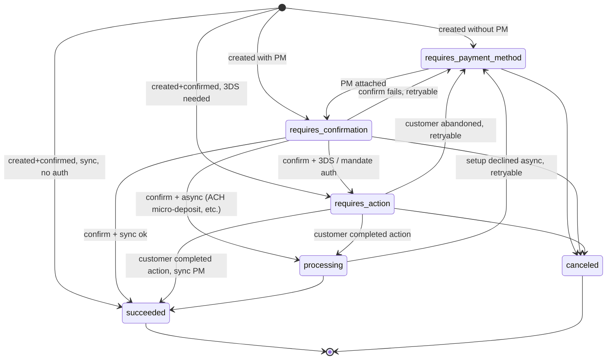
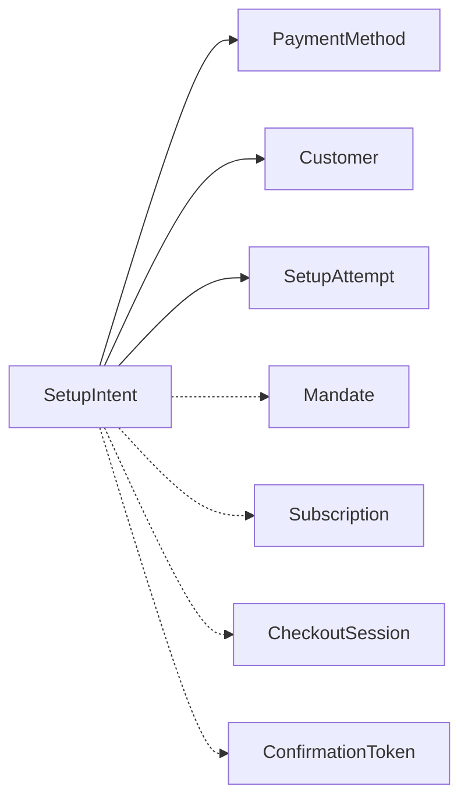

# SetupIntent

> API resource: `setup_intent` · API version: `2026-04-22.dahlia` · Category: [Core resources](README.md)

## What it is

A `SetupIntent` is the [PaymentIntent](payment-intents.md) state machine with the money taken out. It walks a customer through everything required to **save a payment method for future use** — collect card details, run 3DS / SCA if the issuer demands it, generate a [Mandate](mandates.md) for ACH/SEPA/BACS, attach the resulting [PaymentMethod](../02-payment-methods/payment-methods.md) to a [Customer](customers.md) — without ever authorizing a charge.

If PaymentIntent answers *"can I bill this customer right now?"*, SetupIntent answers *"can I bill this customer later, off-session?"*

## Why it exists

You need to put a card on file when there's nothing to charge yet:

- **Free trials.** Subscriber signs up Tuesday; first invoice is in 14 days.
- **Postpaid usage billing.** Ride-share, metered API, hotel incidentals — collect a PM at signup, charge an unknown amount weeks later.
- **Switch / replace card.** Existing customer wants to update their card on file.
- **Reservations and pre-auths that aren't card auths.** ACH and SEPA can't "auth and capture later" — they only debit. Use a SetupIntent up front so you have a `Mandate` ready.

The reason this can't just be "create a PaymentMethod and attach" is **SCA**. Under PSD2 a card needs to be challenged at *some* on-session moment to be safely chargeable off-session later. SetupIntent is that moment. The successful SetupIntent carries the issuer's blessing (`payment_method_options.card.network_transaction_id`) and Stripe later replays it on the off-session charge so the issuer doesn't insist on another challenge.

## Lifecycle & states



State semantics:

- **`requires_payment_method`** — fresh SI or last attempt failed. `client_secret` is valid; client can confirm with a fresh PM.
- **`requires_confirmation`** — PM attached, awaiting `confirm()`. Server-driven flows sit here briefly.
- **`requires_action`** — `next_action` is populated. Card 3DS, ACH `verify_with_microdeposits`, BACS mandate display, BLIK confirmation, etc.
- **`processing`** — async setup pending. ACH micro-deposit verification can sit here for days.
- **`succeeded`** — terminal. The PM is saved, attached to the Customer (if `customer` was set), and ready for off-session charges. `payment_method` is the `pm_…` to bill against later.
- **`canceled`** — terminal. The PM you attached is *not* automatically detached if it had been attached prior; only the SetupIntent is closed.

> Unlike PaymentIntent there is no `requires_capture` state — there's nothing to capture. There's also no auto-cancel timeout; an abandoned SI in `requires_payment_method` lives indefinitely (eat your dashboard, but harmless).

## Anatomy of the object

### Identity

| Field | Notes |
|---|---|
| `id` | `seti_…` |
| `object` | `"setup_intent"` |
| `client_secret` | Same scoped credential semantics as PI's. Anyone with it can confirm/cancel this SI. Don't log. |
| `status` | enum, see above. |
| `created`, `canceled_at`, `cancellation_reason` | Standard lifecycle. |
| `livemode`, `metadata`, `description` | Standard. |

### Payment method

| Field | Notes |
|---|---|
| `payment_method` | `pm_…` currently attached. Becomes the saved instrument on success. |
| `payment_method_types` | Whitelist. Auto-derived if you use `automatic_payment_methods`. |
| `automatic_payment_methods.enabled` | Recommended. Same logic as PI. |
| `payment_method_options` | Per-type setup options. Notably `card.mandate_options` (for off-session card mandates in IN/MX), `us_bank_account.verification_method` (`automatic` vs `instant` vs `microdeposits`), `acss_debit.mandate_options`, `sepa_debit.mandate_options`. |
| `payment_method_configuration_details.id` | Which [PaymentMethodConfiguration](../02-payment-methods/payment-method-configurations.md) governed PM selection. |
| `flow_directions` | Array of `inbound` / `outbound`. `outbound` only for Treasury / FinancialAccount destinations — most integrations leave default. |

### Customer & usage

| Field | Notes |
|---|---|
| `customer` | `cus_…`. **Strongly recommended** — without it the resulting PM has no owner and can't be charged off-session. |
| `usage` | `off_session` (default) or `on_session`. `off_session` tells Stripe to ask the issuer for a credential good for unattended future charges. `on_session` is the lighter signal — saved PM, but you intend the customer to be present at charge time (so SCA can fire again). |
| `single_use` | Object `{ amount, currency }`. Setting it makes the resulting Mandate **single-use** — good for one specific future charge of that exact amount/currency. Used for things like deferred-payment booking flows. Mutually exclusive with `usage: off_session` and most multi-use mandate use cases. |
| `mandate` | `mandate_…` of the Mandate created on success (ACH/SEPA/BACS/AU BECS/BLIK). |
| `on_behalf_of` | Connected account whose settings (and SCA jurisdiction) apply. |
| `attach_to_self` | Boolean. Connect-only: lets a SI created on the platform attach the resulting PM to the *connected* account's payments rather than the platform's. Edge case; default off. |

### Mandate & customer acceptance

| Field | Notes |
|---|---|
| `mandate_data.customer_acceptance.type` | `online` or `offline`. For `online` you must supply `ip` + `user_agent` (Stripe.js fills these client-side; your server must if you confirm server-side). |
| `mandate_data.customer_acceptance.online` | `{ ip, user_agent }` — what you collected when the customer ticked the box. |
| `mandate_data.customer_acceptance.accepted_at` | Unix seconds. Defaults to "now" if omitted. |

### Outcome / next steps

| Field | Notes |
|---|---|
| `next_action` | Subobject if `status: requires_action`. Common types: `redirect_to_url`, `use_stripe_sdk` (3DS), `verify_with_microdeposits` (ACH), `display_acss_debit_mandate` (PADD CA). |
| `last_setup_error` | Most recent error if confirmation failed. Same shape as PI's `last_payment_error` — `code`, `decline_code`, `payment_method`, `message`. |
| `latest_attempt` | `setatt_…` of the most recent [SetupAttempt](setup-attempts.md). |

## Relationships



- A SetupIntent can have many [SetupAttempts](setup-attempts.md) (one per `confirm` cycle); only the last one's outcome matters for `status`.
- On success, ACH/SEPA/BACS/AU BECS create a [Mandate](mandates.md). Card SetupIntents do *not* create a Mandate object — the network transaction ID lives on the PM's `card.networks` / `payment_method_options.card.mandate_options` instead.
- A Subscription with `payment_behavior: default_incomplete` and a free trial creates a SetupIntent automatically (exposed as `subscription.pending_setup_intent`).
- Checkout in `setup` mode wraps a SetupIntent the same way `payment` mode wraps a PaymentIntent.

## Common workflows

### 1. Save a card during a free-trial signup (recommended)

Server:

```http
POST /v1/setup_intents
  customer=cus_…
  usage=off_session
  automatic_payment_methods[enabled]=true
  metadata[signup_id]=signup_abc123
Idempotency-Key: signup_abc123-si
```

Return `client_secret` to the browser. Client uses Elements:

```js
const { error, setupIntent } = await stripe.confirmSetup({
  elements,
  clientSecret,
  confirmParams: { return_url: "https://example.com/welcome" },
});
```

Stripe handles 3DS. After success: listen for `setup_intent.succeeded`, mark the trial as having a PM on file, store `setup_intent.payment_method` against your local user. **Do not start fulfillment off the synchronous response** — for redirect-based PMs (Bancontact-as-SEPA setup, ACSS PADD) it'll lie.

### 2. Save a US bank account with instant verification

```http
POST /v1/setup_intents
  customer=cus_…
  payment_method_types[]=us_bank_account
  payment_method_options[us_bank_account][verification_method]=instant
  payment_method_options[us_bank_account][financial_connections][permissions][]=payment_method
```

Stripe.js launches Financial Connections. On success the PM is verified and ready off-session in seconds. Falls back to micro-deposits if the bank isn't FC-enabled — then `next_action.type=verify_with_microdeposits` and you wait 1–2 business days for the customer to confirm two amounts.

### 3. Server-confirm via ConfirmationToken (modern server-driven flow)

```js
// client
const { confirmationToken } = await stripe.createConfirmationToken({ elements });
await fetch("/api/setup", { method: "POST", body: JSON.stringify({ ct: confirmationToken.id }) });
```

```http
POST /v1/setup_intents
  customer=cus_…
  confirm=true
  confirmation_token=ctoken_…
Idempotency-Key: signup_abc123-si
```

The server keeps decision logic (which PM types, what metadata) without ever touching raw card data. See [ConfirmationToken](confirmation-tokens.md).

### 4. ACH with a multi-use mandate

```http
POST /v1/setup_intents
  customer=cus_…
  payment_method_types[]=us_bank_account
  payment_method_options[us_bank_account][verification_method]=automatic
  mandate_data[customer_acceptance][type]=online
  mandate_data[customer_acceptance][online][ip]=203.0.113.7
  mandate_data[customer_acceptance][online][user_agent]=Mozilla/5.0...
  payment_method_options[us_bank_account][mandate_options][collection_method]=paper
```

On success, `setup_intent.mandate` references a Mandate with `multi_use` set. Off-session PIs that pass `mandate=mnd_…` and the same `payment_method` will debit under that NACHA authorization.

### 5. Single-use mandate for one specific future charge

```http
POST /v1/setup_intents
  customer=cus_…
  payment_method_types[]=card
  single_use[amount]=49900
  single_use[currency]=usd
```

Useful for "book now, charge on day-of-event" flows. The Mandate created on success is `single_use` and exhausted by the matching off-session PI.

### 6. Cancel

```http
POST /v1/setup_intents/seti_…/cancel
  cancellation_reason=abandoned
```

Allowed in `requires_payment_method`, `requires_confirmation`, `requires_action`. Not in `processing`, `succeeded`, `canceled`.

## Webhook events

| Event | Fires when | Listener typically does |
|---|---|---|
| `setup_intent.created` | SI created (any status). | Optional: store `seti_…` on local signup record. |
| `setup_intent.requires_action` | Customer must do something (3DS, micro-deposits, mandate accept). | Optional: surface UX nudge if the customer leaves. |
| `setup_intent.succeeded` | **Terminal success. PM is saved.** | Mark signup as having a usable PM; store `payment_method` for later off-session charges. |
| `setup_intent.setup_failed` | Most recent attempt failed. Could be retryable (`status: requires_payment_method`) or terminal (`canceled`). | Show an error in your "manage payment" UI; surface `last_setup_error.message`. |
| `setup_intent.canceled` | Explicitly canceled. | Clean up local signup state. |

No `processing` event of its own — `requires_action` covers most of the in-flight phases.

## Idempotency, retries & race conditions

- **Always** set `Idempotency-Key` on `POST /v1/setup_intents`. A duplicate call without one creates two SIs and two SCAs the customer will rage-click.
- `confirm` is idempotent on the same SI — safe to call twice with the same body.
- Webhook delivery is at-least-once and unordered. For `setup_intent.succeeded`, your handler must:
  1. Verify `Stripe-Signature`.
  2. Look up the local signup by `metadata.signup_id` or `seti_…`.
  3. If already marked PM-on-file, ignore.
  4. For high-stakes actions (e.g. starting a trial that auto-bills later), re-fetch the SI from the API to confirm `status: succeeded` and read `payment_method`.
- **Race**: `setup_intent.succeeded` can arrive *before* `payment_method.attached`. If your handler reads the PM by ID and gets a 404, retry with backoff or trust the SI's expanded `payment_method`.

## Test-mode tips

- Same magic cards as PI: `4000 0027 6000 3184` always 3DS, `4000 0025 0000 3155` 3DS off-session, `4000 0000 0000 9995` declined-after-auth.
- US bank account: routing `110000000` + account `000123456789` for instant-verified; `000111111113` triggers micro-deposit flow.
- SEPA: `DE89370400440532013000` succeeds; `DE62370400440532013001` fails on first debit.
- `stripe trigger setup_intent.succeeded` — minimal SI for handler testing.
- `stripe trigger setup_intent.setup_failed` — failure-path coverage.
- For micro-deposits in test mode: amounts are always `$0.32` and `$0.45` — verify with `POST /v1/payment_methods/pm_…/verify`.

## Connect considerations

- **Direct setup** — `Stripe-Account: acct_…` header. SI lives on connected account; resulting PM is owned by the connected account. Cannot then be used for platform payments.
- **Platform-level setup with `attach_to_self=false` (default)** — SI on platform; PM ends up owned by the platform's Customer.
- **`on_behalf_of`** — applies the connected account's *jurisdiction* to SCA. Important for EU PSD2 — without it Stripe applies the platform's country rules and the off-session charge can fail SCA later. If the connected account is EEA-resident, set `on_behalf_of=acct_…`.
- **PM cloning** — to use a SI'd platform PM for a *direct charge* on a connected account later, clone via `POST /v1/payment_methods` with `Stripe-Account` header (see [PaymentMethod](../02-payment-methods/payment-methods.md) Connect notes). The cloned PM keeps SCA exemption only if `on_behalf_of` matched at setup time.

## Common pitfalls

- **Forgetting `customer`**. The SI succeeds, but the PM has no owner. You can't list it on a `cus_…` later, can't off-session-charge. Recoverable via explicit `attach`, but easy to miss.
- **`usage=on_session` for an off-session subscription.** SCA exemption gets stamped weaker; first off-session renewal fails with `authentication_required`. Default to `off_session` unless you know the customer will be present at every charge.
- **Reading the synchronous `confirm` response and acting on `succeeded` immediately.** For redirect/async PMs the response is `requires_action` or `processing` and only the webhook tells the truth. Same rule as PI.
- **Confirming server-side without `mandate_data` for ACH/SEPA/BACS.** The API rejects it. Stripe.js sets `mandate_data` automatically when the customer ticks the consent box; if you bypass Elements you must collect IP/UA and send them yourself.
- **Reusing one SI for many save attempts across sessions.** SI is per-session intent. New customer visit, new save attempt = new SI. (Ok to retry the same SI within one session.)
- **Treating `processing` as success.** ACH `processing` can sit for days and end up `requires_payment_method` if micro-deposits fail. Don't enable trial-converts-to-paid logic until `succeeded`.
- **Setting `single_use` and expecting to bill twice.** The Mandate is consumed by the first matching PI. For multi-charge use, omit `single_use` and let `usage=off_session` produce a multi-use mandate.
- **Using `automatic_payment_methods` with non-saveable PM types in your dashboard.** Stripe filters to saveable PMs only for SI; if your dashboard has, say, OXXO enabled, it won't show up here — and that's correct.

## Further reading

- [API reference: SetupIntent](https://docs.stripe.com/api/setup_intents/object)
- [Save a card without charging](https://docs.stripe.com/payments/save-and-reuse)
- [Set up future payments](https://docs.stripe.com/payments/setup-intents)
- [SCA / 3DS](https://docs.stripe.com/strong-customer-authentication)
- Sibling objects: [SetupAttempt](setup-attempts.md), [Mandate](mandates.md), [PaymentMethod](../02-payment-methods/payment-methods.md), [PaymentIntent](payment-intents.md).
