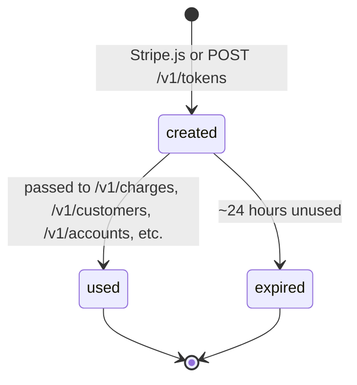
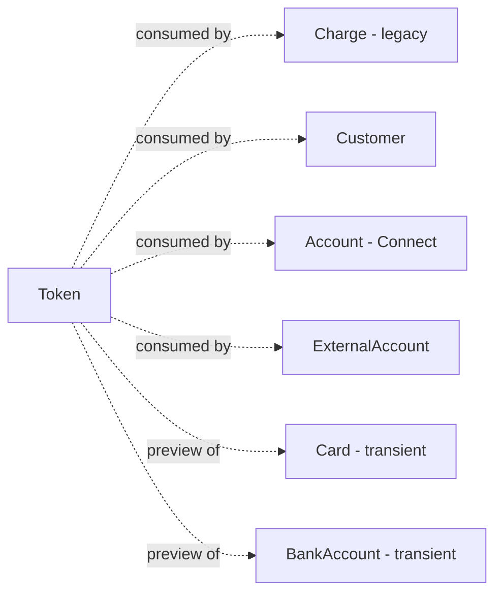

# Token

> API resource: `token` · API version: `2026-04-22.dahlia` · Category: [Core resources](README.md)

## What it is

A `Token` (`tok_…`) is the **legacy single-use representation** of a payment instrument or piece of personally-identifiable information. It's what Stripe used before [PaymentMethod](../02-payment-methods/payment-methods.md) existed: the browser would collect a card number with Stripe.js, POST it to Stripe to get back `tok_…`, then your server would POST that token to `/v1/charges` or attach it to a Customer as the `default_source`.

For payments, **Token has been replaced by PaymentMethod and ConfirmationToken**. New code should not create card or bank-account tokens for charging. The endpoint persists because:

1. **Connect bank-account tokens** (`token.type=bank_account`) are still part of the canonical flow for adding an `external_account` to a connected account when not using Account Links.
2. **Connect account tokens** (`token.type=account`) are how you submit Custom-account TOS acceptance and certain identity attestation server-side.
3. **PII tokens** (`token.type=pii`) carry SSNs / national IDs without your server touching them — used by Connect and Identity flows.
4. **Card tokens** (`token.type=card`) are still occasionally used for Issuing test scenarios and some legacy integrations.

## Why it exists

Originally: keep PAN data out of your servers' PCI scope. The browser POSTs `4242…` to Stripe, gets `tok_…`, your server only ever sees the token. That goal is now served better by PaymentMethod (reusable) and ConfirmationToken (single-use, server-confirm-friendly).

Today, Tokens persist for the cases above where the *thing being tokenized* isn't a payment instrument you'd want to reuse:

- A bank account being attached to a Custom Connect account isn't going to be used to pay anyone — it's a payout destination, and the token is just a one-shot way to hand the routing/account numbers to Stripe without your server holding them.
- An account token's payload (TOS IP/UA, individual identity fields) is meaningless beyond the moment of the API call that consumes it.
- A PII token holds an SSN for *one* `Account` create call — there's no concept of "saving" it for reuse.

## Lifecycle & states

Token has no `status` enum. Lifecycle is creation → single use → done:



What you can read:

- **`used`** — boolean. `true` after the token has been consumed once. Reading the token afterwards still works (it's not deleted), but trying to use it again returns `token_already_used`.
- No event for expiry; tokens just stop working after their TTL (~24 hours, longer than ConfirmationToken because the use cases are slower).

> Tokens are not editable, not deletable via API, and not detachable. They exist, they get consumed, they fade.

## Anatomy of the object

### Identity

| Field | Notes |
|---|---|
| `id` | `tok_…` |
| `object` | `"token"` |
| `type` | `card`, `bank_account`, `pii`, `account`, `cvc_update`. **Discriminator for which subobject is populated.** |
| `created` | Unix seconds. |
| `livemode` | Standard. |
| `used` | Boolean. `true` after first consumption. |
| `client_ip` | IP that created the token (Stripe.js fills automatically). Useful for fraud audit. |

### Card token (`type: card`)

| Field | Notes |
|---|---|
| `card.id` | `card_…` — a transient Card object exposed inside the token. **Don't store this**; it's gone after consumption. |
| `card.brand`, `.last4`, `.exp_month`, `.exp_year`, `.country`, `.funding` | Standard card fingerprinting fields. |
| `card.fingerprint` | Same fingerprint scheme as PaymentMethod's `card.fingerprint` — canonical "is this the same card?" identifier across tokens, PMs, charges. |
| `card.address_line1_check`, `.address_zip_check`, `.cvc_check` | AVS / CVC check results from token creation. |
| `card.tokenization_method` | `apple_pay`, `google_pay`, `android_pay`, or null. |

### Bank-account token (`type: bank_account`) — still used for Connect external accounts

| Field | Notes |
|---|---|
| `bank_account.id` | `ba_…` — transient. |
| `bank_account.country` | ISO. |
| `bank_account.currency` | ISO. |
| `bank_account.account_holder_name`, `.account_holder_type` | `individual` or `company`. |
| `bank_account.bank_name`, `.last4`, `.routing_number` | Display + scheme metadata. |
| `bank_account.fingerprint` | Same role as card fingerprint. |
| `bank_account.status` | `new`, `validated`, `verified`, `verification_failed`, `errored`. Mostly visible after the token is attached to a Customer/Account. |

### PII token (`type: pii`)

| Field | Notes |
|---|---|
| `pii.id_number` | **Never returned in responses.** You POST it once at creation, Stripe stores hash, and you reference the token by ID forever after. |

### Account token (`type: account`)

| Field | Notes |
|---|---|
| `account.business_type` | `individual` / `company` / `non_profit` / `government_entity`. |
| `account.individual` / `account.company` | Identity payload submitted at create. |
| `account.tos_shown_and_accepted` | Boolean — must be `true`. |

### CVC update token (`type: cvc_update`)

| Field | Notes |
|---|---|
| `cvc_update.id` | Transient. Used in narrow Issuing / step-up auth scenarios. Rarely needed. |

## Relationships



- The `card_…` / `ba_…` IDs *inside* a token are not standalone resources you can retrieve later — they only have meaning while the token is unconsumed.
- A consumed `tok_…` becomes part of the consuming object (a Card on a Customer, an ExternalAccount on a connected Account, a hashed reference on the Account/PII surface).
- Tokens are not Customer-scoped at creation — they're created against a publishable key in a global namespace.

## Common workflows

### 1. Attach a bank account as Connect external account (still current)

Browser:

```js
const { token, error } = await stripe.createToken("bank_account", {
  country: "US",
  currency: "usd",
  routing_number: "110000000",
  account_number: "000123456789",
  account_holder_name: "Jenny Rosen",
  account_holder_type: "individual",
});
```

Server:

```http
POST /v1/accounts/acct_…/external_accounts
  external_account=tok_…
```

The connected account now has a payout destination. The token is consumed; the `ExternalAccount` (`ba_…` on the connected account) is the persistent record.

### 2. Submit Custom Connect account TOS acceptance via account token

```http
POST /v1/tokens
  account[business_type]=individual
  account[individual][first_name]=Jenny
  account[individual][last_name]=Rosen
  account[individual][ssn_last_4]=0000
  account[tos_shown_and_accepted]=true
```

Returns `tok_…`. Then:

```http
POST /v1/accounts/acct_…
  account_token=tok_…
```

Custom-account flows still use this when not driven by Account Links / hosted onboarding.

### 3. PII token for SSN-bearing workflows

```js
const { token } = await stripe.createToken("pii", { personal_id_number: "000-00-0000" });
```

```http
POST /v1/accounts/acct_…/persons/person_…
  id_number=tok_…
```

Your server never holds the SSN.

### 4. Legacy: charge a card via token (NOT recommended for new code)

```js
const { token } = await stripe.createToken(cardElement);
// POST tok_… to your server
```

```http
POST /v1/charges
  amount=1999 currency=usd source=tok_…
```

This works but: no SCA, no 3DS handoff, no per-PM-type options, no automatic_payment_methods. **Use [PaymentIntent](payment-intents.md) + [PaymentMethod](../02-payment-methods/payment-methods.md) (or [ConfirmationToken](confirmation-tokens.md)) for any new payments work.**

### 5. Migration path: Token → PaymentMethod

You can convert an existing card-token-attached Customer to PaymentMethod by:

1. Pull the Customer's saved cards from `customer.sources.data` (the legacy list).
2. For each `card_…`, you can attach it directly to a PaymentIntent via `payment_method_data[card][token]=tok_…` *only at fresh token creation time* — not retroactively against the saved `card_…`. Old saved cards stay readable as `source` objects but new ones should never be created.
3. Going forward, switch the entire integration to Elements + PaymentIntent. Old `default_source` cards keep working until the customer next updates their PM.

There is **no** API to convert a saved `card_…` into a `pm_…` directly. The migration is forward-looking: new saves use PaymentMethod, old ones live out their natural life.

### 6. Inspect a token

```http
GET /v1/tokens/tok_…
```

Read `used`, `card.last4`, etc. Useful for debugging.

## Webhook events

**None.** Tokens have no events of their own. Their consumption surfaces on whatever object consumed them:

| You want | Webhook to listen for |
|---|---|
| Token used to add external account | `account.external_account.created` |
| Token used to update Connect account | `account.updated` |
| Token used in a legacy charge | `charge.succeeded` / `charge.failed` |

This is intentional: a token is plumbing, not a domain object worth subscribing to.

## Idempotency, retries & race conditions

- `POST /v1/tokens` accepts an `Idempotency-Key`. Worth using for server-side token creation (Connect bank-account, account, PII tokens) to avoid duplicate `ba_…` external accounts on retry.
- Stripe.js token creation in the browser is one-shot — there's nothing to deduplicate.
- A token consumed on the *first* call but the response lost in transit is still consumed. Retrying without an idempotency key on the *consuming* call (e.g. `POST /v1/accounts/.../external_accounts`) will fail with `token_already_used`. Always idempotency-key the consumer call.
- Token creation latency can be ~500ms-1s for bank-account tokens that hit network validation. Don't gate UI on it for credit-card flows; users will think it's broken.

## Test-mode tips

- Card numbers same as everywhere: `4242 4242 4242 4242`, `4000 0000 0000 9995` (decline-after-attach), etc. Stripe.js test mode produces real-looking `tok_…` IDs.
- Bank account: routing `110000000` + account `000123456789` produces a token whose `bank_account.status` becomes `verified` automatically when used on a US connected account.
- For Connect account-token testing, every test field accepts dummy data — `tos_shown_and_accepted=true`, `ssn_last_4=0000`, `dob=1901-01-01`.
- `stripe trigger` has no `tok_…` triggers — generate by running real Stripe.js or via the CLI: `stripe tokens create --card[number]=4242424242424242 --card[exp_month]=12 --card[exp_year]=2030 --card[cvc]=123`.

## Connect considerations

- **Bank-account tokens** are the canonical way to add an `external_account` to a Custom or Express connected account when not using Account Links / hosted onboarding. Without account-token / Financial Connections, this is the route.
- **Account tokens** consolidate the entire `legal_entity` / `tos_acceptance` payload server-side. The token is consumed by `POST /v1/accounts/acct_…` with `account_token=tok_…`. The IP/UA captured at token creation become the authoritative TOS-acceptance record — Stripe will use this if the connected account ever disputes accepting their TOS.
- **PII tokens** are required to set `Person.id_number` server-side without holding the raw SSN — your servers stay out of PCI/SSN scope.
- Tokens created against the platform's publishable key can be consumed on a connected account if you set `Stripe-Account: acct_…` on the consume call. The created card/bank account then lives on the connected account.
- For `card_…` Tokens used in Issuing test scenarios, the token gets exchanged into an Issuing.Card via the Issuing test fixtures — uncommon outside that context.

## Common pitfalls

- **Using `tok_…` for new card-payment integrations.** No SCA, no 3DS handoff, no `automatic_payment_methods`. You'll fail EU traffic. Use [PaymentIntent](payment-intents.md) + [ConfirmationToken](confirmation-tokens.md).
- **Storing `card.id` (`card_…`) from inside a token.** It's transient; not retrievable as a standalone resource. Only the consuming Customer's resulting `Card` is persistent.
- **Re-using a token.** Single-use. Second consumption returns `token_already_used`. There is no way to "unconsume."
- **Confusing Token (`tok_…`) with [ConfirmationToken](confirmation-tokens.md) (`ctoken_…`).** Different resource, different purpose, different generation. Token is legacy; ConfirmationToken is the modern server-confirm handle.
- **Forgetting that a bank-account token has a separate verification lifecycle.** The token itself is `validated` at creation if format is right; the underlying bank account on a Custom connected account may still need micro-deposit or instant verification afterward, surfaced via the ExternalAccount, not the token.
- **Trying to charge an `account` or `pii` token.** Type discriminator matters; `/v1/charges?source=tok_<account>` errors. Token type must match consumer.
- **Generating account tokens server-side without a real customer-attestation moment.** The whole point of the IP/UA in `tos_shown_and_accepted` is to prove a real human at a real address agreed. Generating from your backend with your server's IP defeats the purpose and weakens your defense in TOS disputes.
- **Treating Token as PCI-shifting magic for arbitrary integrations.** It only shifts PCI scope when *Stripe.js* creates the token in the browser. Sending `card[number]=` from your server through `POST /v1/tokens` puts you back in scope.

## Further reading

- [API reference: Token](https://docs.stripe.com/api/tokens/object)
- [Connect external accounts via bank-account tokens](https://docs.stripe.com/connect/bank-debit-card-payouts)
- [Connect account tokens](https://docs.stripe.com/connect/account-tokens)
- [Migrating from Sources to PaymentMethods](https://docs.stripe.com/payments/payment-methods/transitioning)
- Modern replacements: [PaymentMethod](../02-payment-methods/payment-methods.md), [ConfirmationToken](confirmation-tokens.md), [SetupIntent](setup-intents.md), [PaymentIntent](payment-intents.md).
