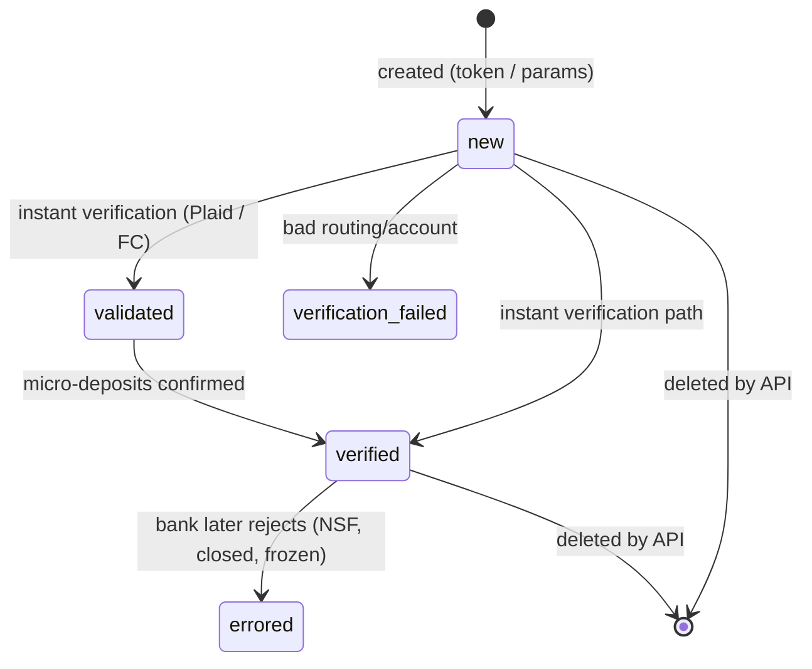
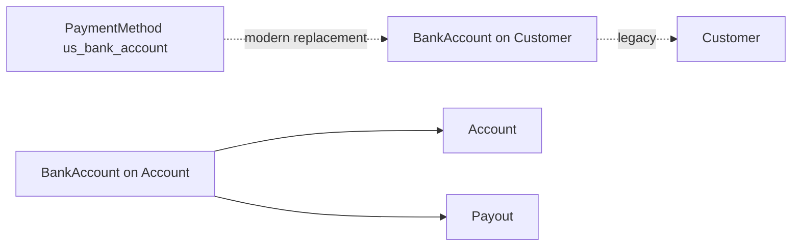

# BankAccount

> API resource: `bank_account` · API version: `2026-04-22.dahlia` · Category: [Payment methods](README.md)

## What it is

`BankAccount` is a **legacy** sub-resource representing a bank account record stored on either a Customer (as a *Source* — old ACH-debit world) or on a Connect Account (as an *ExternalAccount* — current payouts world). It pre-dates the modern [PaymentMethod](payment-methods.md) abstraction and survives in two distinct, non-equivalent roles:

1. **Customer-attached bank account** (`customer.sources` collection). Used by old ACH-debit code paths before `PaymentMethod.type=us_bank_account` existed. Largely deprecated for new payment code.
2. **Connect-account ExternalAccount** (`account.external_accounts` collection). Still current and load-bearing — this is where Stripe sends Payouts on behalf of a connected account. See [ExternalAccount](../07-connect/external-accounts.md) for the canonical doc on that flow.

Both roles share the same `bank_account` object shape. Field semantics — and which API endpoints accept which params — differ slightly. This guide documents the shape and flags both contexts.

## Why it exists

Two historical jobs, only one of which is still recommended:

- **(Legacy) Charge a customer's bank.** Pre-2019, the way to pull ACH from a US customer was: tokenize the bank account → create a `bank_account` Source on the Customer → verify (micro-deposits or Plaid) → create a Charge against it. **Modern code uses [PaymentMethod](payment-methods.md) with `type=us_bank_account`.**
- **(Current) Pay out to a bank.** When a Connect Account needs a destination for Payouts, Stripe stores the routing/account number as an `external_account` of type `bank_account`. There is no PaymentMethod equivalent for this — payout destinations remain on the legacy `bank_account` shape.

Net: if you're collecting money *from* a bank, use PaymentMethod. If you're sending money *to* a bank (Connect payouts), you're still on `bank_account`.

## Lifecycle & states



Field: `status`. Values:

- **`new`** — created but not yet validated by any path. Cannot be charged (Customer context) or used for Payouts (Account context) yet.
- **`validated`** — Stripe has confirmed routing/account format and ownership-of-bank, but micro-deposits haven't been confirmed. Customer context.
- **`verified`** — Fully usable. Customer can be debited; Account can receive payouts.
- **`verification_failed`** — Format/ownership check failed. Re-create with corrected data.
- **`errored`** — Was verified, then a real-world transaction (debit attempt or payout) was rejected by the bank. Common causes: account closed, name mismatch, frozen account. Verify out-of-band, then create a new bank_account.

The Customer context relies more heavily on `validated → verified` (micro-deposit flow). The Account context typically goes straight to `new → verified` once the platform attests onboarding completion (and may transition to `errored` later if a payout bounces).

## Anatomy of the object

### Identity

| Field | Notes |
|---|---|
| `id` | `ba_…` |
| `object` | `bank_account` |
| `customer` | `cus_…` if attached to a Customer; null on ExternalAccount usage. |
| `account` | `acct_…` if attached to a Connect Account; null on Customer usage. |
| `metadata` | standard. |

### Bank details

| Field | Notes |
|---|---|
| `country` | ISO-3166 alpha-2. Determines what `routing_number` format means. |
| `currency` | Currency the account holds / receives payouts in. |
| `routing_number` | US ABA, UK sort code, etc. Format depends on `country`. |
| `last4` | Last 4 of account number. Account number itself is never returned after creation. |
| `bank_name` | Best-effort lookup from routing number. |
| `fingerprint` | Stable hash of (routing+account); use to detect duplicates across customers. |
| `account_holder_name` | The name on the account. |
| `account_holder_type` | `individual` or `company`. Drives KYC obligations. |

### Status

| Field | Notes |
|---|---|
| `status` | `new`, `validated`, `verified`, `verification_failed`, `errored`. See lifecycle. |
| `available_payout_methods` | Array of payout methods available — typically `["standard"]` or `["standard", "instant"]` if the bank participates in same-day rails. **Account context only.** |
| `default_for_currency` | Whether this is the default payout destination for `currency` on the Account. |

### Verification

| Field | Notes |
|---|---|
| `requirements.past_due` | Connect-context: fields owed before payouts can resume. |
| `requirements.currently_due` | Same, soft deadline. |

## Relationships



- Customer-context: `bank_account` lives in `customer.sources.data[]`. Deprecated for new code; use [PaymentMethod](payment-methods.md) (`type=us_bank_account`).
- Account-context: lives in `account.external_accounts.data[]`. A [Payout](../01-core-resources/payouts.md) targets one `external_account` (this `bank_account`).
- A FinancialConnections-linked us_bank_account PaymentMethod can be created from the same underlying bank, but the `bank_account` object and the `payment_method` object are separate IDs even when they describe the same real-world account (compare via `fingerprint`).

## Common workflows

### 1. Add a payout bank to a Connect Account (current)

```http
POST /v1/accounts/acct_…/external_accounts
  external_account[object]=bank_account
  external_account[country]=US
  external_account[currency]=usd
  external_account[routing_number]=110000000
  external_account[account_number]=000123456789
  external_account[account_holder_name]=Acme Inc
  external_account[account_holder_type]=company
```

Or pass a pre-tokenized bank account: `external_account=btok_…`.

After creation, set as default:

```http
POST /v1/accounts/acct_…/external_accounts/ba_…
  default_for_currency=true
```

### 2. Verify a Customer's legacy bank account via micro-deposits

(Legacy flow. Prefer `PaymentMethod` + FinancialConnections instead.)

Stripe deposits two small amounts (each < $1.00). Customer reports them; you confirm:

```http
POST /v1/customers/cus_…/sources/ba_…/verify
  amounts[]=32
  amounts[]=45
```

Amounts in the smallest currency unit (cents). Three failed attempts disables verification on this `bank_account` — must create a new one.

### 3. Modern equivalent: collect a bank PaymentMethod with FinancialConnections

```http
POST /v1/payment_intents
  amount=4900 currency=usd
  customer=cus_…
  payment_method_types[]=us_bank_account
  payment_method_options[us_bank_account][verification_method]=automatic
```

Confirm via Stripe.js — Plaid-style flow logs the customer in and returns a verified `pm_…`. Skip BankAccount entirely.

### 4. Delete an external bank account

```http
DELETE /v1/accounts/acct_…/external_accounts/ba_…
```

Cannot delete the only payout destination for an account's settlement currency unless you set another as `default_for_currency=true` first. Pending payouts continue to the deleted bank — they were already in flight.

### 5. Customer-context bank account on legacy `customer.sources` (read-only review)

```http
GET /v1/customers/cus_…/sources?object=bank_account
```

Inspect status, fingerprint. Don't build new charge logic against these — migrate the customer to a `pm_…` on next interaction.

## Webhook events

Customer-context (legacy):

| Event | Fires when |
|---|---|
| `customer.source.created` | A `bank_account` (or other source) added to a Customer. |
| `customer.source.updated` | Status change (`validated` → `verified`, etc.). |
| `customer.source.deleted` | Removed from Customer. |
| `customer.source.expiring` | Card sources only — not bank_account. |

Account-context (current):

| Event | Fires when |
|---|---|
| `account.external_account.created` | New payout destination added. |
| `account.external_account.updated` | Status, default_for_currency, requirements changed. |
| `account.external_account.deleted` | Removed from Account. |

A bounced payout will surface as `payout.failed` on the [Payout](../01-core-resources/payouts.md) and may flip the `bank_account.status` to `errored`.

## Idempotency, retries & race conditions

- `POST` to add an external account accepts `Idempotency-Key`. Use one when scripted onboarding can retry.
- Bank account *tokens* (`btok_…`) are **single-use** — created via Stripe.js or the legacy Tokens API and consumed by attaching to a Customer / Account. Reusing a `btok_…` returns an error.
- Payout vs. delete race: deleting the only `bank_account` for a currency moments before a payout fires can leave the payout in `pending` waiting for a destination — it will fail and need re-issue.
- Micro-deposit verification is rate-limited per-day; spamming verification attempts blocks the bank account.

## Test-mode tips

- US success routing: `110000000`, account `000123456789` → instantly `verified`.
- US verification-required: `110000000`, account `000222222227` → `new`, requires micro-deposit confirmation. Use amounts `32` and `45`.
- US failure: `110000000`, account `000111111116` → `verification_failed`.
- Trigger payout failure on a verified bank: account `000111111113`.
- Full magic-account list: see Stripe testing docs (BSB / IBAN / sort code variants for non-US).
- `stripe trigger payout.failed` simulates the bounce → `errored` transition.

## Connect considerations

- **Standard** accounts: connected account manages their own external accounts via the Stripe Dashboard; you typically don't `POST` external_accounts on their behalf.
- **Express / Custom** accounts: platform creates and manages external_accounts via API. You're responsible for collecting routing/account number and KYC.
- Multi-currency settlement: an Account may have multiple `bank_account`s, one `default_for_currency` per supported settlement currency.
- Cross-border: not all (country, currency) combos are payout-supported; check `account.capabilities` and the [Connect supported countries](https://docs.stripe.com/connect/cross-border-payouts) matrix.
- Instant Payouts require `available_payout_methods` to include `instant`, which depends on the bank participating in instant rails (US RTP / FedNow / debit-card push).

## Common pitfalls

- **Building new charge code against `customer.sources` bank_account.** Use `PaymentMethod.type=us_bank_account` instead. The Sources path is on a deprecation track.
- **Confusing `customer.sources` and `account.external_accounts`.** They share the `bank_account` shape but live in different namespaces and serve opposite money flows (debit vs. payout).
- **Trying to charge an `account.external_account` bank_account.** It's a payout destination, not a debit instrument. The API will reject.
- **Re-using a single-use `btok_…`.** It expires on first attach.
- **Deleting the default external account.** Set another `default_for_currency=true` *before* deleting, or you'll fail the request.
- **Treating `verified` as "the bank will accept all transactions."** Verification proves ownership; the bank can still bounce a debit (NSF) or reject a payout (account closed). Watch `payout.failed` and `charge.failed` on the downstream resources.
- **Trusting `bank_name` for compliance.** It's a best-effort lookup. Don't use it for KYC; rely on the Account's verified business profile.

## Further reading

- [API reference: BankAccount (legacy)](https://docs.stripe.com/api/customer_bank_accounts)
- [API reference: External account — Bank account](https://docs.stripe.com/api/external_account_bank_accounts)
- [Connect: payouts to connected accounts](https://docs.stripe.com/connect/bank-debit-card-payouts)
- Modern alternative: [PaymentMethod](payment-methods.md) (`type=us_bank_account`)
- Sibling: [ExternalAccount](../07-connect/external-accounts.md), [Payout](../01-core-resources/payouts.md)
