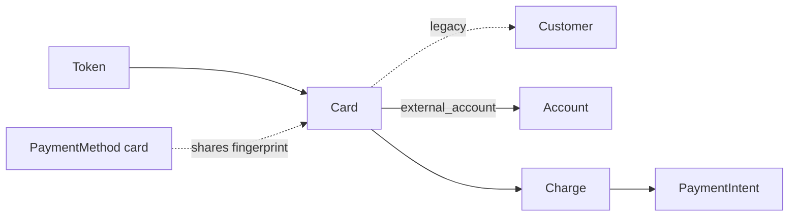

# Card

> API resource: `card` · API version: `2026-04-22.dahlia` · Category: [Payment methods](README.md)

## What it is

`Card` is a **legacy** sub-resource representing a saved card on either a Customer (as a *Source* in `customer.sources`) or on a Connect Account (as an *ExternalAccount* — a debit-card payout destination). It is the pre-2019 forerunner of [PaymentMethod](payment-methods.md) `type=card`.

Three things to internalize:

1. **For new code, never reach for `card`.** Use `PaymentMethod.type=card` instead. The Card resource exists for backward compatibility with legacy integrations and for two specific Connect flows where it remains current.
2. **It still appears under the hood.** When the Tokens API issues a `tok_visa`, Stripe creates a `card` object (you can `expand[]=card` on the Token to see it). When you create a `PaymentMethod` from that token, the underlying card is shared.
3. **It's still load-bearing for two flows**: legacy `customer.sources` for old integrations you haven't migrated, and `account.external_accounts` for debit-card *payouts* (Connect Instant Payouts). The latter has no PaymentMethod equivalent.

## Why it exists

In the original Stripe API (2011–2018), a card was created via `Stripe.js → Token → POST /v1/customers/cus_…/sources` or `POST /v1/charges` directly. Charges, refunds, dispute flow, AVS — everything keyed off a `card_…` ID. PaymentIntent + PaymentMethod (introduced for SCA/3DS/PSD2) replaced this in 2019.

The Card resource survives because:

- Existing integrations have `card_…` IDs in their databases and webhook history.
- The Connect Account ExternalAccount payout flow accepts a debit card (for Instant Payouts) and there is no `payment_method` representation of "this debit card is a *payout destination*."
- Tokens still resolve to underlying Cards.

## Lifecycle & states

Card has no `status` enum. Its meaningful state is whether it's still attached to its parent and whether the issuer has sent updates.

```mermaid
stateDiagram-v2
    [*] --> created: token consumed → card materialized
    created --> attached: living on Customer / Account
    attached --> auto_updated: issuer-pushed change (PAN reissue, exp bump)
    attached --> detached: deleted via API
    attached --> default: set as customer's default_source
    default --> attached: another card set default
    detached --> [*]
```

Implicit "states" you read off other fields:

- **`cvc_check`**: `pass`, `fail`, `unavailable`, `unchecked`. Set at creation, frozen thereafter.
- **`address_line1_check`, `address_zip_check`**: same enum. AVS results from the issuer.
- **`exp_month` / `exp_year` past today**: card is expired. Stripe doesn't auto-detach but charges will fail.
- **`tokenization_method`**: `apple_pay`, `google_pay`, `android_pay`, `masterpass`, `visa_checkout`, `null`. Tells you the card was created via a wallet token (not a raw PAN).

## Anatomy of the object

### Identity

| Field | Notes |
|---|---|
| `id` | `card_…` |
| `object` | `card` |
| `customer` | `cus_…` if attached to a Customer; null otherwise. |
| `account` | `acct_…` if attached as an ExternalAccount on a Connect Account. |
| `metadata` | standard. |

### Card details

| Field | Notes |
|---|---|
| `brand` | `Visa`, `Mastercard`, `American Express`, `Discover`, `Diners Club`, `JCB`, `UnionPay`, `Cartes Bancaires`, `Interac`, `Eftpos Australia`, `Unknown`. Display value (capitalized). |
| `last4` | Last 4 of PAN. |
| `exp_month` | 1–12. |
| `exp_year` | 4-digit. |
| `funding` | `credit`, `debit`, `prepaid`, `unknown`. Drives some routing/fees. |
| `country` | Card issuer country, ISO-3166. |
| `currency` | Currency the card supports (relevant for Account ExternalAccount only — payout destination currency). |
| `fingerprint` | Stable hash of card number; same card across tokens/customers gets the same fingerprint. **Use for "is this the same card as before?"** |
| `dynamic_last4` | Wallet/device-account number's last 4 (Apple Pay tokens have a different real PAN behind them). |

### Verification results (frozen at create)

| Field | Notes |
|---|---|
| `cvc_check` | `pass`, `fail`, `unavailable`, `unchecked`. |
| `address_line1_check` | Same enum. AVS street match. |
| `address_zip_check` | Same enum. AVS ZIP match. |

### Wallet & tokenization

| Field | Notes |
|---|---|
| `tokenization_method` | `apple_pay`, `google_pay`, `android_pay`, `masterpass`, `visa_checkout`, or null. |
| `wallet` | Sub-object with wallet-type details when applicable. (Modern code reads this off the PaymentMethod card sub-object instead.) |

### Cardholder

| Field | Notes |
|---|---|
| `name` | Cardholder name as entered. |
| `address_line1`, `address_line2`, `address_city`, `address_state`, `address_zip`, `address_country` | Billing address fields. |

### Account-context only (payout destination)

| Field | Notes |
|---|---|
| `default_for_currency` | If true, payouts in `currency` go to this card by default. |
| `available_payout_methods` | Typically `["standard", "instant"]` if eligible. |

## Relationships



- A Token (`tok_…`) creates a Card under the hood; the same physical card created via PaymentMethod produces a separate `pm_…` with its own `card.fingerprint` (the fingerprint matches the legacy Card's).
- Customer-context: `card` lives in `customer.sources.data[]`. Modern code reads PMs from `GET /v1/payment_methods?customer=…&type=card`.
- Account-context: `card` lives in `account.external_accounts.data[]` as a debit-card payout destination.
- A historic Charge created against a Card sets `charge.payment_method_details.card.…` and references the Card via the Source pathway.

## Common workflows

### 1. Migrate a legacy customer Card to a PaymentMethod

You usually don't need to migrate proactively — Stripe will continue accepting Charges against legacy Cards. But to bring a customer onto modern flows:

- Next time the customer transacts, present the Payment Element with `setup_future_usage=off_session`.
- They re-enter (or pick from saved) their card; Stripe creates `pm_…`.
- Compare `pm.card.fingerprint` to `card.fingerprint` to detect "same physical card already on file."
- Optionally delete the old `card_…` from `customer.sources` once the new PM is attached.

### 2. Add a debit card as a payout destination on a Connect Account

```http
POST /v1/accounts/acct_…/external_accounts
  external_account[object]=card
  external_account[number]=4000056655665556
  external_account[exp_month]=12
  external_account[exp_year]=2030
  external_account[cvc]=123
  external_account[currency]=usd
```

Or pass a tokenized debit card: `external_account=tok_visa_debit`. Set as default for currency:

```http
POST /v1/accounts/acct_…/external_accounts/card_…
  default_for_currency=true
```

This enables Instant Payouts to that card (when `available_payout_methods` includes `instant`).

### 3. Read a Card behind a Token

```http
GET /v1/tokens/tok_…?expand[]=card
```

Inspect `token.card.fingerprint`, brand, last4, etc. Useful for fraud screens before consuming the token.

### 4. Delete a card

Customer context (legacy):
```http
DELETE /v1/customers/cus_…/sources/card_…
```

Account context:
```http
DELETE /v1/accounts/acct_…/external_accounts/card_…
```

You cannot delete the *only* default-for-currency card; promote another first.

### 5. Update billing address / metadata

```http
POST /v1/customers/cus_…/sources/card_…
  address_zip=94103
  metadata[nickname]=Personal
```

You **cannot** change PAN, expiry, or CVC — to update those, customer must add a new card.

## Webhook events

Customer-context (legacy):

| Event | Fires when |
|---|---|
| `customer.source.created` | Card added. |
| `customer.source.updated` | Brand/last4/exp changed by the issuer auto-updater. |
| `customer.source.deleted` | Removed. |
| `customer.source.expiring` | A month before `exp_month/year`. Email customer to update. |

Account-context (current):

| Event | Fires when |
|---|---|
| `account.external_account.created` | Card added as payout destination. |
| `account.external_account.updated` | Default change, status change. |
| `account.external_account.deleted` | Removed. |

For modern PaymentMethod cards, listen on `payment_method.*` instead — see [PaymentMethod](payment-methods.md).

## Idempotency, retries & race conditions

- Tokens (`tok_…`) are single-use; consuming twice errors. Don't retry attach with the same token — generate a new one.
- `POST` add-card / add-external-account accepts `Idempotency-Key`. Use one in onboarding scripts.
- Stripe's card-account-updater service can update `last4`, `exp_month`, `exp_year`, and even `brand` (rare reissue) without your action. Always read the latest card fields before displaying "card on file."
- Race: customer deletes a card from your UI while an off-session Charge is in flight against it → Charge succeeds (already authorized), card_deleted webhook fires after.

## Test-mode tips

- Magic PANs (same set as PaymentMethod cards):
  - `4242424242424242` — generic success.
  - `4000000000000002` — `card_declined`.
  - `4000000000009995` — insufficient funds.
  - `4000000000000069` — expired card.
  - `4000000000000127` — incorrect CVC.
- Debit-card payout testing:
  - `4000056655665556` — Visa debit, instant-payout eligible.
  - `5200828282828210` — Mastercard debit.
- AVS:
  - `address_zip` `94103` returns `pass`; `99999` returns `fail`; omitted returns `unchecked`.
- `stripe tokens create card` from CLI generates `tok_…` for scripting.

## Connect considerations

- **External account debit-card payout** is the *primary* current use of the Card resource. PaymentMethod doesn't represent payout-destination cards.
- Eligibility for Instant Payouts depends on the card network supporting push-to-card and the connected account being enabled. Check `available_payout_methods` for `"instant"`.
- Cross-border: a card external_account's `currency` must match a settlement currency Stripe supports for the account's country.
- Standard accounts manage external_accounts via Dashboard; Express/Custom: platform manages via API.
- Cards as payment instruments on connected accounts (via direct charges) flow through PaymentMethod, not Card — same advice as the platform path.

## Common pitfalls

- **Building new charge code against `customer.sources` cards.** Use `PaymentMethod` + `PaymentIntent`. The Sources/Card path predates SCA and won't trigger 3DS in many EU contexts → declines.
- **Mistaking a Token for a Card.** A Token is single-use; the Card it materializes is the persistent resource. Store `card.id`, not `tok_…`.
- **Comparing `last4`+`brand` to detect the same card.** Use `fingerprint`. Different physical cards from the same issuer can share `last4`.
- **Treating `dynamic_last4` as the real PAN.** Apple Pay / Google Pay tokens have a device-account-number; `dynamic_last4` is its last 4. The funding card's true `last4` is in `last4`. Display whichever the customer recognizes.
- **Expecting `payment_method.automatically_updated` events on legacy Cards.** That event is for `pm_…`. Legacy Cards fire `customer.source.updated` instead.
- **Deleting the only default-for-currency external card.** Will reject; promote another first.
- **Forgetting to handle `Cartes Bancaires` co-badging on French cards.** Card co-badging surfaces on PaymentMethod's `card.networks`, not on the legacy Card's primary `brand`. Old code reading only `brand` will miss CB routing.

## Further reading

- [API reference: Card (legacy)](https://docs.stripe.com/api/cards/object)
- [API reference: External account — Card](https://docs.stripe.com/api/external_account_cards)
- [Migrating from Charges to PaymentIntents](https://docs.stripe.com/payments/payment-intents/migration)
- Modern equivalent: [PaymentMethod](payment-methods.md) (`type=card`)
- Sibling: [Token](../01-core-resources/tokens.md), [ExternalAccount](../07-connect/external-accounts.md), [Source](sources.md)
