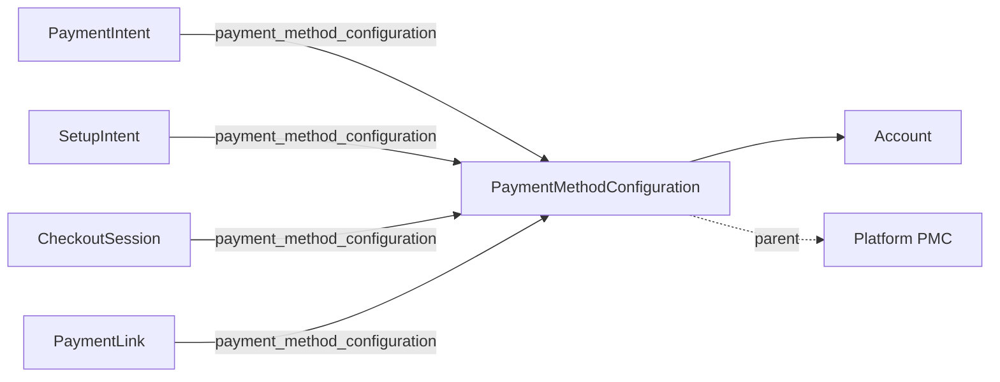

# PaymentMethodConfiguration

> API resource: `payment_method_configuration` · API version: `2026-04-22.dahlia` · Category: [Payment methods](README.md)

## What it is

A `PaymentMethodConfiguration` (PMC) is a named, persisted bundle of payment-method types you offer at checkout — card, link, klarna, afterpay_clearpay, apple_pay, google_pay, ideal, sepa_debit, bancontact, p24, eps, etc. — each with its own *display preference* (`on`, `off`, `on_with_fee`) and per-method config object.

Instead of hard-coding `payment_method_types: ['card', 'klarna', 'ideal']` on every PaymentIntent, Checkout Session, or SetupIntent, you reference one PMC: `payment_method_configuration: 'pmc_123…'`. The PMC is the single source of truth for "which PMs do we offer here, in what order, with what surcharge story?"

PMCs are managed in the Dashboard under **Settings → Payment methods**. Most teams never `POST` one directly — they configure in Dashboard and only ever pass the ID.

## Why it exists

Without PMCs you have two bad choices:

1. **Hard-code `payment_method_types`** in every code path. To add Klarna, you ship code. To A/B test removing AfterPay, you ship code. Marketing has no autonomy.
2. **Use `automatic_payment_methods[enabled]=true`** and let Stripe pick from your account-level Dashboard settings. Convenient, but you only get one global set; can't differ by surface (web vs in-app), brand, geography, or experiment.

PMC threads the needle: configure many bundles in Dashboard (one per surface/brand/region/experiment), reference by ID at runtime. Non-engineers can flip PMs on/off without a deploy.

## Lifecycle & states

PMC has no `status` enum. Its meaningful state is `active` (boolean) and `is_default` (boolean), plus per-PM-type `display_preference.preference` and computed `display_preference.value`.

```mermaid
stateDiagram-v2
    [*] --> active: create
    active --> archived: active=false (update)
    archived --> active: active=true (update)
    active --> default: set is_default=true
    default --> active: another PMC marked default
    active --> [*]: archived & unused
```

- A PMC can never be hard-deleted via API; you set `active=false` to take it out of rotation.
- Exactly one PMC per (account, parent) tuple is `is_default=true` at any moment. Marking another default flips the previous one.
- Each PM-type entry has `display_preference.preference` ∈ `on | off | on_with_fee` (your stated wish) and `display_preference.value` ∈ `on | off` (Stripe's effective decision after capability checks, country eligibility, etc.). They can differ — e.g. you said `on` for `klarna` but the connected account isn't Klarna-eligible, so `value` resolves to `off`.

## Anatomy of the object

### Identity

| Field | Notes |
|---|---|
| `id` | `pmc_…` |
| `object` | `payment_method_configuration` |
| `name` | Human label, e.g. `"Web checkout — EU"`. |
| `active` | Boolean. `false` = archived. |
| `is_default` | Whether this is the account's default PMC for unspecified flows. |
| `livemode` | standard. |
| `application` | If installed by a Stripe App, the `ca_…` ID. |

### Parent (Connect)

| Field | Notes |
|---|---|
| `parent` | `pmc_…` of the platform's PMC this connected-account PMC inherits from, or `null`. Connected accounts can either inherit or override per PM type. |

### Per-PM-type entries

Each supported PM is a top-level field on the object — it is *not* a generic map. Common ones:

`card`, `link`, `klarna`, `afterpay_clearpay`, `affirm`, `apple_pay`, `google_pay`, `apple_pay_later`, `amazon_pay`, `cashapp`, `revolut_pay`, `paypal`, `ideal`, `sepa_debit`, `bancontact`, `bacs_debit`, `au_becs_debit`, `acss_debit`, `us_bank_account`, `eps`, `giropay`, `p24`, `sofort`, `multibanco`, `oxxo`, `boleto`, `pix`, `wechat_pay`, `alipay`, `grabpay`, `fpx`, `konbini`, `mobilepay`, `paynow`, `promptpay`, `twint`, `zip`, `blik`, `swish`, `customer_balance`, `card_present`, …

Every entry has the same shape:

```json
{
  "display_preference": {
    "overridable": true,
    "preference": "on",
    "value": "on"
  }
}
```

Some entries also carry per-method sub-config — e.g. `klarna.preference` historic field, BNPL min/max amounts, `card.installments` toggle (where applicable). Hedge: per-method extension fields vary by version and PM; check the API ref before depending on one.

### Ordering

The object does not expose an explicit `order` array. Ordering presented to the customer is computed by Stripe from preference + customer locale + currency + amount + your Dashboard drag-and-drop. If you need precise ordering for a single intent, fall back to `payment_method_types: [...]`.

## Relationships



- A PMC belongs to exactly one account (platform or connected).
- A `parent` PMC (Connect platforms only) seeds defaults for child PMCs created on connected accounts.
- A PI / SI / Checkout Session / Payment Link can reference at most one PMC. The chosen PMC ID surfaces back as `payment_method_configuration_details.id` on the PI.

## Common workflows

### 1. Create a PMC (rare; usually done in Dashboard)

```http
POST /v1/payment_method_configurations
  name="Web checkout — EU"
  card[display_preference][preference]=on
  link[display_preference][preference]=on
  klarna[display_preference][preference]=on
  ideal[display_preference][preference]=on
  bancontact[display_preference][preference]=on
  apple_pay[display_preference][preference]=on
  google_pay[display_preference][preference]=on
```

Response: `pmc_…`. Add it to your config store.

### 2. Use a PMC on a PaymentIntent

```http
POST /v1/payment_intents
  amount=4999 currency=eur
  customer=cus_…
  payment_method_configuration=pmc_…
  automatic_payment_methods[enabled]=true
```

You may pass `automatic_payment_methods[enabled]=true` *with* a PMC; the PMC narrows what `automatic_payment_methods` selects from. **Don't** pass `payment_method_types` alongside `payment_method_configuration` — see pitfalls.

### 3. Toggle a PM off without deploying

```http
POST /v1/payment_method_configurations/pmc_…
  klarna[display_preference][preference]=off
```

Effective immediately on the next PI you create against this PMC. Already-confirmed PIs are unaffected.

### 4. Make a PMC the default

```http
POST /v1/payment_method_configurations/pmc_…
  is_default=true
```

Other flows that *don't* explicitly pass a `payment_method_configuration` and use `automatic_payment_methods` will draw from this PMC.

### 5. Connect: platform PMC + connected-account override

Platform creates a parent PMC and sets it as the platform default. Connected accounts inherit it automatically. To override on one connected account:

```http
POST /v1/payment_method_configurations
  parent=pmc_platform_…
  klarna[display_preference][preference]=off
Stripe-Account: acct_…
```

The child PMC inherits everything from the parent, except the fields you set. Future changes to the parent's *un-overridden* fields still propagate.

### 6. Archive a PMC

```http
POST /v1/payment_method_configurations/pmc_…
  active=false
```

PIs created with the archived PMC continue to work; the PMC just doesn't surface in Dashboard pickers and won't be picked as default.

## Webhook events

PMC currently does **not** emit dedicated `payment_method_configuration.*` events in the public catalog. Changes are visible via:

| Signal | Where to read it |
|---|---|
| `account.updated` | Capability changes on a connected account that affect what `display_preference.value` resolves to. |
| Audit log (Dashboard) | Manual edits to PMCs. |
| `payment_intent.created` payload | `payment_method_configuration_details.id` and `parent` show which PMC governed a given intent. |

If you need to react to PMC changes programmatically, poll `GET /v1/payment_method_configurations` or treat your IaC / Dashboard as source of truth.

## Idempotency, retries & race conditions

- `POST /v1/payment_method_configurations` accepts `Idempotency-Key`. Use one if you create PMCs from automation.
- Updates are last-write-wins; there's no version/etag. Two concurrent admins can clobber each other's PM toggles silently.
- `display_preference.value` is recomputed at PI-create time, not at PMC-update time. Flipping a PM `on` doesn't retroactively make in-flight PIs offer it.

## Test-mode tips

- PMCs created in test mode are independent from live PMCs (different `pmc_…` IDs). Mirror them via your IaC / config script.
- `stripe payment_method_configurations create --name "Test PMC"` from the CLI works.
- To verify what a PI actually offered, retrieve it after creation and inspect `payment_method_configuration_details` and the resolved `payment_method_types[]`.

## Connect considerations

- **Platform PMCs** live on the platform account (no `Stripe-Account` header). They serve as `parent` for connected-account PMCs.
- **Connected-account PMCs** (`Stripe-Account: acct_…`) can either be standalone or inherit from a platform `parent`. With `parent` set, the platform can edit the parent and changes propagate to all children that didn't override the field.
- A connected account's *capability* gates `display_preference.value`. A PM that's `preference: on` but the account isn't enabled for resolves to `value: off` silently — listen on `account.updated` and re-check if you depend on a specific PM rendering.
- Express and Custom accounts inherit the platform's default PMC unless you create one for them.

## Common pitfalls

- **Passing both `payment_method_types[]` and `payment_method_configuration` on the same intent.** They conflict — `payment_method_types` wins and the PMC is ignored, often silently. Pick one.
- **Expecting `display_preference.preference` to be the customer-facing truth.** Read `display_preference.value` for the effective state; `preference` is your *wish*.
- **Editing the platform PMC and expecting overridden child fields to update.** They don't — overrides on the child shadow the parent permanently for those fields. Reset by `POST`ing the child without the override.
- **Ordering surprises.** PMC doesn't guarantee an explicit display order. If your designer demands "card always first, then Klarna," confirm in Element previews per locale; or use `payment_method_types` for absolute control.
- **Archiving a PMC referenced by Payment Links.** The Payment Link keeps working but new PMs added to your active PMC won't appear there. Recreate the Payment Link against the active PMC.
- **Setting `is_default` on a connected-account PMC and assuming new connected accounts inherit.** They inherit the *platform* default, not a sibling-account default.

## Further reading

- [API reference: PaymentMethodConfiguration](https://docs.stripe.com/api/payment_method_configurations/object)
- [Payment method configurations guide](https://docs.stripe.com/payments/payment-method-configurations)
- [Connect: managing payment methods on connected accounts](https://docs.stripe.com/connect/payment-method-configurations)
- Sibling: [PaymentMethod](payment-methods.md), [PaymentMethodDomain](payment-method-domains.md)
