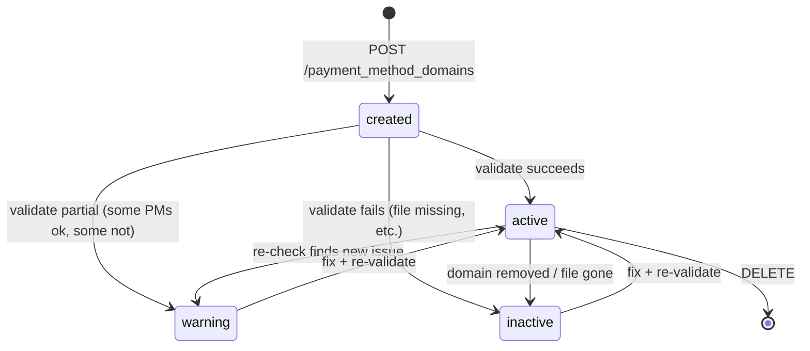
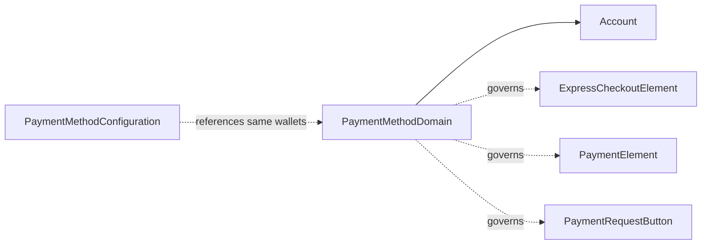

# PaymentMethodDomain

> API resource: `payment_method_domain` · API version: `2026-04-22.dahlia` · Category: [Payment methods](README.md)

## What it is

A `PaymentMethodDomain` (PMD) is a registered web domain (`example.com`, `checkout.example.com`) on which Stripe is allowed to render wallet/express payment buttons: **Apple Pay**, **Google Pay**, **Link**, and **Amazon Pay**. Each registered domain stores a per-PM `enabled` flag plus a `status` (`active`, `inactive`, `warning`) and `status_details` explaining why a wallet is or isn't currently rendering.

For Apple Pay specifically, registration involves a *domain verification file* you must serve at `https://<domain>/.well-known/apple-developer-merchantid-domain-association`. Stripe fetches it during `validate` and on a periodic re-check. Analogous (Stripe-managed, no file) checks back the other wallets.

**Required** before Apple Pay / Google Pay / Link / Amazon Pay buttons render in the Payment Element, Express Checkout Element, or Payment Request Button on a given domain in production. Without a registered, validated PMD, those wallets silently disappear from the Element.

## Why it exists

Apple Pay's protocol requires that the merchant prove control of the originating domain. Stripe used to handle this purely through the Dashboard ("Payment method domains" page). Surfacing it as a first-class API resource lets:

- Platforms (Connect) register many connected-account domains programmatically.
- IaC / multi-environment teams version-control domain registrations.
- Apps that ship checkout to many tenant subdomains automate the registration + validation loop.

Without a PMD record, Stripe.js can't legally render the Apple Pay sheet on the page.

## Lifecycle & states



The top-level `PaymentMethodDomain.enabled` is **your** wish. Each per-PM block (`apple_pay.status`, `google_pay.status`, `link.status`, `amazon_pay.status`) is **Stripe's** verdict. They can disagree — you can have `enabled: true` overall but `apple_pay.status: warning` because the verification file is wrong.

Per-PM `status` values:

- **`active`** — wallet renders on this domain.
- **`inactive`** — wallet does not render. `status_details.error_message` explains why.
- **`warning`** — wallet currently renders but a problem will block it soon (e.g. file is wrong but cached; certificate expiring). Fix promptly.

## Anatomy of the object

### Identity

| Field | Notes |
|---|---|
| `id` | `pmd_…` |
| `object` | `payment_method_domain` |
| `domain_name` | The bare host, e.g. `checkout.example.com`. No scheme, no path. |
| `enabled` | Your master toggle. `false` disables the PMD without deleting it. |
| `livemode` | standard. |
| `created` | unix seconds. |

### Per-PM blocks

Each of these is a sub-object with the same shape:

| Field | Sub-fields |
|---|---|
| `apple_pay` | `status`, `status_details.error_message` |
| `google_pay` | `status`, `status_details.error_message` |
| `link` | `status`, `status_details.error_message` |
| `amazon_pay` | `status`, `status_details.error_message` |

`status_details.error_message` is a human-readable string when status is `inactive` or `warning` — e.g. `"Apple Pay domain association file not found at /.well-known/apple-developer-merchantid-domain-association"`. Surface verbatim in admin UIs.

> Hedge: additional wallet entries may appear in future API versions as Stripe enables more domain-bound express PMs. Read defensively — don't assume only these four keys.

## Relationships



- A PMD belongs to exactly one account.
- It does not point to a [PaymentMethodConfiguration](payment-method-configurations.md), but the two interact: enabling `apple_pay` in your PMC has no visual effect on a domain whose PMD says `apple_pay.status: inactive`.

## Common workflows

### 1. Register a new domain

```http
POST /v1/payment_method_domains
  domain_name=checkout.example.com
  enabled=true
```

Response: `pmd_…` with all per-PM blocks set to `inactive` and a `status_details.error_message` per PM (typically: file not found, since you haven't deployed it yet).

### 2. Serve the Apple Pay verification file

Stripe expects:

```
GET https://checkout.example.com/.well-known/apple-developer-merchantid-domain-association
```

returns a 200 with the file contents (Stripe-provided; download from the Dashboard or fetch via the [`/v1/apple_pay/domains`](https://docs.stripe.com/api/apple_pay_domains) legacy endpoint, or use the canonical file Stripe documents). MIME type is irrelevant; the body must match.

Common gotchas: middleware that rewrites `.well-known/*` to a SPA index, CDN strips the file, redirect to `www`, or your reverse proxy enforces auth on `/`. Curl the URL from a public network and confirm a 200.

### 3. Trigger validation

```http
POST /v1/payment_method_domains/pmd_…/validate
```

Stripe re-fetches your file (Apple Pay) and re-checks the other PMs. Response is the updated PMD with new `status` per PM. Call after every deploy that touches the verification file or your edge config.

### 4. Disable a domain temporarily

```http
POST /v1/payment_method_domains/pmd_…
  enabled=false
```

Wallets stop rendering on that domain. Stripe doesn't delete the PMD; flip `enabled=true` to restore.

### 5. Connect: platform registers per-merchant subdomains

```http
POST /v1/payment_method_domains
  domain_name=acme.platform.example.com
Stripe-Account: acct_…
```

The PMD lives on the connected account. The platform-hosted Express/Checkout flow then renders Apple Pay for `acme.platform.example.com`. If your platform serves checkout from your *own* domain on behalf of merchants, register your domain on the *platform* account once and merchants inherit (Express/Checkout uses platform's domain registration).

### 6. List & inspect

```http
GET /v1/payment_method_domains?domain_name=checkout.example.com
```

Useful in CI to assert a domain is `enabled: true` and `apple_pay.status: active` before promoting a deploy.

## Webhook events

PMD does not emit dedicated webhook events in the public catalog. Validation status changes are observable only by polling `GET /v1/payment_method_domains/pmd_…` or by re-running `validate`. If you need active alerting (e.g. Apple Pay broke after a CDN change), schedule a periodic `validate` call from your monitoring system and alarm on non-`active` statuses.

> Hedge: Stripe occasionally adds new event families; check the [event catalog](../_meta/webhook-catalog.md) for `payment_method_domain.*` before assuming none exist for your API version.

## Idempotency, retries & race conditions

- `POST /v1/payment_method_domains` is idempotent on `domain_name` per account — re-creating returns the existing PMD with a 200.
- `validate` has no idempotency concept; calling it twice re-runs the check. Safe but wasteful.
- After a successful `validate`, Stripe's edge cache for "is this domain allowed to render Apple Pay?" can take seconds to propagate to all data centers. If a fresh deploy doesn't immediately render the button, retry after 30s before debugging.
- Stripe re-validates registered domains on its own schedule; a domain can transition `active → warning` without any action from you when an underlying issue is detected.

## Test-mode tips

- Test-mode PMDs are independent from live; you must register the same domain twice (one per mode).
- `localhost` and IP addresses **cannot** be registered. For local dev of Apple Pay UX, use Stripe's hosted Checkout in test mode (Stripe handles the domain) or tunnel via ngrok / Cloudflare Tunnel and register the public hostname.
- The [Stripe CLI](https://docs.stripe.com/stripe-cli) doesn't have a dedicated trigger for PMD; use `stripe payment_method_domains create --domain-name=…`.
- Apple Pay wallet won't render in non-Safari browsers regardless of PMD status — that's the wallet, not Stripe.

## Connect considerations

- **Platform-owned checkout pages** (you host Checkout / Element on a domain you control, charging on behalf of connected accounts): register on the *platform* account once. Connected accounts inherit through your origin.
- **Connected-account-owned domains** (each merchant has their own subdomain or vanity domain): register a PMD per merchant on their connected account (`Stripe-Account` header). Automate this in your onboarding flow and call `validate` after the merchant deploys their site.
- Express accounts get Stripe-hosted Express Dashboard automatically; no PMD needed for Stripe-hosted surfaces.
- Custom accounts: you're fully responsible for serving the verification file on every domain you ship.

## Common pitfalls

- **Skipping `validate` after registration.** `POST /v1/payment_method_domains` doesn't trigger a fetch by itself in all cases; explicitly call `validate`.
- **Serving the verification file with a redirect or 401.** Apple's protocol requires a direct 200. CDN auth, www-canonicalization, and SPA fallback routes all silently break it.
- **Registering `https://example.com/`** instead of `example.com`. The field is bare host. The API will reject schemes and paths.
- **One PMD per apex assumed to cover subdomains.** Each subdomain that hosts checkout needs its own PMD (`example.com` and `checkout.example.com` are distinct).
- **Apple Pay button missing in Chrome and blaming the PMD.** Apple Pay only renders in Safari (and supported WebViews). Google Pay and Link cover Chromium. Read Stripe.js' `availablePaymentMethods` event before debugging the PMD.
- **Connected-account button missing despite a registered PMD on the platform.** If the connected account has Apple Pay capability disabled, button won't render even though the domain is fine. Check `account.capabilities.apple_pay_payments`.
- **Forgetting test mode.** A live-mode PMD does not validate test-mode buttons — register both.

## Further reading

- [API reference: PaymentMethodDomain](https://docs.stripe.com/api/payment_method_domains/object)
- [Wallets: domain registration](https://docs.stripe.com/payments/payment-methods/pmd-registration)
- [Apple Pay on the web](https://docs.stripe.com/apple-pay)
- Sibling: [PaymentMethod](payment-methods.md), [PaymentMethodConfiguration](payment-method-configurations.md)
