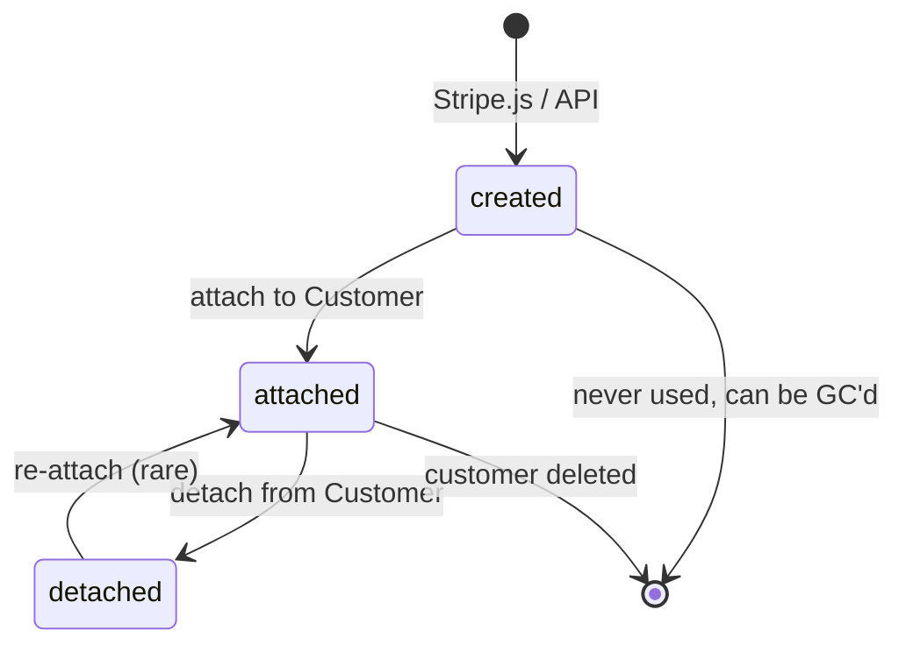
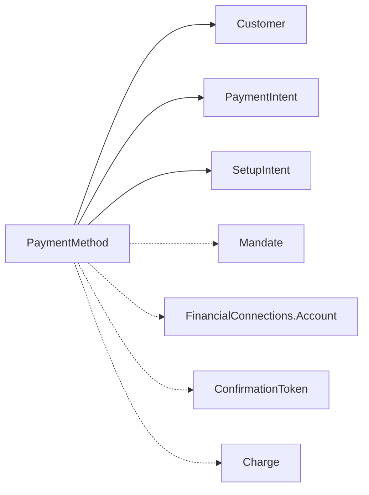

# PaymentMethod

> API resource: `payment_method` · API version: `2026-04-22.dahlia` · Category: [Payment methods](README.md)

## What it is

A `PaymentMethod` is a portable, reusable representation of a way the customer can pay you: a specific card, a specific bank account, a wallet handle, a BNPL account, a Pix key, etc. It is an *instrument*, not an *attempt*. Creating one doesn't move money; it just records "this thing exists and Stripe knows how to bill it later."

The same PM can be used by many PaymentIntents and SetupIntents. It can be attached to a Customer for repeat billing or remain unattached for guest checkouts.

PaymentMethod replaced the older Token + Card/Source flow. **For new code, always use PaymentMethod.**

## Why it exists

Three jobs:

1. **Decouple instrument from attempt.** PaymentIntent is "the attempt"; PaymentMethod is "what to bill." Same card → many intents → many charges.
2. **Decouple instrument from customer.** A PM can exist without a Customer (one-off guest payments) and later be attached to one (subscription signup).
3. **Standardize across PM types.** Card, ACH, SEPA, BACS, OXXO, Klarna, AfterPay, iDEAL, Bancontact, Alipay, WeChat, Boleto, Pix, Sunbit (new in `dahlia`) — all expose the same `PaymentMethod` resource shape with a `type` discriminator and a per-type sub-object.

## Lifecycle & states

PaymentMethod has no `status` field, but it has clear lifecycle moments:



What "attach" really means: the `customer` field on the PM is set, and the PM appears in `GET /v1/payment_methods?customer=…`. PaymentIntents created with `customer=cus_…` and `payment_method=pm_…` work correctly only if the PM is attached to that customer (or about to be attached via `setup_future_usage`).

> **Exception: single-use PM types.** Many redirect-based PMs (`bancontact`, `eps`, `giropay`, `p24`, `ideal` for one-off, etc.) are *single-use* — using them in a PaymentIntent consumes them. They can't be reattached. The PM object still exists for audit but its `type`-specific sub-object is exhausted.

## Anatomy of the object

### Identity

| Field | Notes |
|---|---|
| `id` | `pm_…` |
| `type` | Discriminator: `card`, `us_bank_account`, `sepa_debit`, `bacs_debit`, `ideal`, `klarna`, `afterpay_clearpay`, `affirm`, `alipay`, `wechat_pay`, `boleto`, `oxxo`, `pix`, `sunbit` (new), `link`, `cashapp`, `revolut_pay`, `paypal`, `amazon_pay`, … |
| `customer` | `cus_…` if attached, else null. |
| `created` | unix seconds. |
| `livemode`, `metadata` | standard. |

### Type-specific sub-objects

The PM carries one populated sub-object matching `type`:

- `card` → `{ brand, last4, exp_month, exp_year, country, funding, fingerprint, networks, three_d_secure_usage, wallet, generated_from, … }`
  - **`fingerprint`** is the canonical "is this the same card?" identifier across PMs/Tokens/Customers.
  - **`networks.available`** lists co-badged networks (e.g. `["visa", "cartes_bancaires"]`).
- `us_bank_account` → `{ bank_name, last4, routing_number, account_type, account_holder_type, financial_connections_account, networks: { supported, preferred }, status_details }`
- `sepa_debit` → `{ last4, country, bank_code, branch_code, fingerprint, generated_from }`
- `card_present` → for in-person Terminal payments.
- (and so on per type)

The presence and shape of these sub-objects is what your reconciliation/UI code reads to render the saved instrument.

### Billing details

| Field | Notes |
|---|---|
| `billing_details.name`, `.email`, `.phone`, `.address` | Set by the customer at PM-creation time (typically by Elements). Used for AVS, fraud signals, receipts. |

### Allow/disallow flags

| Field | Notes |
|---|---|
| `allow_redisplay` | `always | limited | unspecified`. New-ish field — controls whether Stripe Elements may show this saved PM back to the user. |

## Relationships



- A successful PI/Charge points back at the PM via `payment_method`.
- ACH/SEPA/BACS PMs spawn a [Mandate](../01-core-resources/mandates.md) when first used recurringly.
- US bank account PMs may link to a [FinancialConnections.Account](../21-financial-connections/accounts.md) (instant verification).

## Common workflows

### 1. Create + confirm in one shot (recommended for new integrations)

You don't usually create PaymentMethods directly. The Payment Element, Card Element, or Express Checkout Element creates the PM client-side as part of `confirmPayment`. The PM ID is set on the PI atomically.

If you're saving for future:

```http
POST /v1/payment_intents
  amount=1999 currency=usd customer=cus_…
  setup_future_usage=off_session
  automatic_payment_methods[enabled]=true
```

After success, the PM exists, is attached to `cus_…`, and `pm.allow_redisplay=always`.

### 2. Save without charging (free trial, on-file billing)

Use a [SetupIntent](../01-core-resources/setup-intents.md) with the same Element. Resulting PM is attached to the Customer.

### 3. Attach an existing PM to a Customer

```http
POST /v1/payment_methods/pm_…/attach
  customer=cus_…
```

PM types that are not reusable will error.

### 4. Detach

```http
POST /v1/payment_methods/pm_…/detach
```

The PM still exists in your dashboard but its `customer` is null and it can't be charged off-session.

### 5. List a customer's saved cards (for a "manage payment methods" UI)

```http
GET /v1/payment_methods?customer=cus_…&type=card
```

Or use a [CustomerSession](../01-core-resources/customer-sessions.md) + the Saved-PM Element for a Stripe-rendered list.

### 6. Update card metadata (e.g. nickname)

```http
POST /v1/payment_methods/pm_…
  metadata[nickname]=Vacation Card
```

You cannot edit the actual card details (PAN, exp). Only `billing_details` and `metadata`. To "update" a card, the customer creates a new PM and you delete the old.

## Webhook events

| Event | Fires when |
|---|---|
| `payment_method.attached` | Attached to a Customer. |
| `payment_method.detached` | Detached. |
| `payment_method.updated` | `billing_details` / `metadata` change. |
| `payment_method.automatically_updated` | Stripe's card-account-updater service refreshed expiry, last4, or brand because the issuer reissued the card. **You don't need to do anything**, but you should re-fetch to update your "card on file" UI. |

`payment_method.automatically_updated` is one of Stripe's most underrated features — it silently keeps subscriptions alive when issuers reissue cards.

## Idempotency, retries & race conditions

- Direct PM creation (`POST /v1/payment_methods`) is rare server-side; Elements does it in the browser. If you do, send `Idempotency-Key`.
- Attaching the same PM twice is idempotent — second call is a no-op.
- A PM created via Elements is owned by the publishable-key session for ~15 minutes; after that, it must be attached to a Customer or it gets garbage-collected.
- **Race**: a PI confirmed at the moment a PM is detached can produce a `payment_method_unavailable` error. Refetch and retry.

## Test-mode tips

- Magic cards listed in [Charge](../01-core-resources/charges.md) → "Test-mode tips".
- Test US bank account: use `pm.us_bank_account` with routing `110000000` and account `000123456789` for instant-verified flows.
- Test SEPA: `IBAN: DE89 3704 0044 0532 0130 00` always succeeds; `…0532 0130 02` fails.
- `stripe payment_methods create --type card --card[number]=4242…` from CLI bypasses Elements when scripting.

## Connect considerations

- A PaymentMethod **belongs to one Stripe account** (platform OR connected, not both). To use a PM saved on the platform with a connected-account charge, you have to *clone* it via:
  ```http
  POST /v1/payment_methods
    customer=cus_…
    payment_method=pm_…
  Stripe-Account: acct_…
  ```
  This creates a copy on the connected account.
- Apple Pay / Google Pay via Connect requires the platform to register its domains; see [PaymentMethodDomain](payment-method-domains.md).

## Common pitfalls

- **Trying to `attach` a single-use PM** (e.g. one-off iDEAL). Errors. Single-use PMs vanish after the PI succeeds.
- **Storing PAN.** Don't. Stripe stores it for you. PCI scope shrinks because your servers never touch it.
- **Reading `last4` / `brand` for fraud or analytics across PMs.** Use `card.fingerprint` instead — it's the canonical "same physical card" key.
- **Forgetting `allow_redisplay`** when calling `attach` from server code. PMs attached without it default to `unspecified` and may not be re-shown by Elements. Set explicitly for clarity.
- **Charging a detached PM off-session.** Will error. Re-attach first.
- **Confusing a PaymentMethod with a Token.** Tokens (`tok_…`) are single-use, browser-generated, going away. PMs (`pm_…`) are reusable.

## Further reading

- [API reference: PaymentMethod](https://docs.stripe.com/api/payment_methods/object)
- [Saving payment details](https://docs.stripe.com/payments/save-and-reuse)
- [Card account updater](https://docs.stripe.com/saving-cards#automatic-card-updates)
- [Allow re-display](https://docs.stripe.com/payments/payment-methods#allow-redisplay)
