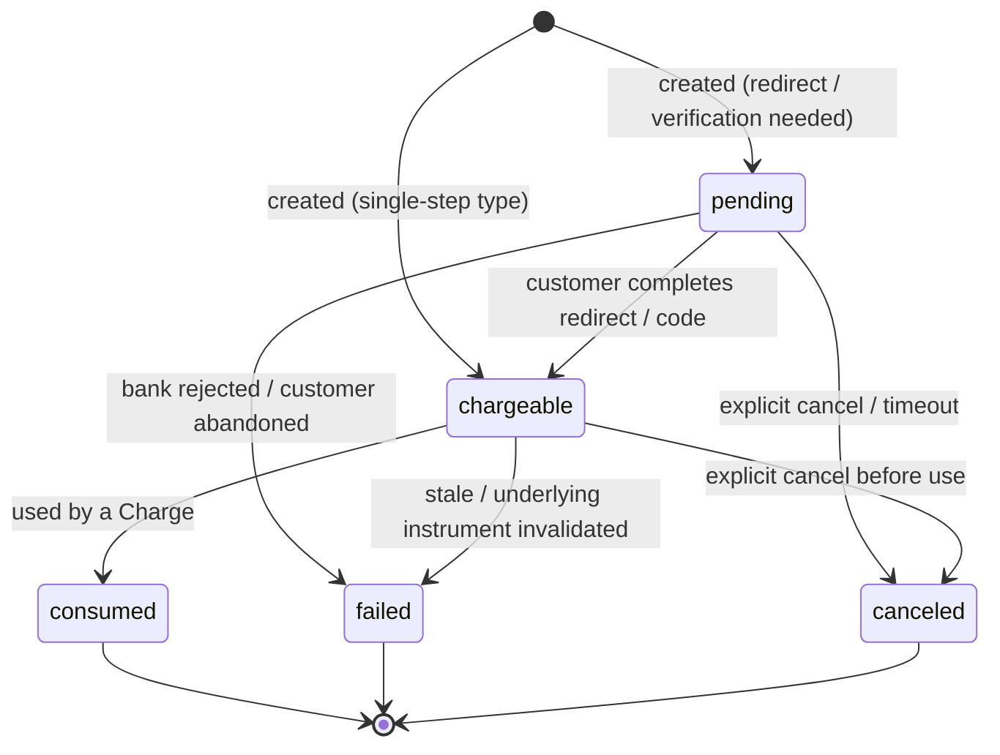
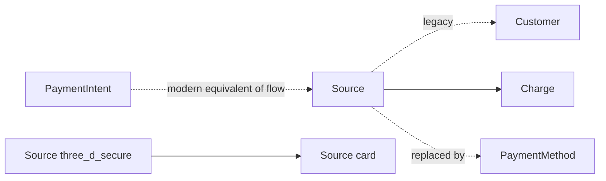

# Source (legacy)

> API resource: `source` · API version: `2026-04-22.dahlia` · Category: [Payment methods](README.md)

## What it is

`Source` is a **fully deprecated** pre-PaymentMethod abstraction representing "an instrument the customer wants to pay with," modeled as a multi-step state machine that handled redirects, code-verification (e.g. SOFORT), receivers (push payments like ACH credit transfer), and 3DS card authorization.

It was Stripe's attempt (2017–2018) to unify card and non-card payments under one resource before the Charge. PaymentIntent + PaymentMethod (2019) replaced it cleanly.

> **Loud warning: do not build new integrations on Sources.** Use [PaymentIntent](../01-core-resources/payment-intents.md) + [PaymentMethod](payment-methods.md) for everything. This guide exists to (a) explain Sources you may still see in legacy code/data and (b) point you at the migration path off them.

## Why it existed

When Stripe added bank redirects (iDEAL, Bancontact, SOFORT, Giropay, EPS, Multibanco), bank debits (ACH, SEPA), and 3DS card authorization, the existing Token + Charge model couldn't express:

- Multi-step "create instrument → send customer to bank → bank returns → charge" flows.
- Async settlement where the instrument exists but isn't immediately chargeable.
- Reusable bank debits with mandates.

Source unified these under one resource with `flow`, `status`, and per-`type` sub-objects. The model worked but was complex and shipped before SCA/PSD2; PaymentIntent absorbed Source's responsibilities (orchestrating the multi-step flow) while PaymentMethod absorbed its instrument-representation responsibilities, leaving Source with no remaining unique role.

## Lifecycle & states

Field: `status`. Values:

- **`pending`** — created, waiting for customer to complete a redirect, code-verification, or receiver step. `redirect.url` or `code_verification.attempts_remaining` populated.
- **`chargeable`** — instrument is ready; create a Charge against it. (Reusable Sources stay `chargeable` after each charge; single-use ones flip to `consumed`.)
- **`consumed`** — single-use Source has been used by a Charge. Terminal.
- **`canceled`** — you canceled it or it timed out before becoming `chargeable`. Terminal.
- **`failed`** — async failure (redirect denied, code wrong, receiver expired). Terminal.

`usage` field tells you `single_use` vs `reusable` and dictates `chargeable → consumed` vs `chargeable → chargeable`.

## Anatomy of the object

### Identity

| Field | Notes |
|---|---|
| `id` | `src_…` |
| `object` | `source` |
| `customer` | `cus_…` if attached. |
| `created` | unix seconds. |
| `livemode`, `metadata` | standard. |

### Money & type

| Field | Notes |
|---|---|
| `amount` | Optional intended amount. Some types require it (single-use). |
| `currency` | ISO. |
| `type` | Discriminator: `card`, `three_d_secure`, `bancontact`, `ideal`, `sofort`, `eps`, `giropay`, `multibanco`, `p24`, `ach_debit`, `ach_credit_transfer`, `sepa_debit`, `sepa_credit_transfer`, `alipay`, `wechat`, `klarna`, `acss_debit`, `au_becs_debit`. |
| `usage` | `reusable` or `single_use`. |
| `flow` | `none`, `redirect`, `code_verification`, `receiver`. |
| `status` | See lifecycle. |

### Flow sub-objects

Exactly one of these is populated based on `flow`:

| Flow | Sub-object | Contains |
|---|---|---|
| `redirect` | `redirect` | `url` (where to send customer), `return_url` (where bank returns them), `status` (`pending`, `succeeded`, `failed`, `not_required`). |
| `code_verification` | `code_verification` | `attempts_remaining`, `status`. Customer enters a code from their bank statement (SOFORT). |
| `receiver` | `receiver` | `address` (where to send the bank transfer to), `amount_received`, `amount_charged`, `amount_returned`, `refund_attributes_status`. Used by ACH credit transfer / SEPA credit transfer / Multibanco. |
| `none` | (none) | Single-step types. |

### Type-specific sub-objects

Same idea as PaymentMethod: one sub-object matching `type`.

- `card` → `{ brand, last4, exp_month, exp_year, country, cvc_check, address_*_check, fingerprint, three_d_secure: required|optional|not_supported, … }`.
- `three_d_secure` → wraps a `card` Source after 3DS authentication; references `card` (the underlying Source).
- `ach_debit` → `{ bank_name, last4, country, routing_number, fingerprint }`.
- `ideal` → `{ bank, bic, iban_last4 }`.
- `sepa_debit` → `{ bank_code, branch_code, country, fingerprint, last4, mandate_reference, mandate_url }`.
- (and so on per type)

### Owner

`owner` sub-object: `name`, `email`, `phone`, `address`, `verified_*` (Stripe's verified copy after the bank confirms). The pre-PaymentMethod equivalent of `billing_details`.

### Mandate (for SEPA/ACH/BACS Sources)

`mandate` sub-object with `acceptance.status`, `acceptance.date`, `acceptance.ip`, `acceptance.user_agent`, `notification_method`, `reference`, `url`. Required for recurring debit Sources.

## Relationships

- A Source attached to a Customer lives in `customer.sources.data[]` alongside legacy Cards and BankAccounts.
- A Charge created against a Source references it via `charge.source` (now `charge.payment_method` in modern flows).
- The legacy 3DS pattern: create a `source.type=card`, then create a `source.type=three_d_secure` referencing it; redirect the customer; on return, the `three_d_secure` source becomes `chargeable`. Modern equivalent: PaymentIntent + `next_action.use_stripe_sdk` handles 3DS automatically.

## Migration path

| Old Source type | Modern PaymentMethod / approach |
|---|---|
| `source.type=card` | `pm_…` `type=card` via Stripe.js Elements + PaymentIntent. |
| `source.type=three_d_secure` | Don't create explicitly; PaymentIntent + `payment_method_options[card][request_three_d_secure]` handles it. |
| `source.type=ach_debit` | `pm_…` `type=us_bank_account` (often + FinancialConnections for instant verification). |
| `source.type=sepa_debit` | `pm_…` `type=sepa_debit`. |
| `source.type=ideal` | `pm_…` `type=ideal` (single-use). |
| `source.type=bancontact` | `pm_…` `type=bancontact` (single-use). |
| `source.type=sofort` | `pm_…` `type=sofort` (deprecated by Stripe — migrate to a SEPA Direct Debit `pm_…` instead). |
| `source.type=alipay` | `pm_…` `type=alipay`. |
| `source.type=wechat` | `pm_…` `type=wechat_pay`. |
| `source.type=klarna` | `pm_…` `type=klarna`. |
| `source.type=ach_credit_transfer` | Customer Balance / `pm_…` `type=customer_balance` (bank transfer funding). |

For each migration: stop creating new Sources of that type. New flows use the modern PM. Existing Customers' attached Sources can stay until you naturally re-collect (e.g. next checkout or saved-PM re-confirmation).

## Common workflows (legacy reference only)

### A. Card 3DS via Sources (deprecated)

1. `POST /v1/sources` `type=card token=tok_…`
2. `POST /v1/sources` `type=three_d_secure amount=... currency=... source=src_card_…`
3. Redirect customer to `redirect.url`.
4. On return, retrieve the 3DS source; if `chargeable`, `POST /v1/charges source=src_3ds_…`.

**Modern equivalent**: a single PaymentIntent with `automatic_payment_methods[enabled]=true`. Stripe.js handles 3DS.

### B. Bank redirect (iDEAL) via Sources (deprecated)

1. `POST /v1/sources` `type=ideal amount=4900 currency=eur ideal[bank]=... redirect[return_url]=...`
2. Redirect to `source.redirect.url`.
3. On return, `POST /v1/charges source=src_…`.

**Modern equivalent**: PaymentIntent with `payment_method_types[]=ideal`, `confirmPayment` from Stripe.js with `return_url`.

### C. ACH debit via Sources (deprecated)

1. `POST /v1/customers/cus_…/sources` `source=src_ach_…` (created via Plaid token).
2. Verify (micro-deposits or Plaid).
3. `POST /v1/charges source=src_…`.

**Modern equivalent**: PaymentIntent with `payment_method_types[]=us_bank_account` and FinancialConnections.

## Webhook events

Source events exist but are **noisy and not maintained for new flows**. Listed for reference:

| Event | Fires when |
|---|---|
| `source.chargeable` | Source transitioned to `chargeable`. The trigger to create a Charge in legacy flows. |
| `source.canceled` | Source canceled. |
| `source.failed` | Async failure. |
| `source.mandate_notification` | SEPA debit notice to send to customer (you have a notification obligation). |
| `source.refund_attributes_required` | Receiver flow needs return-bank info before refunding. |
| `source.transaction.created` / `source.transaction.updated` | Receiver flow received a partial/full payment from the customer. |

**Do not subscribe to `source.*` for new code.** Use `payment_intent.*` and `payment_method.*`.

## Idempotency, retries & race conditions

- `POST /v1/sources` accepts `Idempotency-Key`.
- A Source can transition `pending → chargeable → consumed` between your sync API call and a webhook delivery. Always re-fetch on webhook before acting.
- Single-use Sources can be charged only once; a retry against the same `src_…` after `consumed` errors. Modern PaymentIntents handle retries cleanly via the same `pi_…`.
- Receiver flows (ACH credit transfer): partial payments arrive over hours/days. Handle multiple `source.transaction.created` events per source.

## Test-mode tips

- Test card Sources: same magic PANs as Cards/PaymentMethods.
- Test iDEAL: `ideal[bank]=abn_amro` always returns `chargeable` after redirect.
- Test SEPA: `IBAN: DE89370400440532013000` → `chargeable`; `…013002` → `failed`.
- Test ACH credit transfer (receiver): use the test routing/account from the receiver address; trigger `source.transaction.created` via `stripe trigger source.transaction.created`.
- Generally, prefer testing with PaymentMethod equivalents — Source test paths are minimally maintained.

## Connect considerations

- A Source belongs to one account (platform or connected). Cloning a Source between accounts is not supported in the same way as PaymentMethods. **Migration is the answer**: collect a fresh PM on the connected account.
- Direct charges with `Stripe-Account` and a `src_…` work, but should be replaced by PaymentIntent + PM cloning per [PaymentMethod](payment-methods.md) guide.
- Connect platforms with legacy Source-based onboarding flows should plan a migration before any future Stripe deprecation announcement.

## Common pitfalls

- **Building any new integration on Sources.** Stop. Use PaymentIntent + PaymentMethod.
- **Treating `pending` as a poll-until-chargeable target.** It is — but use webhooks (`source.chargeable`) not polling. Even better: use PaymentIntent and read `status` there.
- **Charging a `consumed` single-use Source.** Errors. The Source is exhausted.
- **Forgetting SEPA mandate notification obligations.** SEPA debit Sources have legal obligations to notify the customer of upcoming debits. Modern `pm.sepa_debit` + Mandate handles this; the Source path required you to surface `mandate.url` and notify out-of-band.
- **Ignoring `redirect.return_url` security.** Anyone who can guess your return URL with the right Source ID could try to reattach. Modern PaymentIntent's `client_secret` is bound to the intent and harder to spoof.
- **Mixing 3DS via Source with PaymentIntent in the same flow.** They don't compose. Pick one orchestrator.
- **Ignoring `source.*` events you receive on a webhook endpoint subscribed to `*`.** They will trickle in as long as legacy Sources exist. Filter them out in your handler if you've migrated everything.

## Further reading

- [API reference: Source (deprecated)](https://docs.stripe.com/api/sources/object)
- [Migration: Sources → PaymentMethods](https://docs.stripe.com/payments/payment-methods/transitioning)
- Modern stack: [PaymentIntent](../01-core-resources/payment-intents.md), [PaymentMethod](payment-methods.md), [SetupIntent](../01-core-resources/setup-intents.md)
- Sibling legacy: [Card](cards.md), [BankAccount](bank-accounts.md), [Token](../01-core-resources/tokens.md)
