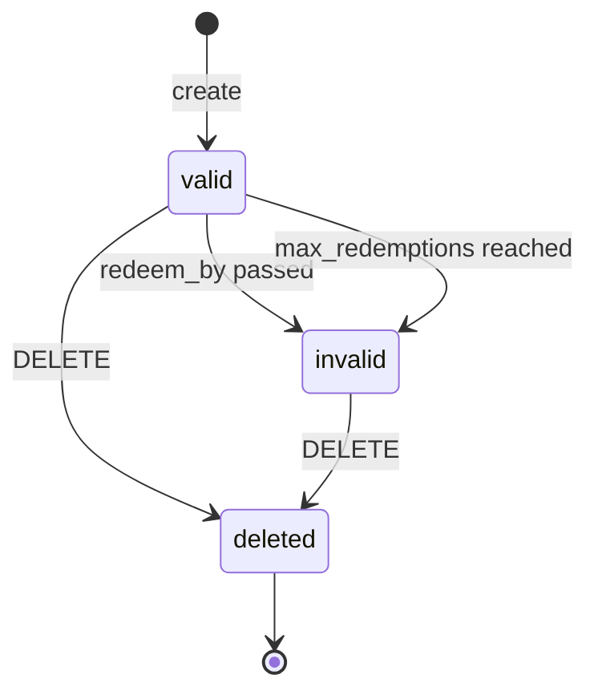
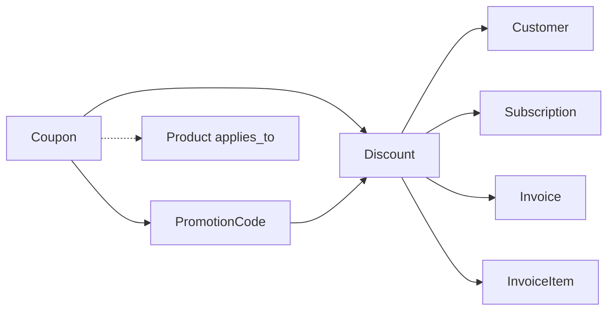

# Coupon

> API resource: `coupon` · API version: `2026-04-22.dahlia` · Category: [Products & catalog](README.md)

## What it is

A `Coupon` is a **reusable discount template**. It defines the shape of a discount — "20% off," "$10 off," "50% off for 3 months" — without yet attaching that discount to anyone. Coupons themselves don't reduce any customer's bill. To do that, you create a [Discount](discounts.md) (an *application* of the Coupon) on a Customer, Subscription, Invoice, or InvoiceItem — typically by reference, either directly (`coupon=COUPON_ID`) or indirectly via a [Promotion Code](promotion-codes.md) the customer typed at checkout.

Think of it as the *plan*; the Discount is the *instance*.

## Why it exists

Without Coupons, every promotional discount would be ad-hoc math on individual invoices, with no central record of "what's `BLACKFRIDAY20` worth?" or "how many people redeemed it?" Coupons exist to:

- Codify discount rules once and reuse them across many customers.
- Track aggregate redemptions and revenue impact.
- Cap exposure (`max_redemptions`, `redeem_by`).
- Restrict scope (`applies_to.products[]`).
- Compose with [Promotion Codes](promotion-codes.md), which are customer-facing strings (`BLACKFRIDAY20`) bound to a Coupon — so marketing can hand out codes without exposing the underlying Coupon ID or letting people enter raw discount math.

## Lifecycle & states

Coupons have no `status` enum. The relevant states are *valid* (per `valid: true`) vs. exhausted, plus deletion.



### `valid: true`

The Coupon can still be applied to new Discounts. Stripe sets `valid: false` automatically once `max_redemptions` is reached or `redeem_by` has passed.

### `valid: false` (exhausted)

Cannot create new Discounts from this Coupon. **Existing Discounts referencing it remain in force** for their `duration` — exhausting a Coupon doesn't claw back discounts already applied to ongoing Subscriptions.

### `deleted`

`DELETE /v1/coupons/:id` works at any time and is the typical "retire" action. Same rule: existing Discounts referencing the Coupon are unaffected. Subscriptions with the discount applied keep getting discounted invoices until their `duration` elapses. The Coupon record stays retrievable as a tombstone (`deleted: true`) so historical Discounts can still describe themselves.

> **Why deletion doesn't unwind active Discounts.** Customers were promised "20% off for 3 months." Retroactively pulling that promise would corrupt finalized invoices. Stripe enforces that promises stay kept.

## Anatomy of the object

### Identity

| Field | Notes |
|---|---|
| `id` | Required. **You can pass a human-readable ID** like `BLACKFRIDAY20` or let Stripe auto-generate a random one. Whatever you pass becomes the API ID. |
| `object` | always `"coupon"`. |
| `created`, `livemode`, `metadata` | standard. |
| `name` | Display label (e.g. "Black Friday — 20% off"). Shown on hosted Checkout and Invoice PDFs. |

### Discount math (exactly one of these pairs)

| Field | Notes |
|---|---|
| `percent_off` | Float, `0 < x ≤ 100`. Reduces the bill by this percentage. |
| `amount_off` + `currency` | Integer in cents. Reduces by a flat amount. The Coupon is *currency-locked* — only applies to invoices in the same currency. For multi-currency, use `currency_options` (per-currency `amount_off`). |
| `currency_options` | Map `{ currency: { amount_off } }` — lets one fixed-amount Coupon work across currencies (e.g. $10 off in USD, €9 off in EUR). |

You set **either** `percent_off` **or** `amount_off`, never both.

### Duration

| Field | Notes |
|---|---|
| `duration` | `once` (apply to one invoice only — usually the next), `repeating` (apply for N months), or `forever` (apply to every invoice this Subscription generates). |
| `duration_in_months` | Required when `duration=repeating`. Number of months the discount stays active. |

For one-time Invoices and one-shot Checkout Sessions, `duration=once` is what you want — `repeating` and `forever` only make sense for Subscriptions.

### Caps

| Field | Notes |
|---|---|
| `max_redemptions` | Hard cap on the total number of Discounts created from this Coupon (across all customers). Once reached, `valid: false`. |
| `redeem_by` | Unix seconds. After this timestamp, no new Discounts can be created. Existing ones are unaffected. |
| `times_redeemed` | Integer. Increments every time a new Discount is created from this Coupon. |
| `valid` | Boolean. Stripe-computed: `true` when neither cap has been hit. |

### Scope

| Field | Notes |
|---|---|
| `applies_to.products` | Array of `prod_…` IDs. **Restricts** the Coupon to only discount line items that reference these Products. If empty/absent, the Coupon applies to every line on the Invoice/Subscription. |

## Relationships



- A Coupon spawns many Discount instances.
- A Coupon can have many Promotion Codes pointing at it (one Coupon, multiple codes — `BFCM20`, `BLACKFRIDAY20`, `EARLYBIRD`, all redeeming the same underlying 20% off).
- Coupons are independent of [TaxRate](tax-rates.md) — discounts apply *before* tax in Stripe's calculation order (assuming `tax_behavior=exclusive`).

## Common workflows

### 1. Create a 20% off coupon for one invoice

```http
POST /v1/coupons
  id=WELCOME20
  name=Welcome — 20% off
  percent_off=20
  duration=once
```

### 2. Create a $10-off-for-3-months Subscription coupon

```http
POST /v1/coupons
  id=THREE_MONTHS_TEN
  amount_off=1000
  currency=usd
  duration=repeating
  duration_in_months=3
```

### 3. Multi-currency fixed-amount Coupon

```http
POST /v1/coupons
  id=GLOBAL10
  duration=once
  currency=usd
  amount_off=1000
  currency_options[eur][amount_off]=900
  currency_options[gbp][amount_off]=800
```

### 4. Capped promo for a single Product

```http
POST /v1/coupons
  id=PRO_LAUNCH
  percent_off=50
  duration=forever
  max_redemptions=100
  redeem_by=1735689600
  applies_to[products][]=prod_acme_pro
```

First 100 redeemers get 50% off forever, but only on the Pro product — Basic seats on the same Subscription bill at full price.

### 5. Apply a Coupon to a Customer (cascades to all future invoices)

```http
POST /v1/customers/cus_…
  coupon=WELCOME20
```

Creates a [Discount](discounts.md) at the Customer level. Every Invoice generated for this customer reduces by the Coupon's terms (subject to `duration` and `applies_to`).

### 6. Apply a Coupon to a Subscription only

```http
POST /v1/subscriptions/sub_…
  discounts[0][coupon]=THREE_MONTHS_TEN
```

Only this Subscription's invoices get the discount. Customer-level coupons (if any) still apply too — multiple discounts can stack.

### 7. Retire a Coupon

```http
DELETE /v1/coupons/WELCOME20
```

New Discount creation blocked immediately. Existing Discounts continue.

## Webhook events

| Event | Fires when | Listener typically does |
|---|---|---|
| `coupon.created` | A Coupon is created. | Sync to local promo registry. |
| `coupon.updated` | `name`, `metadata`, or computed fields like `times_redeemed`/`valid` change. | Refresh promo dashboard. |
| `coupon.deleted` | `DELETE` issued. | Mark retired in your registry. |
| `customer.discount.created` | A Discount instance is created from this Coupon (often the more useful signal). | Update customer-facing pricing UI. |
| `customer.discount.updated` / `customer.discount.deleted` | Discount lifecycle. | See [Discount](discounts.md). |

> Coupon-level events are mostly admin signals. Discount-level events tell you what's actually happening at the customer.

## Idempotency, retries & race conditions

- `POST /v1/coupons` accepts `Idempotency-Key`. **Use it especially when you supply a custom `id`** — otherwise a network retry can race with the unique-id constraint and produce a confusing 409.
- `times_redeemed` is incremented atomically by Stripe, but webhooks for `customer.discount.created` may arrive before the corresponding `coupon.updated` reflecting the new count. Don't assume tight ordering.
- `max_redemptions` is enforced at Discount-creation time; a Coupon can briefly show `valid: true` while concurrent attempts race past the cap. The losing attempts get a 400.
- Deleting a Coupon is idempotent — a 404 on a second `DELETE` is the only signal you'll get.

## Test-mode tips

- Test-mode Coupons are isolated from live. The Dashboard "Copy to live mode" button copies a Coupon and all its Promotion Codes.
- `stripe coupons create --percent-off=20 --duration=once` for quick CLI fixtures.
- To test `redeem_by` expiry, pair with [TestClock](../06-billing/test-clocks.md): set the clock past `redeem_by`, then attempt to apply — should fail.
- `stripe trigger customer.discount.created` for handler smoke tests.

## Connect considerations

- Coupons are scoped per Stripe account. The platform's Coupons aren't visible on connected accounts.
- For *direct charge* setups, the connected account creates and owns its own Coupons.
- For *destination charge* setups, the platform's Coupons live on the platform; the Discount applies to the platform's Invoice/Subscription, and `transfer_data.amount` reflects the discounted total.

## Common pitfalls

- **Confusing Coupon and Discount.** The Coupon is the template; it never reduces money on its own. The Discount is the application. People look for the Coupon on a Customer's record and don't realize they need to look at `customer.discount` (a Discount).
- **Setting `amount_off` without realizing it's currency-locked.** A USD coupon won't apply to a EUR Invoice. Use `currency_options` or create one Coupon per currency.
- **`duration=repeating` with `duration_in_months` for non-Subscription contexts.** Only meaningful on Subscriptions. On a one-off Invoice it degrades to "once."
- **Deleting a Coupon to "remove a customer's discount."** Deletion does *not* end existing Discounts. To cancel a Discount, DELETE the parent's `discount` endpoint (e.g. `DELETE /v1/customers/:id/discount`).
- **`applies_to.products` as a per-customer rule.** It's a per-line filter, applied at every Invoice render. If the Subscription has multiple items and only some match, only those lines get discounted.
- **Forgetting `max_redemptions` is global, not per-customer.** If you want one-per-customer, use a [Promotion Code](promotion-codes.md) with `customer=cus_…` or `restrictions.first_time_transaction=true`.
- **Trying to edit `percent_off` / `amount_off` after creation.** You can't. Create a new Coupon with new terms.

## Further reading

- [API reference: Coupon](https://docs.stripe.com/api/coupons/object)
- [Coupons guide](https://docs.stripe.com/billing/subscriptions/coupons)
- [Discounts (instances)](discounts.md)
- [Promotion Codes (customer-facing strings)](promotion-codes.md)
