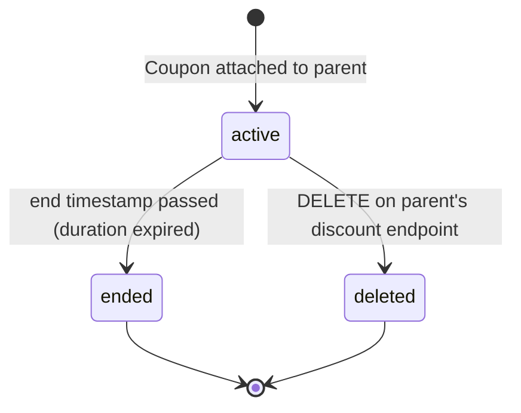
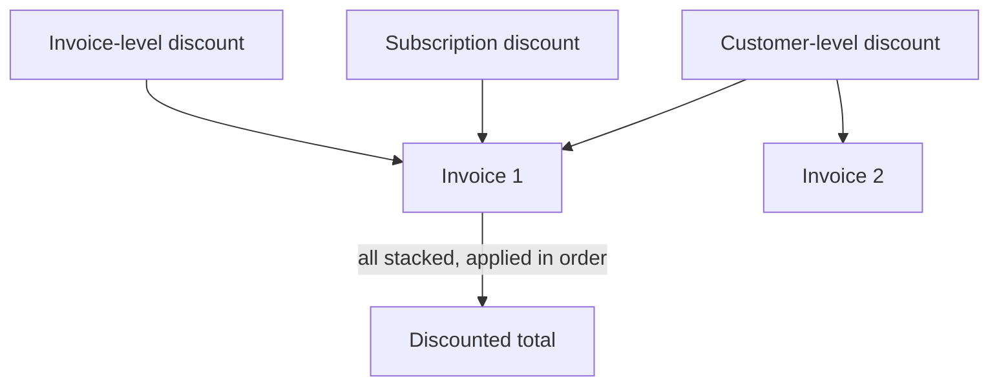
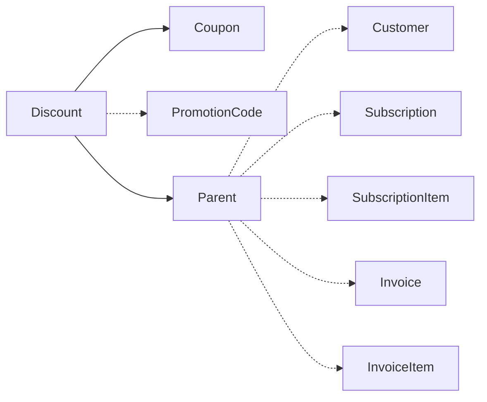

# Discount

> API resource: `discount` · API version: `2026-04-22.dahlia` · Category: [Products & catalog](README.md)

## What it is

A `Discount` is the **instance** — the *application* of a [Coupon](coupons.md) to a specific Customer, Subscription, Invoice, InvoiceItem, or SubscriptionItem. The Coupon defines the math (20% off, $10 off for 3 months); the Discount is the record that says "Coupon X is currently active on object Y, started on date A, ends on date B."

You almost never `POST` a Discount directly. You attach a Coupon (or Promotion Code) to a parent object — Customer, Subscription, Invoice, InvoiceItem, SubscriptionItem — and Stripe creates the Discount for you and embeds it in the parent's `discount` (singular, legacy) or `discounts` (array, current) field.

## Why it exists

Coupons are stateless templates. To track "this specific customer is in the middle of a 3-month 20%-off promotion, starting March 1, 2 months remaining," Stripe needs a per-relationship object — the Discount. It records:

- Which Coupon is being applied.
- Which Promotion Code (if any) was redeemed to create it.
- When the Discount started (`start`) and when it ends (`end`).
- Which parent object it lives on.

It's also the object that gets *removed* when you "remove a discount." You don't delete the Coupon; you delete the Discount instance from the parent.

## Lifecycle & states

Discounts have no `status` enum. Their lifetime is bounded by `start` and `end`.



### `active`

Currently in force on its parent. Each invoice the parent generates picks up the discount until `end` is reached or `applies_to.products` rules out all line items.

### `ended` (implicit)

Once the Coupon's `duration` runs out (`once`: after the next invoice, `repeating`: after `duration_in_months`, `forever`: never), Stripe sets `end` and stops applying the discount. The Discount object lingers as a historical record.

### `deleted`

Removed via `DELETE` on the parent's discount endpoint. Future invoices won't carry it. **Already-issued invoices still show the discount applied** — Stripe never retroactively edits a finalized invoice.

## Anatomy of the object

### Identity

| Field | Notes |
|---|---|
| `id` | `di_…`. |
| `object` | always `"discount"`. |
| `livemode` | standard. |
| Note: Discounts have no `metadata` of their own — metadata lives on the Coupon. |

### Parent linkage

A Discount sits on exactly one parent. Exactly one of these is non-null:

| Field | Notes |
|---|---|
| `customer` | `cus_…` if applied at the Customer level (cascades to all invoices for this customer). |
| `subscription` | `sub_…` if applied to a Subscription. |
| `subscription_item` | `si_…` if applied to a single Subscription item. |
| `invoice` | `in_…` if applied to a single Invoice. |
| `invoice_item` | `ii_…` if applied to a single InvoiceItem (one line). |
| `promotion_code` | `promo_…` if the Discount was created via a Promotion Code redemption. Null if attached directly via Coupon. |
| `coupon` | The full Coupon object, embedded. **Read-only snapshot at attach time** for `id`, but field updates to the Coupon after the fact (e.g. `name` changes) are reflected on read. |

### Time window

| Field | Notes |
|---|---|
| `start` | Unix seconds. When the Discount became active. |
| `end` | Unix seconds. When it stops/stopped. Null for `forever` discounts. |

### Checkout link

| Field | Notes |
|---|---|
| `checkout_session` | `cs_…` if redeemed via a Checkout Session. |

## Cascade and stacking rules

This is what trips most people up. Multiple discounts can apply to one Invoice via different parents. Stripe's order of application:

1. **Customer-level discount** (the Customer's `discount` / `discounts`) cascades to every Invoice/Subscription that customer ever generates.
2. **Subscription-level discount** (`subscription.discounts`) applies to every Invoice that Subscription generates.
3. **SubscriptionItem-level discount** applies only to that one item's portion.
4. **Invoice-level discount** (`invoice.discounts`, set while invoice is `draft`) applies to one specific Invoice.
5. **InvoiceItem-level discount** applies only to that one line.

Multiple discounts on the same parent stack via the `discounts[]` array (each entry is a Coupon or PromotionCode reference, materialized as a Discount). Stripe applies them sequentially — the second discount applies to the post-first-discount subtotal — so order matters and the math compounds, not adds.



> Discounts always apply to the **subtotal pre-tax** (when `tax_behavior=exclusive`). For `inclusive` pricing, Stripe back-computes correctly. Don't try to reproduce this math locally.

## Relationships



## Common workflows

### 1. Apply a Coupon at the Customer level

```http
POST /v1/customers/cus_…
  coupon=WELCOME20
```

(or `discounts[0][coupon]=WELCOME20` for the array form). Stripe creates a Discount on the Customer. Every future Invoice picks it up until the Coupon's `duration` expires.

### 2. Apply via Promotion Code

```http
POST /v1/customers/cus_…
  promotion_code=promo_…
```

Same as above but recorded with `promotion_code` set on the Discount. Useful for redemption analytics.

### 3. Apply to a Subscription only

```http
POST /v1/subscriptions/sub_…
  discounts[0][coupon]=THREE_MONTHS_TEN
```

Stripe creates a Discount on the Subscription. Customer-level discounts (if any) still apply too — discounts stack.

### 4. Apply to a single Invoice (while still `draft`)

```http
POST /v1/invoices/in_…
  discounts[0][coupon]=ONE_TIME_OFF
```

Once the Invoice is finalized (`open`), you can no longer add or remove discounts. To reduce a finalized Invoice, use a [CreditNote](../06-billing/credit-notes.md).

### 5. Stack multiple discounts

```http
POST /v1/subscriptions/sub_…
  discounts[0][coupon]=PARTNER_10PCT
  discounts[1][coupon]=LOYALTY_5PCT
```

10% off, then 5% off the discounted total. Final factor: `0.90 × 0.95 = 0.855` → 14.5% effective discount, not 15%.

### 6. Remove a Customer-level Discount

```http
DELETE /v1/customers/cus_…/discount
```

Singular endpoint for the customer's *current* discount. Future invoices won't carry it. Previously-issued invoices retain it.

### 7. Remove a Subscription Discount

```http
DELETE /v1/subscriptions/sub_…/discount
```

Same pattern. Or, with the `discounts[]` array form, `POST` with `discounts=` (empty) to clear all.

### 8. Replace a discount

There's no "update" — `DELETE` then re-attach with the new Coupon.

## Webhook events

| Event | Fires when | Listener typically does |
|---|---|---|
| `customer.discount.created` | A Discount was attached anywhere on this customer (Customer, Sub, Invoice, etc.). | Update pricing UI; record redemption. |
| `customer.discount.updated` | Discount field change (rare — usually when its underlying Coupon is updated). | Resync. |
| `customer.discount.deleted` | Discount removed (manually or `end` reached). | Update pricing UI; refresh upcoming-invoice estimate. |

> Despite the `customer.*` namespace, these events fire for discounts at *any* level (Subscription, Invoice, etc.) — Stripe routes them through the customer because that's the consistent point of identity.

## Idempotency, retries & race conditions

- Attach operations (`POST` to a parent with `coupon=` or `discounts=`) are idempotent: re-applying the same Coupon to a parent that already has it is a no-op (or returns 400 in some flows). Use `Idempotency-Key` for safety.
- `customer.discount.created` may arrive *before* `customer.subscription.updated` for the same logical change. Don't assume order; refetch the parent if you need the post-state.
- Removing a discount during a billing-cycle close window is racy — the in-flight `invoice.created` may or may not have included the discount. Use the `discount` field on the Invoice itself, not your local cache, as ground truth.
- The `coupon` embedded inside a Discount is a snapshot fetch at read time, not at attach time — so renames on the Coupon are reflected, but the math fields (`percent_off`, `amount_off`) of a Coupon you tried to "edit" can't change because Coupons themselves don't allow editing those.

## Test-mode tips

- Discounts mirror the Coupon's behavior, so testing usually means testing the Coupon configuration. See [Coupon test-mode tips](coupons.md#test-mode-tips).
- Use [TestClock](../06-billing/test-clocks.md) to advance through a `repeating` Coupon's `duration_in_months` and verify the Discount's `end` fires at the right time.
- `stripe trigger customer.discount.deleted` to smoke-test the deletion handler.

## Connect considerations

- Discounts inherit the scope of their parent. A Discount on a connected-account Customer is invisible to the platform.
- For *destination charge* Connect, the platform's Discount reduces the platform Invoice; `transfer_data.amount` reflects the discounted total going to the connected account.
- Coupons and PromotionCodes that the Discount references must exist on the same account as the parent.

## Common pitfalls

- **Trying to attach a discount to a finalized Invoice.** Invoices are immutable once `open`. Use a [CreditNote](../06-billing/credit-notes.md) for post-finalization adjustments.
- **Stacked discounts adding instead of compounding.** 10% + 5% = 14.5% effective, not 15%. Stripe applies in array order, each on the prior subtotal.
- **Confusing `discount` (singular, legacy) and `discounts` (plural, current).** Customer still uses singular for backward compatibility; Subscription/Invoice/InvoiceItem use plural arrays. Read both, write to the array form.
- **Deleting a Coupon expecting Discounts to disappear.** Coupon deletion does not remove existing Discounts. To remove a discount, DELETE on the parent's discount endpoint.
- **Forgetting that customer-level discounts cascade.** A Customer with a `forever` 20% Discount has every future Subscription and Invoice silently discounted. Auditors find these surprises in revenue reports.
- **Computing your own discounted totals.** Read `total_discount_amounts` and `total` on the Invoice. Stripe's order of operations (discount → tax, or tax-inclusive back-computation) is finicky to reproduce.
- **Treating `customer.discount.deleted` as customer-initiated.** It also fires when a `repeating` Discount naturally hits `end`. Check `end` and `start` to distinguish.

## Further reading

- [API reference: Discount](https://docs.stripe.com/api/discounts/object)
- [Coupons & discounts guide](https://docs.stripe.com/billing/subscriptions/coupons)
- [Coupon (template)](coupons.md)
- [Promotion Code (redemption string)](promotion-codes.md)
- [CreditNote (post-finalization adjustments)](../06-billing/credit-notes.md)
