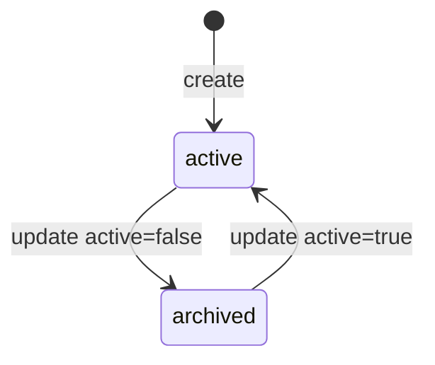
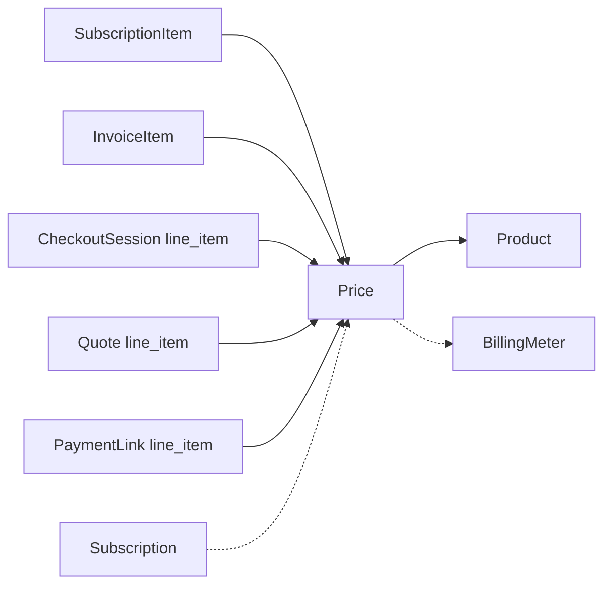

# Price

> API resource: `price` · API version: `2026-04-22.dahlia` · Category: [Products & catalog](README.md)

## What it is

A `Price` is the contract: how much is charged, in what currency, on what cadence, under what billing model, for one [Product](products.md). It's the object [Subscription](../06-billing/subscriptions.md), [Checkout Session](../04-checkout/sessions.md), [InvoiceItem](../06-billing/invoice-items.md), [Quote](../06-billing/quotes.md), and [PaymentLink](../05-payment-links/payment-links.md) all reference when they need to know "how much."

A Product owns *zero or many* Prices. A Price belongs to exactly one Product. Most real catalogs have multiple Prices per Product: monthly + annual, USD + EUR + GBP, flat + tiered, licensed + metered.

## Why it exists

Pricing is the most-changed dimension of a SaaS catalog. Prices are split out so you can:

- Add a new tier or currency without rewriting the catalog row.
- A/B test by directing different cohorts at different Price IDs.
- Migrate customers from `price_old` → `price_new` while keeping the Product (analytics identity) constant.
- Express complex billing models — graduated tiers, volume discounts, per-package quantities, metered usage — declaratively, so Stripe handles the math.

And critically: **Prices are mostly immutable.** Once a Price is created with `unit_amount=1000`, you cannot change that amount. To change the amount, you create a new Price and migrate. This immutability is what makes Prices safe to reference from finalized Invoices: the Price the customer agreed to is forever the Price they see on their tax document.

## Lifecycle & states

Prices have only `active` / archived. No status enum.



### `active` (default)

Live and chargeable. Can be referenced in new Subscriptions, Checkout Sessions, Payment Links, Quotes, InvoiceItems.

### archived (`active: false`)

Soft-hidden. Existing Subscriptions and Invoices keep using it — Stripe never breaks an in-flight billing relationship. But:

- Hidden from default Dashboard listings.
- Cannot be referenced in **new** Checkout Sessions or Payment Links.
- Can still be referenced via API for new Subscriptions/InvoiceItems (Stripe blocks hosted creation only).

There is **no DELETE for Prices.** Archive is the only "remove from catalog" path. The Price ID is permanent.

> **Why no delete.** Every finalized Invoice line carries a Price reference for the audit trail. Deleting the Price would dangle that reference.

## What is and isn't mutable

After creation, you can edit:

- `active` (toggle archive)
- `nickname` (internal label)
- `lookup_key` (the string handle used by `lookup_keys[]` in lookup queries)
- `metadata`
- `tax_behavior` — **but only once**, and only from `unspecified` → `inclusive` or `exclusive`. You cannot flip back.

You **cannot** edit:

- `unit_amount`, `currency`
- `product`
- `recurring.*` (interval, usage_type, meter)
- `tiers[]`, `tiers_mode`, `billing_scheme`
- `transform_quantity`

Anything in the second list requires a new Price.

## Anatomy of the object

### Identity

| Field | Notes |
|---|---|
| `id` | `price_…`. You can pass your own at creation. |
| `object` | always `"price"`. |
| `livemode`, `created`, `metadata` | standard. |
| `nickname` | Internal label, not shown to customers. Useful for "Pro Monthly" vs "Pro Annual" in your Dashboard. |
| `lookup_key` | Stable string handle. Lets you fetch a Price by name (`GET /v1/prices?lookup_keys[]=pro_monthly`) without storing the `price_…` ID. Great for code-as-config. |

### Money

| Field | Notes |
|---|---|
| `currency` | ISO 4217 lowercase (`usd`, `eur`). Immutable. |
| `unit_amount` | Integer in the smallest currency unit (cents). Null when `billing_scheme=tiered`. |
| `unit_amount_decimal` | String for sub-cent precision (e.g. `"0.5"` = half a cent). Used for high-volume metered billing. |
| `currency_options` | Map of `{ currency: { unit_amount, tax_behavior, tiers[] }}` — multi-currency on a single Price. The `currency` field is the default; `currency_options` lets one Price serve `usd`, `eur`, `gbp` from one ID. |

### Product link

| Field | Notes |
|---|---|
| `product` | `prod_…`. Immutable. |

### Cadence

| Field | Notes |
|---|---|
| `recurring` | `null` for one-time prices. Otherwise a sub-object: |
| `recurring.interval` | `day | week | month | year`. |
| `recurring.interval_count` | Multiplier (e.g. `interval=month, interval_count=3` → quarterly). Max 1 year total. |
| `recurring.usage_type` | `licensed` (charge for the seat regardless of use) or `metered` (charge for reported usage). |
| `recurring.aggregate_usage` | For metered: `sum | last_during_period | last_ever | max`. How to roll up usage records into a billable number. |
| `recurring.meter` | `mtr_…` of a [BillingMeter](../06-billing/billing-meters.md). **Modern metered billing uses Meters; the legacy usage_records flow uses just `usage_type=metered`.** |

### Billing scheme

| Field | Notes |
|---|---|
| `billing_scheme` | `per_unit` (default — quantity × unit_amount) or `tiered`. |
| `tiers_mode` | If tiered: `graduated` (each tier billed separately) or `volume` (all units at the rate of the tier reached). |
| `tiers` | If tiered: array of `{ up_to, unit_amount, flat_amount }`. `up_to: "inf"` for the last tier. |
| `transform_quantity` | `{ divide_by, round }` — packages quantity (e.g. bill per pack of 10: `divide_by=10, round=up`). |

### Tax

| Field | Notes |
|---|---|
| `tax_behavior` | `inclusive` (price includes tax — back-compute the pre-tax amount), `exclusive` (price plus tax), or `unspecified` (Stripe Tax can't compute — fix this). |

### Status

| Field | Notes |
|---|---|
| `active` | Boolean. See lifecycle. |
| `type` | `recurring` (has `recurring`) or `one_time`. Derived. |

## Relationships



## Common workflows

### 1. Flat monthly recurring

```http
POST /v1/prices
  product=prod_acme_pro
  currency=usd
  unit_amount=1000
  recurring[interval]=month
  tax_behavior=exclusive
  lookup_key=pro_monthly
```

Reference in a Subscription as `items[0][price]=price_…` or by lookup as `lookup_keys[]=pro_monthly`.

### 2. One-time price

```http
POST /v1/prices
  product=prod_setup_fee
  currency=usd
  unit_amount=20000
  tax_behavior=exclusive
```

No `recurring`. Used in InvoiceItems and one-shot Checkout.

### 3. Volume-based tiered (one rate for the entire quantity)

```http
POST /v1/prices
  product=prod_seats
  currency=usd
  recurring[interval]=month
  billing_scheme=tiered
  tiers_mode=volume
  tiers[0][up_to]=10  tiers[0][unit_amount]=1500
  tiers[1][up_to]=50  tiers[1][unit_amount]=1200
  tiers[2][up_to]=inf tiers[2][unit_amount]=1000
```

Customer with 25 seats pays 25 × $12 = $300 (the *whole* quantity at the tier-2 rate).

### 4. Graduated tiered (per-unit cost varies as you cross tiers)

Same as above with `tiers_mode=graduated`. Customer with 25 seats pays 10 × $15 + 15 × $12 = $330 (each tier billed separately for the units it covers).

### 5. Metered with a Billing Meter

```http
POST /v1/billing/meters
  display_name=API calls
  event_name=api_call
  default_aggregation[formula]=sum

POST /v1/prices
  product=prod_api
  currency=usd
  unit_amount_decimal=0.05
  recurring[interval]=month
  recurring[usage_type]=metered
  recurring[meter]=mtr_…
```

Then report usage by sending Meter Events; the Subscription's renewal invoice multiplies aggregated usage × price. See [BillingMeter](../06-billing/billing-meters.md) for the full pattern.

### 6. Multi-currency single Price

```http
POST /v1/prices
  product=prod_acme_pro
  currency=usd
  unit_amount=1000
  recurring[interval]=month
  currency_options[eur][unit_amount]=900
  currency_options[gbp][unit_amount]=800
```

Now the same `price_…` ID works for USD, EUR, and GBP customers. Stripe picks the customer's currency at checkout. **The customer's locked currency must match an option** — there's no FX conversion fallback.

### 7. Per-package billing

Bill per pack of 100 API calls, rounded up:

```http
POST /v1/prices
  product=prod_api
  currency=usd
  unit_amount=500
  transform_quantity[divide_by]=100
  transform_quantity[round]=up
```

Customer reporting 250 calls: `ceil(250/100) = 3 packs × $5 = $15`.

### 8. Migrate customers to a new amount

You cannot edit `unit_amount`. Instead:

1. Create the new Price.
2. For each affected Subscription, `POST /v1/subscriptions/sub_…` with `items[0][id]=si_…` and `items[0][price]=price_new` and a `proration_behavior` of your choice.
3. Archive the old Price (`active=false`) so it can't be selected in new Checkouts.

The Subscription edit triggers `customer.subscription.updated`; existing customers continue billing at the new rate from the next cycle.

### 9. Lookup keys for code-as-config

In production code, hardcoding `price_1Nhb…abc` is brittle. Use a `lookup_key` instead:

```http
GET /v1/prices?lookup_keys[]=pro_monthly&active=true&expand[]=data.product
```

Returns the current Price by handle. Lets you swap the underlying Price (new amount, new tiers) by transferring the lookup_key with `transfer_lookup_key=true`.

## Webhook events

| Event | Fires when | Listener typically does |
|---|---|---|
| `price.created` | A Price is created. | Sync to local catalog cache. |
| `price.updated` | Field changed (`active`, `nickname`, `metadata`, one-shot `tax_behavior` set). | Re-sync. |
| `price.deleted` | Hard-deleted (rare — only possible for unused Prices in some legacy paths). | Remove from cache. |

> Most teams keep a local Prices table and update it via webhook. The cost of looking up Prices via `lookup_key` on every render adds up at scale.

## Idempotency, retries & race conditions

- `POST /v1/prices` accepts `Idempotency-Key`. Use it — duplicate Prices with subtly different IDs are a maintenance headache.
- Once a Price is referenced by a Subscription, its `unit_amount` is locked into every renewal forever. Plan migrations carefully.
- `price.updated` for a `metadata` change can race with a Subscription that just created an invoice line; the line carries the *snapshot* at finalization time. Don't expect mid-period invoices to retroactively pick up new metadata.
- The `transfer_lookup_key=true` flag is atomic — exactly one Price holds a given lookup_key at a time.

## Test-mode tips

- Use the Stripe CLI: `stripe prices create --product=prod_… --unit-amount=1000 --currency=usd --recurring-interval=month`.
- Test-mode Prices are isolated from live. Don't expect IDs to cross.
- For metered Prices, [TestClock](../06-billing/test-clocks.md) plus `stripe billing meter-events create` lets you fast-forward usage and renewals deterministically.
- The Dashboard's "Copy to live mode" button on Products copies their Prices too — but verify in live before letting customers near them.

## Connect considerations

- Prices are scoped per account. The platform's Prices are invisible to connected accounts and vice versa.
- For *direct charge* Connect, the connected account must create its own Prices. The platform's `prod_…` / `price_…` IDs aren't valid there.
- For *destination charge* Connect, the platform's Prices stay on the platform; the connected account just receives the funds.

## Common pitfalls

- **Trying to edit `unit_amount`.** Prices are immutable for amount. Create a new Price and migrate.
- **Forgetting `tax_behavior`.** `unspecified` causes Stripe Tax to silently skip computing. Set `inclusive` or `exclusive` explicitly.
- **`tiers_mode` confusion.** `volume` charges the *whole quantity* at the tier-end rate; `graduated` charges *each unit* at the tier rate it falls into. Volume tends to surprise on the upgrade-path math.
- **Mixing `usage_type=metered` with the modern Meter object incorrectly.** Modern usage-based billing requires `recurring.meter=mtr_…` *and* `usage_type=metered`. Old usage_records flow set only `usage_type=metered`. Pick one regime per Price; don't mix.
- **Looking for a DELETE button.** You can't delete, only archive. People scan the Dashboard for it and don't find it.
- **Hardcoding `price_…` IDs in client code.** Use `lookup_key`. Migrating is then a server-side swap, not a client redeploy.
- **`currency_options` with mismatched tax_behavior.** Each currency option can carry its own tax_behavior. If they disagree, your invoices look inconsistent across regions.
- **Setting per-customer-currency Prices and assuming Stripe converts FX.** It doesn't. The customer must use a currency you've explicitly priced.

## Further reading

- [API reference: Price](https://docs.stripe.com/api/prices/object)
- [Tiered pricing](https://docs.stripe.com/products-prices/pricing-models#tiered-pricing)
- [Multi-currency Prices](https://docs.stripe.com/products-prices/pricing-models#multicurrency)
- [Lookup keys](https://docs.stripe.com/products-prices/manage-prices#lookup-keys)
- [Usage-based billing with Meters](https://docs.stripe.com/billing/subscriptions/usage-based)
