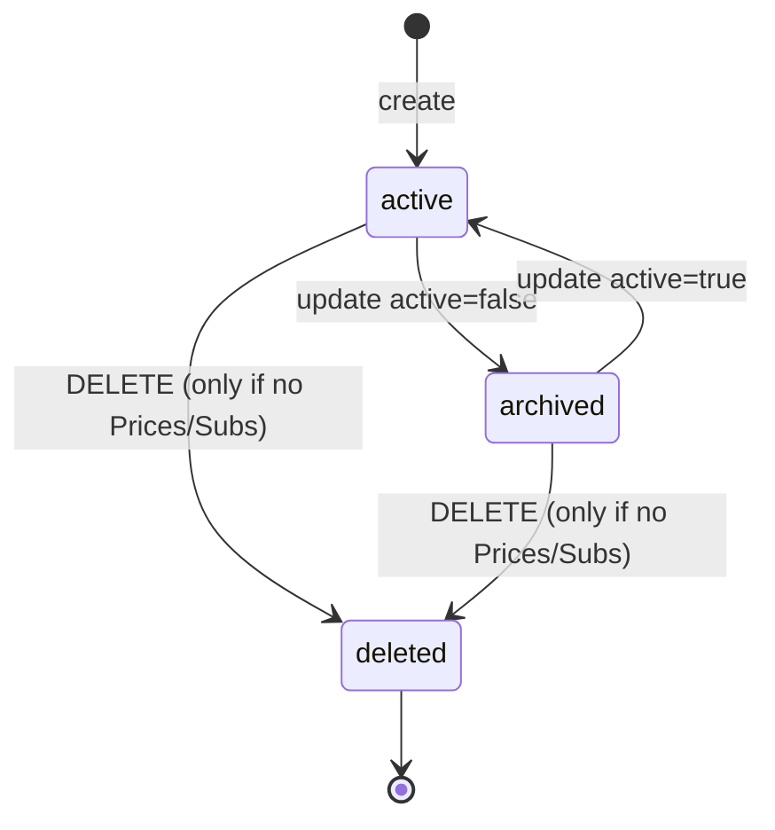
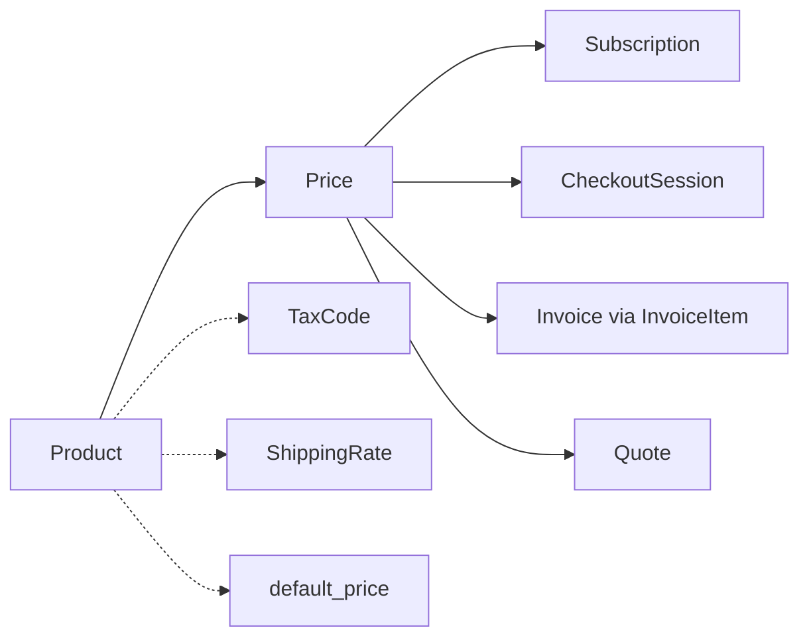

# Product

> API resource: `product` · API version: `2026-04-22.dahlia` · Category: [Products & catalog](README.md)

## What it is

A `Product` is the *thing* you sell — its name, description, images, marketing features, and tax classification. It's the catalog entry, the row in your "what we offer" table. Crucially, **a Product carries no price information.** Pricing — amount, currency, billing cadence, tiering — lives on one or more [Price](prices.md) objects that point back at the Product.

A Product can be a recurring SaaS plan ("Acme Pro"), a digital download ("Lightroom Preset Pack"), a physical good ("Hoodie XL"), or a service ("Onboarding Hour"). Stripe doesn't care which; the `type` field exists but is mostly cosmetic in modern flows.

## Why it exists

Splitting the catalog into Product + Price is the single most useful design decision Stripe Billing made. With a Product, you can:

- Sell the same offering at different price points (`$10/mo` and `$100/yr` and `€9/mo`) without duplicating the *what*.
- A/B test pricing without rewriting copy.
- Migrate customers from an old Price to a new one while keeping the Product identity (analytics, features, name) constant.
- Show a single "Acme Pro" SKU in your UI even though five Prices reference it under the hood.

Without a Product object, every Price would have to redundantly carry name/description/images, and "show me everyone subscribed to Pro" would be a string match on description text.

## Lifecycle & states

Products don't have a `status` enum. The relevant state is `active` vs. archived (`active=false`) and a hard-delete corner case.



### `active` (default)

Live and selectable. Shows up in Checkout, Payment Links, the Dashboard catalog UI. New Prices can be created against it. New Subscriptions and Checkout Sessions can reference its Prices.

### archived (`active: false`)

Soft-hidden. Existing Subscriptions and Invoices keep working — Stripe never breaks an in-flight billing relationship just because you archived a Product. But:

- The Product no longer appears in default Dashboard listings (toggle "Show archived" to see it).
- You **cannot create new Checkout Sessions or Payment Links** referencing its Prices.
- You **can still create Subscriptions via API** referencing its Prices (Stripe doesn't block API creation, only hosted-flow creation).

Archive when you're sunsetting an offering but still want existing customers undisturbed.

### `deleted`

You can `DELETE /v1/products/:id` **only if** no Prices reference it (or all referencing Prices were created with the Dashboard one-off mode and have no live Subscriptions/Invoices). Practically: once you've created any persistent Price for a Product, archive is your only "make it go away" option. The Product ID is permanent in that case.

> **Why hard-delete is restricted.** Invoices, Subscriptions, and historical analytics carry the Product ID forever. Allowing arbitrary deletion would leave dangling references in tax documents and reports.

## Anatomy of the object

### Identity

| Field | Notes |
|---|---|
| `id` | `prod_…`. You can also pass your own ID at creation (e.g. `prod_acme_pro`). |
| `object` | always `"product"`. |
| `livemode` | true in live, false in test. |
| `created`, `updated` | unix seconds. |
| `metadata` | your bag — 50 keys / 500 chars each. |

### Display

| Field | Notes |
|---|---|
| `name` | Required. Customer-facing. Shows on Checkout, hosted invoice, receipts. |
| `description` | Free text. Shows on Checkout next to the name, on receipts, on PDF invoices. |
| `images` | Array of up to 8 image URLs. Used in Checkout and Payment Links. Must be HTTPS. |
| `marketing_features` | Array of `{ name }` — bullet points displayed in hosted UIs (Checkout, Pricing Tables, Customer Portal plan picker). |
| `url` | Optional URL to your own product page. Surfaces in some hosted flows and Tax exports. |

### Catalog metadata

| Field | Notes |
|---|---|
| `active` | Boolean. `false` means archived (see lifecycle). |
| `type` | `service` (default) or `good`. **Mostly cosmetic now.** Used historically to distinguish digital from physical; modern flows lean on `tax_code` + `shippable` instead. |
| `default_price` | `price_…`. A shortcut to "the canonical price for this product." Set/read by Checkout's no-Price-ID flow. Optional — most catalogs don't bother with it and pass Price IDs explicitly. |
| `tax_code` | `txcd_…`. References a [TaxCode](tax-codes.md). Required for Stripe Tax to compute jurisdiction-specific rates. Without one, Stripe Tax falls back to your account's default category. |
| `unit_label` | Singular noun for the unit being priced (e.g. `seat`, `API call`, `hour`). Renders on Checkout/invoices as `"$10 per seat"`. |
| `statement_descriptor` | The Product-level override for what shows on the customer's bank statement. Sub/Invoice/Charge can override further. Max 22 chars. |

### Physical-goods fields

| Field | Notes |
|---|---|
| `shippable` | Boolean. Tells Checkout to collect a shipping address and to make [ShippingRate](shipping-rates.md) selection available. |
| `package_dimensions` | `{ height, length, weight, width }` — used by some shipping integrations and by tax engines for jurisdictional classification. |

### Relations

| Field | Notes |
|---|---|
| `prices` | NOT a field on the object — fetch with `GET /v1/prices?product=prod_…`. |

## Relationships



- A Product **must exist before** any Price referencing it. (Or both can be created in one API call by passing `product_data` to `POST /v1/prices`.)
- A Price **cannot move between Products.** Its `product` link is immutable. To re-parent, create a new Price.
- Archiving a Product does **not** auto-archive its Prices (or vice versa). They have independent `active` flags.

## Common workflows

### 1. Create Product + Price together

The shortcut for a brand-new offering:

```http
POST /v1/prices
  currency=usd
  unit_amount=1000
  recurring[interval]=month
  product_data[name]=Acme Pro
  product_data[tax_code]=txcd_10103000
```

Stripe creates the Product and the Price atomically. The response is the Price; the Product is referenced by ID.

### 2. Create Product, then add multiple Prices

```http
POST /v1/products
  name=Acme Pro
  description=Everything in Basic plus team features
  tax_code=txcd_10103000
  marketing_features[0][name]=Unlimited projects
  marketing_features[1][name]=Priority support
  metadata[plan_tier]=pro
```

Then:

```http
POST /v1/prices  product=prod_…  currency=usd  unit_amount=1000  recurring[interval]=month
POST /v1/prices  product=prod_…  currency=usd  unit_amount=10000 recurring[interval]=year
POST /v1/prices  product=prod_…  currency=eur  unit_amount=900   recurring[interval]=month
```

Three Prices, one Product.

### 3. Update display copy

```http
POST /v1/products/prod_…
  name=Acme Pro (2026)
  description=Now with AI assist
```

Safe at any time. **Already-issued invoices and receipts don't retroactively update** — they snapshot the Product name at the moment of issuance.

### 4. Archive a sunset plan

```http
POST /v1/products/prod_…
  active=false
```

Existing Subscriptions keep billing. Hosted Checkout/Payment Link creation against its Prices is now blocked.

### 5. Assign a default Price

```http
POST /v1/products/prod_…
  default_price=price_…
```

Lets some shorter Checkout/Payment Link flows reference the Product directly without naming a Price.

### 6. Add marketing features displayed in hosted UIs

```http
POST /v1/products/prod_…
  marketing_features[0][name]=Unlimited seats
  marketing_features[1][name]=24/7 support
  marketing_features[2][name]=SOC 2 reports
```

Renders as bullets on Checkout and the Pricing Table embed.

## Webhook events

| Event | Fires when | Listener typically does |
|---|---|---|
| `product.created` | A Product is created. | Sync to your catalog cache. |
| `product.updated` | Any field change including `active` toggle. | Re-sync; refresh hosted-page caches. |
| `product.deleted` | Hard-deleted (only possible if no Prices/Subs). | Remove from local catalog. |

> Most teams keep their own catalog table in sync via webhooks rather than reading from Stripe on every request — Stripe is the source of truth for IDs and pricing, but read-latency matters for customer-facing pages.

## Idempotency, retries & race conditions

- `POST /v1/products` accepts `Idempotency-Key`. Use it — accidentally creating two `prod_acme_pro_v2` records is annoying to clean up.
- Pass an explicit `id` (e.g. `id=prod_acme_pro_v2`) for fully idempotent catalog provisioning from your build pipeline.
- `product.updated` fires on every field change including `metadata`. Idempotent handlers are mandatory.
- A `product.updated` event with `active: false` and an in-flight Checkout Session created moments earlier will *not* invalidate the Session — but the next Session attempt will fail. Don't rely on the webhook to enforce "stop selling" in real time.

## Test-mode tips

- Test-mode Products are completely separate from live-mode Products. IDs do not cross.
- The Stripe Dashboard has a "Copy to live mode" button on Products — useful when seeding a live catalog from a test one. **Prices, TaxCodes, and Coupons each have their own copy buttons.** Plan to copy them all.
- `stripe products create --name "Acme"` via CLI is the fastest way to seed.
- Use `stripe fixtures` to bring up a full Product → Price → Customer → Subscription tree in one shot.

## Connect considerations

- Products are scoped per Stripe account. A Product on the platform account is invisible to a connected account and vice versa.
- For *direct charge* Connect setups, the connected account creates and owns its Products. The platform doesn't see them.
- For *destination charge* setups, the platform creates Products on its own account; the connected account only ever appears as the funds-routing destination.
- A Product copied between accounts gets a new ID. Don't hardcode IDs across environments.

## Common pitfalls

- **Stuffing pricing logic into Product fields.** Amount, currency, recurrence, tiers all belong on Price. The Product should be display-only.
- **Trying to delete a Product to "remove a typo."** If any Price exists, you can't. Use `name` updates and `active=false` instead.
- **Assuming `active=false` cancels Subscriptions.** It doesn't. Existing Subs keep billing; the Price stays chargeable via API. To stop new sign-ups *and* existing customers, also cancel their Subs.
- **Forgetting `tax_code`.** Without it, Stripe Tax falls back to a generic category, which can produce wrong VAT/sales-tax rates. Set the right `txcd_…` per Product.
- **Mixing live and test IDs.** A `prod_…` from test won't resolve in live. Most "404 product not found" reports trace back to this.
- **Updating `name` and expecting issued invoices to change.** Invoices snapshot at finalization. Old invoices keep the old name.
- **Using `type=good` to flag physical inventory.** That field is largely vestigial. Use `shippable=true` and a physical-goods `tax_code` instead.

## Further reading

- [API reference: Product](https://docs.stripe.com/api/products/object)
- [Products and prices guide](https://docs.stripe.com/products-prices/overview)
- [Marketing features](https://docs.stripe.com/products-prices/manage-prices#marketing-features)
- [Stripe Tax + tax codes](https://docs.stripe.com/tax/tax-codes)
