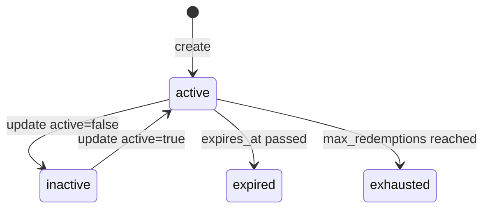
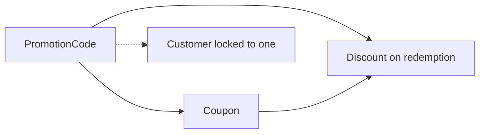

# Promotion Code

> API resource: `promotion_code` · API version: `2026-04-22.dahlia` · Category: [Products & catalog](README.md)

## What it is

A `PromotionCode` is the **customer-facing string** — `BLACKFRIDAY20`, `WELCOME10`, `EARLYBIRD` — that a customer types into a Checkout, Payment Link, or Customer Portal field to redeem a discount. Behind the scenes, the PromotionCode points at exactly one [Coupon](coupons.md), which defines the actual discount math.

PromotionCode is the redemption layer: it adds restrictions (one-per-customer, minimum order amount, expiry), tracks per-code redemption counts, and decouples the customer-visible string from the internal Coupon ID. One Coupon can have many PromotionCodes ("20% off Q4" might be reachable as `BFCM20`, `EARLYBIRD20`, `LASTCHANCE20`).

## Why it exists

Coupons alone are awkward for self-serve flows:

- Coupon IDs are arbitrary strings often picked for the back-office (`bfcm_2026_pro_only`); you don't want customers typing those.
- Coupons don't have customer-facing restrictions (`first_time_transaction`, minimum amount).
- Marketing wants to issue and rotate codes without touching the underlying discount config.
- You may want to give a single high-value customer their own personal code without exposing it to anyone else.

PromotionCodes solve all of that. They are essentially a "customer-friendly redemption wrapper" around a Coupon.

## Lifecycle & states

PromotionCodes have an `active` boolean, plus the same caps the underlying Coupon has.



Note: Stripe doesn't model `expired` or `exhausted` as separate field values — they're implicit from `expires_at`/`times_redeemed`. The `active` boolean is the one explicit toggle.

### `active: true`

The code can be redeemed. Stripe still validates against the underlying Coupon's `valid` flag, the PromotionCode's own `expires_at`, `max_redemptions`, and `restrictions`.

### `active: false`

You manually deactivated it. Cannot be redeemed. **Existing Discounts already created from this PromotionCode keep going** — same rule as Coupon deletion.

### Implicit expired/exhausted

When `expires_at` is in the past, or `times_redeemed >= max_redemptions`, redemption attempts return a 400 with a `"promotion_code_inactive"` or similar error code.

## Anatomy of the object

### Identity

| Field | Notes |
|---|---|
| `id` | `promo_…`. Stripe-generated. **Not** the customer-facing string. |
| `object` | always `"promotion_code"`. |
| `created`, `livemode`, `metadata` | standard. |

### The customer-facing string

| Field | Notes |
|---|---|
| `code` | The string the customer types. **Case-sensitive in the API** but Stripe normalizes to uppercase on most surfaces (Checkout matches case-insensitively). Letters and numbers, no spaces. Must be unique per Coupon (you can have `WELCOME10` redeeming Coupon A and `WELCOME10` redeeming Coupon B *only if* you scope them differently — but in practice keep codes globally unique to avoid confusion). If you don't pass `code`, Stripe generates a random one. |

### Coupon link

| Field | Notes |
|---|---|
| `coupon` | `coupon_id` of the underlying Coupon. **Immutable.** Defines the discount's math, duration, and Product scope. |

### Caps & scoping

| Field | Notes |
|---|---|
| `active` | Boolean. Manual toggle. |
| `expires_at` | Unix seconds. Hard expiry independent of the Coupon's `redeem_by`. The earlier of the two wins. |
| `max_redemptions` | Cap on redemptions of *this code* (separate from the Coupon's global `max_redemptions`). |
| `times_redeemed` | Stripe-incremented counter. |
| `customer` | If set, only this `cus_…` may redeem. Useful for personal codes ("here's a recovery discount, just for you"). Once set, no other customer can use the code. |

### Restrictions

| Field | Notes |
|---|---|
| `restrictions.first_time_transaction` | Boolean. If true, the redeeming customer must have no prior successful Charges on your account. Stripe-enforced. |
| `restrictions.minimum_amount` | Integer in cents. The order subtotal must meet this minimum. |
| `restrictions.minimum_amount_currency` | Required when `minimum_amount` is set. |
| `restrictions.currency_options` | Per-currency `minimum_amount` map for international flows. |

## Relationships



A redemption creates a [Discount](discounts.md) that references both the PromotionCode (`promotion_code` field) and its underlying Coupon (`coupon` field).

## Common workflows

### 1. Public sitewide promo

```http
POST /v1/promotion_codes
  coupon=BLACKFRIDAY_20PCT
  code=BLACKFRIDAY20
  expires_at=1735689600
  max_redemptions=10000
  restrictions[first_time_transaction]=true
```

Hand the string `BLACKFRIDAY20` to marketing. Customers enter it on Checkout (`allow_promotion_codes=true` must be set on the Session) or in the Customer Portal.

### 2. Personalized recovery code

```http
POST /v1/promotion_codes
  coupon=APOLOGY_50PCT
  code=SORRY_JANE_X9F
  customer=cus_jane_…
  max_redemptions=1
  expires_at=…
```

Only Jane can use this code, exactly once. Even if her friend gets the string, redemption fails for them.

### 3. Minimum-order promo

```http
POST /v1/promotion_codes
  coupon=TEN_OFF_FIFTY
  code=TENOFF50
  restrictions[minimum_amount]=5000
  restrictions[minimum_amount_currency]=usd
```

Code only applies if the order subtotal is ≥ $50.

### 4. Auto-generate the code string

```http
POST /v1/promotion_codes
  coupon=REFERRAL_10
  customer=cus_…
```

No `code` passed — Stripe generates a random short string. Useful for in-app referral generation.

### 5. Allow redemption in Checkout

When creating the Session:

```http
POST /v1/checkout/sessions
  ...
  allow_promotion_codes=true
```

Stripe renders a "Add promotion code" link. The customer types `BLACKFRIDAY20`; Stripe matches case-insensitively against active codes for this account.

### 6. Redeem programmatically

If your UI collects the code outside of Checkout, look it up server-side and apply via [Discount](discounts.md):

```http
GET /v1/promotion_codes?code=BLACKFRIDAY20&active=true
# returns the promo_… ID

POST /v1/subscriptions/sub_…
  discounts[0][promotion_code]=promo_…
```

Stripe validates restrictions server-side; an invalid code returns a 400 you can show the customer.

### 7. Deactivate a leaked code

```http
POST /v1/promotion_codes/promo_…
  active=false
```

Future redemption blocked. Existing Discounts continue.

## Webhook events

There are no `promotion_code.*` events in the catalog. The signals you watch are:

| Event | Fires when | Listener typically does |
|---|---|---|
| `customer.discount.created` | A code was successfully redeemed. | Track redemption analytics; show "promo applied" in your UI. |
| `customer.discount.deleted` | A redeemed Discount was removed. | Update pricing display. |
| `customer.subscription.updated` | When a sub gets/loses a discount. | Resync. |

To see PromotionCode-level redemption counts, refetch the PromotionCode (`times_redeemed`) — there's no event stream specifically for it.

## Idempotency, retries & race conditions

- `POST /v1/promotion_codes` accepts `Idempotency-Key`. **Use it especially when generating codes from user actions** (e.g. referral signups) — a double-submit can produce two codes for the same intent.
- Redemption is racy when `max_redemptions=1` and two customers click "Apply" within the same millisecond. Stripe enforces atomicity: exactly one wins. The loser gets `"promotion_code_inactive"` and you should display "this code is no longer available."
- `code` uniqueness across active codes is enforced. Trying to create `BLACKFRIDAY20` while another active PromotionCode has the same code returns a 400.
- Deactivation is immediate; pre-existing in-flight Checkout Sessions that already validated the code (but not yet completed) may still complete with the discount applied — Stripe doesn't kill the Session.

## Test-mode tips

- `stripe promotion_codes create --coupon=COUPON_ID --code=TESTCODE` for fast fixtures.
- `restrictions.first_time_transaction` is true if the customer has *no successful Charges*. In test mode, create the customer fresh to test the "first time" path.
- Pair with [TestClock](../06-billing/test-clocks.md) to test `expires_at`-based behavior without waiting.
- Test all your error UIs: invalid code, expired code, exhausted code, minimum-not-met, customer-locked-to-other-customer. Each returns a different error code from `POST /v1/checkout/sessions` or the redemption call.

## Connect considerations

- PromotionCodes are scoped per Stripe account. Platform-side codes can't be redeemed on a connected account's checkout, and vice versa.
- For *direct charge* Connect, the connected account owns its own PromotionCodes and Coupons. Platform-issued promos do nothing on connected-account flows.
- For *destination charge* Connect, the platform's PromotionCodes work normally on platform Sessions; the discount reduces the platform Invoice/Subscription before the transfer to the connected account.

## Common pitfalls

- **Forgetting `allow_promotion_codes=true` on Checkout Sessions.** Without it, the "Add promotion code" link doesn't render — codes can't be entered, and customer support gets the angry email.
- **Codes with spaces, lowercase, or punctuation.** Stripe normalizes uppercase-letters + numbers; spaces and most punctuation will silently fail validation. Stick to `[A-Z0-9]{3,32}`.
- **Expecting `max_redemptions` to be per-customer.** It's *total*. For one-per-customer, use `restrictions.first_time_transaction=true` (limits to never-charged customers) or use the `customer` field for a personal code.
- **Reusing the same `code` across Coupons.** The API allows two codes with the same `code` string only when one is inactive. In Checkout the customer can't pick which Coupon they meant — first match wins. Don't do this.
- **Treating PromotionCode = Discount.** PromotionCode is the *redeemable string*; Discount is what gets created when someone successfully redeems. Inspect the Discount on the Customer/Subscription, not the PromotionCode, to know "is this customer currently discounted?"
- **Letting expired codes appear in your UI.** Stripe blocks redemption, but if your storefront still advertises `OLDCODE`, customers will rage. Use the webhook on `customer.discount.created` to sync redemption counts and your own display logic for expiry.
- **Deactivating a leaked code without telling customers.** Redemptions in-flight may still complete. Be ready to refund-via-CreditNote if a fraud wave used the code in the seconds before deactivation.

## Further reading

- [API reference: PromotionCode](https://docs.stripe.com/api/promotion_codes/object)
- [Coupons & promotion codes guide](https://docs.stripe.com/billing/subscriptions/coupons)
- [Allow promotion codes in Checkout](https://docs.stripe.com/payments/checkout/discounts)
- [Coupon (the underlying template)](coupons.md)
- [Discount (the redemption record)](discounts.md)
