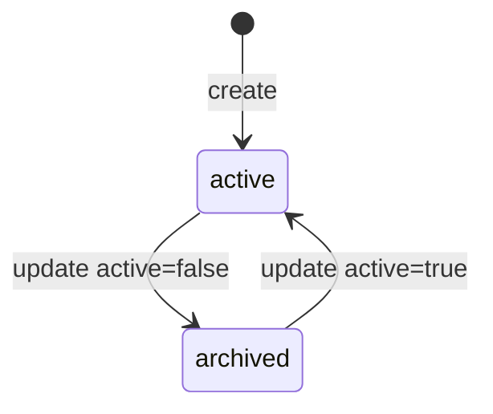
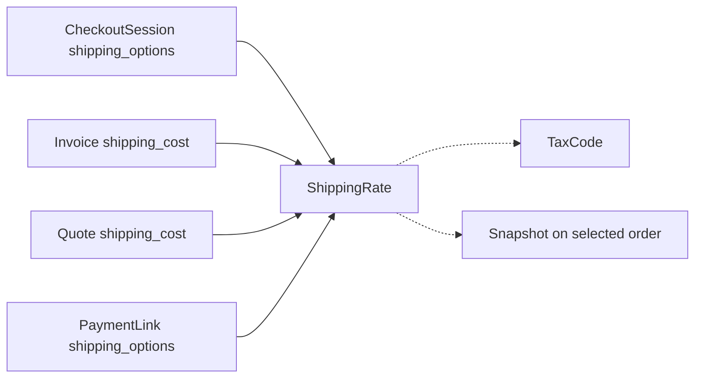

# Shipping Rate

> API resource: `shipping_rate` · API version: `2026-04-22.dahlia` · Category: [Products & catalog](README.md)

## What it is

A `ShippingRate` is a **reusable shipping option** — a named, priced (and optionally tax-coded, ETA-bearing) line item that Checkout, Quotes, and Invoices can offer to a customer. The customer (or you, programmatically) picks one; its price is added to the order as a separate "Shipping" line.

Each ShippingRate captures: a display label ("Standard — 5–7 business days"), a fixed amount in one or more currencies, an optional delivery estimate, and a tax classification. ShippingRates are catalog objects, not per-order — define them once and reference them from many Checkout Sessions / Invoices / Quotes.

## Why it exists

Shipping cost is a recurring requirement for any catalog that ships physical goods, but it's not just a number — it's a *menu*. Customers want to choose between "Standard $5" and "Express $20." Each option has its own ETA, tax treatment, and per-currency pricing. Stripe extracts that into a first-class object so:

- Hosted Checkout can render a radio-button shipping picker.
- Invoices can show shipping as a properly tax-treated line, not buried in a description.
- The same set of options can be offered consistently across Checkout / Payment Links / Quotes / Invoices.
- You can A/B test shipping prices without rewriting per-order math.

## Lifecycle & states

ShippingRates have only `active` / archived. No DELETE.



### `active: true`

Selectable in new Checkout Sessions, Invoices, Quotes. Renders in the shipping picker.

### `active: false`

Hidden from new use. **Existing Checkout Sessions, Invoices, and Quotes that already reference it are unaffected.** Once selected by a customer in Checkout and recorded on the Session as `shipping_cost`, the rate is snapshotted and survives archive.

There is **no DELETE for ShippingRates.** Archive is the only retire path. The ID is permanent so historical orders can resolve it.

## What is and isn't mutable

After creation you can edit:

- `active` (toggle archive)
- `metadata`
- `tax_behavior` — **only once**, only from `unspecified` → `inclusive` or `exclusive`. Not reversible.

You **cannot** edit:

- `display_name`
- `type`
- `fixed_amount.amount`, `fixed_amount.currency`, `fixed_amount.currency_options`
- `delivery_estimate`
- `tax_code`

To change the price or estimate, create a new ShippingRate and switch references.

## Anatomy of the object

### Identity

| Field | Notes |
|---|---|
| `id` | `shr_…`. |
| `object` | always `"shipping_rate"`. |
| `created`, `livemode`, `metadata` | standard. |
| `active` | Boolean. See lifecycle. |

### Display

| Field | Notes |
|---|---|
| `display_name` | Required. Customer-facing label, shown in the Checkout shipping picker and on invoices ("Standard shipping", "FedEx Overnight"). |

### Type & price

| Field | Notes |
|---|---|
| `type` | Currently always `"fixed_amount"`. Stripe reserves the field for future calculator-style options. |
| `fixed_amount.amount` | Integer in smallest currency unit (cents). |
| `fixed_amount.currency` | ISO 4217 lowercase. |
| `fixed_amount.currency_options` | Map `{ currency: { amount, tax_behavior } }` — one ShippingRate priced for many currencies. The customer's checkout currency must match an option (no FX fallback). |

### Delivery estimate

| Field | Notes |
|---|---|
| `delivery_estimate.minimum.unit` | `hour | day | business_day | week | month`. |
| `delivery_estimate.minimum.value` | Integer. |
| `delivery_estimate.maximum.unit` / `value` | Optional max bound. |

Renders on Checkout as "Arrives in 5–7 business days." Pure display — Stripe doesn't enforce or track actual delivery.

### Tax

| Field | Notes |
|---|---|
| `tax_behavior` | `inclusive | exclusive | unspecified`. Same semantics as on [Price](prices.md). Set `exclusive` to add tax on top, `inclusive` to back-compute tax from the shipping price. |
| `tax_code` | `txcd_…` from [TaxCode](tax-codes.md). Typically `txcd_92010001` ("Shipping") and adjacent. Drives Stripe Tax's per-jurisdiction shipping treatment. Without it, Stripe Tax falls back to the account default — likely wrong. |

## Relationships



When a customer picks a ShippingRate, the parent (Session/Invoice/Quote) records:

- `shipping_cost.shipping_rate` — the `shr_…` ID.
- `shipping_cost.amount_subtotal` — the chosen amount.
- `shipping_cost.amount_tax` — tax on shipping (if applicable).
- `shipping_cost.amount_total` — final shipping including tax.

That snapshot is immutable; archiving the underlying ShippingRate doesn't disturb it.

## Common workflows

### 1. Create a basic standard-shipping rate

```http
POST /v1/shipping_rates
  display_name=Standard shipping
  type=fixed_amount
  fixed_amount[amount]=500
  fixed_amount[currency]=usd
  tax_behavior=exclusive
  tax_code=txcd_92010001
  delivery_estimate[minimum][unit]=business_day
  delivery_estimate[minimum][value]=5
  delivery_estimate[maximum][unit]=business_day
  delivery_estimate[maximum][value]=7
```

### 2. Free shipping option

```http
POST /v1/shipping_rates
  display_name=Free shipping
  type=fixed_amount
  fixed_amount[amount]=0
  fixed_amount[currency]=usd
  tax_behavior=exclusive
```

`amount=0` is fine. Stripe still records the line; tax engines see $0.

### 3. Multi-currency

```http
POST /v1/shipping_rates
  display_name=International shipping
  type=fixed_amount
  fixed_amount[amount]=1500
  fixed_amount[currency]=usd
  fixed_amount[currency_options][eur][amount]=1400
  fixed_amount[currency_options][eur][tax_behavior]=inclusive
  fixed_amount[currency_options][gbp][amount]=1200
  delivery_estimate[minimum][unit]=week
  delivery_estimate[minimum][value]=2
  delivery_estimate[maximum][unit]=week
  delivery_estimate[maximum][value]=4
```

The customer's Checkout currency must match one of the options.

### 4. Offer multiple options at Checkout

```http
POST /v1/checkout/sessions
  ...
  shipping_address_collection[allowed_countries][]=US
  shipping_address_collection[allowed_countries][]=CA
  shipping_options[0][shipping_rate]=shr_standard
  shipping_options[1][shipping_rate]=shr_express
  shipping_options[2][shipping_rate]=shr_free
```

Customer sees a radio list with all three. Selection lands as `shipping_cost` on the completed Session, and as a "Shipping" line on the resulting Invoice (when one is generated).

### 5. Inline (one-off) shipping rate on a Session

If a rate is so per-order that registering it isn't worth it, pass `shipping_rate_data` instead of `shipping_rate`:

```http
POST /v1/checkout/sessions
  ...
  shipping_options[0][shipping_rate_data][display_name]=Local pickup
  shipping_options[0][shipping_rate_data][type]=fixed_amount
  shipping_options[0][shipping_rate_data][fixed_amount][amount]=0
  shipping_options[0][shipping_rate_data][fixed_amount][currency]=usd
```

Stripe creates an unlisted ShippingRate behind the scenes. Use sparingly; the catalog approach is cleaner.

### 6. Set on an Invoice / Subscription

```http
POST /v1/invoices/in_…
  shipping_cost[shipping_rate]=shr_…
```

Only valid while the Invoice is `draft`. Once finalized, the shipping line is frozen.

### 7. Retire a rate

```http
POST /v1/shipping_rates/shr_…
  active=false
```

Existing references continue. New Sessions can no longer offer it.

## Webhook events

There are no `shipping_rate.*` events in the catalog. Stripe doesn't emit lifecycle events for ShippingRates. The signals you watch are:

- `checkout.session.completed` — read `shipping_cost.shipping_rate` to know what the customer picked.
- `invoice.created` / `invoice.finalized` — read `shipping_cost` and `amount_shipping` for the rendered shipping line.

To track ShippingRate-level configuration changes, log them in your own deployment pipeline.

## Idempotency, retries & race conditions

- `POST /v1/shipping_rates` accepts `Idempotency-Key`. Use it.
- Customer's Checkout selection is recorded on the Session atomically with `checkout.session.completed`. Don't read shipping selection from your own logic — read it from the Session.
- Archiving a ShippingRate while a customer is mid-Checkout is safe: the Session was created with a snapshot of the rate. The customer can still complete.
- `tax_behavior=unspecified` causes Stripe Tax to skip computing tax on shipping — set it explicitly when Stripe Tax is enabled.

## Test-mode tips

- Stripe CLI: `stripe shipping_rates create --display-name="Standard" --type=fixed_amount --fixed-amount-amount=500 --fixed-amount-currency=usd`.
- Test-mode rates are isolated from live.
- Test the multi-rate Checkout picker by creating 2–3 rates and listing them in `shipping_options` — verify the picker UI and the `checkout.session.completed` event payload's `shipping_cost`.
- For Stripe-Tax-on-shipping behavior, use the documented test addresses to provoke specific jurisdictional outcomes.

## Connect considerations

- ShippingRates are scoped per Stripe account.
- For *direct charge* Connect, the connected account creates and manages its own ShippingRates.
- For *destination charge* setups, the platform's ShippingRates apply to the platform's Session/Invoice; the shipping amount flows through `transfer_data.amount` to the connected account along with the rest of the order net.
- A Connect-platform-style multi-vendor cart (different sellers in one order) cannot be expressed natively — Stripe assumes one merchant per Checkout Session. ShippingRates can't be split across vendors in one Session.

## Common pitfalls

- **Forgetting `tax_code`.** Without it, Stripe Tax silently uses the account default for shipping — which often produces wrong rates (some jurisdictions tax shipping, some don't, some only if it's separate from goods). Set `txcd_92010001` (or appropriate variant) explicitly.
- **Setting `tax_behavior=unspecified` and enabling Stripe Tax.** Stripe Tax can't compute on `unspecified` — shipping line ends up untaxed even when it should be.
- **Trying to edit `fixed_amount.amount`.** You can't. Create a new ShippingRate.
- **Missing `shipping_address_collection` on Checkout.** Without it, the customer can't pick a shipping address, so even shipping options of bullet-proof config won't render.
- **Inline `shipping_rate_data` proliferation.** Each inline definition creates a new ShippingRate behind the scenes. Over time you accumulate hundreds of one-off rates in the API listing. Use named ShippingRates whenever a rate is reused.
- **Using a `currency_options` rate with a customer locked to an unlisted currency.** Checkout fails. Always include the currencies you actually serve.
- **Treating shipping as a Product line item.** Shipping is its own object on the Session/Invoice (`shipping_cost`), not a regular Price line. Don't model it as a hidden Product to hack around the picker — Stripe's first-class shipping handling is meaningfully better for tax and reporting.
- **Setting `delivery_estimate` and assuming Stripe enforces it.** It's pure display. If you need actual fulfillment SLAs, that's your operational system, not Stripe.

## Further reading

- [API reference: ShippingRate](https://docs.stripe.com/api/shipping_rates/object)
- [Collect shipping address & rates in Checkout](https://docs.stripe.com/payments/checkout/shipping)
- [Shipping in Invoices](https://docs.stripe.com/invoicing/integration/shipping)
- [TaxCode for shipping classifications](tax-codes.md)
