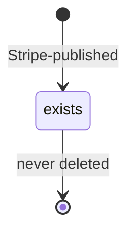
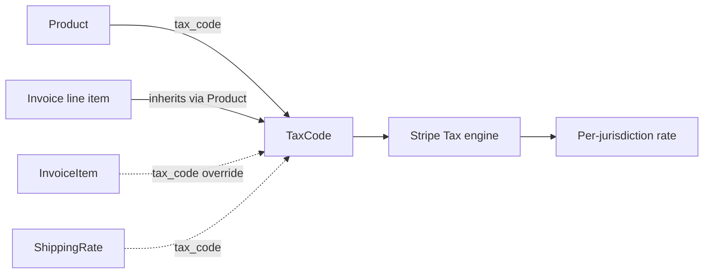

# Tax Code

> API resource: `tax_code` · API version: `2026-04-22.dahlia` · Category: [Products & catalog](README.md)

## What it is

A `TaxCode` is one entry in Stripe's **product taxonomy** — a curated list of `txcd_…` IDs that classify what a [Product](products.md) is for tax purposes. Stripe Tax reads the tax code on each product and figures out the right rate for the customer's jurisdiction (US sales tax, EU VAT, UK VAT, Australian GST, Canadian PST/HST, etc.).

The catalog is **read-only**. You don't create tax codes; you `GET` them and assign the right one to your Products. There are several hundred, organized by category: digital goods, SaaS, physical goods, food, professional services, downloadable software, streaming, telephony, and so on.

## Why it exists

Tax law is jurisdictional and category-sensitive. The same dollar amount might be taxed at 0% (food, exempt SaaS jurisdiction), 8% (US state sales tax on physical goods), 20% (UK VAT on standard-rated services), or 27% (Hungarian VAT). Computing the right number requires knowing *what was sold*, not just *how much*.

Tax codes are Stripe's interlingua between your catalog and Stripe Tax's jurisdictional engine. By tagging your `Product` with `tax_code=txcd_10103000` ("Software as a Service"), you're telling Stripe Tax: "treat invoices for this product as SaaS for the purposes of every jurisdiction that taxes SaaS differently from, say, physical goods." Stripe then handles per-state, per-country variation invisibly.

## Lifecycle & states

TaxCodes are a global, immutable, read-only catalog maintained by Stripe. There's no lifecycle on your end.



Stripe occasionally adds new tax codes (jurisdictions and categories evolve). Existing IDs don't change. You'll never see a `tax_code.deleted` event.

## Anatomy of the object

| Field | Notes |
|---|---|
| `id` | `txcd_…` — opaque identifier. Stable forever. |
| `object` | always `"tax_code"`. |
| `name` | Short human-readable label, e.g. `"Software as a Service"`, `"Books - printed"`, `"Streaming - audio"`. |
| `description` | Longer explanation of scope and intent — useful when picking between near-similar codes (e.g. "Software downloaded" vs. "Software accessed via SaaS"). |

There are no metadata, currency, or amount fields. TaxCode is a label.

## How TaxCode plugs in



- Set `tax_code` on the [Product](products.md) — every line that references that Product inherits it.
- An [InvoiceItem](../06-billing/invoice-items.md) can override with its own `tax_code` for line-by-line variation (e.g. "this one-off line is consulting, not the SaaS we usually invoice for").
- [ShippingRate](shipping-rates.md) carries its own `tax_code` (typically `txcd_92010001` "Shipping") so shipping is taxed appropriately.
- If no `tax_code` is set anywhere, Stripe Tax falls back to your account's **default product tax category** (Settings → Tax → Tax categories). The default is usually `txcd_10000000` ("General — Tangible Goods") — likely *not* what you want for a SaaS company.

## Important categories

A non-exhaustive map of common ones (look up the exact `txcd_…` in the Dashboard or via API):

| Category | Examples |
|---|---|
| **SaaS / cloud software** | "Software as a Service" — most modern recurring-billing companies. |
| **Downloadable software** | Distinct from SaaS in many US states (e.g. taxed as tangible personal property). |
| **Digital content** | E-books, audiobooks, streaming audio/video, online courses. Each has its own code; treatment varies wildly by jurisdiction. |
| **Physical goods** | Apparel, books, electronics, food (taxed often differently from non-food). |
| **Professional services** | Consulting, design, legal — often tax-exempt or zero-rated in many jurisdictions. |
| **Telecommunications** | Subject to special telecom taxes in many US states. |
| **Shipping & handling** | `txcd_92010001` and adjacent. Shipping is its own taxable thing. |
| **Gift cards / vouchers** | Usually not taxed at point of sale; tax applies on redemption. There's a code for this. |

Always read the `description` before picking — "Software downloaded" vs "Software as a Service" produces materially different US sales tax outcomes.

## Common workflows

### 1. List the catalog

```http
GET /v1/tax_codes
GET /v1/tax_codes?limit=100&starting_after=txcd_…
```

Returns the global catalog. Cache it locally — it changes maybe a few times per year.

### 2. Look up by name (no API filter, just paginate)

There's no `name` filter. Either fetch all and filter client-side, or use the Dashboard's tax-code picker (much faster) and copy the `txcd_…` ID into your code.

### 3. Tag a Product

```http
POST /v1/products/prod_acme_pro
  tax_code=txcd_10103000
```

Done. Future Invoices for this Product compute tax via Stripe Tax using this category.

### 4. Override on a one-off InvoiceItem

```http
POST /v1/invoiceitems
  customer=cus_…
  amount=50000
  currency=usd
  description=Onboarding consulting
  tax_code=txcd_20030000   # professional services
```

Even though the customer's main Subscription is SaaS, this line bills as professional services.

### 5. Set a default category for the account

In the Dashboard: Settings → Tax → "Default product tax category." Stripe applies this when a Product has no `tax_code`. Pick the one most of your catalog falls under — usually SaaS for software companies.

## Webhook events

There are no `tax_code.*` events. The catalog is read-only and Stripe-managed; changes happen on Stripe's side and propagate silently. If you cache locally, refresh on a periodic schedule (monthly is plenty).

## Idempotency, retries & race conditions

- TaxCode is read-only. Caching is safe and recommended; the catalog is small (a few hundred entries) and stable.
- Setting `tax_code` on a Product is idempotent — re-PUT the same value as a no-op.
- Tax computation at Invoice finalization reads the *current* `tax_code` on the Product/InvoiceItem at that moment. If you change a Product's `tax_code` mid-cycle, draft invoices recompute on next read; finalized invoices are frozen with whatever code applied at finalization.

## Test-mode tips

- The same `txcd_…` IDs work in test and live mode.
- Stripe Tax has special test-mode addresses that always produce specific tax outcomes. See [Stripe Tax test data](https://docs.stripe.com/tax/testing).
- `stripe tax_codes list` for CLI browsing.

## Connect considerations

- TaxCodes are global Stripe IDs; they're identical across all accounts (platform and connected).
- Each connected account assigns tax codes on its own Products.
- For *destination charge* setups where the platform invoices on the customer's behalf, the platform's Product `tax_code` drives Stripe Tax — the connected account's tax category is irrelevant unless funds-routing tax (rare) is involved.

## Common pitfalls

- **Leaving `tax_code` unset.** Stripe Tax silently uses the account default — usually a generic "Tangible Goods" category. For a SaaS company, this can produce wrong (and surprisingly higher) taxes in jurisdictions that distinguish SaaS from physical goods. Always set explicitly.
- **Picking "Software downloaded" when you mean "Software as a Service."** Multiple US states tax these differently. The `description` text matters; read it.
- **Using a TaxCode on a [TaxRate](tax-rates.md).** TaxCodes are for *automatic* Stripe Tax. TaxRates are for *manual* tax application. They're different code paths; don't mix.
- **Caching the TaxCode list and never refreshing.** Stripe adds new ones occasionally (especially around regulatory changes). Refresh monthly.
- **Trying to create a custom TaxCode.** You can't. The catalog is closed; if your industry's classification is missing, file a support request.
- **Setting `tax_code` on a Subscription.** Subscriptions don't carry tax codes — the Product (via items → Price → product) does. The Subscription only has `automatic_tax.enabled` to say "use Stripe Tax."

## Further reading

- [API reference: TaxCode](https://docs.stripe.com/api/tax_codes/object)
- [Stripe Tax overview](https://docs.stripe.com/tax)
- [Tax category lookup](https://docs.stripe.com/tax/tax-codes)
- [Setting up Stripe Tax](https://docs.stripe.com/tax/set-up)
- [TaxRate (manual mode)](tax-rates.md)
