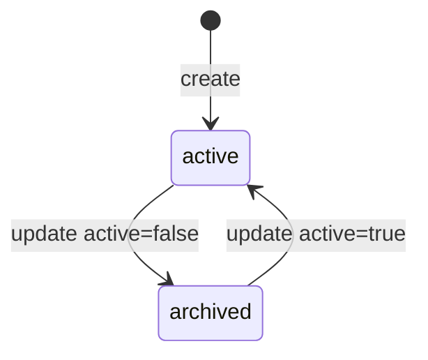
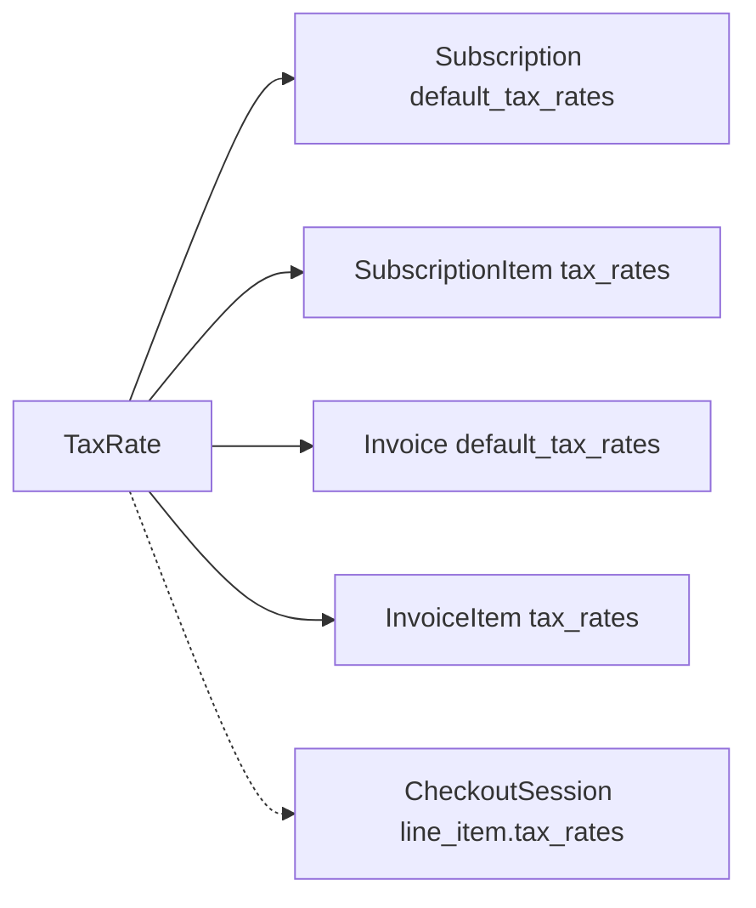

# Tax Rate

> API resource: `tax_rate` · API version: `2026-04-22.dahlia` · Category: [Products & catalog](README.md)

## What it is

A `TaxRate` is a **manually-defined** tax rate — an explicit "20% UK VAT," "8.25% California sales tax," "10% Australian GST" — that you create yourself and reference on Invoice, InvoiceItem, Subscription, or SubscriptionItem objects to apply tax to specific lines. Each TaxRate captures one (jurisdiction, rate, type) tuple plus display metadata.

This is the **legacy / manual** tax application path. For most modern integrations, [Stripe Tax](https://docs.stripe.com/tax) (configured via `automatic_tax.enabled=true` on Subscriptions/Invoices/Checkout, driven by [TaxCode](tax-codes.md) on Products) replaces TaxRates entirely — Stripe computes the right rate per jurisdiction automatically. TaxRates remain available for: jurisdictions Stripe Tax doesn't yet cover, businesses that need pure manual control, and pre-Stripe-Tax integrations grandfathered in.

## Why it exists

Before Stripe Tax existed (and for jurisdictions outside its coverage), Stripe needed *some* way to put a tax line on an invoice. TaxRate is that mechanism: you, the merchant, are responsible for knowing the rate; Stripe just renders the math and the line item.

You'd reach for TaxRate today only if:

- You operate in a jurisdiction Stripe Tax doesn't cover.
- Your tax authority requires line-by-line manual control.
- You're maintaining a legacy integration and migrating to Stripe Tax is a future project.
- You're a tax-exempt seller in some lines and need to selectively apply rates.

For most SaaS and ecommerce, **enable Stripe Tax and stop thinking about TaxRates.**

## Lifecycle & states

TaxRates have only `active` / archived. No `status` enum, no DELETE.



### `active: true`

Can be referenced on new lines. Shows in the Dashboard's TaxRate picker.

### `active: false`

Hidden from new use. **Existing lines and finalized invoices that already reference it are unaffected** — finalized invoices snapshot the rate at finalization time anyway.

There is **no DELETE for TaxRates.** Archive is the only path. The ID is permanent so historical invoices can resolve it.

## What is and isn't mutable

After creation, you can edit:

- `active` (toggle archive)
- `display_name` (cosmetic — affects future invoice rendering)
- `description`
- `metadata`
- `jurisdiction` (display string)

You **cannot** edit:

- `percentage`
- `inclusive`
- `country`, `state`
- `tax_type`

To change the rate, create a new TaxRate and switch references over.

## Anatomy of the object

### Identity

| Field | Notes |
|---|---|
| `id` | `txr_…`. |
| `object` | always `"tax_rate"`. |
| `created`, `livemode`, `metadata` | standard. |

### Display

| Field | Notes |
|---|---|
| `display_name` | Required. The label shown on the invoice line ("VAT", "GST", "Sales Tax"). |
| `description` | Internal notes. |
| `jurisdiction` | Free-form display string (e.g. "United Kingdom", "California"). |
| `jurisdiction_level` | Optional: `country | state | county | city | district | multiple`. Helps tax-engine integrations classify. |

### The math

| Field | Notes |
|---|---|
| `percentage` | Float, e.g. `20.0` for 20%. |
| `inclusive` | Boolean. **`true`** = the price includes this tax (back-compute pre-tax for reporting). **`false`** = tax is added on top of the price. Critical for VAT vs. US sales tax models. |

### Classification

| Field | Notes |
|---|---|
| `tax_type` | `vat | gst | hst | pst | qst | sales_tax | jct | rst | igst | service_tax | amusement_tax | communications_tax | lease_tax | retail_delivery_fee | fee | …`. Drives some downstream reporting. |
| `country` | ISO 3166-1 alpha-2 (`GB`, `US`, `AU`). |
| `state` | ISO 3166-2 subdivision (`CA`, `NY`). For US/CA primarily. |

### Status

| Field | Notes |
|---|---|
| `active` | Boolean. See lifecycle. |
| `effective_percentage` | Stripe-computed: the actual percentage used in invoices. Useful when `inclusive=true` and the surfaced rate differs from the back-computed one. |

## How TaxRates are applied

You don't apply a TaxRate to a Product or Customer directly. You attach it at the line / parent level:



Precedence: line-level overrides parent-level. A SubscriptionItem with `tax_rates=[txr_…]` ignores the Subscription's `default_tax_rates`.

You can attach **multiple** TaxRates to one line (e.g. state + county tax stacked). Each shows as its own tax line on the rendered invoice.

## Common workflows

### 1. Create a UK VAT rate

```http
POST /v1/tax_rates
  display_name=VAT
  description=United Kingdom VAT
  jurisdiction=United Kingdom
  country=GB
  percentage=20
  inclusive=false
  tax_type=vat
```

### 2. Inclusive-pricing VAT (price already contains tax)

```http
POST /v1/tax_rates
  display_name=VAT
  jurisdiction=United Kingdom
  country=GB
  percentage=20
  inclusive=true
  tax_type=vat
```

A `1200` cents line + this rate → reported subtotal `1000`, tax `200`, total `1200`. The math is back-computed.

### 3. US state sales tax (added on top)

```http
POST /v1/tax_rates
  display_name=Sales Tax
  jurisdiction=California
  country=US
  state=CA
  percentage=8.25
  inclusive=false
  tax_type=sales_tax
```

### 4. Apply to a Subscription as default

```http
POST /v1/subscriptions
  customer=cus_…
  items[0][price]=price_…
  default_tax_rates[]=txr_uk_vat
```

Every renewal invoice line tax-applies this rate.

### 5. Override per InvoiceItem

```http
POST /v1/invoiceitems
  customer=cus_…
  amount=10000
  currency=usd
  tax_rates[]=txr_ca_sales
  tax_rates[]=txr_la_county
```

Two stacked rates on this one line.

### 6. Migrate from manual TaxRates to Stripe Tax

The recommended path:

1. Enable Stripe Tax in the Dashboard. Configure your origin address.
2. Set `tax_code` on every Product (via [TaxCode](tax-codes.md)).
3. On new and existing Subscriptions, set `automatic_tax[enabled]=true` **and** clear `default_tax_rates`/`tax_rates`. Stripe Tax now computes per-jurisdiction.
4. Continue running existing Subscriptions on TaxRates if needed; they don't conflict.

```http
POST /v1/subscriptions/sub_…
  automatic_tax[enabled]=true
  default_tax_rates=    # empty - clear manual rates
```

Verify: next renewal invoice should have `automatic_tax.status=complete` and tax lines computed by Stripe Tax instead of your manual rates.

### 7. Replace a rate (e.g. tax law change)

You can't edit `percentage`. Create a new TaxRate at the new rate, archive the old, and update each Subscription's `default_tax_rates` to reference the new one. Existing finalized invoices stay at the old rate; only future renewals adopt the new one.

## Webhook events

There are no `tax_rate.*` events in the catalog. TaxRates are passive metadata — changes don't fire events. Watch instead:

- `invoice.created` / `invoice.finalized` — to see what tax was actually applied to a given invoice (read `total_taxes` and the per-line `tax_amounts`).
- `tax.settings.updated` — fires on Stripe Tax configuration changes (the *automatic* path).

## Idempotency, retries & race conditions

- `POST /v1/tax_rates` accepts `Idempotency-Key`. Use it.
- TaxRate references are snapshotted into invoice lines at finalization. Archiving or "logically replacing" a TaxRate doesn't ripple back into already-issued invoices.
- A Subscription with `default_tax_rates=[txr_archived]` keeps using the archived rate on renewals — Stripe doesn't auto-clear references. Audit your subs when retiring a rate.
- Stripe Tax (`automatic_tax.enabled=true`) and manual `tax_rates` on the same line don't conflict cleanly. **Pick one regime per line.** Mixing produces double-taxation in some flows.

## Test-mode tips

- Test-mode TaxRates are isolated from live.
- The Stripe CLI: `stripe tax_rates create --display-name=VAT --country=GB --percentage=20 --inclusive=false --tax-type=vat`.
- Use [TestClock](../06-billing/test-clocks.md) to verify renewal invoices apply your TaxRates correctly across cycles.

## Connect considerations

- TaxRates are scoped per Stripe account.
- For *direct charge* Connect, the connected account creates and manages its own TaxRates.
- For *destination charge* Connect, the platform's TaxRates apply to the platform's Invoice; the connected account just receives the post-tax-and-fee transfer.
- For *Stripe Tax* on Connect, the platform can compute tax on behalf of connected accounts via Stripe Tax — but TaxRate-based manual tax is always per-account.

## Common pitfalls

- **Mixing manual `tax_rates` with `automatic_tax.enabled=true`.** They're separate regimes. Stripe applies both, double-taxing the line. Pick one.
- **Editing `percentage` and being surprised it's read-only.** Create a new TaxRate; switch references; archive the old.
- **Not setting `inclusive` correctly.** `true` for VAT-style "price includes tax"; `false` for US-style "tax added on top." Wrong setting silently rounds different totals.
- **Assuming archived TaxRates stop applying.** They keep applying anywhere they're still referenced. Archive is just "hide from picker."
- **Hardcoding rates in your application code.** Tax rates change. Look them up via API or maintain a single source of truth.
- **Missing `state` on US rates.** `country=US, state=null` is a country-level rate; many US contexts need state codes for proper jurisdiction modeling.
- **Reaching for TaxRate when Stripe Tax would just work.** If your jurisdictions are covered (most SaaS markets are), Stripe Tax saves you from maintaining a tax-rate registry. Migrate.
- **Forgetting the migration path is one-way per Subscription.** Once you switch a Subscription to `automatic_tax`, going back to manual TaxRates is rare and usually a bug indicator.

## Further reading

- [API reference: TaxRate](https://docs.stripe.com/api/tax_rates/object)
- [Manual taxes guide](https://docs.stripe.com/billing/taxes/tax-rates)
- [Stripe Tax (the modern alternative)](https://docs.stripe.com/tax)
- [TaxCode (Stripe Tax classifications)](tax-codes.md)
- [Migrating from manual tax to Stripe Tax](https://docs.stripe.com/tax/migrating)
