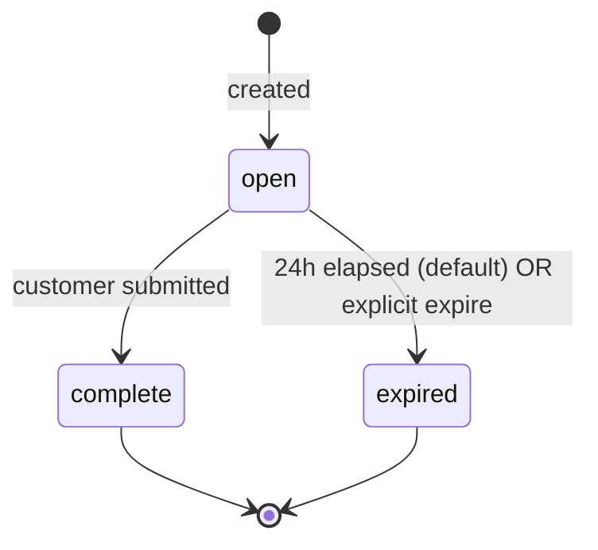
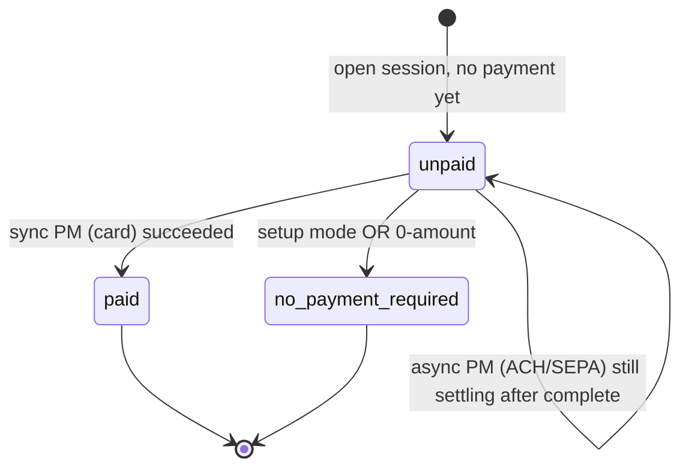
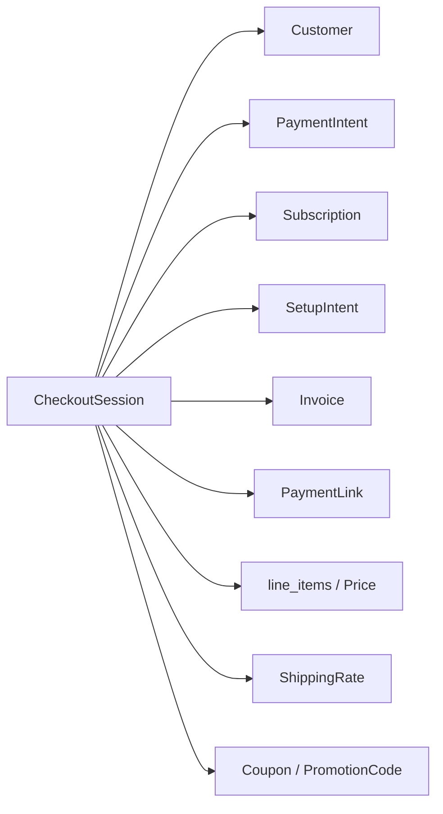

# Checkout Session

> API resource: `checkout.session` · API version: `2026-04-22.dahlia` · Category: [Checkout](README.md)

## What it is

A `checkout.session` represents one run of Stripe's prebuilt payment flow — either the Stripe-hosted page (`ui_mode: hosted`) or an embedded component you mount in your own page (`ui_mode: embedded`). It is a short-lived, customer-facing wrapper around a [PaymentIntent](../01-core-resources/payment-intents.md), [Subscription](../06-billing/subscriptions.md), or [SetupIntent](../01-core-resources/setup-intents.md), depending on the `mode` you set at creation. The Session collects line items, customer details, address, tax, shipping, custom fields, and payment method, then drives the chosen underlying primitive to completion.

Think of it as **the UI + form-collection layer** on top of the orchestration primitives. PaymentIntent is the engine; the Session is the cockpit.

## Why it exists

Building a payment form from scratch means: rendering the country-specific PM picker, handling 3DS / SCA, collecting and validating tax IDs, computing tax, fetching shipping rates, supporting Apple Pay / Google Pay / Link / Klarna / iDEAL / etc., handling localization, surviving page reloads, and being PCI-SAQ-A compliant. Checkout Session is Stripe's done-for-you implementation. You POST a Session, redirect (or mount), and the whole flow plays out under Stripe's roof.

Reach for Sessions when you want a payment page yesterday. Reach for raw PaymentIntents + Elements when you need full control of the UI.

## Lifecycle & states

`status` (high-level) and `payment_status` (payment-specific) are independent and you usually need both.





State semantics:

- **`open`** — the URL is live, the Session can be retrieved and the customer can submit. All session fields except a few (`metadata`, `shipping_options`, `collected_information`) are frozen against API edits.
- **`complete`** — customer submitted the form. **Does not mean money moved** — only that the form was completed. Always check `payment_status` before fulfilling.
- **`expired`** — `expires_at` passed (default 24h after creation; max 24h) or you called `POST /v1/checkout/sessions/{id}/expire`. The PaymentIntent / SetupIntent inside is canceled. `recovery_url` may be populated if `after_expiration.recovery.enabled = true`.
- **`payment_status: unpaid`** — initial. For sync PMs this resolves at submission; for async (ACH, SEPA debit, multibanco, OXXO, BACS, Boleto) it can stay `unpaid` for hours/days *after* `status: complete`.
- **`payment_status: paid`** — money is final per the underlying PI. Safe-to-fulfill signal.
- **`payment_status: no_payment_required`** — `mode: setup` or a 100%-discounted line.

## Anatomy of the object

### Identity

| Field | Notes |
|---|---|
| `id` | `cs_test_…` or `cs_live_…` |
| `object` | `"checkout.session"` |
| `created`, `expires_at` | unix seconds. |
| `livemode`, `metadata` | standard. Metadata cascades to the underlying PI / Subscription. |

### Mode & UI

| Field | Notes |
|---|---|
| `mode` | `payment` (one-shot Charge via PI), `subscription` (creates Subscription + first Invoice + PI), `setup` (creates SetupIntent only — saves PM, no charge). Immutable after creation. |
| `ui_mode` | `hosted` (default) or `embedded`. Drives whether `url` or `client_secret` is returned. |
| `url` | Stripe-hosted page URL. Only present when `ui_mode: hosted`. Single-use; serve via redirect. |
| `client_secret` | For `ui_mode: embedded` — pass to `stripe.initEmbeddedCheckout({ clientSecret })`. Treat as a scoped credential. |
| `success_url` / `cancel_url` | Hosted mode redirects. Stripe appends `{CHECKOUT_SESSION_ID}` if you include the literal placeholder. |
| `return_url` | Embedded mode redirect after submission. |
| `redirect_on_completion` | `always | if_required | never`. Embedded only — when to redirect vs. stay on page. |

### Status

| Field | Notes |
|---|---|
| `status` | `open | complete | expired`. |
| `payment_status` | `unpaid | paid | no_payment_required`. **Check this, not just `status`, before fulfilling.** |
| `after_expiration.recovery` | `{ enabled, allow_promotion_codes, expires_at, url }`. Lets you re-invite an abandoned customer. |
| `recovery_url` | Populated on expiry if recovery enabled. Single-use shareable link. |

### Customer

| Field | Notes |
|---|---|
| `customer` | `cus_…` or null. Either passed in at create time or created at submission per `customer_creation`. |
| `customer_email` | Pre-fill email; locks the email field on the page if set. |
| `customer_creation` | `always` or `if_required`. `payment` mode defaults to `if_required` (no Customer for one-shots); `subscription` always creates one. |
| `customer_details` | After submission: `{ email, name, phone, address, tax_ids, tax_exempt }` collected on the page. |
| `client_reference_id` | Free-form string you set; pass your internal cart/order id and read it back from the webhook. |

### Line items & money

| Field | Notes |
|---|---|
| `line_items` | Array of `{ price OR price_data, quantity, adjustable_quantity, dynamic_tax_rates }`. Not returned by default — `expand[]=line_items` to inspect. |
| `currency` | ISO. Inferred from line items for `payment` mode; required for some flows. |
| `amount_subtotal`, `amount_total` | Computed at submission. Zero pre-submit. |
| `total_details` | `{ amount_discount, amount_shipping, amount_tax, breakdown }` after submission. |
| `currency_conversion` | If presentment currency differs from settlement currency. |

### Per-mode passthrough config

| Field | Notes |
|---|---|
| `payment_intent_data` | `payment` mode only. Forwarded to the PI on creation: `capture_method`, `setup_future_usage`, `statement_descriptor`, `metadata`, `application_fee_amount`, `transfer_data`, `on_behalf_of`. |
| `subscription_data` | `subscription` mode only. Forwarded: `trial_period_days`, `trial_settings`, `application_fee_percent`, `transfer_data`, `default_tax_rates`, `metadata`, `description`, `billing_cycle_anchor`, `proration_behavior`, `invoice_settings`. |
| `setup_intent_data` | `setup` mode only. `description`, `metadata`, `on_behalf_of`. |
| `payment_method_types` | Whitelist of PM type strings. Omit and Stripe Dashboard settings + `automatic_payment_methods` decide. |
| `payment_method_collection` | `always` or `if_required`. With `if_required` + a 100%-off coupon, no PM is collected. |
| `payment_method_options` | Per-PM-type tuning (same shape as PI's). |

### Pointers to created objects

| Field | Notes |
|---|---|
| `payment_intent` | `pi_…` set after submission in `payment` mode. |
| `subscription` | `sub_…` set after submission in `subscription` mode. |
| `setup_intent` | `seti_…` set after submission in `setup` mode. |
| `invoice` | `in_…` for the first invoice in `subscription` mode. |

### Form-collection toggles

| Field | Notes |
|---|---|
| `billing_address_collection` | `auto` (default — collect when needed) or `required`. |
| `shipping_address_collection` | `{ allowed_countries: [...] }`. |
| `phone_number_collection.enabled` | Boolean. |
| `tax_id_collection.enabled` | Boolean. Surfaces a tax-ID field; result lands in `customer_details.tax_ids`. |
| `consent_collection` | `{ promotions, terms_of_service, payment_method_reuse_agreement }`. Surfaces opt-in checkboxes. |
| `consent` | After submit: what the customer checked. |
| `custom_fields` | Up to 3 extra inputs (PO number, "what brought you here", etc.) — `text | numeric | dropdown`. |
| `custom_text` | Override copy on submit button, terms-of-service block, shipping address, etc. |
| `automatic_tax.enabled` | Stripe Tax computes per-line. Requires customer address resolvable. |
| `discounts` | Array of `{ coupon }` or `{ promotion_code }`. Mutually exclusive with `allow_promotion_codes`. |
| `allow_promotion_codes` | Boolean — show the "add promo code" UI on the page. |
| `shipping_options` | Array of `{ shipping_rate }` or `{ shipping_rate_data }`. |
| `locale` | `auto` or any supported locale. |
| `submit_type` | `auto | pay | book | donate | subscribe`. Changes the button label. `payment` mode only. |

### Saved-PM behavior

| Field | Notes |
|---|---|
| `saved_payment_method_options` | `{ allow_redisplay_filters, payment_method_save }`. Controls whether saved PMs surface and whether the customer is offered a "save for later" toggle. |

## Relationships



- A Session creates **exactly one** of PI / Subscription / SetupIntent based on `mode`. Immutable.
- `payment_link` is set on Sessions auto-spawned by a [Payment Link](../05-payment-links/payment-links.md) visit.
- A given Customer can have many Sessions; `client_reference_id` is your join key back to your DB.

## Common workflows

### 1. Hosted Checkout, one-shot payment

```http
POST /v1/checkout/sessions
  mode=payment
  ui_mode=hosted
  success_url=https://example.com/order/{CHECKOUT_SESSION_ID}
  cancel_url=https://example.com/cart
  line_items[0][price]=price_…
  line_items[0][quantity]=1
  customer_email=buyer@example.com
  client_reference_id=ord_abc123
  payment_intent_data[metadata][order_id]=ord_abc123
  automatic_tax[enabled]=true
```

Returned `url` → `302` the buyer there. After completion, fulfill on the `checkout.session.completed` webhook (re-fetch with `expand[]=line_items,payment_intent` if you need detail).

### 2. Embedded Checkout

```http
POST /v1/checkout/sessions
  ui_mode=embedded
  mode=payment
  return_url=https://example.com/order/{CHECKOUT_SESSION_ID}
  line_items[0][price]=price_…
```

Server returns `client_secret`. Browser:

```js
const checkout = await stripe.initEmbeddedCheckout({ clientSecret });
checkout.mount("#checkout");
```

Stripe handles the lifecycle inside the iframe; on success it triggers your `return_url`.

### 3. Subscription with trial

```http
POST /v1/checkout/sessions
  mode=subscription
  success_url=https://example.com/welcome?cs={CHECKOUT_SESSION_ID}
  cancel_url=https://example.com/pricing
  line_items[0][price]=price_pro_monthly
  line_items[0][quantity]=1
  subscription_data[trial_period_days]=14
  subscription_data[trial_settings][end_behavior][missing_payment_method]=cancel
  payment_method_collection=if_required
```

With `payment_method_collection=if_required` + a trial, the customer can start without entering a card; the trial-end behavior decides what happens at conversion.

### 4. Save a card for later (no charge now)

```http
POST /v1/checkout/sessions
  mode=setup
  customer=cus_…
  success_url=https://example.com/account/cards
  cancel_url=https://example.com/account/cards
  payment_method_types[]=card
```

After completion the Session points at a SetupIntent whose `payment_method` is now attached to the customer. Use that PM for future off-session PIs.

### 5. BNPL with explicit method whitelist

```http
POST /v1/checkout/sessions
  mode=payment
  payment_method_types[]=klarna
  payment_method_types[]=afterpay_clearpay
  payment_method_types[]=card
  line_items[0][price]=price_…
  ...
```

Generally prefer letting Dashboard + `automatic_payment_methods` drive PM selection; specify `payment_method_types` only when you must restrict.

### 6. Recover an expired session

If you set `after_expiration[recovery][enabled]=true`, an expired Session yields a `recovery_url`. Email it; visiting it spawns a fresh Session preloaded with the same line items.

## Webhook events

| Event | Fires when | Listener typically does |
|---|---|---|
| `checkout.session.completed` | Buyer submitted the form. | **The success signal.** Re-fetch the Session, check `payment_status`, fulfill if `paid` or `no_payment_required`; otherwise wait. |
| `checkout.session.expired` | `expires_at` reached or explicit `/expire`. | Mark the cart as abandoned; trigger recovery email if you set up recovery. |
| `checkout.session.async_payment_succeeded` | Async PM (ACH/SEPA/Boleto) settled after `completed`. | Now safe to fulfill if you deferred. |
| `checkout.session.async_payment_failed` | Async PM settlement failed after `completed`. | Cancel the order; offer a different PM. |

The Session does not emit `created` / `updated` events — listen on the underlying PI / Subscription / SetupIntent for those.

## Idempotency, retries & race conditions

- **Set `Idempotency-Key`** on `POST /v1/checkout/sessions`. A network retry without it spawns a duplicate session and possibly a duplicate Subscription.
- `checkout.session.completed` and `payment_intent.succeeded` race. For `payment` mode, both fire; for sync PMs they're typically seconds apart. Idempotency-key your fulfillment logic by `client_reference_id` (or `pi.id`) so whichever lands first wins and the other is a no-op.
- For async PMs the order is: `checkout.session.completed` (with `payment_status: unpaid`) → `payment_intent.processing` → `checkout.session.async_payment_succeeded` (or `_failed`). **Don't fulfill on `completed` alone if you accept async PMs.** Either gate on `payment_status: paid` (re-fetch the Session) or wait for `async_payment_succeeded`.
- Webhook delivery is at-least-once and unordered. Re-fetch the Session in your handler — don't trust the snapshot in the event payload for high-stakes actions.
- Calling `/expire` on a completed Session 4xx's. Calling it on an already-expired Session is a no-op.

## Test-mode tips

- `stripe trigger checkout.session.completed` — synthetic Session for handler testing.
- Same magic cards as PaymentIntent: `4242 4242 4242 4242`, `4000 0027 6000 3184` (always 3DS), `4000 0000 0000 9995` (insufficient funds), `4000 0000 0000 0341` (auth ok / capture fails — useful in `subscription` mode for dunning).
- For ACH async testing in `payment` mode: use the `us_bank_account` test instant verification; `payment_status` flips on `stripe trigger payment_intent.succeeded`.
- Subscription-mode trials best paired with [TestClock](../06-billing/test-clocks.md) — attach the `customer` to a clock, then advance past trial end to drive conversion events.

## Connect considerations

- **Direct on connected account** — set `Stripe-Account: acct_…` on the create call. Session, PI/Sub, and Charge all live on the connected account. Take a cut via `payment_intent_data[application_fee_amount]` or `subscription_data[application_fee_percent]`.
- **Destination charge** — no header; set `payment_intent_data[transfer_data][destination]=acct_…` (and optionally `[on_behalf_of]`). The PI lives on the platform; net routes to the connected account.
- **`on_behalf_of`** — controls whose statement descriptor and country-specific behaviors apply. Usually paired with `transfer_data.destination`.
- For `subscription` mode, the same routing options live under `subscription_data` instead.
- Some PM types are gated by the connected account's country/capabilities, not the platform's — list-driven `payment_method_types` may silently drop unsupported types.

## Common pitfalls

- **Fulfilling on `checkout.session.completed` without checking `payment_status`.** For async PMs, `completed` fires *before* the money lands. Always gate on `payment_status: paid` (or `no_payment_required`), or defer to `async_payment_succeeded`.
- **Fulfilling on the redirect to `success_url`.** The buyer can hit success_url without completing payment in some edge cases (refresh, deep-link, manual URL entry). Webhooks are the source of truth.
- **`customer_creation: always` in `payment` mode for guests.** You'll accumulate stub Customers in your dashboard. Default `if_required` is usually right for one-shot guest checkout.
- **Mixing `discounts` and `allow_promotion_codes`.** They're mutually exclusive — Stripe rejects the create call.
- **Not pre-loading `customer_email` for embedded mode.** Without it, returning users re-type their email and you lose Link auto-fill.
- **Treating the Session URL as long-lived.** It expires (default 24h, max 24h). For shareable persistent URLs, use a [Payment Link](../05-payment-links/payment-links.md) instead.
- **Mutating `line_items` after creation.** Not allowed once `open`. To change cart contents, expire the Session and create a new one.
- **Confusing `subscription_data` and `subscription` updates.** `subscription_data` only takes effect at Session-driven creation; to edit the Subscription afterward, hit the Subscription API directly.
- **Using Sessions as a payment-method picker for an existing Subscription.** Don't — use `mode: setup` with `setup_intent_data` + then `subscriptions.update(default_payment_method=…)`, or send the customer through the [Customer Portal](../06-billing/customer-portal-sessions.md).

## Further reading

- [API reference: Checkout Session](https://docs.stripe.com/api/checkout/sessions/object)
- [Build a checkout page](https://docs.stripe.com/checkout/quickstart)
- [Embedded Checkout](https://docs.stripe.com/checkout/embedded/quickstart)
- [Fulfill orders](https://docs.stripe.com/checkout/fulfillment)
- [Subscriptions with Checkout](https://docs.stripe.com/billing/subscriptions/build-subscriptions?ui=checkout)
