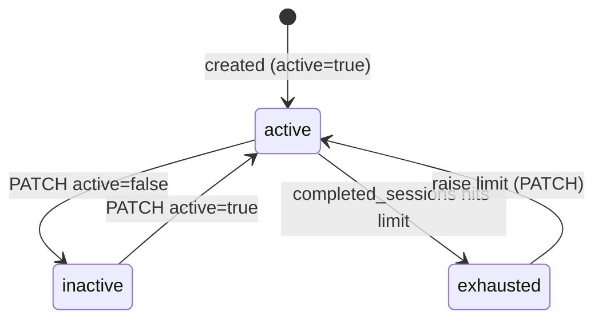
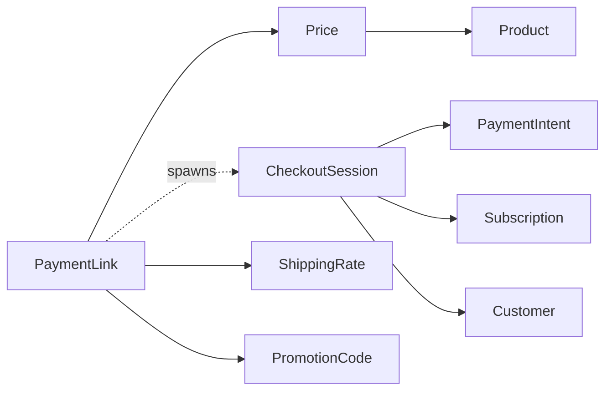

# Payment Link

> API resource: `payment_link` · API version: `2026-04-22.dahlia` · Category: [Payment Links](README.md)

## What it is

A `payment_link` is a persistent, reusable URL that spawns a fresh [Checkout Session](../04-checkout/sessions.md) every time someone visits it. You configure the cart, behavior, and post-completion handling once at creation; Stripe hosts the URL forever (until you deactivate it). Every visit produces an independent Checkout Session — so 1,000 buyers means 1 Payment Link and 1,000 Sessions.

Think of it as **a Checkout Session factory you can paste into a tweet, an email signature, an invoice PDF, or a QR code**.

## Why it exists

Hosted Checkout Sessions are powerful but expire (default 24h) and require a server call per buyer. That's wrong for a "Buy now" link in a newsletter, a Stripe-powered Linktree button, or a consultant's invoice footer. Payment Links collapse that to: create once via API or Dashboard → share the URL → done. Stripe handles spawning a Session per visitor and emits the same downstream events you already wire up for Checkout.

Reach for a Payment Link when the same offer is sold to many anonymous buyers. Reach for a per-buyer Checkout Session when the cart is computed dynamically per visitor.

## Lifecycle & states

There is no `status` enum — only an `active` boolean. A Payment Link cannot be deleted; once created it exists forever and you toggle `active` to control whether the URL accepts new visits.



State semantics:

- **`active: true`** — URL accepts visits, spawns a Session per visit.
- **`active: false`** — URL renders Stripe's "this link is no longer accepting payments" page; no Sessions are spawned.
- **Exhausted** — soft state when `restrictions.completed_sessions.limit` is reached. Stripe blocks new Sessions (same UX as inactive). Raise the limit or accept it as a soft cap.

The lifecycle of any individual purchase lives on its [Checkout Session](../04-checkout/sessions.md) and the underlying [PaymentIntent](../01-core-resources/payment-intents.md) / [Subscription](../06-billing/subscriptions.md) — not on the Payment Link.

## Anatomy of the object

### Identity & state

| Field | Notes |
|---|---|
| `id` | `plink_…` |
| `object` | `"payment_link"` |
| `url` | The shareable URL — `https://buy.stripe.com/…`. Stable for the link's lifetime. |
| `active` | Boolean. The only "status" field. |
| `livemode`, `metadata` | standard. Metadata cascades to spawned Sessions and from there to PIs / Subscriptions. |

### Cart

| Field | Notes |
|---|---|
| `line_items` | Array of `{ price, quantity, adjustable_quantity }`. Inline `price_data` not allowed — must reference an existing [Price](../03-products/prices.md). Not returned by default; `expand[]=line_items`. |
| `currency` | ISO. Must be consistent across line items. |
| `submit_type` | `auto | pay | book | donate | subscribe`. Button label on the spawned Session. |

### What buyer can change

| Field | Notes |
|---|---|
| `allow_promotion_codes` | Boolean. Surfaces the "add promo code" UI. |
| `customer_creation` | `always` or `if_required`. Default depends on mode (subscription always creates one). |
| `payment_method_collection` | `always` or `if_required`. With trials + `if_required`, no card is collected upfront. |
| `payment_method_types` | Whitelist; omit for Stripe-managed selection. |
| `phone_number_collection.enabled` | Boolean. |
| `tax_id_collection.enabled` | Boolean. |
| `billing_address_collection` | `auto | required`. |
| `shipping_address_collection` | `{ allowed_countries: [...] }`. |
| `consent_collection` | `{ promotions, terms_of_service, payment_method_reuse_agreement }`. |
| `custom_fields` | Up to 3 — `text | numeric | dropdown`. |
| `custom_text` | Override copy on submit button, terms, shipping, etc. |
| `automatic_tax.enabled` | Stripe Tax computes per-line. |
| `shipping_options` | Array of `{ shipping_rate }`. |

### Mode-specific passthrough

| Field | Notes |
|---|---|
| `payment_intent_data` | Forwarded to the spawned PI in `payment` mode: `capture_method`, `setup_future_usage`, `statement_descriptor`, `description`, `metadata`, `transfer_group`. **`mode` itself is implicit** — Payment Links infer `mode: payment` vs `mode: subscription` from the line items' Price `type` (one_time vs recurring). No `setup` mode for Payment Links. |
| `subscription_data` | Forwarded in `subscription` mode: `description`, `trial_period_days`, `trial_settings`, `metadata`, `invoice_settings`. |
| `invoice_creation` | `payment` mode only. `{ enabled, invoice_data: {...} }` to auto-issue an Invoice as a receipt. |

### Post-completion

| Field | Notes |
|---|---|
| `after_completion.type` | `hosted_confirmation` (Stripe shows a success page) or `redirect` (send to your URL). |
| `after_completion.hosted_confirmation.custom_message` | Markdown shown on Stripe's success page. |
| `after_completion.redirect.url` | Your URL. Supports `{CHECKOUT_SESSION_ID}` placeholder. |

### Restrictions

| Field | Notes |
|---|---|
| `restrictions.completed_sessions.limit` | Stop accepting new visits after N completed Sessions. Useful for limited-edition drops. |
| `inactive_message` | Markdown shown when `active: false` (or limit reached). |

### Connect routing

| Field | Notes |
|---|---|
| `transfer_data.destination` | Connected account that receives funds (destination charge). |
| `transfer_data.amount` | If unset, full minus app fee routes to destination. |
| `application_fee_amount` | `payment` mode flat fee. |
| `application_fee_percent` | `subscription` mode percent. |
| `on_behalf_of` | Connected account whose settings apply. |

## Relationships



- A Payment Link references existing Prices — you can't define a one-off price inline. Want bespoke pricing? Make the Price first.
- A Payment Link can spawn unlimited Sessions; each Session is an independent object with its own webhook stream.
- Mode (`payment` vs `subscription`) is derived from the Prices, not declared.

## Common workflows

### 1. Simple buy-button URL

```http
POST /v1/payment_links
  line_items[0][price]=price_one_time_$25
  line_items[0][quantity]=1
  after_completion[type]=hosted_confirmation
  after_completion[hosted_confirmation][custom_message]=Thanks! Check your email for receipt.
```

Returned `url` → embed in a button, QR, email. Done.

### 2. Subscription with trial via Payment Link

```http
POST /v1/payment_links
  line_items[0][price]=price_pro_monthly
  line_items[0][quantity]=1
  subscription_data[trial_period_days]=14
  payment_method_collection=if_required
  after_completion[type]=redirect
  after_completion[redirect][url]=https://example.com/welcome?cs={CHECKOUT_SESSION_ID}
```

Mode is inferred as `subscription` from `price_pro_monthly.type = recurring`.

### 3. Marketplace listing (Connect)

```http
POST /v1/payment_links
  line_items[0][price]=price_listing_xyz
  line_items[0][quantity]=1
  application_fee_amount=500
  transfer_data[destination]=acct_seller_…
  on_behalf_of=acct_seller_…
```

Each visit produces a destination charge with the platform's $5 cut.

### 4. Limited-edition drop

```http
POST /v1/payment_links
  line_items[0][price]=price_drop_…
  line_items[0][quantity]=1
  line_items[0][adjustable_quantity][enabled]=true
  line_items[0][adjustable_quantity][maximum]=3
  restrictions[completed_sessions][limit]=100
  inactive_message=Sold out — thanks!
```

After 100 completed Sessions, Stripe blocks new visits and shows the inactive message.

### 5. Deactivate

```http
POST /v1/payment_links/plink_…
  active=false
```

URL stops accepting visits immediately. Re-activate any time. **There is no DELETE.**

## Webhook events

| Event | Fires when | Listener typically does |
|---|---|---|
| `payment_link.created` | Link created via API or Dashboard. | Mirror to your CRM if you track campaign URLs. |
| `payment_link.updated` | Any field changed (most often `active` toggled). | Re-sync metadata; alert if a campaign link goes inactive. |

The Payment Link itself emits **no events for purchases**. Each spawned Session emits the normal Checkout/PI/Subscription stream — wire your fulfillment to those:

- `checkout.session.completed` — buyer submitted (gate on `payment_status: paid`).
- `checkout.session.async_payment_succeeded` / `async_payment_failed` — async PM resolution.
- `payment_intent.succeeded` — for `payment` mode purchases.
- `customer.subscription.created` / `invoice.paid` — for `subscription` mode.

To attribute back to the link, read `checkout.session.payment_link` (the `plink_…` id) on the spawned Session.

## Idempotency, retries & race conditions

- `POST /v1/payment_links` — set `Idempotency-Key`. A retry without it creates a duplicate URL with different `id`/`url`, which is annoying but not financially dangerous.
- Updates are PATCH-style; safe to retry naturally.
- Race between toggling `active=false` and an in-flight visit: the Session may already have been spawned (it's `open`, not yet `complete`). Deactivation does not retroactively kill spawned Sessions — they remain valid until they complete or expire on their own. To force-stop in-flight Sessions, expire them individually via `POST /v1/checkout/sessions/{id}/expire`.
- A spawned Session inherits the Payment Link's snapshot at spawn time. Updating the Payment Link does not alter previously-spawned Sessions.

## Test-mode tips

- Create test Prices first, then a test Payment Link. Test URLs look identical (`https://buy.stripe.com/test_…`).
- `stripe trigger payment_link.created` for handler smoke tests.
- For end-to-end: open the test URL, pay with `4242 4242 4242 4242`, watch the spawned Session and `checkout.session.completed` flow through.
- For limited drops: set `restrictions.completed_sessions.limit=2` and run two completions to verify the third visit is blocked.
- No [TestClock](../06-billing/test-clocks.md) interaction at the link level; clocks attach to the Customer that the spawned Subscription belongs to.

## Connect considerations

- **On a connected account directly** — set `Stripe-Account: acct_…` on creation. URL hosts under that account. Spawned Sessions, PIs, Subscriptions all live there. The platform doesn't see them in its account-scoped queries.
- **As a destination charge from the platform** — create on the platform; set `transfer_data.destination`, `application_fee_amount` (or `_percent`), and usually `on_behalf_of`. Each spawn routes net to the connected account.
- **`on_behalf_of`** is required for some PM types in some regions — without it, the spawned Session may silently lack support for local PMs.
- A connected account in `restricted_soon` can have its links auto-deactivate; listen on `account.updated` for capability transitions.

## Common pitfalls

- **Creating one Payment Link per customer.** Anti-pattern. The whole point of a Payment Link is reuse; if you need a per-customer URL with custom amount/cart, you want a [Checkout Session](../04-checkout/sessions.md) instead. Per-customer Payment Links pollute your dashboard and your `payment_link.created` webhook stream.
- **Trying to delete.** No `DELETE /v1/payment_links/{id}` exists. `active=false` is the only way to retire a URL. Plan your `id` namespace accordingly.
- **Expecting `setup` mode.** Payment Links don't support saving a card without charging. Use a hosted Checkout Session in `mode: setup` (or the [Customer Portal](../06-billing/customer-portal-sessions.md)) for that.
- **Inline `price_data` in line items.** Not supported on Payment Links — you must reference a saved Price.
- **Mixing currencies across line items.** Single-currency only.
- **Editing a link mid-campaign and assuming live spawned Sessions update.** They don't — Sessions are snapshots.
- **Wiring fulfillment to `payment_link.updated`.** That event fires for config edits, not purchases. Fulfillment hangs off the Checkout Session events.
- **Forgetting that Payment Links inherit your Dashboard's PM configuration.** Toggling a PM type in the Dashboard immediately changes what's offered on existing links — sometimes desirable, sometimes a surprise. Pin with `payment_method_types` if you need stability.

## Further reading

- [API reference: Payment Link](https://docs.stripe.com/api/payment-link/object)
- [No-code Payment Links](https://docs.stripe.com/payment-links)
- [Sell subscriptions with Payment Links](https://docs.stripe.com/payment-links/recurring)
- [Connect with Payment Links](https://docs.stripe.com/payment-links/multiple-currencies-and-customers)
