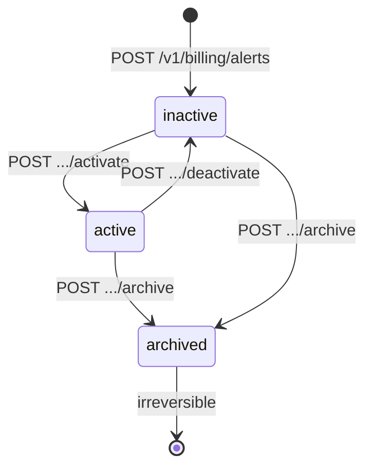
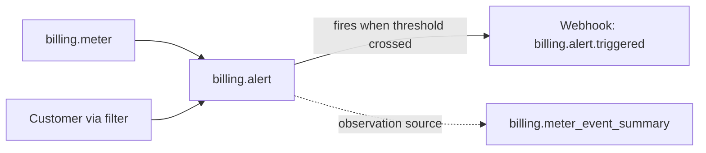

# Billing Alert

> API resource: `billing.alert` · API version: `2026-04-22.dahlia` · Category: [Billing](README.md)

## What it is

A `billing.alert` is a **threshold rule against a [BillingMeter](billing-meters.md)** that fires a webhook when a customer's aggregated usage crosses a configured value. "Alert me when `cus_abc` consumes more than 1,000,000 tokens this period."

Alerts close the loop on usage-based billing: meters report and bill usage, but customers (and your CSM team) want notification *before* the bill arrives. Alerts are the notification primitive.

The current API supports `usage_threshold`-type alerts scoped to a single customer per alert. (Hedge: future alert types — spend thresholds, account-level alerts — may exist; confirm in current docs.)

## Why it exists

Without alerts, the patterns were:

- **Polling [BillingMeterEventSummary](billing-meter-event-summaries.md)** in a cron — more code, more lag, more API calls.
- **Stripe Sigma scheduled queries** — analytical, not transactional; not great for real-time customer-facing notifications.
- **Building it in your app** by streaming your own usage events through your own threshold engine — works, but now you've duplicated metering state.

Alerts let Stripe — which is already the source of truth on aggregated usage — fire the event when the threshold crosses. Your handler decides what to do: email the customer, slack the CSM, throttle API access, top up a credit grant.

## Lifecycle & states



- **`inactive`** — alert is created but not monitoring. The default state on creation. Doesn't fire.
- **`active`** — alert is monitoring usage. Fires `billing.alert.triggered` when usage crosses the threshold.
- **`archived`** — alert is permanently disabled. **Irreversible.** Use to retire an alert you no longer want; clutter-free Dashboard.

The activate/deactivate cycle is for temporarily silencing an alert (e.g. during a planned customer overage). Archive is the kill switch.

## Anatomy of the object

### Identity

| Field | Notes |
|---|---|
| `id` | `al_…` (hedge: confirm prefix). |
| `object` | `"billing.alert"`. |
| `title` | Human label shown in Dashboard and (optionally) in your handler. |
| `status` | `inactive | active | archived`. |
| `livemode`, `created` | standard. |

### Alert type

| Field | Notes |
|---|---|
| `alert_type` | Currently `usage_threshold`. |

### Threshold definition (when `alert_type=usage_threshold`)

| Field | Notes |
|---|---|
| `usage_threshold.gte` | The threshold value. Alert fires when aggregated usage `>=` this. Number, in the meter's value units. |
| `usage_threshold.meter` | `mtr_…`. Which meter to monitor. |
| `usage_threshold.recurrence` | `one_time` (fires once per period and then doesn't re-fire that period — hedge: clarify "period" semantics; may be subscription billing period or rolling). |
| `usage_threshold.filters[]` | Required scoping. Each entry has `type` and a value. The standard filter is `{type: customer, customer: {customer: cus_…}}` to scope to one customer. **Without a customer filter, the alert covers all customers' usage on the meter — typically not what you want.** |

## Relationships



An alert points to one meter and (typically) filters to one customer. To monitor 1,000 customers' usage, you create 1,000 alerts. Programmatic creation at customer-onboarding time is the right pattern.

## Common workflows

### 1. Create and activate an alert at the 80% threshold

When a customer subscribes to a 1M-token plan:

```http
# Step 1: create
POST /v1/billing/alerts
  alert_type=usage_threshold
  title="cus_abc 80% of monthly tokens"
  usage_threshold[meter]=mtr_api_tokens
  usage_threshold[gte]=800000
  usage_threshold[recurrence]=one_time
  usage_threshold[filters][0][type]=customer
  usage_threshold[filters][0][customer][customer]=cus_abc

# Step 2: activate
POST /v1/billing/alerts/al_.../activate
```

`status` → `active`. Stripe begins monitoring.

### 2. Tiered notifications (50% / 80% / 100%)

Create three alerts at different `usage_threshold.gte` values, all scoped to the same customer + meter. Each fires independently when crossed. Your handler dispatches different notifications based on `title` or `usage_threshold.gte`.

### 3. Deactivate during planned overage

A customer asks "we're running a one-week stress test, please stop spamming us":

```http
POST /v1/billing/alerts/al_.../deactivate
```

Reactivate next period:

```http
POST /v1/billing/alerts/al_.../activate
```

### 4. Archive an alert when retiring a meter

```http
POST /v1/billing/alerts/al_.../archive
```

`status` → `archived`. Cannot reactivate. Create a new alert if you change your mind.

### 5. List alerts for a customer

```http
GET /v1/billing/alerts?meter=mtr_…
```

Then filter client-side by `usage_threshold.filters[].customer.customer` to find a customer's alerts. (Hedge: native filter parameters may be limited; confirm.)

## Webhook events

| Event | Fires when | Listener typically does |
|---|---|---|
| `billing.alert.triggered` | Aggregated usage for the customer (per filter) crosses `usage_threshold.gte`. | Send email / slack / in-app notification; optionally throttle API access; optionally top up the customer's [BillingCreditGrant](billing-credit-grants.md). |

The event payload includes the alert object and contextual data (customer, current value). Hedge: payload shape is evolving; check `event.data.object` carefully.

There are **no `billing.alert.created/updated/archived` events** in the catalog — lifecycle changes are observed via your own API calls. Hedge: confirm.

## Idempotency, retries & race conditions

- `POST /v1/billing/alerts` accepts `Idempotency-Key`. Use it — duplicate alerts double-fire, annoying customers.
- Activate/deactivate/archive are idempotent (calling activate on an active alert returns success without state change).
- **Alerts are not exclusive or rate-limited automatically.** A `one_time` alert claims to fire once per period — but the definition of "period" and the dedup window can be subtle. In practice: design your handler to be idempotent against repeated triggers for the same logical threshold.
- Triggering is observation-driven, not event-driven — Stripe periodically checks the meter's aggregated value against thresholds. There is **lag** between the actual crossing and the webhook firing (typically minutes). Don't use alerts as a hard gate for "stop the customer right at 1M tokens"; use them as a soft notification.
- A customer that crosses the threshold, has events adjusted back below it ([BillingMeterEventAdjustment](billing-meter-event-adjustments.md)), and then crosses it again may fire multiple times. Defensive handler design.

## Test-mode tips

- Test alerts only monitor test meters / test events.
- Create a test alert with a low `gte` (e.g. 10), submit metered events totaling over 10, and watch for the webhook.
- Use the Stripe CLI's webhook listener to capture the event locally: `stripe listen --events billing.alert.triggered`.
- `stripe trigger billing.alert.triggered` may produce a synthetic event for handler testing without going through the meter pipeline.

## Connect considerations

- Alerts live on the account that owns the meter. Create alerts on connected accounts via `Stripe-Account: acct_…`.
- For platforms with thousands of connected accounts each having dozens of customers, the alert count multiplies fast. Consider whether platform-level monitoring (your own ETL) scales better than per-customer alerts at that volume.

## Common pitfalls

- **Forgetting the customer filter.** Without `usage_threshold.filters[]` scoping to a customer, the alert monitors *aggregated usage across all customers* on the meter — fires once total usage crosses the threshold, then never again. Almost never what you want.
- **Treating alerts as a hard limit.** They notify; they don't enforce. To actually throttle a customer at 1M tokens, your application must check usage and reject. Use the alert to *trigger* the gating logic, but don't trust it as the gate itself (lag).
- **Creating alerts manually in Dashboard for production customers.** Doesn't scale. Automate creation in your customer-onboarding code.
- **Re-using an archived alert ID.** Archive is irreversible. Create a new alert.
- **Assuming `one_time` means "ever."** It typically resets per usage period (so the alert can fire again next month when usage re-accumulates). Hedge: confirm exact semantics; design handler to handle re-fires gracefully.
- **Not storing the alert ID alongside the customer record.** When the customer changes plans (say, doubles their token quota), you need to find their existing alert and update its `gte`. Without an ID lookup, you're left listing and filtering.
- **Spamming customers on every threshold trigger.** Build dedup into your notification layer (e.g. "don't email same customer about same threshold within 24h").
- **Forgetting to handle `account.application.deauthorized` in Connect.** A connected account's alerts are tied to that account; deauth doesn't auto-archive your platform-side state.

## Further reading

- [API reference: Billing Alert](https://docs.stripe.com/api/billing/alert)
- [Usage alerts guide](https://docs.stripe.com/billing/subscriptions/usage-based/alerts)
- Companion docs: [BillingMeter](billing-meters.md), [BillingMeterEventSummary](billing-meter-event-summaries.md), [BillingCreditGrant](billing-credit-grants.md), [Subscription](subscriptions.md).
