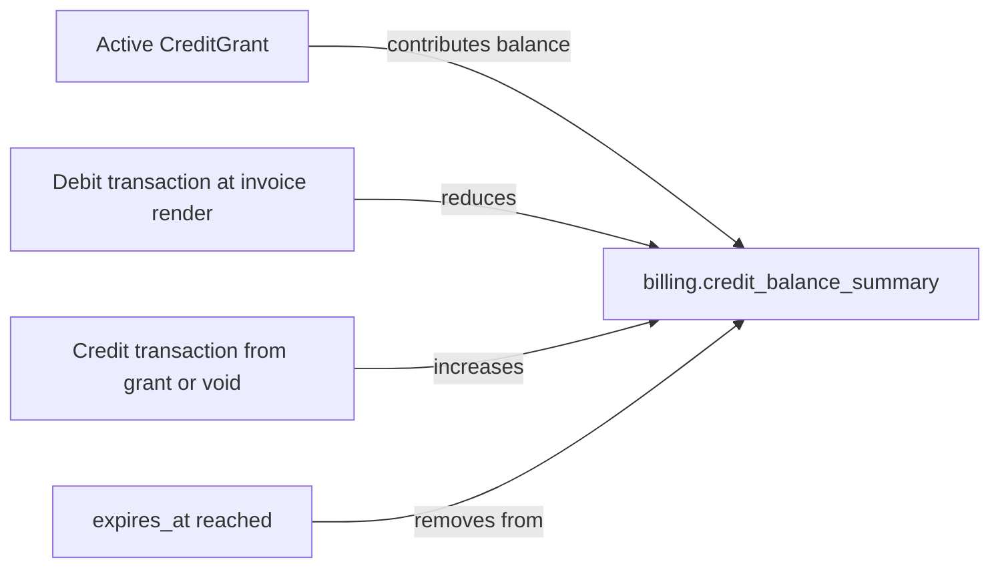

# Billing Credit Balance Summary

> API resource: `billing.credit_balance_summary` · API version: `2026-04-22.dahlia` · Category: [Billing](README.md)

## What it is

A `billing.credit_balance_summary` is a **read-only snapshot of a Customer's available credit**, broken down per [BillingCreditGrant](billing-credit-grants.md). It answers: "Right now, how much credit does this customer have left, where did it come from, and what is its current ledger value vs. its as-of-finalization value?"

Retrieved with `GET /v1/billing/credit_balance_summary?customer=cus_…&filter[…]=…`. There is no creation API; it's a derived projection over the grants and the [BillingCreditBalanceTransactions](billing-credit-balance-transactions.md) recorded against them.

## Why it exists

Customers expect "you have $X credit remaining" displayed in their dashboard. Building that from raw transactions is fiddly — you have to walk every grant, sum every credit/debit, handle pending vs. settled state, and present it consistently. The summary endpoint does that walk for you, returning the same numbers Stripe will use at the next invoice render.

It's also the right surface for:

- **Customer-facing balance UI.**
- **Engineering preview**: "what credit is available before we call this metered API?"
- **Reconciliation**: compare summary vs. your own credit ledger to detect drift.

## Lifecycle & states

The summary doesn't have a state — it's an instantaneous derived view. Its value changes whenever:

- A new grant is created or voided.
- A grant's `effective_at` time arrives or `expires_at` passes.
- An invoice renders and draws down credit (creates a debit transaction).
- A credit-related refund/void event reverses a prior debit.



## Anatomy of the object

### Identity & scope

| Field | Notes |
|---|---|
| `object` | `"billing.credit_balance_summary"`. |
| `customer` | `cus_…`. The Customer this summary is for. Always required as a query param; echoed in response. |
| `livemode` | standard. |

### Balances

| Field | Notes |
|---|---|
| `balances[]` | Array, one entry per active grant the customer holds. Each carries the grant reference plus two balance numbers. |
| `balances[].available_balance.monetary.value` | Smallest unit (cents for USD). What the customer can spend right now. |
| `balances[].available_balance.monetary.currency` | ISO currency. |
| `balances[].available_balance.custom_pricing_unit.value` | If the grant is in custom units. |
| `balances[].ledger_balance.monetary.value` | The "as of last finalized invoice" balance. May lag `available_balance` if there are pending drawdowns or unfinalized invoices. |

The split between `available_balance` and `ledger_balance` matters:

- **`available_balance`** — what's spendable *right now*. Includes uncommitted drawdowns (e.g. against a draft invoice) deducted, and uncommitted credits applied. Use this in customer-facing UI.
- **`ledger_balance`** — settled, post-invoice number. Use this for accounting reports.

For most use cases, `available_balance` is the right field to show.

### Filtering

Query params control which slice of grants the summary covers. Hedge: filter syntax has shifted across iterations — typical filters include:

| Param | Notes |
|---|---|
| `customer` | Required. |
| `filter[type]` | e.g. `monetary`, `custom_pricing_unit`. |
| `filter[applicability_scope][price_type]` | e.g. `metered` to only sum credits applicable to metered usage. |
| `filter[applicability_scope][prices]` | Restrict to credits applicable to specific Prices. |

Confirm exact parameter names against current docs.

## Relationships

```mermaid
graph LR
    CUS[Customer] --> SUMRY[billing.credit_balance_summary]
    CG[billing.credit_grant] -->|one entry in balances[]| SUMRY
    TXN[billing.credit_balance_transaction] -->|drives values in| SUMRY
```

The summary is **derived from the same transactions that the [BillingCreditBalanceTransaction](billing-credit-balance-transactions.md) endpoint exposes**. Summary = projection; transaction list = log. They should always agree.

## Common workflows

### 1. Show "$X credit remaining" in customer dashboard

```http
GET /v1/billing/credit_balance_summary
  ?customer=cus_abc
  &filter[type]=monetary
```

Sum `balances[].available_balance.monetary.value` across the array, format with the currency, render. (If you scope the customer's grants to multiple Prices and want to show per-product credit, query once per scope filter or render the array as-is.)

### 2. Pre-flight check before a paid metered API call

Before serving a high-cost request, check the customer has credit:

```http
GET /v1/billing/credit_balance_summary
  ?customer=cus_abc
  &filter[applicability_scope][price_type]=metered
  &filter[applicability_scope][prices]=price_api_tokens
```

If `available_balance` is zero, you can either fall back to charging a default payment method (via the normal subscription) or block and prompt the customer to top up. The latter pattern is common for prepaid-only AI products.

### 3. Reconciliation against your own ledger

Run periodically: for every customer with an active grant, query the summary, diff vs. your local model. Drift > $0 indicates a transaction your system missed (or vice versa).

### 4. After an invoice renders, refresh the cached balance

The summary value drops when an invoice draws down. If you cache the balance, invalidate the cache on `invoice.finalized` (any invoice for the customer, since you don't know upfront which ones will draw credit).

## Webhook events

**None.** The summary is read-only and does not emit webhooks. To know when balances changed, listen to:

- `billing.credit_grant.created` / `.updated` — new credit added or grant voided.
- `invoice.finalized` / `invoice.paid` — credit drawn down at invoice render.
- (Hedge: a future `billing.credit_balance_transaction.created` event may exist; confirm.)

For a reactive UI, refresh the summary on these triggers.

## Idempotency, retries & race conditions

- Pure read; idempotency-key is a no-op.
- The summary is computed live — no caching layer guarantees stale reads. A read immediately after a grant creation reflects the new grant.
- Concurrent invoice renders + summary reads: the summary returns the consistent state at the moment of read; in-flight drawdowns may or may not be reflected depending on whether the invoice has finalized.
- Cross-currency: a customer can in principle hold grants in different currencies. The summary returns separate `balances[]` entries; sum within currency, not across.

## Test-mode tips

- Test summaries reflect test grants only.
- After creating a grant in test mode, immediately query the summary — `available_balance` should match the granted amount.
- Use [TestClock](test-clocks.md) to push past `effective_at` (a future-effective grant should appear in the summary only after the clock crosses that timestamp) and `expires_at` (an expiring grant should drop out of the summary).
- After triggering a renewal invoice that draws down credit, query the summary again — `available_balance` should decrease by the drawn amount, with a corresponding debit visible in [BillingCreditBalanceTransactions](billing-credit-balance-transactions.md).

## Connect considerations

- Summary is scoped to the account that owns the grants. Use `Stripe-Account: acct_…` for connected-account customers.

## Common pitfalls

- **Showing `ledger_balance` to customers.** It lags reality. Use `available_balance`.
- **Caching summary values too aggressively.** Customers see "you have $50" hours after they spent it. Invalidate on the relevant invoice events.
- **Summing `available_balance` across currencies.** Doesn't make sense. Group by currency in your UI.
- **Treating "no balances entry" as "no grants.**" The summary may also omit grants that are scheduled (`effective_at` in future) or expired/voided. Use the [BillingCreditGrant](billing-credit-grants.md) list endpoint for the canonical list.
- **Using the summary as proof of payment.** It tells you what's available; it does *not* tell you that the customer paid for any of it. For "did this customer top up $50?" check the underlying [PaymentIntent](../01-core-resources/payment-intents.md) or [Charge](../01-core-resources/charges.md).
- **Filter parameter mistakes.** Without scope filters, you get *all* grants regardless of price applicability — including grants for products the customer can't currently use. Apply filters that match the UI you're rendering.

## Further reading

- [API reference: Credit Balance Summary](https://docs.stripe.com/api/billing/credit-balance-summary)
- [Billing credits guide](https://docs.stripe.com/billing/subscriptions/usage-based/billing-credits)
- Companion docs: [BillingCreditGrant](billing-credit-grants.md), [BillingCreditBalanceTransaction](billing-credit-balance-transactions.md), [Customer](../01-core-resources/customers.md), [Invoice](invoices.md).
