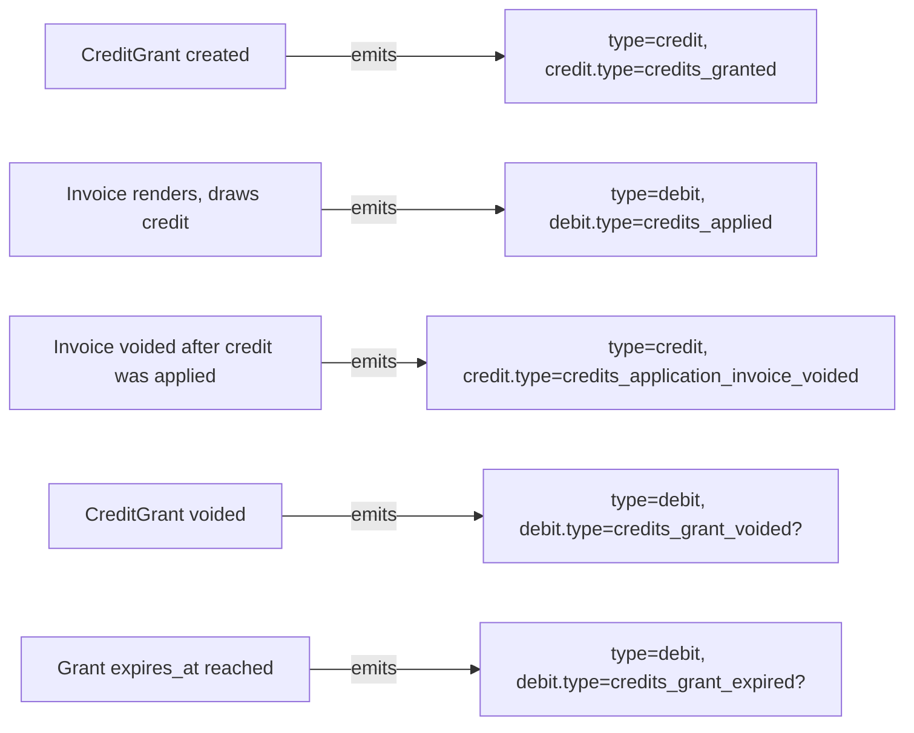
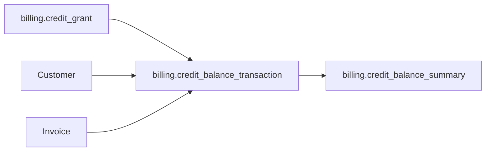

# Billing Credit Balance Transaction

> API resource: `billing.credit_balance_transaction` · API version: `2026-04-22.dahlia` · Category: [Billing](README.md)

## What it is

A `billing.credit_balance_transaction` is **one ledger entry** in the credit-balance lifecycle. Every movement of credit — granted, drawn down at invoice render, restored when an invoice voids, expired, voided — creates a transaction. It's the audit trail for the [BillingCreditGrant](billing-credit-grants.md) system.

Two top-level shapes:

- **`type=credit`** — credit was added or restored (grant issued, drawdown reversed).
- **`type=debit`** — credit was consumed (drawn down to pay an invoice).

This object is read-only; transactions are produced as side effects of grant creation, voiding, expiration, and invoice rendering.

## Why it exists

Without a transaction log:

- You can see the *current* balance ([BillingCreditBalanceSummary](billing-credit-balance-summary.md)) but not how it got there.
- Finance can't reconcile "$X of paid credit was deferred revenue at start of month, $Y was recognized through drawdowns, $Z expired."
- Disputes ("the customer says we burned their $20 of credit but I can't show what invoice took it") have no answer.

The transaction list is the only authoritative answer to "where did this customer's credit go?"

## Lifecycle & states

Transactions are append-only — they don't have states or transitions. A transaction record is immutable once created.



(Subtype names for void/expire are hedge — verify exact `debit.type` enum values in current docs.)

## Anatomy of the object

### Identity

| Field | Notes |
|---|---|
| `id` | `crebtxn_…` (hedge: prefix). |
| `object` | `"billing.credit_balance_transaction"`. |
| `livemode`, `created` | standard. |

### Linkage

| Field | Notes |
|---|---|
| `customer` | `cus_…`. The customer whose balance changed. |
| `credit_grant` | `credgr_…`. Which grant the movement is against. **A transaction always belongs to exactly one grant.** A single invoice that draws from two grants produces two debit transactions. |
| `effective_at` | Unix seconds. When the movement is *effective for accounting*. May differ from `created` for time-shifted entries. |

### Direction & amount

| Field | Notes |
|---|---|
| `type` | `credit` (added to balance) or `debit` (subtracted). |
| `amount.type` | `monetary` or `custom_pricing_unit`. |
| `amount.monetary.value` | Smallest currency unit. **Always positive** — sign is determined by `type`, not by the value. |
| `amount.monetary.currency` | ISO currency. |

### Subtype

| Field | Notes |
|---|---|
| `credit.type` | When `type=credit`: e.g. `credits_granted` (initial issuance), `credits_application_invoice_voided` (a previously-drawn-down invoice was voided, returning credit). |
| `debit.type` | When `type=debit`: e.g. `credits_applied` (drawn down at invoice render). Hedge: additional debit subtypes exist for grant void / expiry. |

### Invoice link (debits only)

| Field | Notes |
|---|---|
| `invoice` | `in_…`. For debits caused by drawdown, the invoice that consumed the credit. **The single most useful field for "what did this credit pay for?"** |
| `invoice_line_item` | Hedge: per-line attribution may be present for fine-grained drawdowns. |

## Relationships



A transaction has FKs to the customer, the grant, and (for debits) the invoice. The summary is the running aggregate over these transactions.

## Common workflows

### 1. List all transactions for a customer

```http
GET /v1/billing/credit_balance_transactions
  ?customer=cus_abc
  &limit=100
```

Paginate via `starting_after`. Returns chronologically (latest first by default).

### 2. List transactions for a specific grant

```http
GET /v1/billing/credit_balance_transactions
  ?credit_grant=credgr_…
```

Use this for "show me the lifetime of this $50K commitment" — every drawdown that consumed it, every void that gave back to it.

### 3. Show "where did this credit go?" in customer dashboard

For a paid grant, list its transactions and render:

```
2026-05-01  +$5,000.00  Granted (2026 commitment)
2026-05-15  -$120.00    Applied to invoice ABC-0001 (API tokens)
2026-06-01  -$240.00    Applied to invoice ABC-0002 (API tokens)
2026-06-04  +$240.00    Invoice ABC-0002 voided (credit restored)
```

Customers find this very reassuring; finance teams find it essential.

### 4. Reconcile total drawdown for a period

```http
GET /v1/billing/credit_balance_transactions
  ?created[gte]=<period_start>
  &created[lte]=<period_end>
  &limit=100
```

Sum `amount` where `type=debit` and `debit.type=credits_applied`. That's the credit your customers consumed in the period. Matches your "deferred revenue → recognized revenue" journal entry.

### 5. Trace a single invoice's credit application

When a customer asks "why is my invoice $80 instead of $100?":

```http
GET /v1/billing/credit_balance_transactions?invoice=in_…
```

Hedge: filter by `invoice` may not be supported as a query param; if not, list by customer and filter client-side, or read the invoice's `total_credit_balance_transaction` field directly.

## Webhook events

Hedge: a dedicated `billing.credit_balance_transaction.created` event may exist (API surface is evolving). The webhook catalog notes only `billing.credit_grant.created` / `.updated` as confirmed for the credit family.

Practical reactivity:

- Listen to `billing.credit_grant.created` for issuance transactions.
- Listen to `invoice.finalized` / `invoice.paid` for drawdown transactions.
- Listen to `invoice.voided` for credit-restore transactions.

The Invoice payload's `total_credit_balance_transaction` field gives you a direct ID to fetch.

## Idempotency, retries & race conditions

- Pure read; idempotency-key is a no-op.
- Transactions are written **synchronously with the action that caused them** (grant create, invoice render, etc.). There is no eventual-consistency lag of practical concern.
- A single invoice render that touches multiple grants (drawdown spans grants by priority) writes multiple debit transactions in a single logical operation. Their `created` timestamps may be identical; rely on `id` for ordering.
- Listing by `customer` with high-volume drawdown (many invoices per period) can be slow; paginate aggressively and consider Sigma for analytical queries.

## Test-mode tips

- Test transactions only reflect test grants and test invoices.
- After running a metered subscription cycle in test mode (with a customer holding a credit grant), list transactions to validate that drawdown happened and the math agrees.
- Voiding a paid invoice in test mode should produce a `credits_application_invoice_voided` credit transaction — useful for testing your refund/restore flows.

## Connect considerations

- Transactions are scoped to the account that owns the grant. Use `Stripe-Account: acct_…` for connected accounts.

## Common pitfalls

- **Treating transactions as the source of truth for current balance.** Transactions are the *log*; [BillingCreditBalanceSummary](billing-credit-balance-summary.md) is the *projection*. Summing transactions client-side and comparing to summary is a valid reconciliation, but for "what's left right now" use the summary.
- **Filtering by `type` alone and missing subtypes.** A `debit` could be a normal drawdown, a grant-void, or an expiry — `debit.type` distinguishes them. Finance reports usually want only `credits_applied` debits in "credit consumed" totals.
- **Assuming a 1:1 between invoices and transactions.** An invoice that draws from two grants writes two debit transactions, both with the same `invoice` ID.
- **Ignoring `effective_at`.** For accounting periods that don't align with `created` (e.g. you back-date a grant for contract effectiveness), `effective_at` is the date the bookkeeping cares about.
- **No webhook for transaction creation (currently).** If you need a streaming view, derive from the surrounding events (`invoice.finalized`, `billing.credit_grant.*`). Hedge: this surface is evolving — re-check.
- **Using the API for analytical queries.** For "credit consumption in 2026 by product," use Stripe Sigma or your own warehouse. The List API isn't an analytical tool.

## Further reading

- [API reference: Credit Balance Transaction](https://docs.stripe.com/api/billing/credit-balance-transaction)
- [Billing credits guide](https://docs.stripe.com/billing/subscriptions/usage-based/billing-credits)
- Companion docs: [BillingCreditGrant](billing-credit-grants.md), [BillingCreditBalanceSummary](billing-credit-balance-summary.md), [Invoice](invoices.md).
