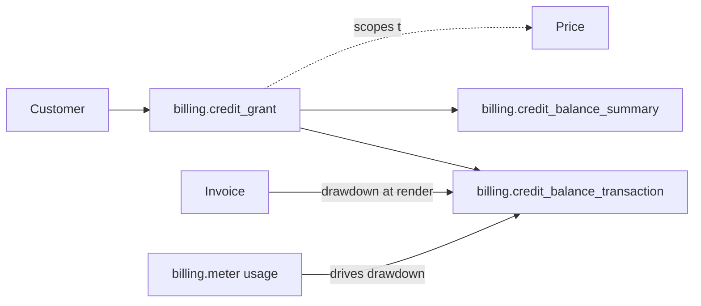

# Billing Credit Grant

> API resource: `billing.credit_grant` · API version: `2026-04-22.dahlia` · Category: [Billing](README.md)

## What it is

A `billing.credit_grant` is **prepaid (or promotional) credit issued to a Customer** that gets automatically drawn down by metered usage or applied against invoices, before the customer's payment method is charged. It models the "$50 of API credit" or "free tier of 1M tokens/month" pattern at first-class infrastructure, instead of you maintaining a custom balance ledger.

A grant has an amount (monetary or in custom pricing units), an applicability scope (which Prices it can offset), a category (paid vs promotional — for accounting), an effective date, an optional expiration, and a priority that controls drawdown order when multiple grants exist.

Grants live on the [Customer](../01-core-resources/customers.md). The aggregate balance and per-grant breakdown are read via [BillingCreditBalanceSummary](billing-credit-balance-summary.md), and individual debit/credit movements are recorded as [BillingCreditBalanceTransactions](billing-credit-balance-transactions.md).

## Why it exists

Before this primitive, the patterns were:

- **Custom balance** on the Customer (`balance`) — works for invoice credit but is account-wide, not per-product, has no expiration, no scope, no audit trail.
- **One-shot coupons** — limited to percentage/amount discounts, not "$X of credit to spend over time."
- **Self-managed ledgers** — you DIY: a credit table, drawdown logic, expiration cron. Brittle.

CreditGrants give you:

- **Scoping** to specific Prices / metered products. (Prepaid AI credits don't accidentally pay the SaaS sub.)
- **Priority ordering** — promotional credit drawn before paid credit, expiring credit before non-expiring.
- **Automatic drawdown** at invoice render time — no application-layer code.
- **Audit trail** via balance transactions.
- **Accounting category** — you can tell finance "$X is paid revenue, $Y is promotional give-away."

## Lifecycle & states

```mermaid
stateDiagram-v2
    [*] --> active: POST /v1/billing/credit_grants (effective_at <= now)
    [*] --> scheduled: effective_at > now
    scheduled --> active: clock reaches effective_at
    active --> expired: clock reaches expires_at
    active --> voided: POST .../void
    active --> exhausted: balance fully drawn
    expired --> [*]
    voided --> [*]
    exhausted --> [*]: balance is 0; grant remains for audit
```



The grant object doesn't carry a literal `status` enum the way Subscription does; you derive its state from `voided_at`, `expires_at`, `effective_at`, and the current ledger balance.

- **scheduled** — `effective_at` is in the future; balance not yet usable.
- **active** — `effective_at <= now < expires_at`, not voided. Drawdown happens automatically at invoice render.
- **expired** — `expires_at` has passed. Remaining balance is forfeited (logged as a balance transaction so finance can see what was given back).
- **voided** — you cancelled the grant via void. `voided_at` is set. Remaining balance forfeited.
- **exhausted** — balance fully drawn. The grant object stays for audit; future drawdowns find nothing here and look at the next grant by priority.

Voiding is irreversible (consistent with other immutable accounting documents in Stripe). Grants cannot be edited materially after creation — to change the amount, void and re-create. Hedge: `metadata`, `name`, and `expires_at` are typically updatable; check current docs.

## Anatomy of the object

### Identity

| Field | Notes |
|---|---|
| `id` | `credgr_…` (hedge: prefix). |
| `object` | `"billing.credit_grant"`. |
| `customer` | `cus_…`. The grant belongs to one Customer. Cannot change. |
| `name` | Optional human label ("2026 promotional grant"). Shown in Dashboard. |
| `livemode`, `created`, `updated`, `metadata` | standard. |

### Amount

| Field | Notes |
|---|---|
| `amount.type` | `monetary` or `custom_pricing_unit`. |
| `amount.monetary.value` | Smallest currency unit (cents for USD). Required when `type=monetary`. |
| `amount.monetary.currency` | ISO currency. Must match the Customer's currency for the grant to apply to invoices. |
| `amount.custom_pricing_unit.value` | When pricing in custom units (e.g. "tokens", "credits"). |
| `amount.custom_pricing_unit.id` | The custom pricing unit definition. |

Hedge: `custom_pricing_unit` support is part of newer pricing primitives; verify availability for your account.

### Applicability

| Field | Notes |
|---|---|
| `applicability_config.scope.price_type` | `metered` (most common — drawdown against metered usage) or other scopes for invoice-level application. |
| `applicability_config.scope.prices[]` | Optional list of `{ id: price_… }` restricting drawdown to specific Prices. Empty = all Prices matching `price_type`. |

Scoping is the difference between "this $50 can pay for *any* charge on this account" and "this $50 can only pay for `price_api_tokens` usage." Tighter scope = less customer surprise.

### Accounting category

| Field | Notes |
|---|---|
| `category` | `paid` (customer paid you for the credit; counts as deferred revenue) or `promotional` (you gave it away; counts as marketing expense). |

This drives nothing in Stripe's drawdown logic except priority defaults — it's primarily a tag for your finance team's revenue reports.

### Priority

| Field | Notes |
|---|---|
| `priority` | Integer. **Lower number = drawn first.** Use to order grants when a customer holds multiple (e.g. always exhaust expiring promotional credit before tapping prepaid paid credit). |

Default ordering when priorities tie: typically by expiration (expiring sooner first). Hedge: verify with current docs.

### Time bounds

| Field | Notes |
|---|---|
| `effective_at` | Unix seconds. Earliest moment the grant can be drawn down. |
| `expires_at` | Unix seconds. After this, remaining balance is forfeited. Null = never expires. |
| `voided_at` | Set when you void. |

## Relationships



The grant doesn't directly point at a Subscription or Invoice. The drawdown machinery picks grants at invoice render time based on the customer + applicability scope, then writes a debit transaction.

## Common workflows

### 1. Sell prepaid API credit ("$100 credit pack")

```http
# Customer pays you $100 (separate Charge / PaymentIntent flow)
# Then issue the grant:
POST /v1/billing/credit_grants
  customer=cus_abc
  amount[type]=monetary
  amount[monetary][value]=10000
  amount[monetary][currency]=usd
  applicability_config[scope][price_type]=metered
  applicability_config[scope][prices][0][id]=price_api_tokens
  category=paid
  priority=100
  name="$100 prepaid API credit"
```

Going forward, the customer's metered API token invoices automatically draw down this grant before charging their card.

### 2. Promotional onboarding credit ("$5 free for new signups")

```http
POST /v1/billing/credit_grants
  customer=cus_new
  amount[type]=monetary
  amount[monetary][value]=500
  amount[monetary][currency]=usd
  applicability_config[scope][price_type]=metered
  category=promotional
  priority=10  # drawn before any paid grants
  expires_at=<now + 30d>
  name="Welcome credit"
```

Lower `priority` and a 30-day expiry ensures it's used (or burned) first.

### 3. Annual contract credit ("$50K of credit, expires year-end")

```http
POST /v1/billing/credit_grants
  customer=cus_enterprise
  amount[type]=monetary
  amount[monetary][value]=5000000
  amount[monetary][currency]=usd
  applicability_config[scope][price_type]=metered
  category=paid
  priority=50
  effective_at=<contract start>
  expires_at=<contract end>
  name="2026 enterprise commitment"
  metadata[contract_id]=ENT-2026-001
```

Pair with [BillingAlerts](billing-alerts.md) on the meter to notify the customer when they're at 80% of their commitment.

### 4. Void a mistaken grant

```http
POST /v1/billing/credit_grants/credgr_…/void
```

Remaining balance is zeroed via a debit transaction. The grant object stays for audit. Already-applied drawdowns are not reversed.

### 5. Update name / metadata

```http
POST /v1/billing/credit_grants/credgr_…
  name="Updated label"
  metadata[contract_id]=ENT-2026-002
```

Hedge: amount, category, applicability scope are typically not editable post-creation. Confirm against current docs.

## Webhook events

| Event | Fires when | Listener typically does |
|---|---|---|
| `billing.credit_grant.created` | Grant issued. | Sync to your CRM / contract record. |
| `billing.credit_grant.updated` | Editable fields changed (or void). | Re-sync; check `voided_at`. |

Hedge: there is *not* (as of the listed catalog) a separate `billing.credit_grant.voided` or `.expired` event — voiding surfaces as `.updated` with `voided_at` set, and expiration is silent. Check current docs.

For drawdown visibility, listen to invoice events; the invoice payload includes `total_credit_balance_transaction` referencing the [BillingCreditBalanceTransaction](billing-credit-balance-transactions.md) created at render.

## Idempotency, retries & race conditions

- `POST /v1/billing/credit_grants` accepts `Idempotency-Key`. Use it — accidentally double-issuing a $50K grant is not the bug you want.
- Drawdown is computed **at invoice render time**. Concurrent invoices for the same customer (rare but possible with one-off invoices alongside subscription invoices) are serialized server-side.
- Voiding mid-period: any drawdowns already applied to in-progress invoices remain. Future renders won't see this grant.
- Webhook order: `billing.credit_grant.created` may arrive before or after the first invoice that uses it; reconcile by ID, not order.

## Test-mode tips

- Test-mode grants only apply to test-mode customers and invoices.
- Use [TestClock](test-clocks.md) to advance through `effective_at` and `expires_at` boundaries to verify scheduled-grant and expiration behavior.
- After issuing a grant, query [BillingCreditBalanceSummary](billing-credit-balance-summary.md) to confirm the available balance matches.
- Combine with metered usage events (see [MeterEvent](billing-meter-events.md)) and trigger a renewal invoice to see the drawdown transaction appear.

## Connect considerations

- Grants live on the account they're created on. For platforms billing on behalf of connected accounts, create the grant on the connected account (`Stripe-Account: acct_…`).
- Cross-account credit (platform-funded credit on a connected-account customer) isn't directly modelled; you'd transfer money to the connected account separately and grant credit locally.

## Common pitfalls

- **Wrong currency on the grant vs. the customer.** Grant doesn't apply. The Customer's invoice currency is locked to their first invoice; the grant's currency must match.
- **No `applicability_config` scope** — too permissive a grant may pay for charges you didn't intend (e.g. one-off setup fees burning prepaid usage credit). Always scope to `prices[]` when intent is narrow.
- **Forgetting `priority` ordering.** Without explicit priority, drawdown order may surprise you when a customer has multiple grants. Set priority deliberately: lowest = drawn first.
- **Treating grants as discounts.** They're not — discounts apply at invoice render as a percent/amount reduction on a line. Grants apply as a debit against a customer balance, with their own ledger and expiration. Use [Coupon](../03-products/coupons.md) for percentage-off; use grants for "$X to spend."
- **Voiding to "fix" an over-drawn grant.** Drawdowns already on a finalized invoice cannot be reversed by voiding the grant. Use [CreditNote](credit-notes.md) on the affected invoice instead.
- **Issuing grants without writing the contract terms into `metadata`.** Six months later when finance asks "what's this $50K?" the audit trail is just a row.
- **Letting grants expire silently.** No webhook fires on expiration (hedge — confirm). Run your own job that warns customers approaching `expires_at`.

## Further reading

- [API reference: Credit Grant](https://docs.stripe.com/api/billing/credit-grant)
- [Billing credits guide](https://docs.stripe.com/billing/subscriptions/usage-based/billing-credits)
- Companion docs: [BillingCreditBalanceSummary](billing-credit-balance-summary.md), [BillingCreditBalanceTransaction](billing-credit-balance-transactions.md), [BillingMeter](billing-meters.md), [Customer](../01-core-resources/customers.md).
