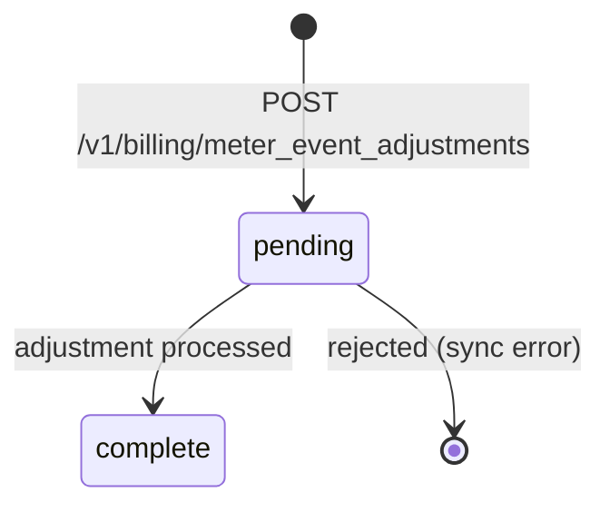
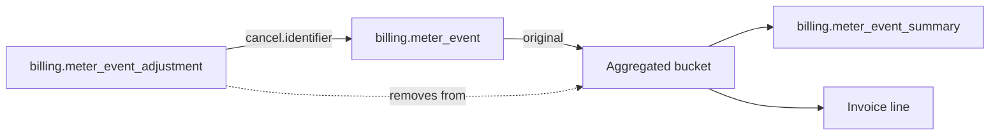

# Billing Meter Event Adjustment

> API resource: `billing.meter_event_adjustment` · API version: `2026-04-22.dahlia` · Category: [Billing](README.md)

## What it is

A `billing.meter_event_adjustment` is the **retroactive correction primitive** for usage you reported in error. The supported correction is *cancellation*: reference a previously-reported [MeterEvent](billing-meter-events.md) by its `identifier` and Stripe will remove it from the aggregated usage that bills the customer.

You cannot *edit* a MeterEvent — they are append-only telemetry. The pattern is "cancel the wrong event, then submit a corrected one with a fresh `identifier`."

## Why it exists

Real billing systems get bad data: a buggy deploy double-reports, a test event leaks into prod, a customer is charged for an internal ops call. Without adjustments, the only fix is a [CreditNote](credit-notes.md) issued *after* the invoice is rendered — slow, manual, and visible to the customer as a credit line. Adjustments fix the underlying aggregation **before** the invoice is finalized, so the customer sees the right number from the start.

## Lifecycle & states



- **`pending`** — accepted but not yet applied to the aggregated bucket. Brief; processing is asynchronous but typically near-real-time.
- **`complete`** — the targeted event has been removed from aggregation. Subsequent reads of [MeterEventSummary](billing-meter-event-summaries.md) will show the corrected total.

There is no "reverse an adjustment" — once an event is cancelled, it stays cancelled. To re-add the usage, submit a new MeterEvent with a fresh `identifier`.

## Anatomy of the object

### Identity

| Field | Notes |
|---|---|
| `id` | adjustment ID (hedge: prefix varies, e.g. `mteadj_…`). |
| `object` | `"billing.meter_event_adjustment"`. |
| `livemode`, `created` | standard. |

### Target

| Field | Notes |
|---|---|
| `event_name` | The meter event_name being adjusted. Must match the original event. |
| `type` | Currently only `cancel`. Hedge: future adjustment types may be added. |
| `cancel.identifier` | The `identifier` of the original [MeterEvent](billing-meter-events.md) to nullify. |
| `status` | `pending | complete`. |

The adjustment is **scoped by `(event_name, identifier)`** — the same fields used by Stripe's meter dedup logic.

## Relationships



An adjustment has no FK to the MeterEvent object — it references it by the `identifier` string you assigned. **If you used the default UUID `identifier` when reporting the event, you cannot adjust it later** because you don't know what value Stripe generated. Always set `identifier` explicitly when you report events.

## Common workflows

### 1. Cancel a single mis-reported event

```http
POST /v1/billing/meter_event_adjustments
  event_name=api_tokens
  type=cancel
  cancel[identifier]=req_xyz_2026_05_06T14:00:00Z
```

`status` returns `pending`; within seconds it transitions to `complete`. The cancelled event is removed from the customer's aggregated bucket for the relevant `event_time_window`.

### 2. Bulk-cancel after a buggy deploy

There is no bulk-cancel endpoint. For each affected event:

```http
POST /v1/billing/meter_event_adjustments
  event_name=api_tokens
  type=cancel
  cancel[identifier]=<original identifier>
```

You must have logged the `identifier`s you sent. **This is the operational reason to derive `identifier` from a stable, queryable source** (request ID in your logs, primary key in your usage table).

### 3. Mid-period correction with a re-submission

```http
# Step 1: cancel the wrong event
POST /v1/billing/meter_event_adjustments
  event_name=api_tokens
  type=cancel
  cancel[identifier]=req_xyz

# Step 2: submit the correct event with a NEW identifier
POST /v1/billing/meter_events
  event_name=api_tokens
  payload[stripe_customer_id]=cus_abc
  payload[tokens]=1000  # the correct amount
  identifier=req_xyz_corrected
```

Do **not** reuse the cancelled `identifier` for the corrected event — Stripe's dedup will treat it as a duplicate and drop it.

### 4. Post-invoice corrections

Adjustments only meaningfully fix usage **before the period's invoice is finalized**. Once an invoice has rendered the metered line:

- For unpaid invoices, you can sometimes void and re-render after adjustment — fragile.
- For paid invoices, use a [CreditNote](credit-notes.md) to refund/credit the customer. Adjusting the underlying meter event no longer changes the customer's invoice.

Hedge: behavior for adjustments to events in already-invoiced periods varies — they may carry forward as a credit on the next invoice, or be rejected. Test in your specific configuration.

## Webhook events

No dedicated webhooks for adjustments themselves (hedge: confirm; this surface area is evolving). Observe outcomes via:

- [MeterEventSummary](billing-meter-event-summaries.md) reads showing the adjusted aggregate.
- The corrected number appearing on the eventual `invoice.finalized` payload.

## Idempotency, retries & race conditions

- `POST /v1/billing/meter_event_adjustments` accepts `Idempotency-Key`. Use it.
- Cancelling the same `identifier` twice returns success the second time (idempotent at the meter-pipeline level).
- Cancelling an `identifier` that was never reported is **not an error** — Stripe accepts it as a no-op (hedge: behavior may be a 200 with `complete` status anyway). Don't rely on this as a "did this event exist?" check.
- There is a window between event acceptance and aggregation; cancelling within that window still works (the event is removed before it ever lands in a bucket).
- Race: cancelling an event that was reported in a window already invoiced does *not* refund. The window matters.

## Test-mode tips

- Test-mode adjustments only target test-mode events.
- The CLI: `stripe billing meter_event_adjustments create --event-name=api_tokens --type=cancel --cancel[identifier]=…`.
- To validate end-to-end: report event → confirm via summary → adjust → confirm summary decreased.

## Connect considerations

- Adjustments are scoped to the account owning the meter. Use `Stripe-Account: acct_…` to adjust events on a connected account.

## Common pitfalls

- **Default UUID identifiers** — you cannot adjust what you cannot reference. This is the root cause of "I reported wrong data and now I can't fix it." Always set `identifier` explicitly from a domain-stable source.
- **Reusing the cancelled identifier for the correction.** Stripe's dedup drops it. Use a new identifier for the corrected event.
- **Adjusting after invoice finalization and expecting refund.** Adjustments don't move money — they change aggregated usage *before* it's billed. Use [CreditNote](credit-notes.md) for post-invoice corrections.
- **Logging `identifier`s only in volatile storage** (request memory). When you need to cancel later — typically days later, after a customer complaint — the identifier is gone. Persist it.
- **Treating `pending` as "didn't work."** It's normal; check back or rely on eventual consistency. Don't poll tightly.
- **Bulk corrections without batching control.** No bulk endpoint exists; if you need to cancel 100k events, your script is responsible for rate-limiting against Stripe API limits.

## Further reading

- [API reference: Meter Event Adjustment](https://docs.stripe.com/api/billing/meter-event_adjustment)
- Companion docs: [BillingMeter](billing-meters.md), [MeterEvent](billing-meter-events.md), [MeterEventSummary](billing-meter-event-summaries.md), [CreditNote](credit-notes.md).
