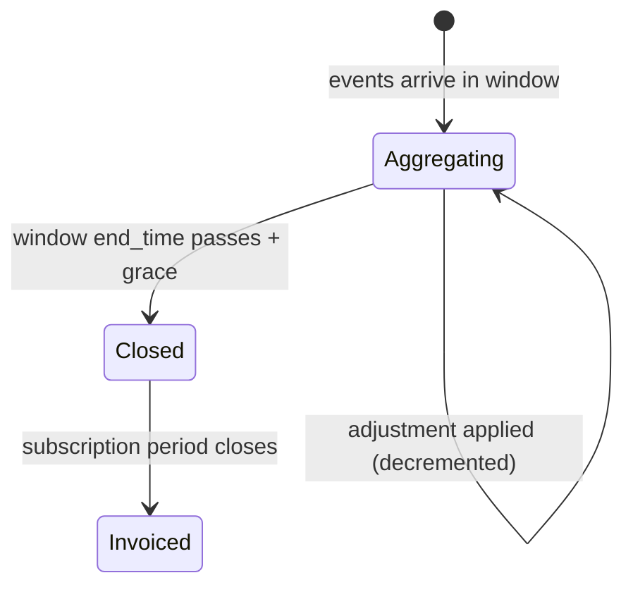
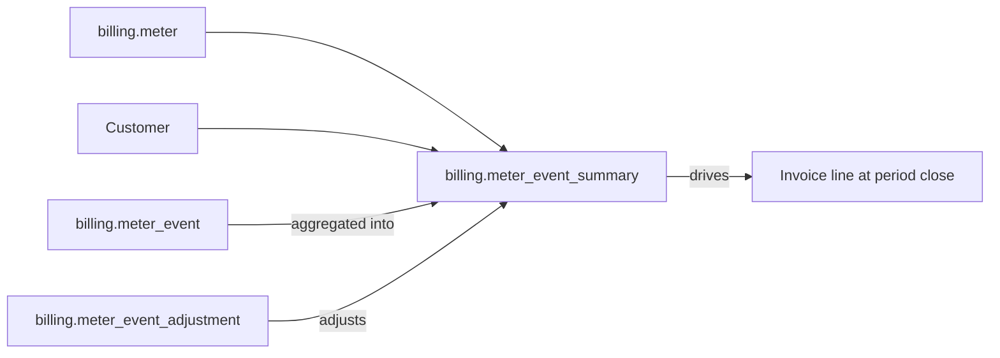

# Billing Meter Event Summary

> API resource: `billing.meter_event_summary` · API version: `2026-04-22.dahlia` · Category: [Billing](README.md)

## What it is

A `billing.meter_event_summary` is a **read-only aggregated view** of the usage Stripe has rolled up for a given (meter, customer, time window) tuple. It's the answer to "how many tokens did `cus_abc` consume between `T1` and `T2` according to Stripe?" — and crucially, **it's the same number Stripe will bill the customer for**.

There is no creation API. Summaries are computed continuously as [MeterEvents](billing-meter-events.md) are reported and [MeterEventAdjustments](billing-meter-event-adjustments.md) are applied. You retrieve them via a list endpoint scoped to a meter and customer.

## Why it exists

Three jobs:

1. **Customer-facing usage UIs.** "You've used 73,000 of your included 100,000 tokens this month." Pull from summaries so the number you show matches the number you bill.
2. **Engineering reconciliation.** Compare Stripe's aggregate against your own internal usage counter. Drift between the two means events were lost, double-counted, or mis-mapped.
3. **Pre-invoice validation.** Before the period closes, query the summary to predict what Stripe will bill.

Without it, you'd be reading raw events (which Stripe doesn't expose retrievably) or trusting your own metering store as the source of truth (and discovering off-by-one billing bugs only when customers complain).

## Lifecycle & states

Summaries don't have a state machine — they're a derived projection. Conceptually:



A summary's `aggregated_value` is **mutable until the window is "closed"** for billing purposes. New events with a `timestamp` inside the window — or adjustments referencing events in the window — change the value.

## Anatomy of the object

### Identity & scope

| Field | Notes |
|---|---|
| `id` | Synthetic ID for the summary row. |
| `object` | `"billing.meter_event_summary"`. |
| `meter` | `mtr_…` this summary belongs to. |
| `customer` | `cus_…` this summary belongs to. |
| `livemode` | standard. |

### Window

| Field | Notes |
|---|---|
| `start_time` | Unix seconds. Inclusive lower bound of the bucket. |
| `end_time` | Unix seconds. Exclusive upper bound. Window granularity matches the meter's `event_time_window` (`day` or `hour`). |

### Value

| Field | Notes |
|---|---|
| `aggregated_value` | Number. The result of applying the meter's `default_aggregation.formula` (sum / count / last) to all events for this customer in this window, *minus* any cancelled events. **This is the billable quantity.** |

## Relationships



A summary is uniquely identified by `(meter, customer, start_time, end_time)`. Listing returns one row per window in the requested range.

## Common workflows

### 1. Show "your usage so far this month" to a customer

```http
GET /v1/billing/meters/mtr_…/event_summaries
  ?customer=cus_abc
  &start_time=1746057600
  &end_time=1748736000
  &value_grouping_window=day
```

Aggregate the returned `aggregated_value`s client-side to get a total, or render a per-day chart.

Hedge: parameter name for the rollup granularity (`value_grouping_window` / `granularity`) has shifted across iterations — check current docs.

### 2. Reconcile your meter against Stripe daily

Run a nightly job for each Customer:

1. Sum your local usage records for `[yesterday_start, yesterday_end)`.
2. Query Stripe summaries for the same range.
3. Diff. Alert if the absolute or relative diff exceeds threshold.

The diff catches: lost events (network failures), double-reported events (retry bugs), mis-mapped events (`customer_mapping` key wrong), and adjustments you didn't expect.

### 3. Validate that a buggy fix worked

After deploying a [MeterEventAdjustment](billing-meter-event-adjustments.md) batch:

1. Note the previous `aggregated_value` for the affected window.
2. Apply adjustments.
3. Re-query — `aggregated_value` should have decreased by the cancelled amount.

Allow propagation lag (seconds to minutes).

### 4. Predict the next invoice

Just before the subscription's `current_period_end`:

```http
GET /v1/billing/meters/mtr_…/event_summaries
  ?customer=cus_abc
  &start_time=<current_period_start>
  &end_time=<current_period_end>
```

Sum the `aggregated_value`s and multiply by the metered Price's unit amount. That's what the next invoice's metered line will show (modulo any tiered/graduated pricing rules — those are computed by Stripe at invoice render).

## Webhook events

**None.** Summaries are read-only projections. To get notified about usage changes:

- Use [BillingAlerts](billing-alerts.md) (`billing.alert.triggered`) for threshold-based notifications.
- Use `invoice.created` / `invoice.finalized` to react when summaries materialize as invoice lines.

## Idempotency, retries & race conditions

- Pure read; idempotency-key is a no-op.
- **Lag matters.** A summary read seconds after submitting events may not reflect them. Aggregation is asynchronous; allow seconds-to-minutes of propagation. Hedge: SLAs vary by load.
- A summary read during active event ingestion is a snapshot — by the time you process the response, the underlying value may have changed.
- For "definitive" reads (e.g. to render an invoice in your own UI), wait until the meter's `event_time_window` has fully passed plus a grace buffer.

## Test-mode tips

- Test-mode summaries only reflect test-mode events.
- After submitting test events via `stripe billing meter_events create`, allow lag before querying. If summaries stay empty for >5 minutes, the most likely cause is a `customer_mapping` payload-key mismatch. Re-check meter config against event payload.
- For a deterministic test loop: submit event → poll summary until `aggregated_value` matches → assert.

## Connect considerations

- Summaries are scoped to the account that owns the meter. Use `Stripe-Account: acct_…` to read summaries on a connected account's meter.

## Common pitfalls

- **Trusting summary reads as "live."** They lag. Render real-time UIs from your own metering store; reconcile to Stripe daily.
- **Querying with a window narrower than the meter's `event_time_window`.** A meter with `event_time_window=day` produces day buckets. Asking for an hour-grain summary returns either the day bucket trimmed (hedge: behavior varies) or nothing useful. Match your query window to the meter's grain.
- **Forgetting that adjustments retroactively change historical summaries.** A summary you read on Tuesday may differ when you read it again on Friday because adjustments were applied. Cache with caution.
- **Using summaries as the audit trail.** They're a projection, not a log. The audit trail is your own event log keyed by the `identifier`s you submitted.
- **Computing customer-facing "money owed so far" naively.** Summary × Price doesn't account for [BillingCreditGrants](billing-credit-grants.md) drawdown, tiered pricing, or proration. To preview an actual invoice, use the upcoming-invoice endpoint, not your own math.
- **Pagination assumptions.** Long date ranges return many rows; iterate via `starting_after` like any List API.

## Further reading

- [API reference: Meter Event Summary](https://docs.stripe.com/api/billing/meter-event_summary)
- [Reading meter usage guide](https://docs.stripe.com/billing/subscriptions/usage-based)
- Companion docs: [BillingMeter](billing-meters.md), [MeterEvent](billing-meter-events.md), [MeterEventAdjustment](billing-meter-event-adjustments.md), [BillingAlert](billing-alerts.md), [Invoice upcoming](invoices.md).
