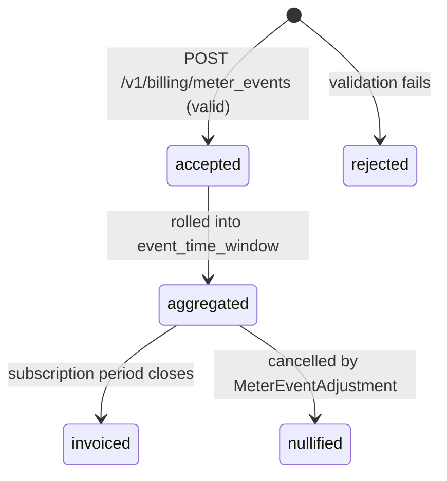
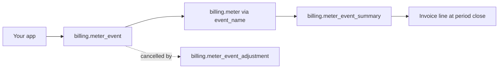

# Billing Meter Event

> API resource: `billing.meter_event` · API version: `2026-04-22.dahlia` · Category: [Billing](README.md)

## What it is

A `billing.meter_event` is a **single point of usage data** reported to Stripe. "Customer cus_X consumed Y units of metric Z at time T." Stripe accepts the event, validates it against a [BillingMeter](billing-meters.md) with the matching `event_name`, extracts the customer ID and the numeric value from your `payload`, and buckets the result into the meter's `event_time_window` for that customer. At the end of a [Subscription](subscriptions.md)'s billing period, Stripe rolls up those buckets into an invoice line.

The MeterEvent itself is **fire-and-forget** — there's no GET endpoint to retrieve a specific event by ID. You verify aggregation through [MeterEventSummaries](billing-meter-event-summaries.md), not by reading individual events back.

## Why it exists

It is the entry point for usage-based billing data, replacing the legacy per-`subscription_item` `usage_record` API. Differences:

- **No subscription/item lookup needed.** Send `payload[stripe_customer_id]=cus_…` and `event_name`; Stripe resolves the rest.
- **Deduplicated by `identifier`.** A retry of the same event won't double-count.
- **Higher throughput.** Designed for high-volume telemetry (AI inference calls, API requests).
- **Adjustable** via [MeterEventAdjustments](billing-meter-event-adjustments.md) when you reported wrong data.

For very high-volume integrations there is a separate **Meter Event Stream** endpoint optimized for batched ingestion (`POST /v1/billing/meter_event_stream`). Hedge: stream-mode semantics differ from the standard endpoint (e.g. fewer ack guarantees) — consult current docs before choosing.

## Lifecycle & states

MeterEvents do not have a status field. They are append-only telemetry. Conceptually:



- **accepted** — Stripe stored the event. The HTTP 200 response is your only confirmation; the event is then asynchronously aggregated.
- **rejected** — synchronous 400. Common causes: unknown `event_name`, missing `customer_mapping` key in payload, non-numeric value, malformed timestamp.
- **aggregated** — visible in [MeterEventSummaries](billing-meter-event-summaries.md) after a propagation delay.
- **nullified** — a [MeterEventAdjustment](billing-meter-event-adjustments.md) with `cancel.identifier` matching this event removed it from aggregation.

## Anatomy of the object

### Identity

| Field | Notes |
|---|---|
| `id` | `mtevt_…` (or similar; hedge: ID prefix has shifted across iterations). |
| `object` | `"billing.meter_event"`. |
| `livemode`, `created` | standard. |

### Routing

| Field | Notes |
|---|---|
| `event_name` | Must match a Meter's `event_name`. Required. |
| `identifier` | Idempotency key for **deduplication** within Stripe's meter pipeline. Defaults to a UUID. **Same `identifier + event_name` within ~24 hours = duplicate, dropped silently.** Use this as your primary dedup key, not the HTTP `Idempotency-Key` header. |
| `timestamp` | Unix seconds. Defaults to now. **Cannot be more than ~35 days in the past or 5 minutes in the future** (hedge: bounds drift; verify against current docs). |

### Payload

| Field | Notes |
|---|---|
| `payload` | A free-form `{string: string}` map. Two keys are *required by convention*: the customer key (named per the Meter's `customer_mapping.event_payload_key`) and the value key (per `value_settings.event_payload_key`). Additional keys are stored but **not used for aggregation** — they're an audit trail. |

Example payload:

```json
{
  "stripe_customer_id": "cus_abc",
  "tokens": "1500",
  "model": "claude-opus-4-7",
  "request_id": "req_xyz"
}
```

`model` and `request_id` are not aggregated; they're metadata you can correlate against your own logs.

## Relationships



The MeterEvent has no foreign keys — `event_name` is a *string match* to a Meter, and the customer linkage is *derived from the payload at aggregation time*. There is no `subscription` field; the link to a Subscription/Price is also derived (the Customer's metered subscriptions referencing the Meter receive the rolled-up usage).

## Common workflows

### 1. Report a usage event

```http
POST /v1/billing/meter_events
  event_name=api_tokens
  payload[stripe_customer_id]=cus_abc
  payload[tokens]=1500
  identifier=req_xyz_2026_05_06T14:00:00Z
```

The `identifier` is your dedup key. Embed something stable from your domain (request ID, log line ID) so retries are safe.

### 2. Backfill usage from your own logs

```http
POST /v1/billing/meter_events
  event_name=api_tokens
  payload[stripe_customer_id]=cus_abc
  payload[tokens]=1500
  identifier=req_xyz_2026_05_06T14:00:00Z
  timestamp=1746540000
```

The event is bucketed into the window containing `timestamp`, **not now**. Useful for catching up after an outage. Bounded by Stripe's "max age" for events (hedge: ~35 days).

### 3. High-throughput ingestion

For workloads above a few hundred events/sec, batch through the meter event stream endpoint:

```http
POST /v1/billing/meter_event_stream
  events[0][event_name]=api_tokens
  events[0][payload][stripe_customer_id]=cus_abc
  events[0][payload][tokens]=1500
  events[0][identifier]=req_xyz
  events[1][event_name]=api_tokens
  events[1][payload][stripe_customer_id]=cus_def
  events[1][payload][tokens]=2200
  events[1][identifier]=req_qrs
```

Hedge: payload shape and limits for the stream endpoint differ from the single-event endpoint; consult current docs for max batch size and ack semantics. Stream events typically share the same `identifier`-based dedup.

### 4. Recover from a misreported event

Use a [MeterEventAdjustment](billing-meter-event-adjustments.md) with `cancel.identifier` set to the original event's `identifier`. You **cannot** edit a MeterEvent in place.

## Webhook events

**None.** MeterEvents do not emit webhook events — they're treated as high-volume telemetry, and a webhook per event would overwhelm consumers. Observe aggregated state via:

- [MeterEventSummary](billing-meter-event-summaries.md) — periodic reads.
- [BillingAlert](billing-alerts.md) — `billing.alert.triggered` when usage crosses a threshold.
- [Invoice](invoices.md) `invoice.created` / `invoice.finalized` — at billing period close, the metered line shows up.

## Idempotency, retries & race conditions

- **Use `identifier` for dedup**, not the HTTP `Idempotency-Key` header. Stripe deduplicates within the meter pipeline based on `(event_name, identifier)` for ~24 hours.
- The default UUID `identifier` defeats dedup — your retry will be a *new* event. **Always set `identifier` to a value derived from your domain** (request ID, log offset, etc.).
- The HTTP endpoint *also* honors the standard `Idempotency-Key` header for the request itself, but that only protects against duplicate HTTP calls within Stripe's API gateway window — not against your client retrying after a real failure.
- A 200 response confirms acceptance, **not aggregation**. Aggregation is asynchronous; reading [MeterEventSummary](billing-meter-event-summaries.md) immediately after may show no data.
- Late events (after the subscription period close) typically land in the *next* period's invoice if the meter window already closed. Hedge: behavior for events with `timestamp` inside an *already-invoiced* period varies — they may be bucketed into that historical period or rejected. Test against your specific use case.

## Test-mode tips

- Stripe CLI: `stripe billing meter_events create --event-name=api_tokens --payload[stripe_customer_id]=cus_… --payload[tokens]=100`.
- To force the rolled-up usage to actually invoice in test mode: attach the customer to a [TestClock](test-clocks.md), submit events, then advance the clock past the next subscription period close.
- After submitting test events, query [MeterEventSummary](billing-meter-event-summaries.md) — if your events don't appear after a few minutes, the most likely cause is a `customer_mapping` key mismatch between event and meter.

## Connect considerations

- Events are scoped to the account that owns the meter. To report usage on behalf of a connected account, send the request with `Stripe-Account: acct_…`.
- Each connected account ingests, aggregates, and invoices its own usage independently.

## Common pitfalls

- **Default UUID `identifier` + retry-on-failure** — the most common bug. Your retry generates a new UUID, the same usage gets counted twice, the customer is overcharged. Always derive `identifier` from a stable upstream ID.
- **Wrong payload keys.** Meter says `stripe_customer_id`, code sends `customerId`. Event is accepted (Stripe doesn't validate unknown keys) but never aggregates because customer mapping fails. Audit using [MeterEventSummary](billing-meter-event-summaries.md).
- **Numeric value with thousands separators or units** (`"1,500"`, `"1.5k"`). Reject. Send a clean numeric string or number.
- **Treating the 200 response as "billed."** It's "queued for aggregation." There can be seconds-to-minutes of lag, and an event can still be cancelled by adjustment.
- **Reporting customer-less events** (e.g. background jobs that don't have an authenticated customer). Such events don't aggregate to anyone — they're orphaned. Filter them out client-side.
- **Submitting events with `timestamp` in the future.** Rejected. Clock skew between your servers and Stripe matters; if you compute `timestamp` server-side, allow for skew.
- **Polling MeterEventSummary as a "did my event land?" check.** Aggregation lag will mislead you. For correctness, trust the dedup-by-`identifier` semantics; for visibility, accept the lag.

## Further reading

- [API reference: Meter Event](https://docs.stripe.com/api/billing/meter-event)
- [Meter Event Stream endpoint](https://docs.stripe.com/api/billing/meter-event_stream) — high-throughput batching.
- [Recording usage guide](https://docs.stripe.com/billing/subscriptions/usage-based/recording-usage)
- Companion docs: [BillingMeter](billing-meters.md), [MeterEventAdjustment](billing-meter-event-adjustments.md), [MeterEventSummary](billing-meter-event-summaries.md).
