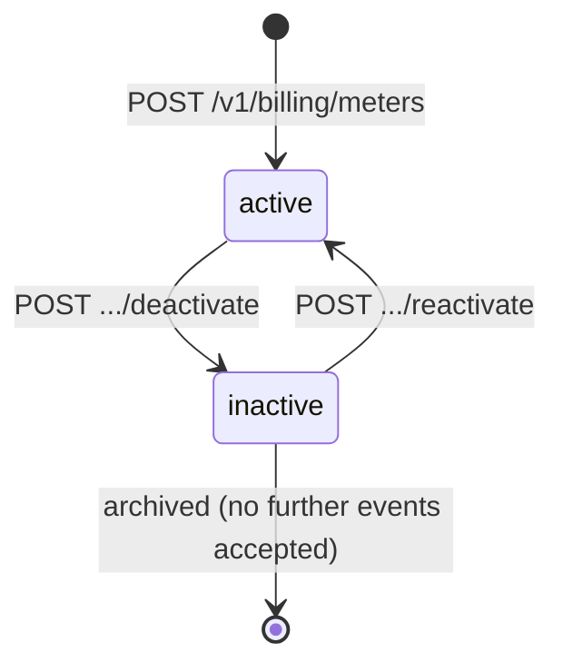
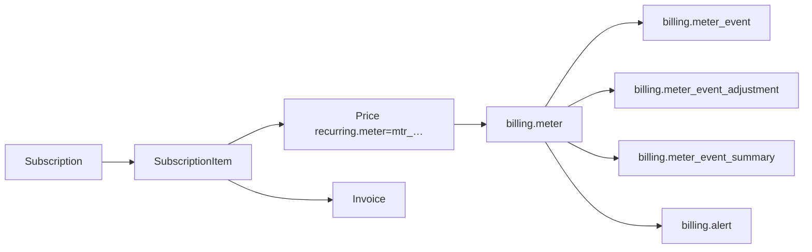

# Billing Meter

> API resource: `billing.meter` · API version: `2026-04-22.dahlia` · Category: [Billing](README.md)

## What it is

A `billing.meter` defines a **named usage stream** that you bill on. It's the schema for "how Stripe should aggregate the events you report against a Customer." A meter has a name (e.g. `api_requests`), a rule for which JSON key in your reported events holds the numeric value (e.g. `payload.tokens`), a rule for which key holds the customer ID (e.g. `payload.stripe_customer_id`), and an aggregation formula (sum, count, last).

Once defined, a meter is referenced from a metered [Price](../03-products/prices.md) (`recurring.meter=mtr_…`). From then on, every [BillingMeterEvent](billing-meter-events.md) you POST that matches the meter's `event_name` is bucketed by customer, aggregated per `event_time_window`, and rolled up onto the next subscription invoice as a usage line.

## Why it exists

It is Stripe's modern replacement for the legacy `usage_record` API attached to `subscription_item`s. Differences that matter:

- **Decoupled from Subscriptions.** You report events without knowing which subscription/item they should hit. Stripe resolves that via `customer_mapping` at aggregation time. Reporting code no longer needs to query for `si_…` IDs.
- **High throughput.** Meters accept events at much higher rates than `usage_record` (designed for AI / API usage workloads).
- **Per-customer aggregation, not per-item.** One meter spans every subscription that prices off it.
- **Replayable & adjustable.** [MeterEventAdjustments](billing-meter-event-adjustments.md) let you cancel events you reported in error.
- **Observable.** [MeterEventSummaries](billing-meter-event-summaries.md) expose the aggregated bucket numbers Stripe used to invoice — your dashboards can read the same number Stripe billed.

If you're starting a usage-based product today, use Meters; the legacy `usage_record` API is functional but no longer the recommended path.

## Lifecycle & states



- **`active`** — meter accepts events, aggregates them, contributes to invoices for any Price that references it.
- **`inactive`** — meter is paused. Events submitted with this `event_name` are **rejected** (or silently dropped — hedge: confirm in your test environment). Subscriptions whose Price references this meter will produce zero-usage invoices for the period.

Reactivation is supported. The `status_transitions.deactivated_at` timestamp records when it was last deactivated. Hedge: an `inactive` meter can typically be reactivated, but verify behavior for meters that have been inactive across a billing cycle — late-arriving events may not backfill.

The meter object itself is not deleted; deactivation is the closest equivalent.

## Anatomy of the object

### Identity

| Field | Notes |
|---|---|
| `id` | `mtr_…` |
| `object` | `"billing.meter"` |
| `display_name` | Human-friendly label shown in the Dashboard. |
| `event_name` | The string your reported events must set as `event_name`. Globally unique within your account once attached to a Price. |
| `status` | `active | inactive`. |
| `livemode`, `created`, `updated` | standard. |

### Customer mapping

| Field | Notes |
|---|---|
| `customer_mapping.type` | Currently only `by_id`. |
| `customer_mapping.event_payload_key` | Which key inside the event `payload` holds the Customer ID (typically `stripe_customer_id`). |

If an event's payload doesn't carry that key, or the value isn't a valid `cus_…`, the event is rejected/orphaned.

### Value extraction

| Field | Notes |
|---|---|
| `value_settings.event_payload_key` | Which key inside `payload` holds the numeric value to aggregate (e.g. `tokens`, `bytes`, `requests`). For `count` aggregation this is ignored. |

The value must be a non-negative number. Stripe coerces strings → number where possible; non-numeric values cause the event to be rejected.

### Aggregation

| Field | Notes |
|---|---|
| `default_aggregation.formula` | `sum` (add all values), `count` (count events; ignore value), `last` (last reported value in window — useful for gauges like "current seat count"). |
| `event_time_window` | `day` or `hour`. Granularity at which Stripe rolls events up. Cannot change after creation (hedge: verify with current docs). |

The aggregation choice has implications for how to think about the data:

- **`sum`** — pure additive metering (tokens used, GB transferred). Most common.
- **`count`** — number of events regardless of value (API calls).
- **`last`** — gauge semantics (provisioned seats at end of period). The "last value in window" is the one billed.

### Status transitions

| Field | Notes |
|---|---|
| `status_transitions.deactivated_at` | unix seconds; null while active. |

## Relationships



A Price binds to a meter via `recurring.meter`. A Subscription billing on that Price will, at period close, ask Stripe "what was this customer's aggregated usage for `mtr_…` in this window?" and turn that into an invoice line.

A meter can be referenced by **many Prices** (e.g. tiered pricing for the same usage stream). Conversely, a Price binds to **one meter**.

## Common workflows

### 1. Define a usage-based product end to end

```http
# Step 1: create the meter
POST /v1/billing/meters
  display_name="API Tokens"
  event_name=api_tokens
  customer_mapping[type]=by_id
  customer_mapping[event_payload_key]=stripe_customer_id
  value_settings[event_payload_key]=tokens
  default_aggregation[formula]=sum
  event_time_window=hour
```

Returns `mtr_…`.

```http
# Step 2: create a Product
POST /v1/products
  name="Token usage"

# Step 3: create a metered Price referencing the meter
POST /v1/prices
  product=prod_…
  currency=usd
  unit_amount_decimal=0.01
  recurring[interval]=month
  recurring[usage_type]=metered
  recurring[meter]=mtr_…

# Step 4: subscribe the customer
POST /v1/subscriptions
  customer=cus_…
  items[0][price]=price_…
```

Note: metered Subscriptions don't accept `quantity` on items — quantity is computed from reported usage at period close.

```http
# Step 5: report events as your app runs
POST /v1/billing/meter_events
  event_name=api_tokens
  payload[stripe_customer_id]=cus_…
  payload[tokens]=1000
```

### 2. Deactivate a meter (sunset a metric)

```http
POST /v1/billing/meters/mtr_…/deactivate
```

`status` → `inactive`. Detach Prices that reference it before subscribers' next renewal, or those subscriptions will generate zero-usage invoice lines.

### 3. Reactivate

```http
POST /v1/billing/meters/mtr_…/reactivate
```

### 4. Verify aggregation matches your expectations

Use [MeterEventSummaries](billing-meter-event-summaries.md) to read the aggregated number Stripe will bill on. **Always reconcile your own usage counters against this** before going live.

```http
GET /v1/billing/meters/mtr_…/event_summaries
  ?customer=cus_…
  &start_time=…
  &end_time=…
```

## Webhook events

| Event | Fires when | Listener typically does |
|---|---|---|
| `billing.meter.created` | New meter created. | Sync to internal product catalog. |
| `billing.meter.updated` | Display name / config changed. | Re-sync. |
| `billing.meter.deactivated` | Status → `inactive`. | Alert: a metric the business depends on is paused. |
| `billing.meter.reactivated` | Status → `active`. | Resume reporting events. |

Note: there is **no event** for "an event was reported" — meter events are high-volume by design and don't emit per-event webhooks. Use [MeterEventSummaries](billing-meter-event-summaries.md) for visibility.

## Idempotency, retries & race conditions

- `POST /v1/billing/meters` accepts `Idempotency-Key`.
- Updating the meter (e.g. `display_name`) is safe to retry.
- **Changing `event_name`, `customer_mapping`, `value_settings`, or `default_aggregation` after the meter is in use is not supported** — these define the schema. Create a new meter and migrate Prices.
- A meter and its Price must coexist before you start reporting events. Reporting against an unknown `event_name` returns a 400 error. Hedge: there may be a buffer window where mismatched events are dropped silently — verify with logs.

## Test-mode tips

- Test-mode meters and live-mode meters are entirely separate (different IDs, different event streams).
- The Stripe CLI: `stripe billing meters create --display-name="Test" --event-name=test_events --default-aggregation[formula]=sum --customer-mapping[event_payload_key]=stripe_customer_id --customer-mapping[type]=by_id --value-settings[event_payload_key]=value`.
- Submit events with `stripe billing meter_events create`. Use [TestClock](test-clocks.md) to advance through a billing period and force the metered invoice to render.
- Aggregation is **not instantaneous** — there is a delay between event submission and visibility in summaries. Test scripts that submit-then-immediately-query will often see no data; allow seconds-to-minutes lag.

## Connect considerations

- Meters live on the account that creates them. For platforms billing on behalf of connected accounts, create the meter on each connected account (with `Stripe-Account: acct_…`) and report events there.
- Hedge: cross-account meter sharing isn't supported as of this API version — each connected account owns its own meters.

## Common pitfalls

- **Reporting events before creating the meter.** Events for unknown `event_name` are rejected. Create the meter first.
- **Wrong `customer_mapping.event_payload_key`.** Easiest mistake: meter says `stripe_customer_id`, your code sends `customer_id`. The event is accepted but never mapped to a Customer, so it never hits an invoice. Inspect `event_summaries` to validate.
- **Numeric value sent as a string with extra characters** (`"1,234"` or `"1.5k"`). Use plain numeric strings or numbers.
- **Forgetting that aggregation has a delay.** Don't show "live" usage to customers from Stripe summaries — derive from your own metering store, then reconcile against Stripe daily.
- **Picking `last` aggregation when you wanted `sum`.** `last` only bills the final value in the window — fine for "seats at month-end," catastrophic for "cumulative usage."
- **Deactivating a meter with active Subscriptions referencing its Price.** The next invoice still renders, but with zero usage line. Detach the Price first or expect customer-facing surprise.
- **Treating meters as quantity counters.** Meters aggregate per **customer** per **window**. To track per-Subscription or per-team breakdowns, encode that into your own DB and report aggregated values per customer.

## Further reading

- [API reference: Billing Meter](https://docs.stripe.com/api/billing/meter)
- [Usage-based billing guide](https://docs.stripe.com/billing/subscriptions/usage-based)
- [Designing meter events](https://docs.stripe.com/billing/subscriptions/usage-based/recording-usage)
- Companion docs: [MeterEvent](billing-meter-events.md), [MeterEventAdjustment](billing-meter-event-adjustments.md), [MeterEventSummary](billing-meter-event-summaries.md), [BillingAlert](billing-alerts.md).
