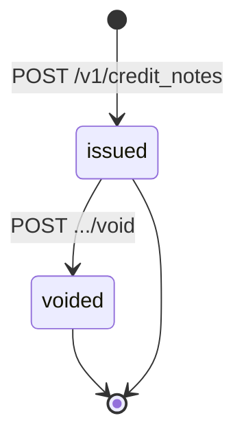
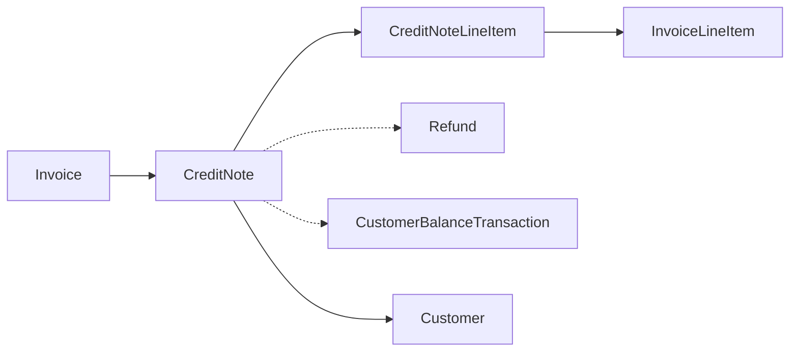

# CreditNote

> API resource: `credit_note` · API version: `2026-04-22.dahlia` · Category: [Billing](README.md)

## What it is

A `CreditNote` is the **legally correct way to reduce a finalized invoice**. Once an invoice has been finalized (status: `open` or beyond), its line items are immutable — you can't reach in and change a number. A CreditNote is a separate, numbered, sister document that says "we issue $X back to the customer against invoice ABC-0001," along with how that money returns (refund, account credit, or out-of-band) and which lines it affects.

If you've ever needed to say "we double-billed you, here's a $50 refund" or "we promised a 10% discount, sorry it wasn't on the invoice — here's a credit toward your next bill," that's a CreditNote.

## Why it exists

Finalized invoices are tax documents. In most jurisdictions, *editing* an issued invoice is illegal — you must instead issue a complementary credit document. CreditNote is Stripe's implementation of that rule, plus the bookkeeping and money-movement glue:

- It carries its own number (`CN-…`) and PDF.
- It generates a [Refund](../01-core-resources/refunds.md) and/or a [CustomerBalanceTransaction](customer-balance-transactions.md) atomically.
- It updates the parent invoice's `amount_remaining` (pre-payment) or `post_payment_credit_notes_amount` (post-payment) so totals stay consistent.

## Lifecycle & states



Two states. That's it.

- **`issued`** — created, money has been moved (refund attempted, balance updated, etc.). Numbered, PDF available.
- **`void`** — you reverted the credit note. The refund is reversed (if possible), customer balance is reversed, the invoice's `amount_remaining` returns to its pre-credit-note value. The credit note number is *kept* (gap-free numbering matters for tax compliance) but the document is marked `void` on the PDF.

There is no `draft` state — credit notes are atomic. Either you create one (and its effects apply) or you don't.

## The pre-payment vs. post-payment distinction

This is the conceptual key to credit notes. Whether the parent invoice has been paid changes what a credit note can do.

### Pre-payment credit note (parent invoice is `open`, unpaid)

The customer hasn't paid yet. Issuing a credit note reduces what they owe.

```
new_invoice.amount_remaining = old_invoice.amount_remaining − credit_note.amount
```

Allowed return channels:

- **`credit_amount`** — increase the customer's balance by this much. Since they haven't paid for *this* invoice yet, the "credit" is functionally identical to a discount on this invoice — it reduces `amount_remaining`.
- **`out_of_band_amount`** — record-only; you handled it elsewhere.

A pre-payment credit note for the entire invoice total is functionally a "void with audit trail": invoice closes as `paid` with `amount_paid: 0`. (Some teams prefer this over a clean `void` because it leaves a reason / line breakdown.)

### Post-payment credit note (parent invoice is `paid`)

The customer already paid. The credit note has to push money *back* to them somehow.

Allowed return channels (any combination summing to the credit-note amount):

- **`refund_amount`** — Stripe creates a Refund on the underlying [Charge](../01-core-resources/charges.md). Most common.
- **`credit_amount`** — adds to the customer's negative balance, applied automatically to the next invoice.
- **`out_of_band_amount`** — record-only; you wired them money or sent a check.

Math invariant for every credit note:

```
credit_note.amount  ==  refund_amount + credit_amount + out_of_band_amount
```

Stripe enforces this in the API.

## Anatomy of the object

### Identity & numbering

| Field | Notes |
|---|---|
| `id` | `cn_…` |
| `number` | Customer-facing credit-note number, e.g. `ABC-0001-CN-01`. Uses the parent invoice's prefix and a per-invoice CN counter. Reserved forever. |
| `customer` | `cus_…`. |
| `invoice` | `in_…` — the parent invoice. **Required.** A credit note always belongs to exactly one invoice. |
| `status` | `issued | void`. |
| `type` | `pre_payment | post_payment`. Stripe sets this from the parent invoice's state. |
| `created`, `livemode`, `metadata` | standard. |
| `effective_at` | The financial-effective date. Defaults to `created` but can be back-dated for accounting. |

### Lines

| Field | Notes |
|---|---|
| `lines` | `{ data: [CreditNoteLineItem, …] }`. Each line credits a specific [InvoiceLineItem](invoice-line-items.md) on the parent. **You cannot credit more than the original line's amount.** Line types: `invoice_line_item`, `custom_line_item`. |

Each line has:

- `invoice_line_item` (the line on the parent being credited).
- `amount` — credit amount for this line.
- `quantity` — for unit-priced lines, how many units to credit.
- `tax_amounts` — proportional tax credit.
- `discount_amounts` — proportional discount reversal.

### Money

| Field | Notes |
|---|---|
| `currency` | Inherited from invoice. |
| `subtotal`, `subtotal_excluding_tax` | Sum of line credits before tax. |
| `total_taxes` | Tax credit. |
| `total` | Final credit-note amount. |
| `amount` | Alias for `total` in many places — same number. |
| `amount_shipping` | Shipping credit, if any. |
| `discount_amounts`, `pretax_credit_amounts` | Pre-tax credit details. |

### Money routing

| Field | Notes |
|---|---|
| `refund_amount` | What got refunded to the original PM. |
| `refund` | `re_…` of the created Refund (if `refund_amount > 0`). |
| `credit_amount` | What was added to the customer's balance. |
| `out_of_band_amount` | Recorded-but-not-moved amount. |
| `customer_balance_transaction` | `cbtxn_…` if `credit_amount > 0`. |

### Reason & display

| Field | Notes |
|---|---|
| `reason` | Enum: `duplicate | fraudulent | order_change | product_unsatisfactory`. Optional. |
| `memo` | Free text shown on the PDF. |
| `pdf` | Persistent URL to the credit-note PDF. |
| `voided_at` | Set when status went void. |
| `shipping_cost` | Only present if you're crediting shipping. |

## Relationships



A CreditNote always points at exactly one Invoice. The Invoice may have many CreditNotes (you can issue several partial credits over time, up to the invoice's total).

## Common workflows

### 1. Refund a single line on a paid invoice

```http
POST /v1/credit_notes
  invoice=in_…
  refund_amount=2000
  reason=product_unsatisfactory
  lines[0][type]=invoice_line_item
  lines[0][invoice_line_item]=il_…
  lines[0][amount]=2000
  memo=Returned the corrupted widget
```

Stripe creates a $20 Refund on the parent invoice's Charge and emits `credit_note.created` + `refund.created` + `charge.refunded`.

### 2. Credit toward future invoices (no refund)

```http
POST /v1/credit_notes
  invoice=in_…
  credit_amount=5000
  reason=order_change
  lines[0][type]=custom_line_item
  lines[0][description]=Goodwill credit
  lines[0][unit_amount]=5000
  lines[0][quantity]=1
```

Customer balance becomes $50 negative. Their next invoice's `amount_due` is reduced by $50.

### 3. Pre-payment discount the day before due

The customer says "I'll pay if you knock 10% off." Invoice is `open`, $100 due:

```http
POST /v1/credit_notes
  invoice=in_…
  credit_amount=1000
  lines[0][type]=custom_line_item
  lines[0][description]=Negotiated discount
  lines[0][unit_amount]=1000
  lines[0][quantity]=1
```

Invoice's `amount_remaining` drops to $90. Customer pays $90, invoice closes as `paid`. The credit note keeps the audit trail that Stripe issued $10 off.

### 4. Preview before committing

```http
GET /v1/credit_notes/preview
  invoice=in_…
  refund_amount=1500
  lines[0][type]=invoice_line_item
  lines[0][invoice_line_item]=il_…
  lines[0][amount]=1500
```

Returns a `CreditNote`-shaped object with the math computed (taxes, totals) without actually creating one. Useful for "preview the credit" UIs.

### 5. Void

```http
POST /v1/credit_notes/cn_…/void
```

Reverses the refund (if a Refund was created) and the customer balance change. `out_of_band_amount` is left as your record. Status → `void`. **You cannot un-void.**

### 6. List credit notes for an invoice

```http
GET /v1/credit_notes?invoice=in_…
```

## Webhook events

| Event | Fires when |
|---|---|
| `credit_note.created` | A credit note is issued. The downstream `refund.created` (if any) fires too. |
| `credit_note.updated` | `metadata` change. |
| `credit_note.voided` | The credit note was voided. |

## Idempotency, retries & race conditions

- `POST /v1/credit_notes` accepts `Idempotency-Key`. **Strongly recommend using it** — accidental duplicate credit notes mean accidental duplicate refunds.
- A credit note's Refund is created atomically with the credit note. If the refund step fails (e.g. the underlying charge is too old to refund automatically), the entire credit-note creation fails — no half-state.
- Voiding a credit note whose Refund has already settled into the customer's bank attempts to reverse it; if too late, the void still completes and you keep the Refund — but Stripe surfaces this in `voided_at` and you should reconcile.

## Test-mode tips

- Create a paid invoice, then `POST /v1/credit_notes` with a `refund_amount` to exercise the full path. The test charge gets a test refund.
- Use `lines` to target specific InvoiceLineItems and verify tax math — Stripe Tax in test mode produces exactly the same proportional tax credits as live.
- For pre-payment scenarios, finalize an invoice with `auto_advance=false` so it doesn't immediately attempt payment, then issue a pre-payment credit note before paying.

## Connect considerations

- Credit notes inherit the connected-account context of the parent invoice. If the invoice is on a connected account (`Stripe-Account: acct_…`), so is the credit note.
- A platform's `application_fee` is **not automatically refunded** when a credit note creates a Refund. To refund the platform fee proportionally, pass `refund_application_fee=true` on the underlying Refund (set when creating the credit note via `refund` parameters), or refund the fee separately via [ApplicationFeeRefund](../07-connect/application-fee-refunds.md).

## Common pitfalls

- **Trying to credit more than was charged.** API errors with `credit_note_invalid_amount`. Sum of credits across all CNs ≤ original invoice total.
- **Voiding to "redo" a credit note.** Voiding is for mistakes, not for "I want to reissue with different lines." Reissuing means: void, then create a new credit note. Two CN numbers are reserved permanently.
- **Refunding without a credit note.** You can refund a Charge directly via the Refunds API, but if the Charge was paid against an invoice, *do it via a credit note instead* — otherwise the invoice's totals don't reflect the refund and your reconciliation breaks.
- **Forgetting tax.** Crediting an invoice line implicitly credits the proportional tax. If you specify `lines[].amount` you must include or accept the auto-calculated `tax_amounts`. Stripe Tax handles this; manual tax setups need care.
- **Issuing a credit note on a `void` invoice.** Not allowed; void invoices have no debt to credit.
- **Issuing a post-payment credit note with `out_of_band_amount` only.** Allowed and useful (you wired the customer back), but make sure your reconciliation script knows that "credit_note exists with no Refund" is a real and intentional case.

## Further reading

- [API reference: CreditNote](https://docs.stripe.com/api/credit_notes/object)
- [Refund or credit a customer](https://docs.stripe.com/invoicing/credit-notes)
- [Pre-payment vs post-payment credit notes](https://docs.stripe.com/invoicing/credit-notes#pre-vs-post-payment)
