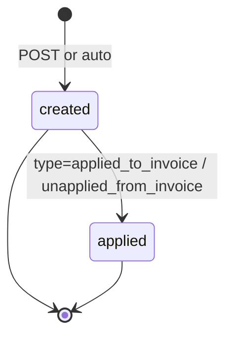
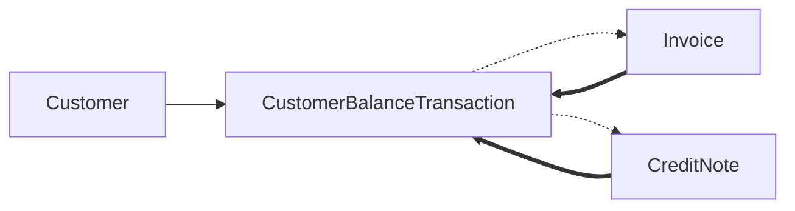

# CustomerBalanceTransaction

> API resource: `customer_balance_transaction` · API version: `2026-04-22.dahlia` · Category: [Billing](README.md)

## What it is

A `CustomerBalanceTransaction` (CBT) is a single ledger entry — debit or credit — against a [Customer](../01-core-resources/customers.md)'s **running balance**. The Customer's `balance` field is the algebraic sum of every CBT ever created for that customer.

The balance is *separate* from the customer's saved cards or bank accounts; it's an internal-to-Stripe IOU between you and them. When the next [Invoice](invoices.md) is generated, Stripe consults this balance and either applies credit (reducing what the customer owes) or adds the customer's outstanding debt to the invoice.

## Why it exists

Real billing has running tabs. You need a way to:

- Issue **goodwill credit**: "sorry for the outage, here's $20 off your next bill."
- Record **overpayment**: customer paid $110 on a $100 invoice → $10 lives in the balance until next invoice.
- Record **underpayment / rounding**: invoice was $100, customer wired $99.97 → $0.03 owed sits in balance.
- Settle automatically with the next invoice instead of issuing refunds.

CBTs are the audit trail of every change to the customer's balance — created either manually by you or automatically by Stripe (in response to invoice events, [CreditNotes](credit-notes.md), or refund flows).

## Sign convention (the most important thing on this page)

Stripe uses an **invoice-perspective** sign convention for the customer balance:

| Sign of `amount` | Meaning | Effect on next invoice |
|---|---|---|
| `amount > 0` (positive) | Customer **owes** you this much (debt). Rare. Usually from invoice rounding or specific underpayment scenarios. | Added to next invoice's `amount_due`. |
| `amount < 0` (negative) | You **owe** the customer (credit). Most common case. | Reduces next invoice's `amount_due`. |

So: a $20 goodwill credit is `amount: -2000`. A $5 underpayment debt is `amount: 500`. **If you reverse this in your head, you'll consistently bill the wrong direction.** This is the canonical bug with this resource.

The customer's `balance` field uses the same sign — `customer.balance: -2000` means "we owe them $20."

## Lifecycle & states

CBTs are immutable ledger entries. They don't have a status enum.



You can update `description` and `metadata`. You cannot delete, void, or amend the `amount`. To reverse a CBT, create a *new* CBT with the opposite sign.

## Anatomy of the object

### Identity

| Field | Notes |
|---|---|
| `id` | `cbtxn_…` (hedge: prefix may render as `cust_balance_txn_…` in some payloads). |
| `object` | `customer_balance_transaction`. |
| `created`, `livemode`, `metadata` | standard. |

### Money

| Field | Notes |
|---|---|
| `amount` | Signed integer in smallest currency unit. **Positive = customer owes; negative = customer is owed.** |
| `currency` | Lowercase ISO. Customer-locked. |
| `ending_balance` | The customer's `balance` *after* this CBT was applied. Useful for reconstructing balance history. |

### Type

| Field | Notes |
|---|---|
| `type` | The reason this CBT exists. Enum below. **Read-only — set by Stripe based on origin.** |
| `description` | Free text. Editable. |

#### Type enum (the cheat sheet)

| `type` | Created by | Sign | Meaning |
|---|---|---|---|
| `adjustment` | You (manual API call). | Either | Generic manual credit/debit. The most common type for goodwill credits. |
| `initial` | Stripe at customer creation. | `0` | Marker entry. |
| `applied_to_invoice` | Stripe when an invoice consumes balance. | Positive (reduces credit owed) | Pairs with the matching `unapplied_from_invoice` if reversed. |
| `unapplied_from_invoice` | Stripe when an applied balance is reversed. | Negative | Voiding an invoice that consumed balance restores it. |
| `credit_note` | Stripe when a [CreditNote](credit-notes.md) with `credit_amount > 0` is issued. | Negative | Customer balance goes more negative (more credit). |
| `invoice_overpaid` | Stripe when a customer pays more than the invoice. | Negative | The overpayment becomes credit. |
| `invoice_too_large` / `invoice_too_small` | Stripe rounding adjustments. | Either | Fractional cent reconciliation. |
| `refund_from_customer_cash_balance` | Stripe when a refund pulls from cash balance. | Variable | Cash-balance refund flow. |
| `unapplied_from_payment` | Stripe when a payment that funded the balance is reversed. | Variable | Payment-side reversal. |
| `unspent_receiver_credit` | Stripe (Sources / receivers legacy). | Variable | Legacy. |
| `migration` | Stripe (data migration). | Variable | One-time migration entry. |

(Hedge: this enum has grown over API versions. Treat the list as the dominant set you'll encounter; new types may appear.)

### Relations

| Field | Notes |
|---|---|
| `customer` | `cus_…`. Required. Immutable. |
| `invoice` | `in_…` if this CBT is tied to a specific invoice (e.g. `applied_to_invoice`, `invoice_overpaid`). |
| `credit_note` | `cn_…` if originated from a CreditNote. |

## Relationships



The Customer aggregates CBTs; CBTs reference the originating Invoice or CreditNote where applicable. The relationship is one-way: the Invoice and CreditNote don't have a `customer_balance_transactions[]` array — instead, CreditNote has `customer_balance_transaction` (singular) and Invoice has `applied_balance_transactions[]`.

## Common workflows

### 1. Grant goodwill credit

```http
POST /v1/customers/cus_…/balance_transactions
  amount=-1000
  currency=usd
  description=Goodwill credit for outage on 2026-05-01
```

`customer.balance` is now $10 more negative. Next invoice's `amount_due` is reduced by $10 (until balance hits $0).

### 2. Record an overpayment manually

Customer wired you $105 on a $100 invoice. The wire was recorded out-of-band on the invoice; the extra $5 lives in balance:

```http
POST /v1/customers/cus_…/balance_transactions
  amount=-500
  currency=usd
  description=Wire overpayment from 2026-05-03
```

(In modern flows, Stripe may auto-create an `invoice_overpaid` CBT instead — check the customer's recent CBTs before creating manually.)

### 3. Charge a small previous-invoice underpayment to next bill

Customer underpaid by 3 cents:

```http
POST /v1/customers/cus_…/balance_transactions
  amount=3
  currency=usd
  description=Rounding underpayment from invoice ABC-0042
```

`customer.balance: 3` → next invoice has $0.03 added to `amount_due`.

### 4. Reverse a CBT (e.g. you credited the wrong customer)

CBTs aren't deletable. Create the opposite:

```http
POST /v1/customers/cus_…/balance_transactions
  amount=1000
  currency=usd
  description=Reversal of cbtxn_… (credited wrong customer)
```

Net effect: zero. The original CBT stays in the audit trail.

### 5. List a customer's balance history

```http
GET /v1/customers/cus_…/balance_transactions?limit=50
```

Returns CBTs in reverse chronological order. Use `ending_balance` on each to reconstruct the running balance over time.

### 6. Inspect what's currently in the balance

```http
GET /v1/customers/cus_…
# read .balance — signed integer
```

Equals the sum of every CBT for this customer. If it doesn't, something is structurally wrong (it never is in practice — the math is enforced).

## Webhook events

CBTs do not currently have dedicated `customer_balance_transaction.*` events ([_meta/webhook-catalog.md](../_meta/webhook-catalog.md) does not list any). React via:

| Event | Tells you about CBT changes |
|---|---|
| `customer.updated` | `balance` field may have changed. Inspect `previous_attributes.balance`. |
| `invoice.paid` | If invoice consumed balance, an `applied_to_invoice` CBT was created. |
| `credit_note.created` | If `credit_amount > 0`, a CBT was created. |
| `invoice.voided` | If voided invoice had consumed balance, an `unapplied_from_invoice` CBT was created. |

## Idempotency, retries & race conditions

- `POST /v1/customers/cus_…/balance_transactions` accepts `Idempotency-Key`. **Use it.** Accidentally double-crediting a customer $20 means actually crediting them $40, and there's no automatic dedupe.
- Stripe-created CBTs (from invoice or credit note flows) are atomic with their parent operation — they can't be partially created.
- Concurrent invoice finalize + manual CBT creation: Stripe applies CBTs in deterministic order (by `created` timestamp), but if you create a credit at exactly the moment an invoice is finalizing, the credit may apply to the *next* invoice rather than the one finalizing. Avoid by issuing credits and waiting for the resulting `customer.updated` before triggering a new invoice.

## Test-mode tips

- Test-mode customers start with `balance: 0`. Build flows by alternating manual CBTs with invoice generation.
- Pair with a [TestClock](test-clocks.md) to verify "credit applies to *next* invoice but not this one" timing.
- Use `expand[]=last_balance_transaction` (where supported) on customer retrieve to inline the most recent CBT for quick inspection.

## Connect considerations

- The customer balance is per-account. A Customer on a connected account has its own balance; the platform's customer balance is separate.
- Manual CBT creation requires `Stripe-Account: acct_…` to operate on a connected account's customer.
- For destination-charge subscriptions, balance applies before the charge is computed — the connected account's revenue is reduced accordingly.

## Common pitfalls

- **Sign confusion.** Negative = credit (customer is owed). Positive = debt. Re-read this page if unsure. Half of all CBT bugs are sign errors.
- **Treating `customer.balance` as cash held in Stripe.** It isn't — it's a notional ledger between you and the customer. Real money moves only when an invoice is paid.
- **Trying to delete or update `amount` on a CBT.** Not allowed. Reverse with an opposite-sign CBT.
- **Not using idempotency keys for manual CBTs.** Network retries silently create duplicates. Customer goes from "$20 credit" to "$40 credit" without your code ever knowing.
- **Issuing a refund via CBT.** A negative CBT *credits future invoices*, not the customer's bank account. To put money back on the card, use a [Refund](../01-core-resources/refunds.md) (or a [CreditNote](credit-notes.md) with `refund_amount`).
- **Forgetting the currency lock.** If a customer has been billed in `usd`, all CBTs must be `usd`. Mixed-currency attempts error.
- **Manual CBT for an overpayment when Stripe already auto-created `invoice_overpaid`.** You'll double-credit. Always list recent CBTs before adding manual ones in response to a payment event.
- **Querying CBTs to compute balance instead of reading `customer.balance`.** Stripe maintains `balance` server-side; that's the authoritative number.

## Further reading

- [API reference: Customer Balance Transaction](https://docs.stripe.com/api/customer_balance_transactions/object)
- [Customer balance overview](https://docs.stripe.com/billing/customer/balance)
- [Customer cash balance](https://docs.stripe.com/payments/customer-balance) — distinct concept (incoming-funds bucket); don't confuse
- [Invoice](invoices.md) — applies balance at finalization
- [CreditNote](credit-notes.md) — auto-creates CBTs when `credit_amount > 0`
