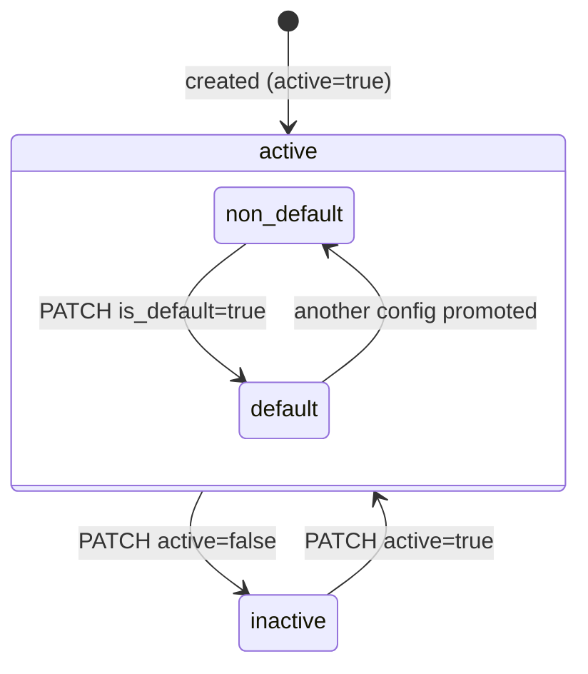
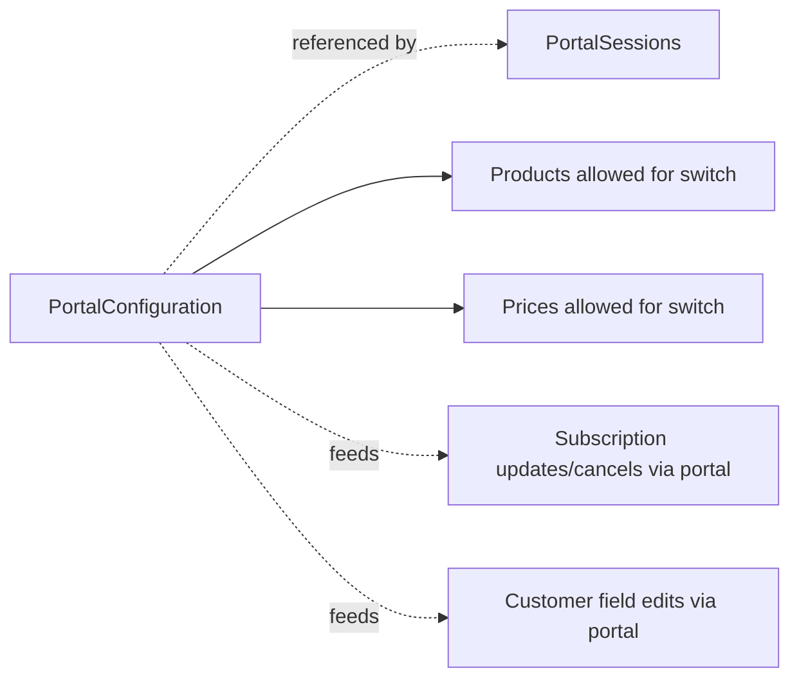

# Customer Portal Configuration

> API resource: `billing_portal.configuration` · API version: `2026-04-22.dahlia` · Category: [Billing](README.md)

## What it is

A `billing_portal.configuration` is a stored bundle of feature toggles and copy that decides what a customer sees and can do inside the Stripe-hosted [Customer Portal](customer-portal-sessions.md). It is the policy object; the [Portal Session](customer-portal-sessions.md) is the per-customer instance that renders against it. One Configuration says things like "yes, show invoice history; let customers update email and address but not name; allow plan changes between Basic / Pro / Enterprise; allow cancellation at period end with reason capture from this list."

Think of it as **the schema for the self-serve UI** — write once, render to every customer that opens a portal session.

## Why it exists

Without it, every portal session would either expose every feature (terrifying) or none (useless). Configurations let you ship a default self-service experience for most customers and then layer per-segment variations: e.g. enterprise customers get a different cancellation mode and an extra "contact AM" link; trial customers can't change plans; partners get a configuration with terms-of-service URL pointed at the partner agreement. Stripe also uses Configurations to drive the optional Stripe-hosted login page, where customers can authenticate themselves into the portal without your server creating a session.

## Lifecycle & states

Configurations have no `status` field. They have an `active` boolean (similar to Payment Links) and an `is_default` flag. There is no DELETE — only deactivation.



State semantics:

- **`active: true`** — the Configuration can be referenced by new portal sessions and used by the hosted login page (if `login_page.enabled`).
- **`active: false`** — `POST /v1/billing_portal/sessions` with this `configuration` id 4xx's. Existing in-flight sessions still resolve — but each page-load reads current config state, so the customer may suddenly see a stripped-down portal mid-flow. (Don't deactivate the config a customer is currently inside.)
- **`is_default: true`** — exactly one Configuration per account is default. Sessions created without an explicit `configuration` use it. You can promote any Configuration to default; the previously-default one demotes.
- **No DELETE** — you live with the row forever.

## Anatomy of the object

### Identity & state

| Field | Notes |
|---|---|
| `id` | `bpc_…` |
| `object` | `"billing_portal.configuration"` |
| `active` | Boolean. |
| `is_default` | Boolean. Exactly one per account is true. |
| `created`, `updated` | unix seconds. |
| `livemode`, `metadata` | standard. |
| `default_return_url` | URL the portal's "Return to merchant" button uses if a Session doesn't override. |

### Business profile (always shown)

| Field | Notes |
|---|---|
| `business_profile.headline` | Optional headline string at top of the portal. |
| `business_profile.privacy_policy_url` | Linked in the footer. |
| `business_profile.terms_of_service_url` | Linked in the footer. **Required** for many features (cancellation, subscription update). |

### Features

Each feature is `{ enabled: bool, …subfeatures }`. Disabled features are hidden from the portal entirely.

#### `features.customer_update`

| Field | Notes |
|---|---|
| `enabled` | Boolean. |
| `allowed_updates[]` | Subset of `email`, `address`, `tax_id`, `name`, `phone`, `shipping`. Omit a value and that field is read-only. |

#### `features.invoice_history`

| Field | Notes |
|---|---|
| `enabled` | Boolean. Shows past invoices and downloadable PDFs. Toggle off if invoices are sensitive (e.g. revenue-share statements). |

#### `features.payment_method_update`

| Field | Notes |
|---|---|
| `enabled` | Boolean. Lets the customer add/remove cards and bank accounts and set the default. PM types offered come from your account-level PM settings. |

#### `features.subscription_cancel`

| Field | Notes |
|---|---|
| `enabled` | Boolean. |
| `mode` | `at_period_end` (most common; customer keeps service until renewal) or `immediately` (canceled now, optional proration refund). |
| `proration_behavior` | `none | create_prorations | always_invoice`. Only meaningful with `mode: immediately`. |
| `cancellation_reason.enabled` | Boolean — capture a reason at cancellation. |
| `cancellation_reason.options[]` | Subset of `too_expensive`, `missing_features`, `switched_service`, `unused`, `customer_service`, `too_complex`, `low_quality`, `other`. The reason lands in `subscription.cancellation_details.feedback` and free-text in `…comment`. |

#### `features.subscription_update`

| Field | Notes |
|---|---|
| `enabled` | Boolean. |
| `default_allowed_updates[]` | Subset of `price`, `quantity`, `promotion_code`. Controls *what* the customer can change. |
| `products[]` | Whitelist of `{ product, prices: [...] }` showing only these as switch targets. Empty/omitted = all of your products. **Use this** to constrain plan switches to a sane upgrade/downgrade matrix. |
| `proration_behavior` | `create_prorations | none | always_invoice`. Default applied to portal-driven plan changes. |
| `schedule_at_period_end` | Object controlling whether plan-downgrade requests apply immediately or get queued via [SubscriptionSchedule](subscription-schedules.md) to fire at period end. New-ish field; semantics covered by the `dahlia` API but exact subfield names may evolve — check the API ref before relying. |
| `trial_settings` | Within-portal trial tweaking; rarely needed. |

#### `features.subscription_pause`

| Field | Notes |
|---|---|
| `enabled` | Boolean. Whether customers can self-serve a pause. Often disabled in favor of explicit retention flows. |

### Login page

| Field | Notes |
|---|---|
| `login_page.enabled` | Boolean. When true, Stripe hosts a public login URL (`https://billing.stripe.com/p/login/…`). Customers enter their email; Stripe emails a magic link that opens a portal session **without your server creating one**. Useful for the "manage subscription" link in transactional emails. |
| `login_page.url` | Populated when enabled. Stable per-Configuration. |

### Connect

Configurations are per-account. A platform's Configuration is not visible to its connected accounts; each connected account has its own (or its own default).

## Relationships



- A Portal Session points to one Configuration. Many Sessions can share the same Configuration.
- Promoting a new Configuration to `is_default: true` does not retroactively re-bind existing Sessions — they keep pointing to whatever they were created with — but Sessions created without an explicit `configuration` after the promotion use the new default.
- The whitelisted `products[].prices` for subscription update reference real Price IDs; deleting / archiving a Price removes it as a switch target (Stripe filters at render time).

## Common workflows

### 1. Create your default configuration

```http
POST /v1/billing_portal/configurations
  business_profile[headline]=Manage your Acme subscription
  business_profile[privacy_policy_url]=https://acme.example.com/privacy
  business_profile[terms_of_service_url]=https://acme.example.com/terms
  default_return_url=https://app.acme.example.com/account/billing
  features[customer_update][enabled]=true
  features[customer_update][allowed_updates][]=email
  features[customer_update][allowed_updates][]=address
  features[customer_update][allowed_updates][]=tax_id
  features[invoice_history][enabled]=true
  features[payment_method_update][enabled]=true
  features[subscription_cancel][enabled]=true
  features[subscription_cancel][mode]=at_period_end
  features[subscription_cancel][cancellation_reason][enabled]=true
  features[subscription_cancel][cancellation_reason][options][]=too_expensive
  features[subscription_cancel][cancellation_reason][options][]=missing_features
  features[subscription_cancel][cancellation_reason][options][]=switched_service
  features[subscription_cancel][cancellation_reason][options][]=other
  features[subscription_update][enabled]=true
  features[subscription_update][default_allowed_updates][]=price
  features[subscription_update][default_allowed_updates][]=promotion_code
  features[subscription_update][products][0][product]=prod_pro
  features[subscription_update][products][0][prices][]=price_pro_monthly
  features[subscription_update][products][0][prices][]=price_pro_annual
  features[subscription_update][proration_behavior]=create_prorations
```

Then promote to default:

```http
POST /v1/billing_portal/configurations/bpc_…
  is_default=true
```

### 2. Per-tier configuration

Create a second Configuration for enterprise customers that **omits** `subscription_cancel.enabled` (forcing them to talk to AM) and uses a different `terms_of_service_url`. When their portal click hits your server:

```http
POST /v1/billing_portal/sessions
  customer=cus_ent_…
  configuration=bpc_enterprise_…
```

### 3. Enable the hosted login page

```http
POST /v1/billing_portal/configurations/bpc_default_…
  login_page[enabled]=true
```

The returned object includes `login_page.url`. Drop that link into your "manage subscription" email button — customers no longer need a server round-trip to enter the portal.

### 4. Constrain switch matrix to a single ladder

To force "Basic ↔ Pro" but not "Basic → Enterprise" (because Enterprise needs sales-led onboarding):

```http
POST /v1/billing_portal/configurations/bpc_…
  features[subscription_update][products][0][product]=prod_basic
  features[subscription_update][products][0][prices][]=price_basic_monthly
  features[subscription_update][products][1][product]=prod_pro
  features[subscription_update][products][1][prices][]=price_pro_monthly
```

`prod_enterprise` is excluded; the portal won't show it as a switch target.

### 5. Deactivate (don't delete)

```http
POST /v1/billing_portal/configurations/bpc_…
  active=false
```

You can no longer create new Sessions referencing it. To "delete" effectively, deactivate; the row stays for audit.

## Webhook events

Configurations don't have their own event types in the standard catalog. Changes to features that cascade into customer-facing changes show up via the underlying object events when customers act:

- `customer.subscription.updated` / `customer.subscription.deleted` — when portal-allowed cancel/update flows fire.
- `customer.updated` — when allowed customer-update fields are edited.
- `payment_method.attached` / `payment_method.detached` — when PM management is enabled.

For audit of who edited the Configuration itself, rely on the Dashboard's event log / Sigma queries.

## Idempotency, retries & race conditions

- `POST /v1/billing_portal/configurations` — set `Idempotency-Key`. A retry without one creates a duplicate Configuration with a new `id`, which then competes with the original in your "default" selection logic.
- Updates: PATCH-style; safe to retry naturally. **Stripe enforces validity** — e.g. enabling `subscription_update` requires `terms_of_service_url`; the API rejects updates that would leave the Configuration in an invalid state.
- Promoting a new default (`is_default=true`) is atomic: the previously-default Configuration is demoted in the same write.
- Race: editing a Configuration while a customer is inside a Session that references it. The portal reads on each page load, so the customer can see UI elements appear/disappear mid-flow. Best practice — clone the Configuration, edit the clone, swap the default once verified, then deactivate the old one.

## Test-mode tips

- Configurations are scoped to live vs. test mode (per `livemode`). You'll typically maintain parallel pairs — name them similarly via `metadata.label`.
- Test-mode Configurations can drive test-mode portal sessions; same UI, no real money.
- The Stripe Dashboard has a no-code Portal editor under **Settings → Billing → Customer portal**; changes there persist as a default Configuration. If you also create Configurations via API, decide who owns the default (Dashboard edits and API edits both touch the same row).
- No useful `stripe trigger` for Configurations themselves — drive end-to-end by creating a Session and clicking through.

## Connect considerations

- Each connected account has its own Configurations. Default-Configuration logic runs per account.
- For Standard/Express accounts, the merchant edits via their own Dashboard.
- For Custom accounts, you (the platform) typically POST Configurations on each connected account at onboarding time, scoped with `Stripe-Account: acct_…`. Plan a backfill job for new feature rollouts — there's no "broadcast Configuration to all connected accounts" API.
- `business_profile.terms_of_service_url` for a connected account should point at *the merchant's* terms, not the platform's.

## Common pitfalls

- **Editing a Configuration that customers are actively using.** Mid-session UI flicker. Clone-edit-swap is safer.
- **Forgetting `terms_of_service_url`.** Required for `subscription_update.enabled` and `subscription_cancel.enabled`. The API rejects activation without it; the error is clear but only at update time.
- **Allowing `default_allowed_updates: [price]` without `products[]` whitelist.** Customers can switch to *any* of your Prices, including legacy or hidden ones. Always pair `price` with a `products[]` whitelist.
- **`mode: immediately` cancellation with `proration_behavior: none`.** You charge for the full month and refund nothing — customer rage. Pick the combination intentionally.
- **Treating Configuration `metadata` as customer-visible.** It isn't. Use it for your own labeling / governance only.
- **Creating one Configuration per Customer.** Anti-pattern — Configurations are policy templates. Use a small fixed set (default + a few segments) and reference them from Sessions.
- **Assuming `login_page.url` is brandable per Configuration.** Branding (logo, colors) is account-level via Dashboard. The login page reflects account branding regardless of which Configuration owns the URL.
- **Disabling features and assuming the customer can't perform them.** Some flows can be reached via `flow_data` deep-links on the Session even if the feature is off the home page — verify by trying.

## Further reading

- [API reference: Portal Configuration](https://docs.stripe.com/api/customer_portal/configurations/object)
- [Customer portal overview](https://docs.stripe.com/customer-management)
- [Configure the portal](https://docs.stripe.com/customer-management/configure-portal)
- [Portal Session](customer-portal-sessions.md) — the runtime instance this Configuration drives.
- [SubscriptionSchedule](subscription-schedules.md) — the underlying mechanism for "schedule at period end" downgrades.
