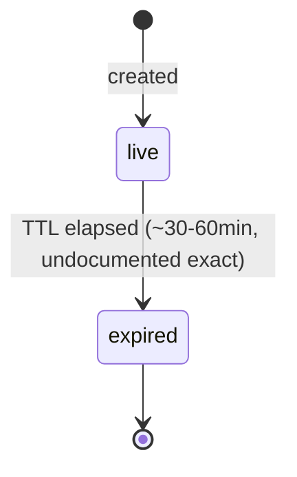
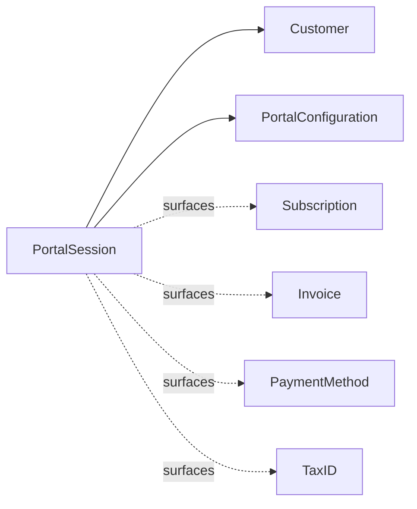

# Customer Portal Session

> API resource: `billing_portal.session` · API version: `2026-04-22.dahlia` · Category: [Billing](README.md)

## What it is

A `billing_portal.session` is a short-lived URL into Stripe's hosted self-service portal for a specific [Customer](../01-core-resources/customers.md). When the customer opens the URL, they land on Stripe's UI where they can — depending on what your [Configuration](customer-portal-configurations.md) allows — update their payment methods, view invoices, change plans, cancel a [Subscription](subscriptions.md), update their address / tax ID, or apply a promo code. When they're done they're redirected back to your `return_url`.

Think of it as **a sub-bound, expiring magic link to "manage your subscription"**.

## Why it exists

Without it, every SaaS has to build the same six pages: list invoices, update card, change plan, downgrade, cancel with reason capture, update billing email. Each of those touches several Stripe primitives and has subtle proration / SCA / dunning edge cases. The Customer Portal is Stripe's done-for-you implementation, kept current with new PM types and regulations. Your only integration burden is "create a session, redirect, listen on the existing webhooks."

Reach for the portal when your subscription UX doesn't need bespoke branding deep inside the flow. Build it yourself when you need pixel-perfect control or unusual flows the portal doesn't expose.

## Lifecycle & states

The Session has no `status` field. It's "valid until expiry," and there is no API to revoke it once issued.



State semantics:

- **Live** — `url` works. The customer can navigate around the portal. Each meaningful action (card update, sub change, cancel) hits Stripe's APIs server-side, generating the same webhooks you'd see if you'd done the API call yourself.
- **Expired** — `url` returns Stripe's "this link has expired" page. **No revocation API** — you cannot kill a session early; you wait it out.

> The exact TTL is not formally documented; observed behavior is roughly 30–60 minutes of inactivity, with shorter windows after sensitive actions. Don't depend on a specific number — generate a fresh session per click.

The customer's actions inside the portal create persistent changes (subscription updates, PM detachments) that long outlive the Session.

## Anatomy of the object

### Identity

| Field | Notes |
|---|---|
| `id` | `bps_…` |
| `object` | `"billing_portal.session"` |
| `url` | The portal URL — `https://billing.stripe.com/p/session/…`. **Single-use UX**: redirect once. Reusing it across browsers/devices works until expiry but is not a recommended pattern. |
| `created` | unix seconds. |
| `livemode` | standard. |

### Targeting

| Field | Notes |
|---|---|
| `customer` | `cus_…`. **Required** at create. The portal scopes to this Customer's data only. Immutable. |
| `configuration` | `bpc_…` of the [Configuration](customer-portal-configurations.md) that decides which features are visible. If omitted, Stripe uses the account-level default configuration (`is_default: true`). |
| `locale` | `auto` (sniff from browser) or any supported locale (e.g. `de`, `pt-BR`). |
| `on_behalf_of` | Connected account whose branding/terms apply, even when the platform created the session. |

### Return navigation

| Field | Notes |
|---|---|
| `return_url` | URL to send the customer back to when they hit the portal's "Return to merchant" button. If unset, falls back to `default_return_url` on the Configuration; if also unset, the button is hidden. |

### Flow targeting

`flow_data` deep-links the customer into one specific flow instead of dropping them on the portal home. Useful when your own UI says "Cancel subscription" — instead of dumping them into the portal home and trusting them to find the cancel button, drive them straight there.

| Field | Notes |
|---|---|
| `flow_data.type` | `payment_method_update`, `subscription_cancel`, `subscription_update`, `subscription_update_confirm`. |
| `flow_data.subscription_cancel.subscription` | `sub_…` to cancel. Required for that flow type. |
| `flow_data.subscription_update.subscription` | `sub_…` to surface the update UI for. |
| `flow_data.subscription_update_confirm` | Pre-filled confirmation: `subscription`, `items[]`, `discounts[]`. Useful for an "upgrade to Pro" button that takes the customer to a one-click confirm page. |
| `flow_data.after_completion.type` | `redirect | hosted_confirmation | portal_homepage`. What happens after the flow finishes. |
| `flow_data.after_completion.redirect.return_url` | Override of the session-level `return_url` for this flow only. |
| `flow_data.after_completion.hosted_confirmation.custom_message` | Markdown shown on Stripe's confirmation page. |

## Relationships



- A Session is bound to one Customer for life.
- A Session carries a snapshot pointer to one Configuration. Updating the Configuration after creation does affect the in-flight Session — whatever the Configuration says at the moment of each portal page load is what the customer sees. (This is unlike Checkout Sessions, which freeze most config at create time.)
- Customer actions inside the portal mutate Subscriptions, PaymentMethods, Customer fields, etc. — those are real persistent changes; the Session itself doesn't store them.

## Common workflows

### 1. Standard "Manage subscription" button

Server route handler when the customer clicks the button in your dashboard:

```http
POST /v1/billing_portal/sessions
  customer=cus_…
  return_url=https://app.example.com/account/billing
```

Return `303` to the resulting `url`. Customer self-serves. Listen for `customer.subscription.updated`, `payment_method.attached`, `customer.updated` — those are what tell you what they did.

### 2. Deep-link to cancel

Your "Cancel" button → server:

```http
POST /v1/billing_portal/sessions
  customer=cus_…
  return_url=https://app.example.com/goodbye
  flow_data[type]=subscription_cancel
  flow_data[subscription_cancel][subscription]=sub_…
  flow_data[after_completion][type]=redirect
  flow_data[after_completion][redirect][return_url]=https://app.example.com/account/billing?canceled=1
```

Customer lands directly on the cancel-with-reason page (assuming the Configuration allows cancellation). Configuration controls cancel mode (`at_period_end` vs `immediately`), proration, and reason capture.

### 3. One-click upgrade confirmation

Your pricing page "Upgrade to Pro" button → server:

```http
POST /v1/billing_portal/sessions
  customer=cus_…
  flow_data[type]=subscription_update_confirm
  flow_data[subscription_update_confirm][subscription]=sub_…
  flow_data[subscription_update_confirm][items][0][id]=si_…
  flow_data[subscription_update_confirm][items][0][price]=price_pro_monthly
  flow_data[subscription_update_confirm][items][0][quantity]=1
  flow_data[after_completion][type]=redirect
  flow_data[after_completion][redirect][return_url]=https://app.example.com/welcome-to-pro
```

Customer sees a pre-filled confirmation page with proration breakdown; one click applies the change.

### 4. Update payment method only

```http
POST /v1/billing_portal/sessions
  customer=cus_…
  flow_data[type]=payment_method_update
  flow_data[after_completion][type]=portal_homepage
```

Useful when an `invoice.payment_failed` email links the customer straight to the card-update screen.

### 5. Connect: portal for a connected account's customer

```http
POST /v1/billing_portal/sessions
  -H "Stripe-Account: acct_…"
  customer=cus_…   # customer on the connected account
  return_url=https://merchant-app.example.com/billing
```

Hosted under the connected account's branding (logo / colors from the Dashboard). Same shape, different account context.

## Webhook events

The Portal Session itself emits **no events**. Customer actions trigger the normal events on the underlying objects:

| Action in portal | Resulting event(s) |
|---|---|
| Update card / add card | `payment_method.attached`, `customer.updated` (if it became default), `setup_intent.succeeded` (during the add) |
| Detach card | `payment_method.detached` |
| Change plan | `customer.subscription.updated` (with `previous_attributes` showing the diff), maybe `invoice.created` + `invoice.paid` for proration |
| Cancel sub | `customer.subscription.updated` (if `cancel_at_period_end: true`) or `customer.subscription.deleted` (if immediate) |
| Update billing email / address | `customer.updated` |
| Add tax ID | `customer.tax_id.created` |
| View invoice | no event |

Wire your existing handlers — there's nothing portal-specific to subscribe to.

## Idempotency, retries & race conditions

- `POST /v1/billing_portal/sessions` — set `Idempotency-Key`. A retry without it spawns a duplicate session URL (annoying but not dangerous; just don't surface both to the customer).
- **No revocation.** If you accidentally created a session for the wrong Customer, you cannot kill the URL — wait for it to expire. Generate fresh sessions per click rather than emailing long-lived links.
- The portal performs API calls on the customer's behalf in real time. Your webhook handlers may see a burst of `customer.subscription.updated` events while the customer clicks around (e.g. confirming a downgrade also touches Discount and Invoice). Idempotency by `id` + `previous_attributes` handling is essential.
- Race: the customer cancels in the portal at the same moment your cron tries to charge them. Stripe's writes are serializable per-Subscription; you'll see one of the writes win and the other reflect the new state. Read current state from the API, not from cached values.

## Test-mode tips

- The portal works in test mode against test Customers. URLs look identical (different host path).
- `stripe trigger customer.subscription.updated` to drive your handler outside the portal flow.
- Pair with [TestClock](test-clocks.md) when testing portal-driven plan changes that prorate — advance the clock to verify renewal behavior matches expectations.
- The Stripe CLI `stripe listen` plus a portal session in a real browser is the fastest E2E loop for portal flows.
- There is no "preview the portal as customer X" admin tool; create a real session in test mode and visit the URL.

## Connect considerations

- For **direct integrations on a connected account**, set `Stripe-Account: acct_…`. The session uses the connected account's Configuration set (default or referenced by `bpc_…` on that account). Customer must exist on that account.
- For **destination-charge platforms** where the Customer lives on the platform, create the session on the platform; pass `on_behalf_of=acct_…` to make the connected account's branding/terms appear.
- Configurations are per-account — a `bpc_…` from the platform is not valid for sessions created on a connected account.
- Connected accounts in `restricted` capability state may have portal features (especially payment_method_update) silently disabled — surface this proactively to merchants.

## Common pitfalls

- **Reusing one long-lived portal URL.** Sessions expire; generate per click. Embedding a session URL in marketing email rarely works for any recipient who doesn't click within the TTL.
- **Forgetting `return_url`.** Without it (and without a `default_return_url` on the Configuration) the customer has no way out of the portal short of closing the tab.
- **Assuming the Configuration is frozen at session create.** It isn't — the portal reads the Configuration at each page load. Mutating a Configuration in front of an active customer is a bad time. Use a separate Configuration for staging changes.
- **Hard-coding the cancel mode in your UI copy.** The actual mode (`at_period_end` vs `immediately`) is set on the Configuration; if Ops flips it later your "you'll keep access until the period ends" copy lies.
- **Listening for portal-specific webhooks.** There aren't any. Wire to the underlying object events.
- **Using the portal to collect a card on first signup.** It can't — there's no Customer yet, and the portal requires one. Use a [Checkout Session](../04-checkout/sessions.md) in `mode: setup` or `mode: subscription` for first-time onboarding.
- **Showing your own "cancel subscription" UI alongside the portal's.** Pick one. Two UIs both writing to the same Subscription will surprise users and your support team.
- **Embedding the portal in an iframe.** Not supported — Stripe sets framing headers that break iframing. Open in a new tab or full-page navigate.

## Further reading

- [API reference: Portal Session](https://docs.stripe.com/api/customer_portal/sessions/object)
- [Customer portal overview](https://docs.stripe.com/customer-management)
- [Deep links with `flow_data`](https://docs.stripe.com/customer-management/portal-deep-links)
- [Customize the portal](customer-portal-configurations.md) — sister resource that controls what's shown.
