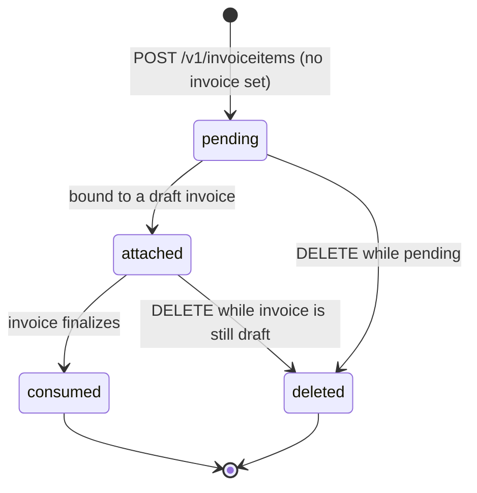
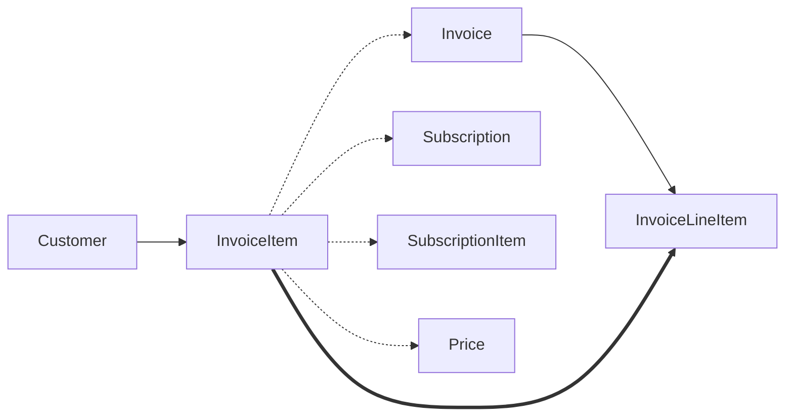

# InvoiceItem

> API resource: `invoiceitem` · API version: `2026-04-22.dahlia` · Category: [Billing](README.md)

## What it is

An `InvoiceItem` is a **pending one-off charge** parked on a [Customer](../01-core-resources/customers.md) waiting to be picked up by the next [Invoice](invoices.md). Think of it as a sticky note on the customer's account that says "next time you bill them, include this line."

It is not itself an invoice line — it's the *seed* that becomes an [InvoiceLineItem](invoice-line-items.md) the moment an invoice finalizes.

## Why it exists

Subscriptions auto-generate their own line items from [SubscriptionItems](subscription-items.md). Anything *outside* the subscription's recurring price — a setup fee, an overage, a one-time add-on, a credit — has nowhere to live. InvoiceItem is that holding bay:

- "Add a $50 setup fee to next month's bill."
- "I discovered after the period closed that they used 1,200 extra API calls — bill them now."
- "Issue a $20 goodwill credit on the next invoice." (negative-amount InvoiceItem.)
- "Bill them for a one-off SKU without setting up a Subscription."

Stripe also creates InvoiceItems internally as **proration adjustments** when a Subscription changes mid-cycle — those have `proration: true`.

## Lifecycle & states

InvoiceItems do not carry an explicit `status` enum. Their state is implicit in whether the `invoice` field is populated:



- **`pending`** — created with `customer=cus_…` and no `invoice`. Waits in the customer's pending bucket. Will be auto-pulled into the next invoice generated for that customer (subscription renewal *or* manual `POST /v1/invoices`).
- **`attached`** — bound to a specific draft invoice via the `invoice` parameter. Only allowed if that invoice is still `draft`.
- **`consumed`** — the parent invoice finalized. The InvoiceItem still exists and is retrievable (`invoice` field populated, `lines.data` on the invoice references it), but it is no longer pending and cannot be edited or deleted.
- **`deleted`** — only possible while the parent invoice is `draft` (or never existed). Once finalization happens, the line is frozen on the invoice and the underlying InvoiceItem is read-only.

## Anatomy of the object

### Identity

| Field | Notes |
|---|---|
| `id` | `ii_…` |
| `object` | `invoiceitem` |
| `livemode`, `metadata` | standard. |
| `date` | Unix seconds — when the item was created. |

### Relations

| Field | Notes |
|---|---|
| `customer` | `cus_…`. Required. Immutable. |
| `invoice` | `in_…` if attached to a specific draft, else `null` (pending). Once the invoice finalizes, this stays populated. |
| `subscription` | `sub_…` if generated as proration on a subscription change. Hedge: also populated on items Stripe auto-creates for billing-threshold or pause events. |
| `subscription_item` | `si_…` for proration items tied to a specific SubscriptionItem. |
| `price` | `price_…` if the item was created from a Price object. |
| `test_clock` | `clock_…` if the customer is on a test clock. |

### Money

| Field | Notes |
|---|---|
| `amount` | Signed integer in the smallest currency unit. **Negative amounts are credits** that reduce the invoice total. |
| `currency` | Lowercase ISO. Must match the customer's currency once that customer has been billed before. |
| `unit_amount` / `quantity` | Alternative to `amount` — Stripe computes `amount = unit_amount * quantity`. |
| `unit_amount_decimal` | High-precision unit price (string). Useful for fractional-cent items. |

You provide *one* of: `amount`, `unit_amount + quantity`, or `price` (+ optional `quantity`).

### Period

| Field | Notes |
|---|---|
| `period.start`, `period.end` | What service window this item covers. Defaults to `[date, date]` (a point in time). Set explicitly for "billed now for service period X→Y" — appears on the PDF. |

### Tax & discounts

| Field | Notes |
|---|---|
| `tax_rates` | Array of `txr_…` IDs applied to this line specifically. Overrides invoice-level rates. |
| `tax_code` | A Stripe Tax product tax code (`txcd_…`). Overrides the Product's tax code for this item only. |
| `tax_behavior` | `inclusive | exclusive | unspecified`. Whether `amount` already contains tax. |
| `discountable` | Boolean. If `false`, invoice-level coupons skip this line. Default `true`. |
| `discounts` | Array of `{ coupon }` or `{ promotion_code }` or `{ discount }` applied to this line only. |

### Display

| Field | Notes |
|---|---|
| `description` | Free text shown on the invoice line. |
| `proration` | Boolean. `true` if Stripe generated the item as part of a subscription proration. **Don't delete prorations** unless you really mean it — you'll desync the customer's billing math. |

## Relationships



- A pending InvoiceItem belongs to a Customer and floats unattached.
- On invoice finalization, it manifests as an [InvoiceLineItem](invoice-line-items.md) with `type: invoiceitem` and the line's `invoice_item` field pointing back at it.
- A proration InvoiceItem is also tied to the SubscriptionItem whose change produced it.

## Common workflows

### 1. Add a one-off charge to next month's subscription invoice

```http
POST /v1/invoiceitems
  customer=cus_…
  amount=5000
  currency=usd
  description=One-time onboarding fee
```

No `invoice` set → goes into the customer's pending bucket → next subscription renewal pulls it in automatically.

### 2. Add a line to a specific draft invoice

```http
POST /v1/invoiceitems
  customer=cus_…
  invoice=in_…
  amount=2500
  currency=usd
  description=Add-on hours
```

Errors with `invoice_no_payment_intent` or similar if the target invoice is no longer `draft`.

### 3. Bill for usage discovered after the period closed

The subscription invoice already finalized last week. You can't add to it (it's `open` or `paid`). Two options:

- **Add to next period.** Create a pending InvoiceItem now; it'll appear on next month's invoice. Simple, but the line shows on the wrong period.
- **Force an immediate ad-hoc invoice.** Create the InvoiceItem with `customer=cus_…`, then `POST /v1/invoices` with `customer=cus_…` (and optionally `subscription=sub_…`) to drain pending items into a fresh invoice now.

### 4. Issue a credit / negative line

```http
POST /v1/invoiceitems
  customer=cus_…
  amount=-1000
  currency=usd
  description=Goodwill credit
```

Reduces next invoice by $10. For a *proper* refund of an already-paid invoice, use a [CreditNote](credit-notes.md) instead — negative InvoiceItems only work prospectively.

### 5. Use a Price instead of a raw amount

```http
POST /v1/invoiceitems
  customer=cus_…
  price=price_one_time_widget
  quantity=3
```

Lets the catalog Price drive amount + currency + tax behavior. Recommended for repeated SKUs.

### 6. Delete a pending item

```http
DELETE /v1/invoiceitems/ii_…
```

Only succeeds if the item is still pending or attached to a draft invoice. After finalize, returns an error like `cannot_delete_invoice_item`.

### 7. Preview the next invoice's effect

```http
GET /v1/invoices/upcoming?customer=cus_…
```

Returns an Invoice-shaped preview that includes pending InvoiceItems. Use before adding more to confirm the resulting total.

## Webhook events

| Event | Fires when | Listener typically does |
|---|---|---|
| `invoiceitem.created` | An InvoiceItem (manual or proration-generated) is created. | Reflect in internal billing UI. |
| `invoiceitem.deleted` | A pending or draft-attached item is deleted. | Roll back any UI / hold. |
| `invoice.created` / `invoice.updated` | When the item is pulled into an invoice draft. | Treat the invoice as the source of truth from here on. |

There is no `invoiceitem.updated` event — field changes on a pending item don't emit. Listen to the parent invoice instead.

## Idempotency, retries & race conditions

- `POST /v1/invoiceitems` accepts `Idempotency-Key`. Strongly recommended — accidentally double-billing a setup fee is a common bug.
- A pending InvoiceItem and the next subscription renewal can race. The renewal cycle picks up *whatever is pending at the moment the draft invoice is created* (~1 hour before period end). An InvoiceItem created after the draft exists but before finalization typically attaches to the open draft for that customer; behavior may vary if multiple drafts exist.
- Multiple subscriptions on the same customer: a pending InvoiceItem with no `subscription` field can land on any of their next-generated invoices. **If you care which invoice it lands on, pin it** with `invoice=in_…` (after the draft exists) or `subscription=sub_…`.

## Test-mode tips

- Pair with a [TestClock](test-clocks.md) to simulate "create item now, advance clock past period end, watch it land on the auto-generated invoice."
- `stripe trigger invoiceitem.created` produces a fixture event but doesn't generate the downstream invoice flow — use a real test customer + clock for that.
- Negative-amount InvoiceItems are clamped: the resulting invoice total can't go below zero. Excess credit lands in the customer's balance instead.

## Connect considerations

- InvoiceItems live on the same account as their Customer. To create on a connected account, pass `Stripe-Account: acct_…`.
- Platform-level proration items inherit the connected-account context of the parent subscription.
- `application_fee_amount` is a Subscription / Invoice concept, not an InvoiceItem one — you can't fee-share a single line directly.

## Common pitfalls

- **Creating a pending InvoiceItem on a customer with multiple subscriptions / open invoices.** It can land on the wrong invoice. Pin it with `invoice=` or `subscription=` if it matters.
- **Forgetting it's pending forever until something invoices the customer.** A standalone customer with no Subscription and no manual `POST /v1/invoices` will hold the item indefinitely. Surfaces as "I created the item but never got billed."
- **Deleting a `proration: true` item.** Stripe added it for a reason; removing it usually means the customer is over- or under-charged for the proration. Don't unless you're consciously rolling back a plan change.
- **Using negative InvoiceItems to "refund" a paid invoice.** That's not a refund — it's a discount on a *future* invoice. Real refunds go through [CreditNote](credit-notes.md) or [Refund](../01-core-resources/refunds.md).
- **Mixing currencies.** First-billed customer locks the currency. An InvoiceItem in a different currency from the customer will error at attach time.
- **Setting `period.start`/`period.end` and forgetting it shows on the PDF.** The customer sees that date range as the service window. Default `[date, date]` if unsure.
- **Treating `invoiceitem.updated` as a thing.** It isn't emitted. Watch invoice events for downstream effect.

## Further reading

- [API reference: InvoiceItem](https://docs.stripe.com/api/invoiceitems/object)
- [Add invoice items to subscriptions](https://docs.stripe.com/billing/invoices/subscription#one-time-invoice-items)
- [One-off invoice flow](https://docs.stripe.com/invoicing/integration)
- [InvoiceLineItem](invoice-line-items.md) — the materialized form
- [CreditNote](credit-notes.md) — for adjusting *finalized* invoices
