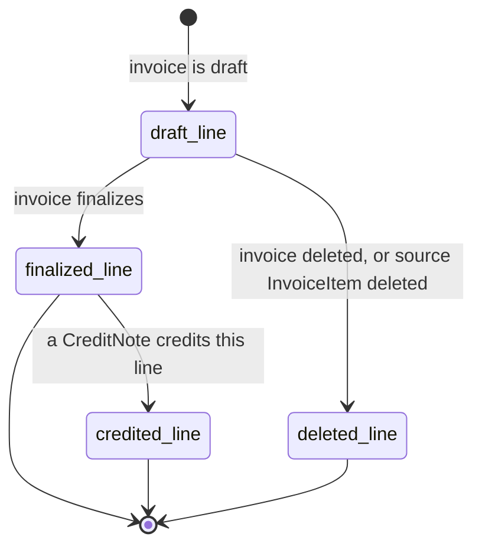
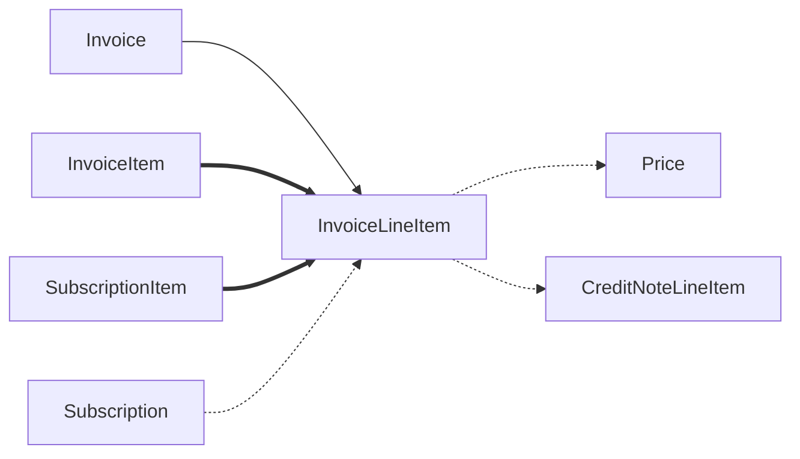

# InvoiceLineItem

> API resource: `invoice_line_item` · API version: `2026-04-22.dahlia` · Category: [Billing](README.md)

## What it is

An `InvoiceLineItem` is a single row that **appears on** an [Invoice](invoices.md). It's a read-only sub-resource — you don't create one directly. Instead, lines materialize when the parent invoice is generated, sourced from either:

- An [InvoiceItem](invoice-items.md) (a one-off charge attached to the customer) → `type: invoiceitem`.
- A [SubscriptionItem](subscription-items.md) (a recurring price + quantity on a Subscription) → `type: subscription`.

If you've ever wondered "what shows up on the PDF?" — that's the line item. It's also the unit that a [CreditNote](credit-notes.md) credits against.

## Why it exists

An Invoice is the legal document; a line is the audit-detail of *what specifically* was billed. Lines exist as their own resource (rather than being inlined-only on the Invoice) because:

- They have their own ID (`il_…`) so other resources — primarily CreditNotes — can reference exactly which line is being adjusted.
- They are paginatable (`GET /v1/invoices/in_…/lines`) — useful when an invoice has hundreds of lines (multi-tenant SaaS, metered usage).
- They carry per-line tax and discount math that the Invoice's totals roll up from.

## Lifecycle & states

InvoiceLineItems do not have a status enum. Their lifecycle mirrors the parent invoice's:



- **Draft line** — invoice is `draft`. The line is mutable in narrow ways (see workflows below).
- **Finalized line** — invoice has moved to `open` (or beyond). Line is **immutable** as far as amount / quantity / pricing.
- **Credited line** — one or more CreditNoteLineItems point at this line, reducing its effective amount. The InvoiceLineItem itself doesn't change; the credit is tracked on the credit note side.

## Anatomy of the object

### Identity

| Field | Notes |
|---|---|
| `id` | `il_…`. **Use this** when targeting the line from a CreditNote, line update, or refund. |
| `object` | `line_item` (within an `invoice.lines` payload) or `invoice_line_item`. |
| `livemode`, `metadata` | standard. Note: line metadata is separate from the source InvoiceItem's metadata. |

### Type & source

| Field | Notes |
|---|---|
| `type` | `invoiceitem` or `subscription`. Tells you which sub-graph to look at. |
| `invoice_item` | `ii_…` if `type: invoiceitem`. |
| `subscription` | `sub_…` if `type: subscription`. |
| `subscription_item` | `si_…` if `type: subscription`. |
| `parent` | Newer wrapper around `subscription_item_details` / `invoice_item_details` that carries the source pointer. Hedge: shape evolved in recent API versions; defer to the live response shape. |

### Money

| Field | Notes |
|---|---|
| `amount` | Signed integer in smallest currency unit. Includes proration sign. |
| `currency` | Lowercase ISO. Always equal to the parent invoice's currency. |
| `quantity` | Number of units. Defaults to 1 for non-priced items. |
| `unit_amount_excluding_tax` | (Newer) per-unit amount net of inclusive tax. |
| `amount_excluding_tax` | (Newer) line amount net of inclusive tax. |

### Pricing

| Field | Notes |
|---|---|
| `pricing` | (Newer wrapper, replacing the older `price` reference) — describes the price source: `pricing.type` (`price_details` / `price`), `pricing.price_details.price` (`price_…`), `pricing.price_details.product` (`prod_…`), `pricing.unit_amount_decimal`. |
| `price` | Legacy direct pointer. Mirrors `pricing.price_details.price`. |
| `plan` | Legacy mirror of `price` — kept for backwards-compat with the old Plans API. |

### Period

| Field | Notes |
|---|---|
| `period.start`, `period.end` | The service window this line covers. For subscription lines: the subscription cycle. For invoiceitem lines: inherited from the source InvoiceItem's `period` (defaults to a point in time). |

### Proration

| Field | Notes |
|---|---|
| `proration` | Boolean. `true` if this line is a proration adjustment from a mid-cycle plan change. |
| `proration_details.credited_items.invoice` | The original invoice whose line is being credited by this proration. |
| `proration_details.credited_items.invoice_line_items` | The specific `il_…` IDs being credited. **Useful for tracing "where did this -$X line come from?"** |

### Tax & discounts

| Field | Notes |
|---|---|
| `tax_amounts` | Array of `{ amount, inclusive, tax_rate, taxability_reason, taxable_amount }`. Per-rate tax breakdown for this line. |
| `taxes` | Newer field — same idea, slightly different shape. Hedge: which one is canonical depends on the API version's tax-display preference; both may be returned. |
| `discount_amounts` | Per-discount breakdown of how much this line was reduced. |
| `discounts` | Discount IDs applied. |
| `tax_rates` | Inherited from invoice or set per-line. |

### Display

| Field | Notes |
|---|---|
| `description` | Free text shown on the line. |

## Relationships



A line always has exactly one parent invoice and exactly one source (InvoiceItem *or* SubscriptionItem, never both). Multiple CreditNoteLineItems can reference the same InvoiceLineItem (partial credits over time, summing up to ≤ the line amount).

## Common workflows

### 1. List lines on an invoice

```http
GET /v1/invoices/in_…/lines?limit=100
```

Paginated. The Invoice retrieve endpoint also returns the first page inline at `invoice.lines.data` — use the dedicated endpoint for invoices with > ~10 lines.

### 2. Update a line on a draft invoice

Only allowed while the parent invoice is `draft`:

```http
POST /v1/invoices/in_…/lines/il_…
  description="Updated line description"
  quantity=5
  metadata[po]=PO-1234
```

What you can edit varies by line type. For subscription-derived lines, most fields are owned by the source SubscriptionItem; edit there instead. For invoiceitem-derived lines, prefer editing the source InvoiceItem.

### 3. Add a line to a draft invoice

```http
POST /v1/invoices/in_…/add_lines
  lines[0][amount]=2500
  lines[0][currency]=usd
  lines[0][description]=Setup fee
```

This is a newer alternative to creating an InvoiceItem with `invoice=in_…`. Both work; this endpoint accepts a batch.

### 4. Remove a line from a draft invoice

```http
POST /v1/invoices/in_…/remove_lines
  lines[0][id]=il_…
  lines[0][behavior]=delete
```

`behavior` controls the source: `delete` (drop the source InvoiceItem entirely) or `unassign` (leave the InvoiceItem pending so the next invoice picks it up).

### 5. Credit a line on a finalized invoice

You can't edit the line. Issue a [CreditNote](credit-notes.md) targeting it:

```http
POST /v1/credit_notes
  invoice=in_…
  refund_amount=1500
  lines[0][type]=invoice_line_item
  lines[0][invoice_line_item]=il_…
  lines[0][amount]=1500
```

Stripe creates the credit note + Refund and updates the invoice's `post_payment_credit_notes_amount`.

### 6. Trace a proration line back to its origin

A `-$8.33` line shows up on this month's invoice. To find what it's crediting:

```http
GET /v1/invoices/in_…/lines
# inspect the line where amount < 0
# read line.proration_details.credited_items.invoice + invoice_line_items
```

That tells you "this credit reverses lines il_X, il_Y on invoice in_Z."

## Webhook events

InvoiceLineItem doesn't emit its own events. Watch the parent invoice:

| Event | What lines did |
|---|---|
| `invoice.created` | Initial draft lines materialized. |
| `invoice.updated` | Lines added / removed / edited (on draft) or invoice metadata changed. |
| `invoice.finalized` | Lines locked. |
| `credit_note.created` | A line was partially or fully credited; check the credit note's lines for which `il_…` IDs. |

## Idempotency, retries & race conditions

- Lines are deterministic per-finalize: re-reading after finalize always returns the same `il_…` IDs and amounts.
- Stripe's pagination on `GET /v1/invoices/in_…/lines` is stable as long as the invoice is finalized. On a draft, lines can be added/removed between pages — use the cursor cautiously and consider re-fetching the entire list if you've been editing the draft concurrently.
- A line's `il_…` ID **can change** between draft and finalized in some cases (Stripe regenerates lines at finalization for subscription cycles). Don't store `il_…` IDs from a draft and expect them to survive finalization — store the source `ii_…` / `si_…` instead.

## Test-mode tips

- The easiest way to inspect line shape: create a customer + subscription + a few InvoiceItems on a [TestClock](test-clocks.md), advance the clock past `current_period_end`, then fetch `GET /v1/invoices/in_…/lines` to see the materialized result with prorations.
- Stripe Tax in test mode produces real-shape `tax_amounts` arrays — useful for verifying your line-by-line tax rendering.
- Use `expand[]=lines.data.discounts` and `expand[]=lines.data.tax_amounts.tax_rate` when retrieving an invoice to inline the related objects for inspection.

## Connect considerations

- Lines are scoped to the connected account that owns the invoice. Pass `Stripe-Account: acct_…` on the lines retrieval to read.
- `application_fee_amount` and `application_fee_percent` apply at the Invoice / Subscription level — there's no per-line fee split.

## Common pitfalls

- **Editing a finalized line.** Returns `invoice_not_editable` (or similar). Use a CreditNote.
- **Storing `il_…` IDs from a draft.** They can change at finalization. Store the source ID (`ii_…`, `si_…`) and resolve forward.
- **Computing your own subtotal from line amounts.** Stripe's totals account for inclusive vs exclusive tax, rounding, and discount allocation in a specific order. Read `invoice.subtotal` / `invoice.total`, not your own sum.
- **Confusing `type: subscription` with "the line is a Subscription."** The line is sourced *from* a SubscriptionItem within a Subscription. The Subscription itself isn't a line.
- **Looking for `invoice_line_item.created` events.** They don't exist. The parent invoice's `created` / `updated` are the signal.
- **Treating proration lines as separate invoices.** They're just lines with `proration: true` on the same invoice as the new period's charges. They net out in `total`.

## Further reading

- [API reference: InvoiceLineItem](https://docs.stripe.com/api/invoices/line_item)
- [Update invoice line items](https://docs.stripe.com/api/invoices/update_line_item)
- [Add / remove lines](https://docs.stripe.com/api/invoices/add_lines)
- [InvoiceItem](invoice-items.md) — the source for `type: invoiceitem`
- [SubscriptionItem](subscription-items.md) — the source for `type: subscription`
- [CreditNote](credit-notes.md) — credits a finalized line
