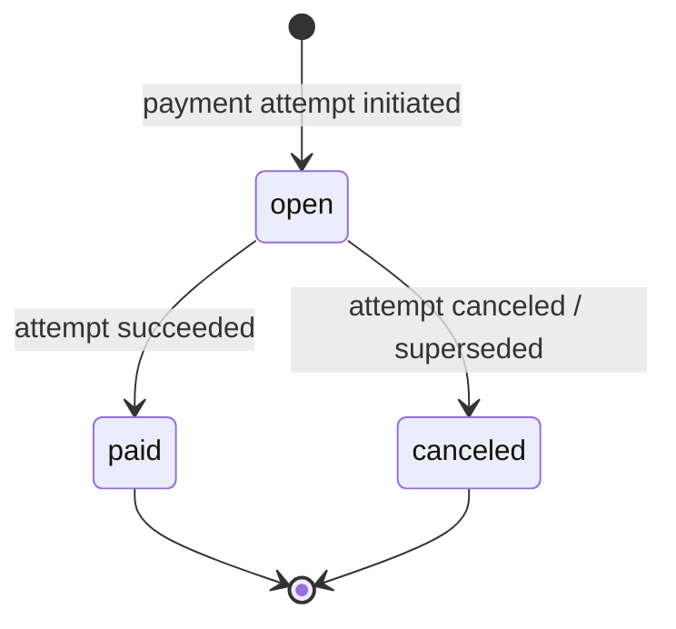
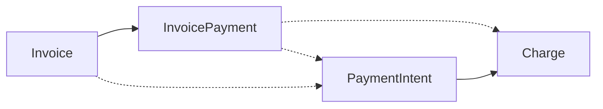

# InvoicePayment

> API resource: `invoice_payment` · API version: `2026-04-22.dahlia` · Category: [Billing](README.md)

## What it is

An `InvoicePayment` is a **per-attempt record of how an [Invoice](invoices.md) was paid** (or attempted to be paid). One Invoice can have many InvoicePayments — one for each retry, partial payment, out-of-band record, or pre-authorized payment that targeted it.

Older Stripe integrations had only `invoice.payment_intent` (the *most recent* attempt) and walked Charges/PIs to reconstruct payment history. InvoicePayment is the explicit, queryable history.

> **Hedge.** This resource is relatively new (introduced in 2024-2025 API versions). Some field names and exact shapes may have evolved. Treat the lists below as the *concept* and confirm exact field names against the live API reference for `2026-04-22.dahlia`.

## Why it exists

A single Invoice can be paid in non-trivial ways:

- **Multiple attempts.** Smart Retries / dunning produces N PaymentIntents for one invoice over days/weeks. Which one finally succeeded? The most recent one isn't always the one that paid.
- **Partial payments.** A customer wires you 60% and pays the rest by card. Two payments, one invoice.
- **Out-of-band payments.** You wired the money externally and `pay --paid_out_of_band=true` recorded it. There's no PaymentIntent — but there *is* an InvoicePayment.
- **Pre-authorized customer-balance payments.** Customer balance gets debited toward the invoice; that's an InvoicePayment with no PI.
- **Reconciliation.** Finance needs "every payment ever applied to invoice X, with status, amount, and timestamp."

Without InvoicePayment, you'd have to walk Charges by `invoice` field and stitch together the picture. With it, `GET /v1/invoice_payments?invoice=in_…` returns the timeline directly.

## Lifecycle & states



- **`open`** — payment has been initiated against the invoice (a PaymentIntent is in flight, or a partial wire was recorded as pending). Not yet settled.
- **`paid`** — terminal success. Money was applied to the invoice's `amount_paid`.
- **`canceled`** — the attempt was canceled or superseded (e.g., the underlying PaymentIntent was canceled before settling). No money applied.

The Invoice's own `status` doesn't move to `paid` until the **sum of `paid` InvoicePayments ≥ `amount_due`**.

## Anatomy of the object

### Identity

| Field | Notes |
|---|---|
| `id` | `inpay_…` (hedge: prefix may differ — Stripe sometimes uses `inv_pay_…` in newer schemas). |
| `object` | `invoice_payment`. |
| `livemode`, `created` | standard. |

### Relations

| Field | Notes |
|---|---|
| `invoice` | `in_…`. The parent invoice. Required and immutable. |
| `payment` | Discriminated union pointing to the underlying money mover: `payment.type` is one of `payment_intent`, `out_of_band`, `charge`. The corresponding sibling field (`payment.payment_intent`, `payment.charge`) holds the ID. |

### Money

| Field | Notes |
|---|---|
| `amount_paid` | What the invoice's `amount_paid` increased by when this payment settled. Zero on `open` / `canceled`. |
| `amount_requested` | What was attempted. May be > `amount_paid` if the payment partially succeeded (rare). |
| `currency` | Inherited from the invoice. |

### Status

| Field | Notes |
|---|---|
| `status` | `open | paid | canceled`. |
| `status_transitions` | `{ paid_at, canceled_at }` Unix timestamps. |
| `is_default` | Boolean — whether this is the "primary" payment for the invoice. Hedge: behavior tied to how the invoice was paid (auto vs out-of-band). |

## Relationships



One Invoice → many InvoicePayments. Each InvoicePayment → at most one PaymentIntent (or Charge, or "out of band" sentinel). The Invoice's top-level `latest_invoice.payment_intent` shortcut still works, but it only points at the *latest* attempt's PI; InvoicePayment is the full list.

## Common workflows

### 1. List all payment attempts for an invoice

```http
GET /v1/invoice_payments?invoice=in_…
```

Returns every attempt in chronological order. Use to build a "payment history" UI for a customer or to debug "why is this invoice still `open` when I see a successful charge?"

### 2. Retry forensics on a dunned invoice

The invoice is `paid`, but the customer is asking which attempt actually went through (and which earlier ones failed):

```http
GET /v1/invoice_payments?invoice=in_…
# filter status=paid → the successful one
# filter status=canceled → the failed/canceled retries
# expand[]=data.payment.payment_intent → see decline codes per attempt
```

### 3. Multi-payment invoice (partial wire + remaining card)

Customer wires $600 toward a $1,000 invoice. You record:

```http
POST /v1/invoices/in_…/pay
  paid_out_of_band=true
  # if the API supports recording partial out-of-band, use partial pay; else
  # adjust customer balance + apply
```

This creates an `InvoicePayment` with `payment.type=out_of_band`, `amount_paid=60000`, `status=paid`.

The remaining $400 is then attempted on card (auto, since `auto_advance=true`):

```http
# Stripe creates a PI; on success, a second InvoicePayment with
# payment.type=payment_intent, amount_paid=40000, status=paid
```

Now `invoice.amount_paid = 100000`, `invoice.amount_remaining = 0`, `invoice.status = paid`.

### 4. Reconcile "paid out of band"

Finance asks: "we marked invoice ABC paid out of band — show me where that record lives."

```http
GET /v1/invoice_payments?invoice=in_…&payment.type=out_of_band
```

(Hedge: filter syntax may differ; check API ref. You may need to fetch the list and filter client-side.)

### 5. Find the PaymentIntent that paid an invoice

The legacy answer is `invoice.payment_intent` — but that's only the *latest* attempt. The robust answer:

```http
GET /v1/invoice_payments?invoice=in_…
# find data[*] where status=paid && payment.type=payment_intent
# read payment.payment_intent
```

## Webhook events

Hedge: dedicated `invoice_payment.*` events may not yet exist (or are limited). The signal you can rely on:

| Event                                                        | Fires when                                       | What it tells you about InvoicePayment                           |
| ------------------------------------------------------------ | ------------------------------------------------ | ---------------------------------------------------------------- |
| `invoice.payment_succeeded`                                  | A payment attempt against the invoice succeeded. | A new InvoicePayment with `status=paid` exists for this invoice. |
| `invoice.payment_failed`                                     | An attempt failed.                               | An InvoicePayment may be `canceled` or stay `open`.              |
| `invoice.paid`                                               | Sum of paid InvoicePayments ≥ amount_due.        | Terminal — invoice is settled.                                   |
| `payment_intent.succeeded` / `payment_intent.payment_failed` | The underlying PI moved.                         | Look up the InvoicePayment via the PI's `invoice` field.         |

If your account has `invoice_payment.*` events available in this API version, they fire on each create / status transition.

## Idempotency, retries & race conditions

- InvoicePayments are created by Stripe (you don't `POST /v1/invoice_payments` directly — they materialize as a side effect of `POST /v1/invoices/in_…/pay`, of automatic dunning attempts, or of out-of-band recording). So idempotency is handled at the parent operation.
- Webhook ordering: the underlying `payment_intent.succeeded` and the resulting `invoice.payment_succeeded` (and the InvoicePayment becoming `paid`) can arrive in any order. Re-fetch the invoice or the InvoicePayment list to get a consistent view.
- A `paid` invoice can later have **additional** InvoicePayments if you record an out-of-band overpayment that flows to customer balance. Don't assume "invoice is paid → no more InvoicePayments will appear."

## Test-mode tips

- Use a [TestClock](test-clocks.md) + a card that fails-then-succeeds (`4000 0000 0000 0341`) to produce an invoice with multiple InvoicePayments.
- `stripe trigger invoice.payment_failed` followed by `stripe trigger invoice.payment_succeeded` produces fixture events but doesn't always wire up the full InvoicePayment timeline — for that, use a real test customer + invoice.
- For out-of-band records, finalize an invoice and call `POST /v1/invoices/in_…/pay --paid_out_of_band=true`; you'll see the resulting InvoicePayment in the list.

## Connect considerations

- InvoicePayments inherit the connected-account context of the parent Invoice. Pass `Stripe-Account: acct_…` to list on a connected account.
- The underlying PaymentIntent / Charge belongs to the same account.
- Platform `application_fee` is computed once per *Invoice*, not per InvoicePayment — partial payments don't multiply the platform fee.

## Common pitfalls

- **Reading `invoice.payment_intent` and assuming it's the one that paid.** It's just the most recent. For multi-attempt invoices, the actual paying PI is the one whose InvoicePayment has `status=paid`.
- **Treating `invoice.amount_paid` as set in one shot.** It increases per InvoicePayment that settles. Watch `invoice.paid` (or `invoice.status=paid`) for the terminal signal.
- **Querying Charges by `invoice=in_…` for reconciliation.** Works for direct PI payments but misses out-of-band entries. Use InvoicePayment.
- **Assuming the API supports `POST /v1/invoice_payments` to create a payment manually.** It doesn't — payments are side-effects of pay / dunning / OOB recording. The list/get endpoints are the developer-facing surface.
- **Building dunning UIs off `invoice.attempt_count` alone.** That counts attempts on the latest PI, not historical InvoicePayments. List InvoicePayments for an audit-grade history.

## Further reading

- [API reference: InvoicePayment](https://docs.stripe.com/api/invoice-payments) (hedge: URL may differ; search for "Invoice Payment" in the official sidebar).
- [Pay an invoice](https://docs.stripe.com/api/invoices/pay)
- [Invoice payment retry / dunning](https://docs.stripe.com/billing/revenue-recovery/smart-retries)
- [Invoice](invoices.md) — the parent
- [PaymentIntent](../01-core-resources/payment-intents.md) — the underlying money mover for most attempts
