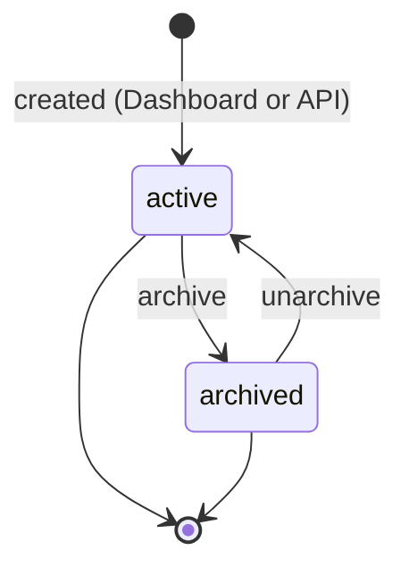
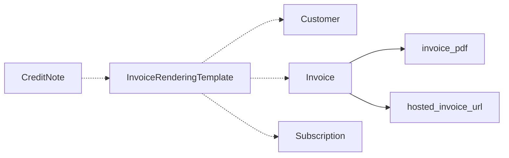

# InvoiceRenderingTemplate

> API resource: `invoice_rendering_template` · API version: `2026-04-22.dahlia` · Category: [Billing](README.md)

## What it is

An `InvoiceRenderingTemplate` is a **named, versioned style/branding template** that controls how an [Invoice](invoices.md) (and a [CreditNote](credit-notes.md)) renders to PDF and to the hosted invoice page. Created and edited primarily in the Stripe Dashboard's invoice template editor, then referenced by ID from invoices/customers via API.

Use one when your default Stripe-hosted invoice PDF doesn't match your brand: custom logo placement, color scheme, legal footers, alternate languages, multi-entity branding (one template per legal entity).

> **Hedge.** Public API documentation for this resource is limited — most of the surface area is Dashboard-driven. The fields below are the publicly exposed concept; treat exact field names and semantics as approximate and confirm against the live API reference.

## Why it exists

Without it, every Stripe-hosted invoice PDF for your account looks the same (driven by your Dashboard branding settings — single logo, single color). Real billing operations need:

- **Multi-entity billing.** A holding company invoices customers under several legal entity names; each needs its own letterhead.
- **Locale variants.** Same template, different language/footer per region.
- **Versioning.** Marketing changed the logo on March 1; invoices issued before that date should keep the old letterhead, after that date should use the new one. Templates are versioned (`version` field) so historical PDFs render with the version active at issue time.
- **Custom legal copy.** Footer with company registration number, VAT ID, jurisdiction-specific notices — varies by template, attached to whichever invoices need it.

## Lifecycle & states



- **`active`** — usable as a `template` reference on invoices and credit notes. New invoices can adopt it.
- **`archived`** — hidden from "pick a template" UIs and not selectable for new invoices, but **historical invoices that already reference it continue to render with the archived version**. Archive is for retiring a template without breaking past PDFs.

## Anatomy of the object

### Identity & versioning

| Field | Notes |
|---|---|
| `id` | `invoice_rendering_template_…` (or shorter prefix; verify against live API). |
| `object` | `invoice_rendering_template`. |
| `nickname` | Human-readable name shown in Dashboard pickers ("EU letterhead", "US standard"). |
| `version` | Integer. Monotonically increases each time the template is published. Invoices snapshot the version at finalization. |
| `status` | `active | archived`. |
| `created`, `livemode`, `metadata` | standard. |

### Content

The actual rendering content (HTML/CSS, logo, color tokens, footer copy) is **not directly exposed via the API** in most cases — it's edited in the Dashboard template editor. The API surface is mostly: list templates, archive/unarchive, reference by ID.

## Where templates get referenced

A template is *applied* to an Invoice or CreditNote via the parent's rendering settings. Likely points of attachment (verify against your API version):

| Where | Field |
|---|---|
| Customer default | `customer.invoice_settings.rendering_options.template` (hedge: exact path may differ — sometimes `customer.invoice_settings.invoice_template`). All future invoices for this customer use this template unless overridden. |
| Invoice override | `invoice.rendering.template` set at create/update on a draft invoice. Overrides the customer default for this invoice only. |
| Subscription default | `subscription.invoice_settings` (similar shape) — applies to all invoices generated from this subscription. |
| CreditNote | Inherits from the parent Invoice's template; not separately settable. |

When the invoice finalizes, Stripe snapshots `template` + `version` onto the invoice's rendering metadata so the PDF stays stable forever, even if you later edit or archive the template.

## Relationships



A template is a *resource*; invoices reference it by ID. The invoice's `invoice_pdf` and `hosted_invoice_url` are rendered using the referenced template version at finalization time.

## Common workflows

### 1. List active templates

```http
GET /v1/invoice_rendering_templates?status=active
```

Useful in admin UIs that let users pick a template per invoice.

### 2. Apply a template to all invoices for a customer

```http
POST /v1/customers/cus_…
  invoice_settings[rendering_options][template]=invoice_rendering_template_…
```

(Hedge: the exact parameter path. Some API versions use `invoice_settings[invoice_template]`.) From now on, invoices for this customer render with that template unless overridden.

### 3. Override per-invoice

```http
POST /v1/invoices
  customer=cus_…
  rendering[template]=invoice_rendering_template_…
  rendering[template_version]=3   # optional pin to a specific version
```

If you don't pin `template_version`, the invoice uses whatever version is current at finalize time.

### 4. Archive a retired template

```http
POST /v1/invoice_rendering_templates/invoice_rendering_template_…/archive
```

New invoices can no longer pick it. Existing invoices that snapshot-referenced it still render fine.

### 5. Unarchive

```http
POST /v1/invoice_rendering_templates/invoice_rendering_template_…/unarchive
```

### 6. Edit content

Edit in the Dashboard template editor. On publish, the version increments. Invoices issued *after* publish use the new version; previously issued invoices keep their snapshot.

## Webhook events

There are no public `invoice_rendering_template.*` events at the time of writing (verify in [_meta/webhook-catalog.md](../_meta/webhook-catalog.md) — none listed). If you need to react to template changes, poll the list endpoint or trigger from the Dashboard side.

## Idempotency, retries & race conditions

- API operations on the template (archive/unarchive) are idempotent.
- A template publish (Dashboard side) and an in-flight invoice finalize race: the invoice snapshots whichever version is current at the moment of finalize. If you publish a new template version mid-batch, some invoices will use vN and some vN+1. To guarantee consistency, pin `template_version` explicitly when creating drafts.

## Test-mode tips

- Templates are test/live mode separate (like all Stripe objects). Build and test in test mode; promote/copy to live via the Dashboard.
- Render a test invoice and download `invoice.invoice_pdf` to visually verify your template before going live.

## Connect considerations

- Templates are scoped to the account that created them. Connected accounts have their own templates.
- A platform cannot push a template onto a Standard connected account's invoices (the connected account owns its branding). For Express / Custom accounts the platform controls more.
- If you're issuing direct charges on a connected account, the connected account's templates apply.

## Common pitfalls

- **Editing a template and assuming historical invoices update.** They don't — they snapshot the version at finalize. Reissue or void+reissue if you need a re-rendered PDF (legally fraught; usually you don't).
- **Archiving a template that's still set as a customer default.** Future invoice generation for that customer falls back to your account's default branding (or errors, depending on configuration). Update customers off the archived template before archiving.
- **Trying to edit template HTML via the API.** The content edit surface is the Dashboard. The API is for selection, listing, and archival.
- **Forgetting that `version` snapshots at finalize, not at draft creation.** A draft invoice references the *current* template; if you publish a new version before finalizing, the draft picks up the new one. Pin explicitly if that matters.
- **Confusing template with `rendering.amount_tax_display` and `rendering.pdf.page_size`.** Those are per-invoice rendering knobs, not part of the template object.

## Further reading

- [API reference: Invoice Rendering Template](https://docs.stripe.com/api/invoice-rendering-template) (hedge: search for "Invoice Rendering Template" in the official sidebar).
- [Customize invoice PDFs](https://docs.stripe.com/invoicing/customize)
- [Brand your invoices and emails](https://docs.stripe.com/invoicing/branding)
- [Invoice](invoices.md) — where templates are applied
- [CreditNote](credit-notes.md) — inherits invoice template
